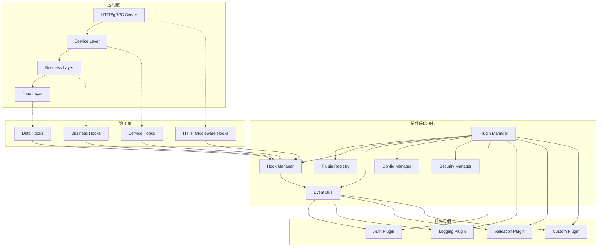

# 插件系统设计文档

## 概述

本文档描述了为基于Kratos框架的Go微服务项目设计的插件系统架构。该插件系统将与现有的分层架构(biz/data/service)和中间件系统无缝集成，提供灵活的扩展能力而不影响核心业务逻辑。

插件系统采用事件驱动架构，通过钩子点(Hook Points)和事件总线(Event Bus)实现松耦合的插件通信机制。系统支持动态加载、配置管理、安全隔离和完整的生命周期管理。

## 架构

### 整体架构图



### 核心组件架构

插件系统由以下核心组件组成：

1. **Plugin Manager**: 插件生命周期管理器
2. **Plugin Registry**: 插件注册和发现服务
3. **Hook Manager**: 钩子点管理器
4. **Event Bus**: 事件总线，处理插件间通信
5. **Config Manager**: 插件配置管理器
6. **Security Manager**: 插件安全和隔离管理器

## 组件和接口

### 1. 插件接口定义

```go
// Plugin 插件基础接口
type Plugin interface {
    // 插件元数据
    Name() string
    Version() string
    Description() string
    Dependencies() []string
    
    // 生命周期方法
    Initialize(ctx context.Context, config PluginConfig) error
    Start(ctx context.Context) error
    Stop(ctx context.Context) error
    Cleanup(ctx context.Context) error
    
    // 健康检查
    HealthCheck(ctx context.Context) error
}

// HookPlugin 支持钩子的插件接口
type HookPlugin interface {
    Plugin
    RegisterHooks(manager HookManager) error
}

// EventPlugin 支持事件的插件接口
type EventPlugin interface {
    Plugin
    RegisterEventHandlers(bus EventBus) error
}
```

### 2. 钩子系统接口

```go
// HookManager 钩子管理器接口
type HookManager interface {
    RegisterHook(name string, hook Hook) error
    UnregisterHook(name string, pluginName string) error
    ExecuteHook(ctx context.Context, name string, data HookData) (HookData, error)
    ListHooks() []string
}

// Hook 钩子接口
type Hook interface {
    Name() string
    Priority() int
    Execute(ctx context.Context, data HookData) (HookData, error)
}

// HookData 钩子数据接口
type HookData interface {
    GetType() string
    GetData() interface{}
    SetData(data interface{})
    GetMetadata() map[string]interface{}
    SetMetadata(key string, value interface{})
}
```

### 3. 事件系统接口

```go
// EventBus 事件总线接口
type EventBus interface {
    Subscribe(eventType string, handler EventHandler) error
    Unsubscribe(eventType string, handlerID string) error
    Publish(ctx context.Context, event Event) error
    PublishAsync(ctx context.Context, event Event) error
}

// Event 事件接口
type Event interface {
    Type() string
    Source() string
    Timestamp() time.Time
    Data() interface{}
    Metadata() map[string]interface{}
}

// EventHandler 事件处理器接口
type EventHandler interface {
    ID() string
    Handle(ctx context.Context, event Event) error
    Filter(event Event) bool
}
```

### 4. 插件管理器接口

```go
// PluginManager 插件管理器接口
type PluginManager interface {
    // 插件生命周期管理
    LoadPlugin(path string) error
    UnloadPlugin(name string) error
    StartPlugin(name string) error
    StopPlugin(name string) error
    
    // 插件查询
    GetPlugin(name string) (Plugin, error)
    ListPlugins() []PluginInfo
    GetPluginStatus(name string) (PluginStatus, error)
    
    // 配置管理
    UpdatePluginConfig(name string, config PluginConfig) error
    GetPluginConfig(name string) (PluginConfig, error)
}
```

## 数据模型

### 1. 插件元数据模型

```go
type PluginMetadata struct {
    Name         string            `json:"name" yaml:"name"`
    Version      string            `json:"version" yaml:"version"`
    Description  string            `json:"description" yaml:"description"`
    Author       string            `json:"author" yaml:"author"`
    License      string            `json:"license" yaml:"license"`
    Homepage     string            `json:"homepage" yaml:"homepage"`
    Dependencies []string          `json:"dependencies" yaml:"dependencies"`
    Hooks        []string          `json:"hooks" yaml:"hooks"`
    Events       []string          `json:"events" yaml:"events"`
    Config       PluginConfigSpec  `json:"config" yaml:"config"`
    Permissions  []string          `json:"permissions" yaml:"permissions"`
}

type PluginConfigSpec struct {
    Properties map[string]ConfigProperty `json:"properties" yaml:"properties"`
    Required   []string                  `json:"required" yaml:"required"`
}

type ConfigProperty struct {
    Type        string      `json:"type" yaml:"type"`
    Description string      `json:"description" yaml:"description"`
    Default     interface{} `json:"default" yaml:"default"`
    Enum        []string    `json:"enum,omitempty" yaml:"enum,omitempty"`
}
```

### 2. 插件状态模型

```go
type PluginStatus string

const (
    PluginStatusUnloaded PluginStatus = "unloaded"
    PluginStatusLoaded   PluginStatus = "loaded"
    PluginStatusStarted  PluginStatus = "started"
    PluginStatusStopped  PluginStatus = "stopped"
    PluginStatusError    PluginStatus = "error"
)

type PluginInfo struct {
    Metadata    PluginMetadata `json:"metadata"`
    Status      PluginStatus   `json:"status"`
    LoadTime    time.Time      `json:"load_time"`
    StartTime   time.Time      `json:"start_time,omitempty"`
    Error       string         `json:"error,omitempty"`
    Config      PluginConfig   `json:"config"`
    Metrics     PluginMetrics  `json:"metrics"`
}

type PluginMetrics struct {
    HookExecutions   int64         `json:"hook_executions"`
    EventsProcessed  int64         `json:"events_processed"`
    ErrorCount       int64         `json:"error_count"`
    AverageExecTime  time.Duration `json:"average_exec_time"`
    LastActivity     time.Time     `json:"last_activity"`
}
```

### 3. 钩子点定义

系统预定义的钩子点：

```go
const (
    // HTTP层钩子
    HookHTTPPreRequest   = "http.pre_request"
    HookHTTPPostRequest  = "http.post_request"
    HookHTTPPreResponse  = "http.pre_response"
    HookHTTPPostResponse = "http.post_response"
    
    // 认证钩子
    HookAuthPreLogin     = "auth.pre_login"
    HookAuthPostLogin    = "auth.post_login"
    HookAuthPreRegister  = "auth.pre_register"
    HookAuthPostRegister = "auth.post_register"
    HookAuthPreLogout    = "auth.pre_logout"
    HookAuthPostLogout   = "auth.post_logout"
    
    // 业务层钩子
    HookBizPreExecute    = "biz.pre_execute"
    HookBizPostExecute   = "biz.post_execute"
    HookBizPreValidate   = "biz.pre_validate"
    HookBizPostValidate  = "biz.post_validate"
    
    // 数据层钩子
    HookDataPreRead      = "data.pre_read"
    HookDataPostRead     = "data.post_read"
    HookDataPreWrite     = "data.pre_write"
    HookDataPostWrite    = "data.post_write"
)
```

## 错误处理

### 错误类型定义

```go
var (
    ErrPluginNotFound     = errors.New("plugin not found")
    ErrPluginAlreadyLoaded = errors.New("plugin already loaded")
    ErrPluginDependency   = errors.New("plugin dependency error")
    ErrPluginConfig       = errors.New("plugin configuration error")
    ErrPluginSecurity     = errors.New("plugin security violation")
    ErrPluginTimeout      = errors.New("plugin execution timeout")
    ErrHookNotFound       = errors.New("hook not found")
    ErrEventBusError      = errors.New("event bus error")
)
```

### 错误处理策略

1. **插件加载错误**: 记录详细错误信息，不影响其他插件和系统运行
2. **插件执行错误**: 使用断路器模式，防止错误插件影响系统性能
3. **钩子执行错误**: 继续执行其他钩子，记录错误但不中断流程
4. **事件处理错误**: 异步事件处理失败不影响主流程
5. **配置错误**: 使用默认配置或拒绝加载插件

### 错误恢复机制

```go
type ErrorRecovery interface {
    ShouldRetry(err error) bool
    GetRetryDelay(attempt int) time.Duration
    GetMaxRetries() int
    OnFinalFailure(err error) error
}
```

## 测试策略

### 1. 单元测试

- **插件管理器测试**: 测试插件加载、卸载、启动、停止等生命周期操作
- **钩子系统测试**: 测试钩子注册、执行、优先级排序等功能
- **事件系统测试**: 测试事件发布、订阅、过滤等机制
- **配置管理测试**: 测试配置加载、验证、热重载等功能

### 2. 集成测试

- **插件与系统集成测试**: 测试插件与现有Kratos框架的集成
- **多插件协作测试**: 测试多个插件同时运行时的交互
- **钩子链测试**: 测试多个插件在同一钩子点的执行顺序
- **事件流测试**: 测试复杂事件流的处理

### 3. 性能测试

- **插件加载性能**: 测试大量插件加载时的性能表现
- **钩子执行性能**: 测试钩子执行对系统性能的影响
- **事件处理性能**: 测试高频事件处理的性能
- **内存使用测试**: 测试插件系统的内存占用和泄漏

### 4. 安全测试

- **插件隔离测试**: 测试插件间的安全隔离
- **权限控制测试**: 测试插件权限控制机制
- **恶意插件测试**: 测试系统对恶意插件的防护能力

### 5. 测试插件开发

为了便于测试，系统将提供以下测试插件：

```go
// TestPlugin 测试插件接口
type TestPlugin interface {
    Plugin
    SetupTest(t *testing.T) error
    TeardownTest(t *testing.T) error
    GetTestData() interface{}
}

// MockPlugin 模拟插件，用于单元测试
type MockPlugin struct {
    name        string
    version     string
    initialized bool
    started     bool
    hooks       map[string]Hook
    events      map[string]EventHandler
}
```

### 6. 测试工具和框架

- **插件测试框架**: 提供插件开发和测试的标准框架
- **性能基准测试**: 建立插件系统性能基准
- **自动化测试**: CI/CD集成的自动化测试流程
- **测试覆盖率**: 确保核心功能的测试覆盖率达到90%以上

## 与现有系统集成

### 1. Kratos框架集成

插件系统将作为Kratos应用的一个组件，通过Wire依赖注入进行管理：

```go
// 在 wire.go 中添加插件系统依赖
var PluginSet = wire.NewSet(
    NewPluginManager,
    NewHookManager,
    NewEventBus,
    NewPluginRegistry,
)
```

### 2. 中间件集成

现有的中间件系统将扩展支持插件钩子：

```go
func PluginMiddleware(hookManager HookManager) middleware.Middleware {
    return func(handler middleware.Handler) middleware.Handler {
        return func(ctx context.Context, req interface{}) (interface{}, error) {
            // 执行前置钩子
            hookData := NewHookData("http.pre_request", req)
            hookData, _ = hookManager.ExecuteHook(ctx, HookHTTPPreRequest, hookData)
            
            // 执行原始处理器
            reply, err := handler(ctx, hookData.GetData())
            
            // 执行后置钩子
            hookData = NewHookData("http.post_request", reply)
            hookData, _ = hookManager.ExecuteHook(ctx, HookHTTPPostRequest, hookData)
            
            return hookData.GetData(), err
        }
    }
}
```

### 3. 配置系统集成

插件配置将集成到现有的配置系统中：

```yaml
# config.yaml
server:
  http:
    addr: 0.0.0.0:8000
  grpc:
    addr: 0.0.0.0:9000

plugins:
  enabled: true
  directory: "./plugins"
  config_directory: "./configs/plugins"
  auto_load: true
  security:
    sandbox_enabled: true
    max_memory: "100MB"
    max_cpu_percent: 10
  
  instances:
    auth_enhancer:
      enabled: true
      config:
        jwt_validation: true
        rate_limiting: true
    
    audit_logger:
      enabled: true
      config:
        log_level: "info"
        output_format: "json"
```