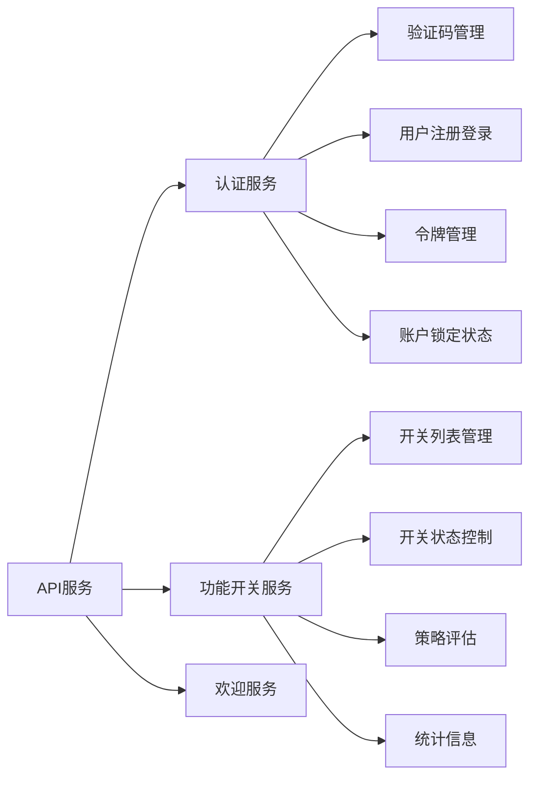
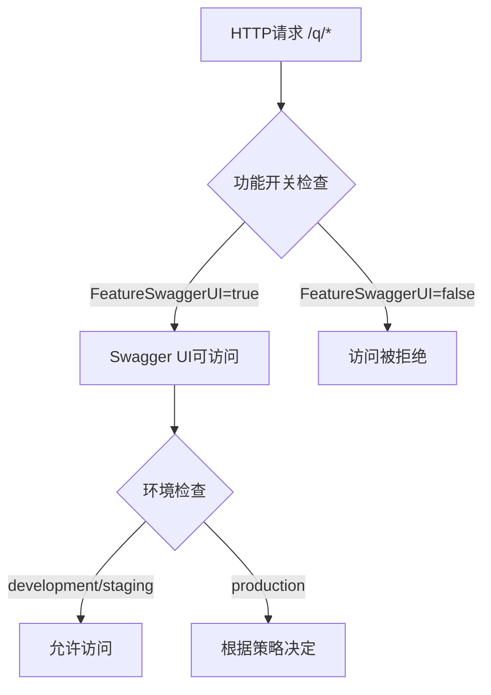
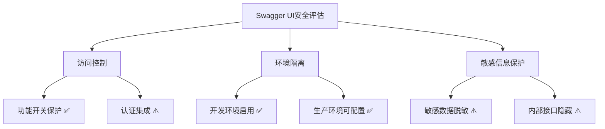

# Kratos项目API定义与OpenAPI文档生产就绪性分析

## 概述

本文档评估kratos-boilerplate项目的API定义规范性、OpenAPI文档生成能力以及Swagger UI访问的生产就绪性，为企业级部署提供技术建议。

## 当前API定义状况

### Protocol Buffers API设计质量
项目采用Protocol Buffer优先的API设计模式，具备以下优势：

| 方面        | 状况                    | 评估       |
| ----------- | ----------------------- | ---------- |
| API定义规范 | 完整的.proto文件定义    | ✅ 优秀     |
| HTTP映射    | 使用google.api.http注解 | ✅ 符合标准 |
| 版本管理    | 明确的v1版本路径结构    | ✅ 生产就绪 |
| 字段验证    | 基础的protobuf类型约束  | ⚠️ 可增强   |

### API服务覆盖范围



**认证API完整性**：
- 验证码获取与验证（图片/短信/邮件）
- 用户注册流程
- 登录认证（支持TOTP）
- 令牌刷新机制
- 账户锁定状态查询

**功能开关API完整性**：
- CRUD操作完备
- 支持分页查询
- 策略评估引擎
- 统计信息导出

## OpenAPI文档生成评估

### 代码生成配置分析

Makefile中的API生成命令：
```
protoc --proto_path=./api \
       --proto_path=./third_party \
       --go_out=paths=source_relative:./api \
       --go-http_out=paths=source_relative:./api \
       --go-grpc_out=paths=source_relative:./api \
       --openapi_out=fq_schema_naming=true,default_response=false:. \
       $(API_PROTO_FILES)
```

| 配置项             | 设置值     | 影响                          |
| ------------------ | ---------- | ----------------------------- |
| `fq_schema_naming` | true       | 启用完全限定模式名称          |
| `default_response` | false      | 禁用默认响应，更精确的API规范 |
| 输出路径           | 项目根目录 | 便于访问和部署                |

### OpenAPI规范支持

项目包含完整的OpenAPI v3支持：
- 引入了`third_party/openapi/v3/`规范文件
- 支持完整的OpenAPI 3.0规范
- 包含annotations支持

**优势**：
- 自动生成符合OpenAPI 3.0标准的文档
- 支持复杂的数据模型定义
- 兼容主流API工具链

**限制**：
- 缺少API示例和详细描述
- 未配置自定义文档元数据
- 缺少错误响应规范化

## Swagger UI访问机制

### 当前实现分析

主要入口在`cmd/kratos-boilerplate/main.go`：
```go
func newApp(logger log.Logger, gs *grpc.Server, hs *http.Server) *kratos.App {
    openAPIHandler := openapiv2.NewHandler()
    hs.HandlePrefix("/q/", openAPIHandler)
    // ...
}
```

**访问路径**：`http://localhost:8000/q/swagger-ui/`

### 功能开关控制

项目通过功能开关系统控制Swagger UI访问：



**环境策略配置**：
- 开发环境：默认启用
- 生产环境：可通过配置控制
- 支持基于环境的动态开关

### 安全性考量

| 安全方面 | 当前状况     | 建议           |
| -------- | ------------ | -------------- |
| 访问控制 | 功能开关保护 | ✅ 基础安全     |
| 认证要求 | 无强制认证   | ⚠️ 需要增强     |
| 生产环境 | 可配置禁用   | ✅ 符合最佳实践 |
| 路径隔离 | 独立路径前缀 | ✅ 良好隔离     |

## 生产就绪性评估

### 文档完整性检查

| 检查项         | 状况            | 生产就绪度 |
| -------------- | --------------- | ---------- |
| API定义完整性  | 完整的proto定义 | ✅ 生产就绪 |
| HTTP映射正确性 | 标准RESTful映射 | ✅ 生产就绪 |
| 错误处理规范   | 基础错误定义    | ⚠️ 需要增强 |
| 请求验证       | 基础类型验证    | ⚠️ 需要增强 |
| 响应规范化     | 一致的响应格式  | ✅ 生产就绪 |

### 安全性评估



**安全强化建议**：
1. 集成认证中间件保护Swagger UI
2. 实施敏感数据脱敏
3. 生产环境默认禁用
4. 添加IP白名单控制

### 运维监控集成

| 监控维度 | 当前支持             | 建议改进             |
| -------- | -------------------- | -------------------- |
| 健康检查 | ✅ 完整的健康检查系统 | 增加API可用性检查    |
| 访问日志 | ✅ 请求日志记录       | 增加Swagger访问审计  |
| 性能监控 | ✅ 中间件支持         | 增加文档生成性能监控 |
| 错误追踪 | ✅ 链路追踪集成       | 增加API错误统计      |

## 改进建议

### 短期改进（1-2周）

1. **API文档增强**
   - 为proto文件添加详细的字段注释
   - 增加API使用示例
   - 完善错误响应定义

2. **安全性提升**
   - 集成认证中间件保护Swagger UI
   - 配置生产环境默认禁用策略
   - 实施敏感信息过滤

3. **文档生成优化**
   - 配置自定义API元数据
   - 添加服务器信息和联系方式
   - 实现自动化文档更新流程

### 中期改进（2-4周）

1. **高级验证集成**
   - 集成protoc-gen-validate
   - 实现复杂业务规则验证
   - 完善字段级约束定义

2. **多环境支持**
   - 实现环境特定的API文档
   - 支持多版本API文档管理
   - 配置动态服务发现

3. **企业级集成**
   - 与API网关集成
   - 实现统一的API管理
   - 支持API版本兼容性检查

### 长期规划（1-3个月）

1. **API治理体系**
   - 建立API设计规范
   - 实现自动化API测试
   - 构建API性能基准

2. **开发者体验优化**
   - 提供交互式API示例
   - 集成代码生成工具
   - 建立API社区和文档站点

## 结论

kratos-boilerplate项目的API定义和OpenAPI文档生成已达到**基础生产就绪**标准，具备以下优势：

**生产就绪优势**：
- 完整的Protocol Buffer API定义
- 标准的OpenAPI 3.0文档生成
- 灵活的功能开关控制机制
- 良好的环境隔离策略

**需要改进的方面**：
- API文档的详细程度
- 安全访问控制机制
- 企业级监控和审计
- 高级验证规则集成

**推荐部署策略**：
1. 开发/测试环境：启用完整的Swagger UI功能
2. 预发布环境：有条件启用，增加认证保护
3. 生产环境：默认禁用，仅在必要时通过内网访问

总体而言，该项目在API定义标准化和文档生成方面表现良好，通过实施建议的安全和监控改进措施，完全可以满足企业级生产环境的要求。