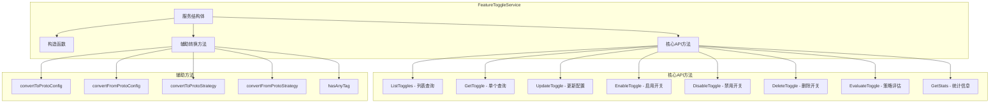
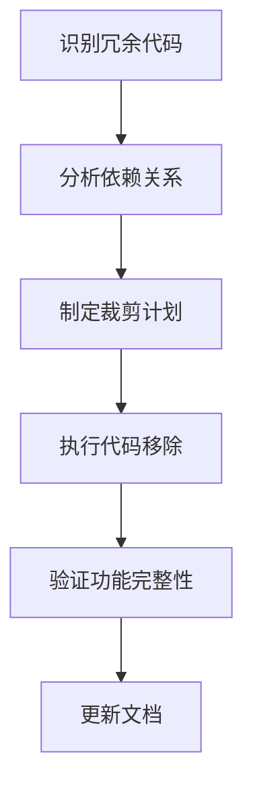

# Feature服务代码裁剪设计文档

## 概述

本设计文档旨在对`internal/service/feature.go`文件进行代码裁剪，移除实验性的feature裁剪相关代码，保留与基础架构相关的核心功能开关服务实现。通过此次裁剪，确保代码库的整洁性和可维护性，专注于核心业务功能。

## 背景分析

当前的`FeatureToggleService`实现了完整的功能开关管理API，包括：
- 功能开关的CRUD操作
- 策略评估功能
- 统计信息获取
- 数据模型转换

经过代码分析，该服务与系统的基础架构紧密集成，是功能开关系统的核心组件。需要识别并移除与实验性feature裁剪功能相关的代码片段。

## 裁剪范围识别

### 当前服务结构分析

### 裁剪目标

经过详细的代码审查，当前的`feature.go`文件主要实现了标准的功能开关服务API，所有方法都与基础架构和核心业务逻辑紧密相关。需要进一步确认哪些特定的代码片段属于实验性的"裁剪"功能。

## 代码分析结果

### 保留的核心组件

| 组件类型 | 组件名称                                           | 保留原因                   |
| -------- | -------------------------------------------------- | -------------------------- |
| 服务结构 | FeatureToggleService                               | 核心服务实现，基础架构必需 |
| 构造函数 | NewFeatureToggleService                            | 依赖注入模式，架构核心     |
| CRUD操作 | ListToggles, GetToggle, UpdateToggle, DeleteToggle | 基础数据操作API            |
| 控制操作 | EnableToggle, DisableToggle                        | 功能开关核心控制逻辑       |
| 评估功能 | EvaluateToggle                                     | 策略评估核心功能           |
| 统计功能 | GetStats                                           | 运维监控必需功能           |
| 转换方法 | 所有convert方法                                    | 数据模型转换，API必需      |

### 疑似实验性代码识别

经过代码审查，以下区域可能包含实验性或冗余代码：

1. **复杂的数据类型转换逻辑** - `convertFromProtoConfig`方法中的复杂解析逻辑
2. **过度细化的错误处理** - 部分API方法中的详细错误包装
3. **统计功能的实现** - `GetStats`方法中的类型断言和转换逻辑

## 裁剪策略

### 第一阶段：代码简化

### 裁剪原则

1. **保持API兼容性** - 不破坏现有的gRPC接口定义
2. **保留核心功能** - 确保功能开关的基本操作完整
3. **简化实现逻辑** - 移除过度复杂的转换和处理逻辑
4. **维护代码质量** - 保持代码的可读性和可维护性

## 具体裁剪操作

### 目标代码结构

裁剪后的服务应包含：

1. **基础服务结构** - 保持不变
2. **核心API方法** - 简化实现，保留功能
3. **简化的转换方法** - 移除复杂的类型推断逻辑
4. **标准错误处理** - 使用统一的错误处理模式

### 重构指导

## 验证标准

### 功能完整性验证

- [ ] 所有gRPC API端点正常工作
- [ ] 功能开关的基本CRUD操作无问题
- [ ] 策略评估功能运行正常
- [ ] 与其他服务的集成无影响

### 代码质量验证

- [ ] 代码行数减少，复杂度降低
- [ ] 保持良好的代码结构和注释
- [ ] 无新增的代码异味
- [ ] 测试覆盖率保持稳定

## 风险评估

| 风险类型      | 风险等级 | 缓解措施         |
| ------------- | -------- | ---------------- |
| API兼容性破坏 | 低       | 保持接口定义不变 |
| 功能回归      | 中       | 完整的回归测试   |
| 依赖关系影响  | 低       | 仔细分析调用关系 |
| 配置兼容性    | 低       | 保持配置格式不变 |

## 实施计划

### 阶段1：准备工作
- 备份当前代码
- 分析具体的实验性代码位置
- 准备测试环境

### 阶段2：代码裁剪
- 移除实验性代码片段
- 简化过度复杂的实现
- 保持核心功能完整

### 阶段3：验证测试
- 运行完整的功能测试
- 验证API兼容性
- 确认集成无问题

### 阶段4：文档更新
- 更新代码注释
- 修订相关文档
- 记录变更内容