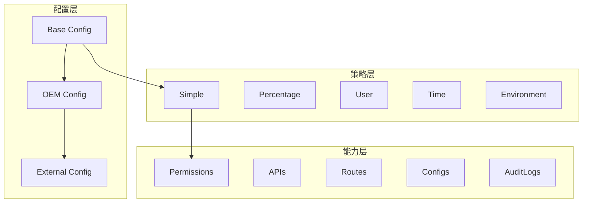

# 功能裁剪系统设计审核报告

## 概述

本报告对 kratos-boilerplate 项目的功能裁剪系统进行全面审核，评估其设计的合理性、实现的最佳实践符合度，并提出改进建议。审核范围包括系统架构、配置管理、代码实现和运维实践。

## 架构设计评估

### 优秀设计点

#### 1. 分层架构清晰


- 功能集合采用 A.B.C 分层结构，支持域级管理
- 配置分层清晰：base → oem → external → final
- 策略与功能解耦，支持多种评估策略

#### 2. 接口设计合理
- 向后兼容的接口设计
- 支持分层功能检查和传统功能检查
- 事件驱动的变更通知机制

#### 3. 功能集合概念创新
- 每个功能集合包含权限、API、路由、配置、审计日志的完整组合
- 支持功能域批量控制
- CSV导出便于产品验证

### 设计问题识别

#### 1. 接口过于复杂
```go
// 当前接口过于庞大
type HierarchicalFeatureToggle interface {
    // 基本功能检查 (4个方法)
    IsEnabled(ctx context.Context, flag FeatureFlag) bool
    IsEnabledWithContext(ctx context.Context, flag FeatureFlag, evalCtx *EvaluationContext) bool
    IsFeatureEnabled(featurePath string) bool
    IsDomainEnabled(domain string) bool
    
    // 功能集合能力检查 (5个方法)
    HasPermission(featurePath, permission string) bool
    HasAPI(featurePath, api string) bool
    HasRoute(featurePath, route string) bool
    HasConfig(featurePath, config string) bool
    HasAuditLog(featurePath, logType string) bool
    
    // 批量检查 (2个方法)
    IsAnyFeatureEnabled(featurePaths ...string) bool
    AreAllFeaturesEnabled(featurePaths ...string) bool
    
    // 管理功能 (10个方法)
    GetFeatureCapabilities(featurePath string) *FeatureCapabilities
    GetToggleConfig(flag FeatureFlag) (*ToggleConfig, error)
    UpdateToggle(flag FeatureFlag, config *ToggleConfig) error
    ListToggles() map[FeatureFlag]*ToggleConfig
    EnableFeature(flag FeatureFlag) error
    DisableFeature(flag FeatureFlag) error
    DeleteToggle(flag FeatureFlag) error
    Subscribe(callback ToggleChangeCallback) error
    Unsubscribe(callback ToggleChangeCallback) error
    ExportCSV() ([]byte, error)
    
    // 其他功能 (3个方法)
    GetDomainFeatures(domain string) []string
    GetFeatureTree() map[string][]string
}
```

**问题**：违反了接口隔离原则，单一接口承担过多职责。

#### 2. 配置结构不够标准化

当前的 YAML 配置缺乏版本管理和元数据：
```yaml
# 当前配置缺少版本和元数据
features:
  user.management:
    enabled: true
    strategy: simple
    permissions:
      - "user.create"
```

#### 3. 评估上下文提取不够灵活

```go
func ExtractEvaluationContext(ctx context.Context) *EvaluationContext {
    // 硬编码的上下文提取逻辑
    evalCtx := &EvaluationContext{
        Environment: "production",  // 硬编码默认值
        Version:     "1.0.0",       // 硬编码默认值
        Attributes:  make(map[string]string),
    }
    
    // 固定的键名提取
    if userID, ok := ctx.Value("user_id").(string); ok {
        evalCtx.UserID = userID
    }
}
```

## 代码实现评估

### 优秀实现

#### 1. 并发安全设计
```go
type ToggleManager struct {
    mu                sync.RWMutex  // 读写锁保证并发安全
    toggles           map[FeatureFlag]*ToggleConfig
    // ...
}
```

#### 2. 策略模式应用得当
```go
type CompositeStrategy struct {
    evaluators map[FeatureStrategy]StrategyEvaluator
}

func (c *CompositeStrategy) RegisterEvaluator(strategy FeatureStrategy, evaluator StrategyEvaluator) {
    c.evaluators[strategy] = evaluator
}
```

#### 3. 依赖注入配置完善
```go
var ProviderSet = wire.NewSet(
    NewFeatureConfig,
    NewFeatureRepository,
    NewCompositeStrategy,
    NewToggleManager,
    // ...
)
```

### 实现问题

#### 1. 错误处理不够细化
```go
// 当前实现
func (tm *ToggleManager) UpdateToggle(flag FeatureFlag, config *ToggleConfig) error {
    // 简单的错误返回，缺乏错误分类
    if err := tm.repository.SaveToggle(context.Background(), flag, config); err != nil {
        return err  // 错误信息不够详细
    }
}
```

#### 2. 内存使用缺乏优化
```go
// 配置副本创建可能导致内存浪费
func (tm *ToggleManager) ListToggles() map[FeatureFlag]*ToggleConfig {
    result := make(map[FeatureFlag]*ToggleConfig)
    for flag, config := range tm.toggles {
        configCopy := *config  // 深拷贝每个配置
        result[flag] = &configCopy
    }
    return result
}
```

#### 3. 测试覆盖不够全面
- 缺少集成测试
- 并发场景测试不足
- 错误恢复场景测试缺失

## 运维实践评估

### 优秀实践

#### 1. 配置监听机制
```go
func (fr *FileRepository) Watch(ctx context.Context, callback func(map[FeatureFlag]*ToggleConfig)) error {
    // 文件变更监听实现
}
```

#### 2. 变更事件通知
```go
func (tm *ToggleManager) Subscribe(callback ToggleChangeCallback) error {
    // 支持订阅配置变更事件
}
```

#### 3. 统计信息提供
```go
func (tm *ToggleManager) GetStats() map[string]interface{} {
    // 提供功能开关统计信息
}
```

### 运维问题

#### 1. 缺乏审计日志
- 配置变更记录不完整
- 无法追踪变更来源
- 缺少操作时间戳

#### 2. 监控指标不足
- 缺少功能使用率统计
- 无性能指标监控
- 缺少异常情况告警

#### 3. 备份恢复机制缺失
- 无配置历史版本管理
- 缺少自动备份机制
- 回滚操作不够便捷

## 改进建议

### 1. 接口重构建议

#### 拆分接口职责
```go
// 基础功能检查接口
type FeatureChecker interface {
    IsEnabled(ctx context.Context, flag FeatureFlag) bool
    IsEnabledWithContext(ctx context.Context, flag FeatureFlag, evalCtx *EvaluationContext) bool
}

// 分层功能检查接口
type HierarchicalChecker interface {
    IsFeatureEnabled(featurePath string) bool
    IsDomainEnabled(domain string) bool
    GetDomainFeatures(domain string) []string
    GetFeatureTree() map[string][]string
}

// 能力检查接口
type CapabilityChecker interface {
    HasPermission(featurePath, permission string) bool
    HasAPI(featurePath, api string) bool
    HasRoute(featurePath, route string) bool
    HasConfig(featurePath, config string) bool
    HasAuditLog(featurePath, logType string) bool
}

// 管理接口
type FeatureManager interface {
    GetToggleConfig(flag FeatureFlag) (*ToggleConfig, error)
    UpdateToggle(flag FeatureFlag, config *ToggleConfig) error
    ListToggles() map[FeatureFlag]*ToggleConfig
    EnableFeature(flag FeatureFlag) error
    DisableFeature(flag FeatureFlag) error
    DeleteToggle(flag FeatureFlag) error
}

// 事件接口
type EventManager interface {
    Subscribe(callback ToggleChangeCallback) error
    Unsubscribe(callback ToggleChangeCallback) error
}
```

### 2. 配置结构标准化

#### 增加版本和元数据支持
```yaml
# 改进后的配置结构
apiVersion: v1
kind: FeatureConfiguration
metadata:
  name: kratos-boilerplate-features
  version: "1.0.0"
  createdAt: "2024-01-01T00:00:00Z"
  updatedAt: "2024-01-01T00:00:00Z"
  
spec:
  features:
    user.management:
      enabled: true
      strategy: simple
      metadata:
        description: "用户管理功能集合"
        tags: ["user", "admin"]
        owner: "user-team"
        deprecated: false
        deprecationDate: null
      capabilities:
        permissions:
          - "user.create"
          - "user.update"
        apis:
          - "POST /api/v1/users"
          - "PUT /api/v1/users/{id}"
        routes:
          - "/admin/users"
        configs:
          - "user.max_count"
        auditLogs:
          - "user_created"
      rules:
        environments: ["production"]
```

### 3. 上下文提取器改进

#### 可配置的上下文提取
```go
// 上下文提取器接口
type EvaluationContextExtractor interface {
    Extract(ctx context.Context) *EvaluationContext
}

// 可配置的提取器实现
type ConfigurableExtractor struct {
    userIDKey     string
    userTypeKey   string
    environmentKey string
    defaultValues map[string]string
}

func (ce *ConfigurableExtractor) Extract(ctx context.Context) *EvaluationContext {
    evalCtx := &EvaluationContext{
        Environment: ce.getDefault("environment", "production"),
        Version:     ce.getDefault("version", "1.0.0"),
        Attributes:  make(map[string]string),
    }
    
    if userID, ok := ctx.Value(ce.userIDKey).(string); ok {
        evalCtx.UserID = userID
    }
    
    if userType, ok := ctx.Value(ce.userTypeKey).(string); ok {
        evalCtx.UserType = userType
    }
    
    return evalCtx
}
```

### 4. 错误处理增强

#### 细化错误类型
```go
// 功能开关错误类型
type FeatureError struct {
    Code    string
    Message string
    Feature FeatureFlag
    Cause   error
}

const (
    ErrCodeFeatureNotFound     = "FEATURE_NOT_FOUND"
    ErrCodeInvalidConfig       = "INVALID_CONFIG"
    ErrCodeStrategyNotSupported = "STRATEGY_NOT_SUPPORTED"
    ErrCodeRepositoryError     = "REPOSITORY_ERROR"
    ErrCodeEvaluationError     = "EVALUATION_ERROR"
)

func NewFeatureError(code, message string, feature FeatureFlag, cause error) *FeatureError {
    return &FeatureError{
        Code:    code,
        Message: message,
        Feature: feature,
        Cause:   cause,
    }
}
```

### 5. 审计日志增强

#### 完整的审计记录
```go
type AuditLog struct {
    ID          string    `json:"id"`
    Timestamp   time.Time `json:"timestamp"`
    Operation   string    `json:"operation"`
    Feature     string    `json:"feature"`
    OldValue    interface{} `json:"old_value,omitempty"`
    NewValue    interface{} `json:"new_value,omitempty"`
    UserID      string    `json:"user_id"`
    Source      string    `json:"source"`
    Reason      string    `json:"reason,omitempty"`
}

type AuditLogger interface {
    LogFeatureChange(ctx context.Context, operation string, feature FeatureFlag, oldConfig, newConfig *ToggleConfig) error
    LogFeatureAccess(ctx context.Context, feature FeatureFlag, result bool, evalCtx *EvaluationContext) error
    GetAuditLogs(ctx context.Context, filter AuditFilter) ([]AuditLog, error)
}
```

### 6. 监控指标改进

#### 丰富的指标收集
```go
type FeatureMetrics struct {
    AccessCount      map[FeatureFlag]int64
    AccessLatency    map[FeatureFlag]time.Duration
    EvaluationTime   map[FeatureFlag]time.Duration
    ErrorCount       map[FeatureFlag]int64
    ConfigChangeTime time.Time
}

type MetricsCollector interface {
    RecordFeatureAccess(feature FeatureFlag, result bool, duration time.Duration)
    RecordEvaluationTime(feature FeatureFlag, duration time.Duration)
    RecordError(feature FeatureFlag, errorCode string)
    RecordConfigChange(feature FeatureFlag, operation string)
    GetMetrics() *FeatureMetrics
}
```

### 7. 配置验证增强

#### 配置验证和一致性检查
```go
type ConfigValidator interface {
    ValidateConfig(config *FeatureConfiguration) error
    ValidateConsistency(config *FeatureConfiguration) error
    ValidateDependencies(config *FeatureConfiguration) error
}

type ValidationResult struct {
    Valid    bool      `json:"valid"`
    Errors   []string  `json:"errors"`
    Warnings []string  `json:"warnings"`
}
```

### 8. 性能优化建议

#### 内存池和缓存优化
```go
// 配置对象池
var configPool = sync.Pool{
    New: func() interface{} {
        return &ToggleConfig{}
    },
}

// 评估结果缓存
type EvaluationCache struct {
    cache map[string]CacheEntry
    mutex sync.RWMutex
    ttl   time.Duration
}

type CacheEntry struct {
    Result    bool
    Timestamp time.Time
}
```

## 迁移建议

### 阶段一：接口重构
1. 定义新的分离接口
2. 保持向后兼容
3. 逐步迁移使用方

### 阶段二：配置标准化
1. 定义新的配置格式
2. 实现配置迁移工具
3. 支持新旧格式并存

### 阶段三：功能增强
1. 添加审计日志
2. 完善监控指标
3. 增强配置验证

### 阶段四：性能优化
1. 实现缓存机制
2. 优化内存使用
3. 提升并发性能

## 总体评价

当前的功能裁剪系统在架构设计上有很多创新点，特别是功能集合的概念和分层配置管理。但在工程实践方面还有提升空间，主要体现在接口设计、错误处理、监控审计等方面。

**优势**：
- 架构清晰，扩展性好
- 功能完整，支持多种场景
- 代码质量较高，有一定的测试覆盖

**待改进**：
- 接口过于庞大，需要拆分
- 运维支持不够完善
- 性能优化还有空间

建议按照上述改进建议分阶段实施，逐步完善系统的工程质量和运维能力。