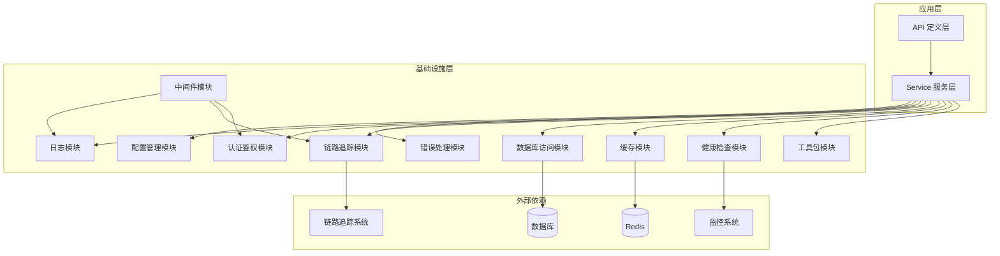
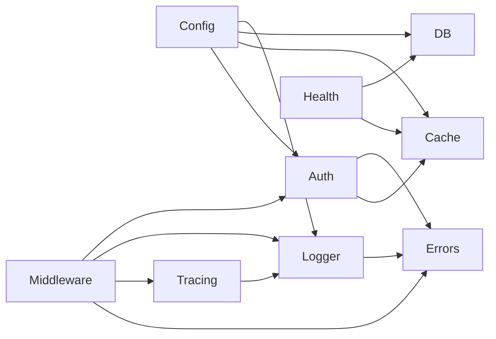
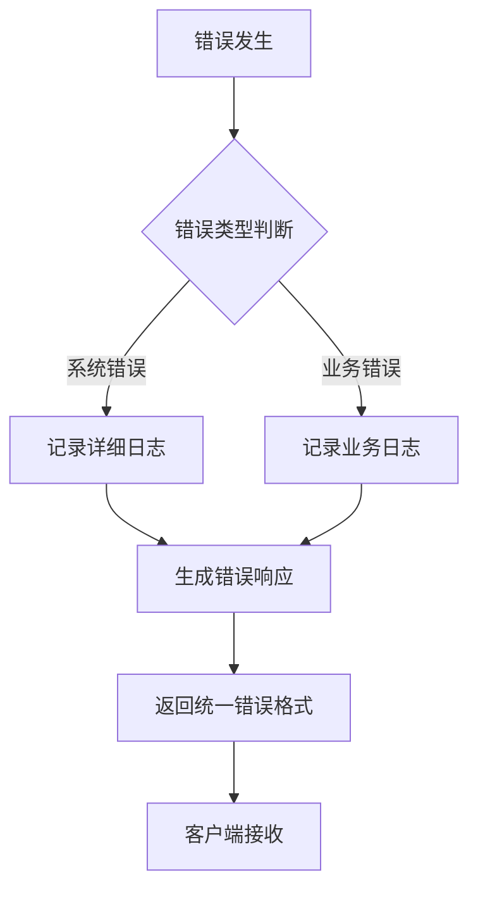
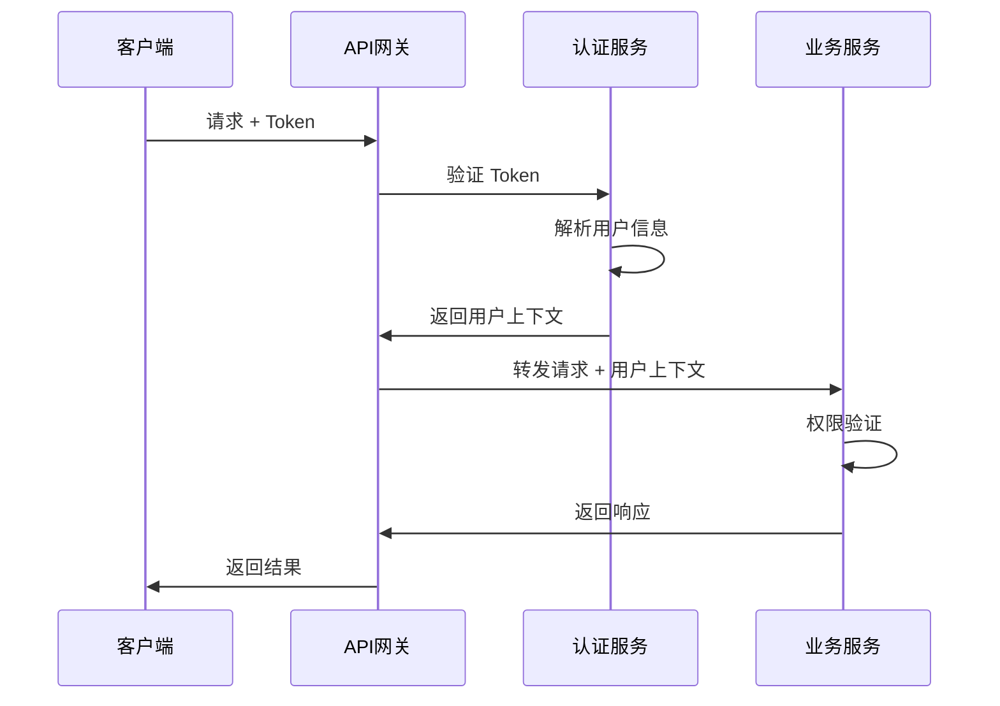
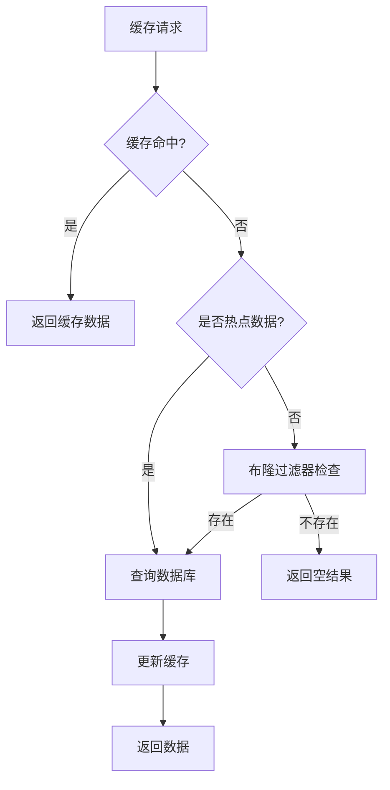
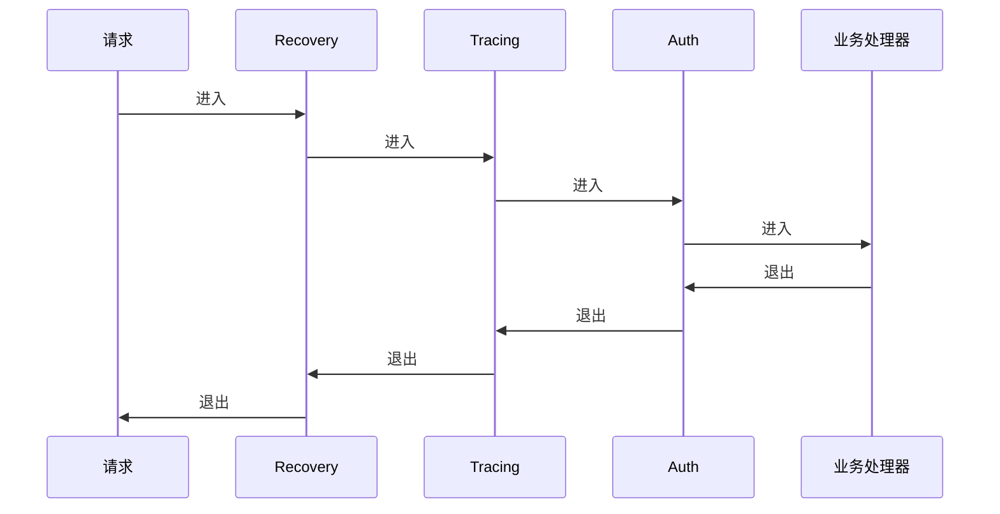
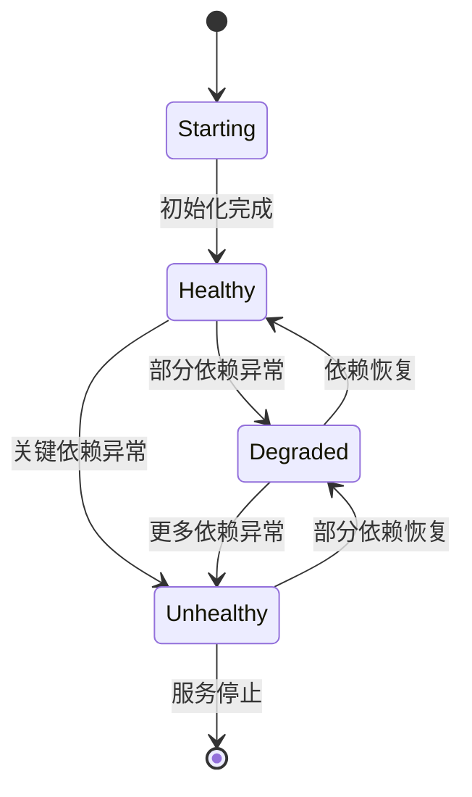

# Kratos 项目基础模块搭建设计

## 概述

本设计旨在为 Kratos 微服务项目建立一套完整的基础模块体系，这些模块构成了项目的核心基础设施，为后续的业务开发提供坚实的技术支撑。通过模块化的设计，可以形成可复用的项目脚手架，加速新项目的启动和开发。

### 价值主张

- **标准化基础设施**：提供统一的配置管理、日志处理、错误处理等基础能力
- **开发效率提升**：业务开发时无需重复搭建基础设施，专注于业务逻辑实现
- **可维护性增强**：模块化设计使系统更易于维护和扩展
- **技术债务降低**：通过统一的技术栈和最佳实践减少技术债务积累

## 基础模块架构

### 整体架构设计



### 模块依赖关系



## 核心基础模块设计

### 1. 配置管理模块（config）

#### 功能特性
- 支持多种配置源：YAML、JSON、环境变量
- 配置热更新能力
- 分环境配置管理
- 配置验证和类型安全

#### 配置结构设计

| 配置分类   | 配置项                  | 描述          | 默认值         |
| ---------- | ----------------------- | ------------- | -------------- |
| 服务配置   | server.http.addr        | HTTP 服务地址 | 0.0.0.0:8000   |
| 服务配置   | server.grpc.addr        | gRPC 服务地址 | 0.0.0.0:9000   |
| 数据库配置 | data.database.driver    | 数据库驱动    | postgres       |
| 数据库配置 | data.database.source    | 数据库连接串  | -              |
| 缓存配置   | data.redis.addr         | Redis 地址    | 127.0.0.1:6379 |
| 认证配置   | auth.jwt_secret_key     | JWT 密钥      | -              |
| 日志配置   | log.level               | 日志级别      | info           |
| 追踪配置   | tracing.jaeger.endpoint | Jaeger 端点   | -              |

#### 配置加载策略
- 优先级：命令行参数 > 环境变量 > 配置文件 > 默认值
- 支持配置文件监听，实现热更新
- 提供配置验证机制，确保关键配置的有效性

### 2. 日志模块（logger）

#### 日志规范设计
- 统一日志格式：`timestamp | level | trace_id | caller | message | fields`
- 支持结构化日志输出
- 预留链路追踪集成能力
- 支持敏感信息脱敏

#### 日志级别策略

| 级别  | 用途     | 示例场景           |
| ----- | -------- | ------------------ |
| DEBUG | 调试信息 | 函数入参、中间变量 |
| INFO  | 一般信息 | 业务流程关键节点   |
| WARN  | 警告信息 | 可恢复的异常情况   |
| ERROR | 错误信息 | 业务异常、系统错误 |
| FATAL | 致命错误 | 系统无法继续运行   |

#### 日志输出策略
- 开发环境：控制台输出，便于调试
- 生产环境：文件输出，支持日志轮转
- 支持多种输出目标：文件、ELK、Loki 等

### 3. 错误处理模块（errors）

#### 错误码体系设计

| 错误类别 | 错误码范围  | HTTP 状态码 | 描述         |
| -------- | ----------- | ----------- | ------------ |
| 系统错误 | 10000-19999 | 500         | 内部系统错误 |
| 参数错误 | 20000-29999 | 400         | 请求参数错误 |
| 认证错误 | 30000-39999 | 401/403     | 认证授权错误 |
| 业务错误 | 40000-49999 | 200         | 业务逻辑错误 |
| 外部错误 | 50000-59999 | 502         | 外部服务错误 |

#### 错误处理流程



#### 错误响应格式
```
{
  "code": 错误码,
  "message": "错误描述",
  "details": {
    "trace_id": "链路追踪ID",
    "timestamp": "错误时间",
    "path": "请求路径"
  }
}
```

### 4. 认证鉴权模块（auth）

#### 认证策略设计
- 支持 JWT Token 认证
- 支持 Refresh Token 机制
- 预留 OAuth2 扩展能力
- 支持多租户认证

#### Token 管理策略

| Token 类型    | 有效期 | 存储位置   | 刷新策略           |
| ------------- | ------ | ---------- | ------------------ |
| Access Token  | 24小时 | 内存/Redis | 通过 Refresh Token |
| Refresh Token | 7天    | Redis      | 定期轮换           |

#### 权限验证流程



### 5. 链路追踪模块（tracing）

#### 追踪策略设计
- 基于 OpenTelemetry 标准
- 支持 Jaeger/Zipkin 后端
- 提供 Trace ID 和 Span ID 生成
- 支持采样率配置

#### 追踪数据模型

| 字段           | 类型      | 描述           |
| -------------- | --------- | -------------- |
| trace_id       | string    | 全链路唯一标识 |
| span_id        | string    | 操作单元标识   |
| parent_span_id | string    | 父操作标识     |
| operation_name | string    | 操作名称       |
| start_time     | timestamp | 开始时间       |
| duration       | duration  | 执行时长       |
| tags           | map       | 标签信息       |
| logs           | array     | 日志事件       |

#### Metrics 指标设计

| 指标类型  | 指标名称              | 描述              |
| --------- | --------------------- | ----------------- |
| Counter   | http_requests_total   | HTTP 请求总数     |
| Histogram | http_request_duration | HTTP 请求耗时分布 |
| Gauge     | active_connections    | 活跃连接数        |
| Counter   | errors_total          | 错误总数          |

### 6. 数据库访问模块（db）

#### 数据库抽象设计
- 支持多种数据库：PostgreSQL、MySQL
- 提供连接池管理
- 支持主从读写分离
- 提供事务管理能力

#### 连接池配置策略

| 参数               | 默认值 | 描述             |
| ------------------ | ------ | ---------------- |
| max_open_conns     | 25     | 最大开放连接数   |
| max_idle_conns     | 5      | 最大空闲连接数   |
| conn_max_lifetime  | 1h     | 连接最大生命周期 |
| conn_max_idle_time | 10m    | 连接最大空闲时间 |

#### 健康检查机制
- 定期执行 ping 操作
- 监控连接池状态
- 支持慢查询检测
- 提供数据库性能指标

### 7. 缓存模块（cache）

#### 缓存策略设计
- 支持 Redis 集群
- 提供分布式锁能力
- 支持缓存雪崩/穿透防护
- 提供 TTL 管理策略

#### 缓存操作抽象

| 操作类型 | 方法              | 描述         |
| -------- | ----------------- | ------------ |
| 基础操作 | Get/Set/Del       | 基本缓存操作 |
| 批量操作 | MGet/MSet         | 批量缓存操作 |
| 有序集合 | ZAdd/ZRange       | 排序数据操作 |
| 分布式锁 | Lock/Unlock       | 分布式锁操作 |
| 发布订阅 | Publish/Subscribe | 消息通信     |

#### 缓存失效策略



### 8. 中间件模块（middleware）

#### 中间件架构设计
- 洋葱圈模型：请求和响应都会经过中间件处理
- 支持中间件链式调用
- 提供中间件优先级管理
- 支持条件性中间件应用

#### 核心中间件清单

| 中间件    | 优先级 | 功能描述       |
| --------- | ------ | -------------- |
| Recovery  | 1      | 异常捕获和恢复 |
| Tracing   | 2      | 链路追踪注入   |
| Logging   | 3      | 请求日志记录   |
| CORS      | 4      | 跨域处理       |
| Auth      | 5      | 认证授权       |
| RateLimit | 6      | 限流控制       |
| Metrics   | 7      | 指标收集       |

#### 中间件执行流程



### 9. 健康检查模块（health）

#### 健康检查维度
- 服务可用性检查
- 依赖组件检查
- 资源使用情况检查
- 业务健康度检查

#### 检查端点设计

| 端点         | 用途     | 检查内容         |
| ------------ | -------- | ---------------- |
| /healthz     | 存活检查 | 服务基本可用性   |
| /readyz      | 就绪检查 | 服务完全就绪状态 |
| /metrics     | 指标导出 | Prometheus 指标  |
| /debug/pprof | 性能分析 | Go 性能分析数据  |

#### 健康状态模型



### 10. 工具包模块（utils）

#### 工具函数分类

| 分类       | 功能       | 具体工具                       |
| ---------- | ---------- | ------------------------------ |
| 唯一标识   | ID 生成    | UUID、Snowflake、纳秒时间戳    |
| 时间处理   | 时间格式化 | ISO8601、时区转换、时间计算    |
| 加密解密   | 密码学     | AES、RSA、SM3、SM4             |
| 数据验证   | 输入验证   | 邮箱、手机号、身份证验证       |
| 字符串处理 | 文本操作   | 敏感信息脱敏、字符串转换       |
| 网络工具   | 网络操作   | IP 获取、URL 解析、HTTP 客户端 |

#### 加密工具设计

| 算法类型   | 用途       | 实现方式      |
| ---------- | ---------- | ------------- |
| 对称加密   | 数据加密   | AES-256-GCM   |
| 非对称加密 | 密钥交换   | RSA-2048      |
| 哈希算法   | 密码存储   | bcrypt/argon2 |
| 摘要算法   | 数据完整性 | SM3/SHA-256   |

## 项目目录结构设计

### 标准目录布局

```
.
├── api/                     # Protocol Buffer 定义
│   ├── auth/v1/            # 认证服务 API
│   ├── common/v1/          # 通用类型定义
│   └── health/v1/          # 健康检查 API
├── cmd/
│   └── server/             # 应用程序入口
│       ├── main.go         # 主程序
│       ├── wire.go         # 依赖注入配置
│       └── wire_gen.go     # Wire 生成文件
├── configs/                # 配置文件
│   ├── config.yaml         # 主配置文件
│   ├── config.dev.yaml     # 开发环境配置
│   └── config.prod.yaml    # 生产环境配置
├── internal/               # 内部代码
│   ├── biz/                # 业务逻辑层（暂空，待业务填充）
│   ├── data/               # 数据访问层（暂空，待业务填充）
│   ├── service/            # 服务层（暂空，待业务填充）
│   └── conf/               # 配置定义
├── pkg/                    # 可复用包
│   ├── config/             # 配置管理
│   ├── log/                # 日志模块
│   ├── errors/             # 错误处理
│   ├── auth/               # 认证鉴权
│   ├── tracing/            # 链路追踪
│   ├── db/                 # 数据库访问
│   ├── cache/              # 缓存模块
│   ├── middleware/         # 中间件
│   ├── health/             # 健康检查
│   └── utils/              # 工具包
├── scripts/                # 脚本文件
│   ├── build.sh            # 构建脚本
│   ├── test.sh             # 测试脚本
│   └── migrate.sh          # 数据库迁移脚本
├── test/                   # 测试文件
│   ├── unit/               # 单元测试
│   ├── integration/        # 集成测试
│   └── e2e/                # 端到端测试
├── deployments/            # 部署配置
│   ├── docker/             # Docker 配置
│   └── k8s/                # Kubernetes 配置
├── docs/                   # 文档
├── Dockerfile              # 容器构建文件
├── docker-compose.yml      # 本地开发环境
├── Makefile                # 构建自动化
├── go.mod                  # Go 模块定义
└── README.md               # 项目说明
```

### 模块实现优先级

#### 第一阶段：核心基础模块
1. 配置管理模块
2. 日志模块
3. 错误处理模块
4. 工具包模块

#### 第二阶段：服务基础模块
1. 数据库访问模块
2. 缓存模块
3. 健康检查模块
4. 中间件模块

#### 第三阶段：高级功能模块
1. 认证鉴权模块
2. 链路追踪模块
3. 监控指标模块
4. 性能优化模块

## 技术实现策略

### 依赖注入设计
- 使用 Google Wire 进行依赖注入
- 按模块划分注入器
- 支持接口抽象和实现替换
- 提供测试用的 Mock 实现

### 配置热更新机制
- 基于文件系统监听实现配置热更新
- 支持配置变更通知机制
- 提供配置回滚能力
- 确保配置更新的原子性

### 错误处理最佳实践
- 使用 pkg/errors 包进行错误包装
- 实现错误链追踪
- 提供错误重试机制
- 支持错误率监控和告警

### 性能优化策略
- 使用连接池减少连接开销
- 实现缓存预热机制
- 支持批量操作优化
- 提供性能监控和分析工具

## 测试策略

### 测试层次设计

| 测试类型   | 覆盖范围      | 测试工具          | 目标覆盖率 |
| ---------- | ------------- | ----------------- | ---------- |
| 单元测试   | 单个函数/方法 | Go test + testify | >80%       |
| 集成测试   | 模块间集成    | Testcontainers    | >70%       |
| 端到端测试 | 完整业务流程  | 自定义测试框架    | >60%       |
| 性能测试   | 系统性能      | Go benchmark      | 基准测试   |

### 测试数据管理
- 使用工厂模式生成测试数据
- 支持测试数据隔离
- 提供测试数据清理机制
- 实现测试数据版本管理
