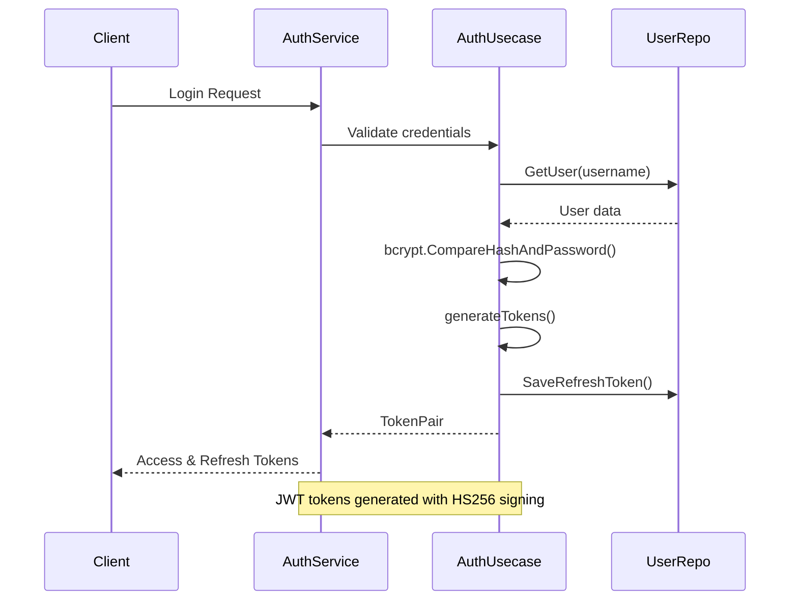
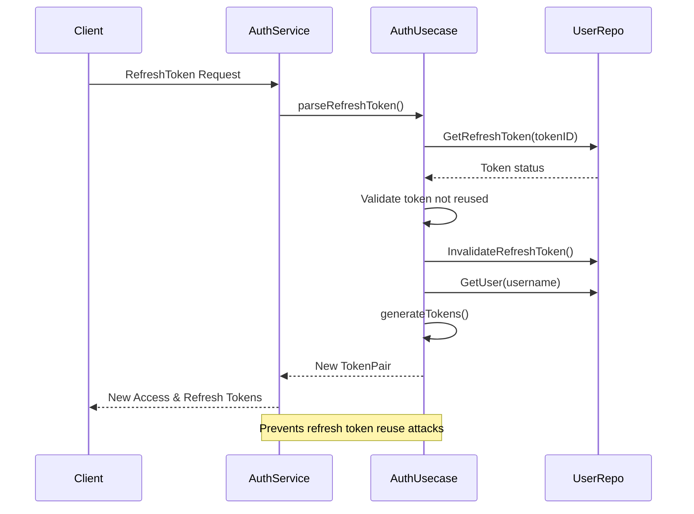
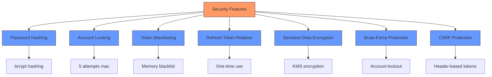

# Authentication API

<cite>
**Referenced Files in This Document**   
- [auth.proto](file://api/auth/v1/auth.proto#L1-L155)
- [auth.go](file://internal/service/auth.go#L1-L234)
- [auth.go](file://internal/biz/auth.go#L1-L694)
- [auth.go](file://internal/data/auth.go#L1-L437)
- [validate.proto](file://third_party/validate/validate.proto#L1-L864)
- [error_reason.proto](file://api/helloworld/v1/error_reason.proto#L1-L17)
</cite>

## Table of Contents
1. [Authentication API Endpoints](#authentication-api-endpoints)
2. [Request/Response Schemas](#requestresponse-schemas)
3. [gRPC to REST Mapping](#grpc-to-rest-mapping)
4. [Input Validation](#input-validation)
5. [Authentication and Token Management](#authentication-and-token-management)
6. [Error Handling](#error-handling)
7. [Captcha Integration](#captcha-integration)
8. [Security Considerations](#security-considerations)
9. [Client Implementation Examples](#client-implementation-examples)

## Authentication API Endpoints

The Authentication API provides comprehensive user authentication functionality including registration, login, token refresh, and logout operations. The API is defined using Protocol Buffers and supports both gRPC and RESTful access patterns through HTTP annotations.

### User Registration
Registers a new user account with username, password, email, and phone number. Requires captcha verification.

### User Login
Authenticates user credentials and returns JWT access and refresh tokens upon successful authentication.

### Refresh Token
Generates new access and refresh tokens using a valid refresh token, extending the user's authenticated session.

### Logout
Terminates the user's current session by invalidating the access token and associated refresh tokens.

### Get Captcha
Generates a captcha for security verification, supporting image, SMS, and email types.

### Verify Captcha
Validates user-provided captcha code against the stored captcha value.

### Lock Status
Retrieves the account lock status for a given username, including failed attempt count and unlock time.

**Section sources**
- [auth.proto](file://api/auth/v1/auth.proto#L1-L155)
- [auth.go](file://internal/service/auth.go#L1-L234)

## Request/Response Schemas

### User Register

**HTTP Method**: POST  
**URL Pattern**: `/api/v1/auth/register`

#### Request Schema (JSON)
```json
{
  "username": "string",
  "password": "string",
  "email": "string",
  "phone": "string",
  "captcha_id": "string",
  "captcha_code": "string"
}
```

#### Request Schema (gRPC)
```protobuf
message RegisterRequest {
  string username = 1;
  string password = 2;
  string email = 3;
  string phone = 4;
  string captcha_id = 5;
  string captcha_code = 6;
}
```

#### Response Schema (JSON)
```json
{
  "message": "string"
}
```

#### Response Schema (gRPC)
```protobuf
message RegisterReply {
  string message = 1;
}
```

### User Login

**HTTP Method**: POST  
**URL Pattern**: `/api/v1/auth/login`

#### Request Schema (JSON)
```json
{
  "username": "string",
  "password": "string",
  "captcha_id": "string",
  "captcha_code": "string",
  "totp_code": "string"
}
```

#### Request Schema (gRPC)
```protobuf
message LoginRequest {
  string username = 1;
  string password = 2;
  string captcha_id = 3;
  string captcha_code = 4;
  string totp_code = 5;
}
```

#### Response Schema (JSON)
```json
{
  "access_token": "string",
  "refresh_token": "string",
  "expires_in": "int64"
}
```

#### Response Schema (gRPC)
```protobuf
message LoginReply {
  string access_token = 1;
  string refresh_token = 2;
  int64 expires_in = 3;
}
```

### Refresh Token

**HTTP Method**: POST  
**URL Pattern**: `/api/v1/auth/refresh`

#### Request Schema (JSON)
```json
{
  "refresh_token": "string"
}
```

#### Request Schema (gRPC)
```protobuf
message RefreshTokenRequest {
  string refresh_token = 1;
}
```

#### Response Schema (JSON)
```json
{
  "access_token": "string",
  "refresh_token": "string",
  "expires_in": "int64"
}
```

#### Response Schema (gRPC)
```protobuf
message RefreshTokenReply {
  string access_token = 1;
  string refresh_token = 2;
  int64 expires_in = 3;
}
```

### Logout

**HTTP Method**: POST  
**URL Pattern**: `/api/v1/auth/logout`

#### Request Schema (JSON)
```json
{}
```

#### Request Schema (gRPC)
```protobuf
message LogoutRequest {}
```

#### Response Schema (JSON)
```json
{
  "success": "boolean"
}
```

#### Response Schema (gRPC)
```protobuf
message LogoutReply {
  bool success = 1;
}
```

**Section sources**
- [auth.proto](file://api/auth/v1/auth.proto#L1-L155)

## gRPC to REST Mapping

The Authentication API uses google.api.http annotations to map gRPC methods to RESTful HTTP endpoints, enabling both gRPC and HTTP/JSON access to the same service.

```mermaid
flowchart TD
A["gRPC Method: Register"] --> B["HTTP POST /api/v1/auth/register"]
C["gRPC Method: Login"] --> D["HTTP POST /api/v1/auth/login"]
E["gRPC Method: RefreshToken"] --> F["HTTP POST /api/v1/auth/refresh"]
G["gRPC Method: Logout"] --> H["HTTP POST /api/v1/auth/logout"]
I["gRPC Method: GetCaptcha"] --> J["HTTP GET /api/v1/auth/captcha"]
K["gRPC Method: VerifyCaptcha"] --> L["HTTP POST /api/v1/auth/captcha/verify"]
M["gRPC Method: LockStatus"] --> N["HTTP GET /api/v1/auth/lock-status/{username}"]
style A fill:#f9f,stroke:#333
style B fill:#bbf,stroke:#333
style C fill:#f9f,stroke:#333
style D fill:#bbf,stroke:#333
style E fill:#f9f,stroke:#333
style F fill:#bbf,stroke:#333
style G fill:#f9f,stroke:#333
style H fill:#bbf,stroke:#333
style I fill:#f9f,stroke:#333
style J fill:#bbf,stroke:#333
style K fill:#f9f,stroke:#333
style L fill:#bbf,stroke:#333
style M fill:#f9f,stroke:#333
style N fill:#bbf,stroke:#333
click A "#authentication-api-endpoints"
click B "#authentication-api-endpoints"
click C "#authentication-api-endpoints"
click D "#authentication-api-endpoints"
click E "#authentication-api-endpoints"
click F "#authentication-api-endpoints"
click G "#authentication-api-endpoints"
click H "#authentication-api-endpoints"
click I "#authentication-api-endpoints"
click J "#authentication-api-endpoints"
click K "#authentication-api-endpoints"
click L "#authentication-api-endpoints"
click M "#authentication-api-endpoints"
click N "#authentication-api-endpoints"
```



**Diagram sources**
- [auth.proto](file://api/auth/v1/auth.proto#L1-L155)

## Input Validation

The API implements comprehensive input validation using the validate.proto rules to ensure data integrity and security.

### Validation Rules

#### String Fields
- **Username**: Must be 3-20 characters, alphanumeric with underscores
- **Password**: Minimum 8 characters with complexity requirements
- **Email**: Valid email format
- **Phone**: Valid phone number format
- **Captcha ID/Code**: Required and non-empty

#### Field-Level Validation
```protobuf
// Example validation rules that would be applied
message RegisterRequest {
  string username = 1 [(validate.rules).string = {
    min_len: 3,
    max_len: 20,
    pattern: "^[a-zA-Z0-9_]+$"
  }];
  string password = 2 [(validate.rules).string = {
    min_len: 8,
    pattern: "^(?=.*[a-z])(?=.*[A-Z])(?=.*\\d).*$"
  }];
  string email = 3 [(validate.rules).string = {
    min_len: 5,
    max_len: 254,
    email: true
  }];
  string phone = 4 [(validate.rules).string = {
    pattern: "^\\+?[1-9]\\d{1,14}$"
  }];
  string captcha_id = 5 [(validate.rules).string = {
    min_len: 1
  }];
  string captcha_code = 6 [(validate.rules).string = {
    min_len: 1
  }];
}
```

**Section sources**
- [validate.proto](file://third_party/validate/validate.proto#L1-L864)
- [auth.proto](file://api/auth/v1/auth.proto#L1-L155)

## Authentication and Token Management

The authentication system implements JWT-based token management with access and refresh token flows for secure session handling.

### Token Generation Flow



**Diagram sources**
- [auth.go](file://internal/service/auth.go#L1-L234)
- [auth.go](file://internal/biz/auth.go#L1-L694)

### Token Refresh Flow



**Diagram sources**
- [auth.go](file://internal/service/auth.go#L1-L234)
- [auth.go](file://internal/biz/auth.go#L1-L694)

### Token Configuration
- **Access Token**: 15 minutes expiration
- **Refresh Token**: 7 days expiration
- **Signing Algorithm**: HS256 with 256-bit secret key
- **Token Storage**: Refresh tokens stored in database with usage tracking

## Error Handling

The API implements comprehensive error handling with specific error codes and appropriate HTTP status mappings.

### Error Codes and HTTP Status Mappings

| Error Code | HTTP Status | Description |
|------------|-------------|-------------|
| USER_NOT_FOUND | 404 Not Found | Username does not exist |
| PASSWORD_INCORRECT | 401 Unauthorized | Password is incorrect |
| CAPTCHA_REQUIRED | 400 Bad Request | Captcha is required for this operation |
| CAPTCHA_INVALID | 400 Bad Request | Captcha code is invalid |
| CAPTCHA_EXPIRED | 400 Bad Request | Captcha has expired |
| ACCOUNT_LOCKED | 403 Forbidden | Account is locked due to too many failed attempts |
| TOKEN_INVALID | 401 Unauthorized | Token is malformed or invalid |
| TOKEN_EXPIRED | 401 Unauthorized | Token has expired |
| USER_EXISTS | 400 Bad Request | Username already exists |

### Error Response Schema

#### JSON Format
```json
{
  "error": {
    "code": "string",
    "message": "string",
    "reason": "string",
    "metadata": {}
  }
}
```

#### gRPC Format
```protobuf
// Defined in third_party/errors/errors.proto
extend google.protobuf.EnumOptions {
  int32 default_code = 1108;
}

extend google.protobuf.EnumValueOptions {
  int32 code = 1109;
}
```

**Section sources**
- [auth.go](file://internal/service/auth.go#L1-L234)
- [error_reason.proto](file://api/helloworld/v1/error_reason.proto#L1-L17)

## Captcha Integration

The authentication system integrates captcha functionality to prevent automated attacks and bot registrations.

### Captcha Types Supported
- **Image Captcha**: Base64-encoded image data returned in response
- **SMS Captcha**: Sent to mobile phone number
- **Email Captcha**: Sent to email address

### Captcha Workflow

```mermaid
flowchart TD
A["Client: GetCaptcha Request"] --> B["Server: Generate captcha ID and code"]
B --> C["Store captcha in repository"]
C --> D["Return captcha ID and image data (if image type)"]
D --> E["Client: Display captcha to user"]
E --> F["Client: Submit captcha verification"]
F --> G["Server: Verify captcha ID and code"]
G --> H{"Valid?"}
H --> |Yes| I["Mark captcha as used", "Return success"]
H --> |No| J["Return validation error"]
style A fill:#f9f,stroke:#333
style B fill:#ff7,stroke:#333
style C fill:#ff7,stroke:#333
style D fill:#ff7,stroke:#333
style E fill:#f9f,stroke:#333
style F fill:#f9f,stroke:#333
style G fill:#ff7,stroke:#333
style H fill:#bbf,stroke:#333
style I fill:#9f9,stroke:#333
style J fill:#f99,stroke:#333
```

**Diagram sources**
- [auth.proto](file://api/auth/v1/auth.proto#L1-L155)
- [auth.go](file://internal/biz/auth.go#L1-L694)

## Security Considerations

The authentication system implements multiple security measures to protect user accounts and prevent common attacks.

### Password Security
- **Hashing**: Passwords are hashed using bcrypt with default cost
- **Storage**: Hashed passwords stored in database, never plaintext
- **Strength**: Minimum 8-character length requirement

### Account Protection
- **Account Locking**: Account locked after 5 failed login attempts
- **Lock Duration**: 30 minutes lockout period
- **Failed Attempt Tracking**: Tracks failed attempts with timestamps

### Session Security
- **Token Blacklisting**: Access tokens added to blacklist on logout
- **Refresh Token Rotation**: New refresh token issued on each refresh
- **Refresh Token Reuse Detection**: Detects and prevents token reuse attacks

### Attack Prevention
- **Brute Force Protection**: Account locking prevents password guessing
- **CSRF Protection**: JWT tokens in Authorization header (not cookies)
- **Rate Limiting**: Captcha required for sensitive operations
- **Data Encryption**: Sensitive user data encrypted at rest using KMS

### Sensitive Data Handling
- **Email/Phone Encryption**: Personal information encrypted in database
- **Data Hashing**: Hashes stored for lookup without revealing plaintext
- **Logging Anonymization**: Sensitive fields redacted in logs



**Diagram sources**
- [auth.go](file://internal/biz/auth.go#L1-L694)
- [auth.go](file://internal/data/auth.go#L1-L437)

## Client Implementation Examples

### Go Client Example

```go
package main

import (
    "context"
    "fmt"
    "time"
    
    "kratos-boilerplate/api/auth/v1"
    "google.golang.org/grpc"
    "google.golang.org/grpc/credentials/insecure"
)

func main() {
    // Connect to authentication service
    conn, err := grpc.Dial("localhost:8000", grpc.WithTransportCredentials(insecure.NewCredentials()))
    if err != nil {
        panic(err)
    }
    defer conn.Close()
    
    client := v1.NewAuthClient(conn)
    
    // Login request
    ctx, cancel := context.WithTimeout(context.Background(), time.Second*5)
    defer cancel()
    
    loginResp, err := client.Login(ctx, &v1.LoginRequest{
        Username:     "testuser",
        Password:     "password123",
        CaptchaId:    "captcha123",
        CaptchaCode:  "ABC123",
    })
    
    if err != nil {
        fmt.Printf("Login failed: %v\n", err)
        return
    }
    
    fmt.Printf("Access Token: %s\n", loginResp.AccessToken)
    fmt.Printf("Expires in: %d seconds\n", loginResp.ExpiresIn)
    
    // Use access token for authenticated requests
    authCtx := metadata.NewOutgoingContext(ctx, metadata.Pairs(
        "Authorization", "Bearer "+loginResp.AccessToken,
    ))
    
    // Refresh token example
    refreshResp, err := client.RefreshToken(ctx, &v1.RefreshTokenRequest{
        RefreshToken: loginResp.RefreshToken,
    })
    
    if err != nil {
        fmt.Printf("Token refresh failed: %v\n", err)
        return
    }
    
    fmt.Printf("New Access Token: %s\n", refreshResp.AccessToken)
}
```

### TypeScript Client Example

```typescript
// auth.service.ts
interface TokenPair {
  access_token: string;
  refresh_token: string;
  expires_in: number;
}

interface LoginCredentials {
  username: string;
  password: string;
  captcha_id?: string;
  captcha_code?: string;
  totp_code?: string;
}

class AuthService {
  private baseUrl = '/api/v1/auth';
  private accessToken: string | null = null;
  private refreshToken: string | null = null;
  private expiresAt: number = 0;

  async login(credentials: LoginCredentials): Promise<TokenPair> {
    const response = await fetch(`${this.baseUrl}/login`, {
      method: 'POST',
      headers: {
        'Content-Type': 'application/json',
      },
      body: JSON.stringify(credentials),
    });

    if (!response.ok) {
      const error = await response.json();
      throw new Error(error.message || 'Login failed');
    }

    const data = await response.json();
    this.setTokens(data.access_token, data.refresh_token, data.expires_in);
    return data;
  }

  async refreshToken(): Promise<TokenPair> {
    if (!this.refreshToken) {
      throw new Error('No refresh token available');
    }

    const response = await fetch(`${this.baseUrl}/refresh`, {
      method: 'POST',
      headers: {
        'Content-Type': 'application/json',
      },
      body: JSON.stringify({ refresh_token: this.refreshToken }),
    });

    if (!response.ok) {
      const error = await response.json();
      throw new Error(error.message || 'Token refresh failed');
    }

    const data = await response.json();
    this.setTokens(data.access_token, data.refresh_token, data.expires_in);
    return data;
  }

  async logout(): Promise<void> {
    if (!this.accessToken) {
      return;
    }

    await fetch(`${this.baseUrl}/logout`, {
      method: 'POST',
      headers: {
        'Authorization': `Bearer ${this.accessToken}`,
        'Content-Type': 'application/json',
      },
    });

    this.clearTokens();
  }

  private setTokens(accessToken: string, refreshToken: string, expiresIn: number): void {
    this.accessToken = accessToken;
    this.refreshToken = refreshToken;
    this.expiresAt = Date.now() + (expiresIn * 1000);
  }

  private clearTokens(): void {
    this.accessToken = null;
    this.refreshToken = null;
    this.expiresAt = 0;
  }

  isAuthenticated(): boolean {
    return !!this.accessToken && Date.now() < this.expiresAt;
  }

  getAuthHeader(): string | null {
    return this.accessToken ? `Bearer ${this.accessToken}` : null;
  }
}

// Usage example
const authService = new AuthService();

// Login
authService.login({
  username: 'testuser',
  password: 'password123',
  captcha_id: 'captcha123',
  captcha_code: 'ABC123'
}).then(tokens => {
  console.log('Login successful');
  console.log('Access token:', tokens.access_token);
}).catch(error => {
  console.error('Login failed:', error.message);
});
```

**Section sources**
- [auth.go](file://internal/service/auth.go#L1-L234)
- [auth.proto](file://api/auth/v1/auth.proto#L1-L155)