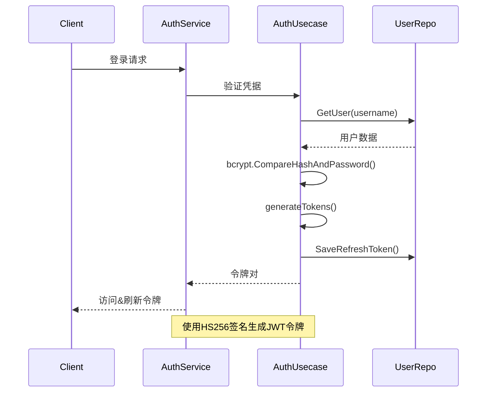
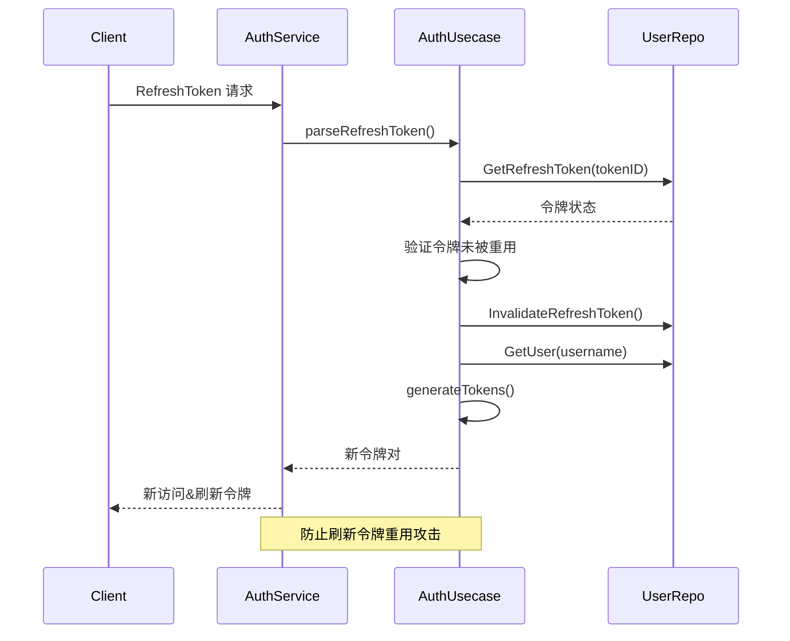
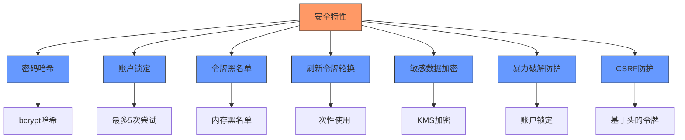

# 认证API

<cite>
**本文档引用的文件**   
- [auth.proto](file://api/auth/v1/auth.proto#L1-L155)
- [auth.go](file://internal/service/auth.go#L1-L234)
- [auth.go](file://internal/biz/auth.go#L1-L694)
- [auth.go](file://internal/data/auth.go#L1-L437)
- [validate.proto](file://third_party/validate/validate.proto#L1-L864)
- [error_reason.proto](file://api/helloworld/v1/error_reason.proto#L1-L17)
</cite>

## 目录
1. [认证API端点](#认证api端点)
2. [请求/响应模式](#请求响应模式)
3. [gRPC到REST映射](#grpc到rest映射)
4. [输入验证](#输入验证)
5. [认证和令牌管理](#认证和令牌管理)
6. [错误处理](#错误处理)
7. [验证码集成](#验证码集成)
8. [安全考虑](#安全考虑)
9. [客户端实现示例](#客户端实现示例)

## 认证API端点

认证API提供全面的用户认证功能，包括注册、登录、令牌刷新和注销操作。该API使用协议缓冲区定义，并通过HTTP注解支持gRPC和RESTful访问模式。

### 用户注册
使用用户名、密码、邮箱和电话号码注册新用户账户。需要验证码验证。

### 用户登录
验证用户凭据，并在成功认证后返回JWT访问令牌和刷新令牌。

### 刷新令牌
使用有效的刷新令牌生成新的访问和刷新令牌，延长用户的认证会话。

### 注销
通过使访问令牌和相关刷新令牌失效来终止用户的当前会话。

### 获取验证码
为安全验证生成验证码，支持图像、短信和邮件类型。

### 验证验证码
将用户提供的验证码与存储的验证码值进行验证。

### 锁定状态
检索给定用户名的账户锁定状态，包括失败尝试次数和解锁时间。

**Section sources**
- [auth.proto](file://api/auth/v1/auth.proto#L1-L155)
- [auth.go](file://internal/service/auth.go#L1-L234)

## 请求/响应模式

### 用户注册

**HTTP方法**: POST  
**URL模式**: `/api/v1/auth/register`

#### 请求模式 (JSON)
```json
{
  "username": "string",
  "password": "string",
  "email": "string",
  "phone": "string",
  "captcha_id": "string",
  "captcha_code": "string"
}
```

#### 请求模式 (gRPC)
```protobuf
message RegisterRequest {
  string username = 1;
  string password = 2;
  string email = 3;
  string phone = 4;
  string captcha_id = 5;
  string captcha_code = 6;
}
```

#### 响应模式 (JSON)
```json
{
  "message": "string"
}
```

#### 响应模式 (gRPC)
```protobuf
message RegisterReply {
  string message = 1;
}
```

### 用户登录

**HTTP方法**: POST  
**URL模式**: `/api/v1/auth/login`

#### 请求模式 (JSON)
```json
{
  "username": "string",
  "password": "string",
  "captcha_id": "string",
  "captcha_code": "string",
  "totp_code": "string"
}
```

#### 请求模式 (gRPC)
```protobuf
message LoginRequest {
  string username = 1;
  string password = 2;
  string captcha_id = 3;
  string captcha_code = 4;
  string totp_code = 5;
}
```

#### 响应模式 (JSON)
```json
{
  "access_token": "string",
  "refresh_token": "string",
  "expires_in": "int64"
}
```

#### 响应模式 (gRPC)
```protobuf
message LoginReply {
  string access_token = 1;
  string refresh_token = 2;
  int64 expires_in = 3;
}
```

### 刷新令牌

**HTTP方法**: POST  
**URL模式**: `/api/v1/auth/refresh`

#### 请求模式 (JSON)
```json
{
  "refresh_token": "string"
}
```

#### 请求模式 (gRPC)
```protobuf
message RefreshTokenRequest {
  string refresh_token = 1;
}
```

#### 响应模式 (JSON)
```json
{
  "access_token": "string",
  "refresh_token": "string",
  "expires_in": "int64"
}
```

#### 响应模式 (gRPC)
```protobuf
message RefreshTokenReply {
  string access_token = 1;
  string refresh_token = 2;
  int64 expires_in = 3;
}
```

### 注销

**HTTP方法**: POST  
**URL模式**: `/api/v1/auth/logout`

#### 请求模式 (JSON)
```json
{}
```

#### 请求模式 (gRPC)
```protobuf
message LogoutRequest {}
```

#### 响应模式 (JSON)
```json
{
  "success": "boolean"
}
```

#### 响应模式 (gRPC)
```protobuf
message LogoutReply {
  bool success = 1;
}
```

**Section sources**
- [auth.proto](file://api/auth/v1/auth.proto#L1-L155)

## gRPC到REST映射

认证API使用google.api.http注解将gRPC方法映射到RESTful HTTP端点，从而实现对同一服务的gRPC和HTTP/JSON访问。

```mermaid
flowchart TD
A["gRPC 方法: Register"] --> B["HTTP POST /api/v1/auth/register"]
C["gRPC 方法: Login"] --> D["HTTP POST /api/v1/auth/login"]
E["gRPC 方法: RefreshToken"] --> F["HTTP POST /api/v1/auth/refresh"]
G["gRPC 方法: Logout"] --> H["HTTP POST /api/v1/auth/logout"]
I["gRPC 方法: GetCaptcha"] --> J["HTTP GET /api/v1/auth/captcha"]
K["gRPC 方法: VerifyCaptcha"] --> L["HTTP POST /api/v1/auth/captcha/verify"]
M["gRPC 方法: LockStatus"] --> N["HTTP GET /api/v1/auth/lock-status/{username}"]
style A fill:#f9f,stroke:#333
style B fill:#bbf,stroke:#333
style C fill:#f9f,stroke:#333
style D fill:#bbf,stroke:#333
style E fill:#f9f,stroke:#333
style F fill:#bbf,stroke:#333
style G fill:#f9f,stroke:#333
style H fill:#bbf,stroke:#333
style I fill:#f9f,stroke:#333
style J fill:#bbf,stroke:#333
style K fill:#f9f,stroke:#333
style L fill:#bbf,stroke:#333
style M fill:#f9f,stroke:#333
style N fill:#bbf,stroke:#333
click A "#认证api端点"
click B "#认证api端点"
click C "#认证api端点"
click D "#认证api端点"
click E "#认证api端点"
click F "#认证api端点"
click G "#认证api端点"
click H "#认证api端点"
click I "#认证api端点"
click J "#认证api端点"
click K "#认证api端点"
click L "#认证api端点"
click M "#认证api端点"
click N "#认证api端点"
```



**Diagram sources**
- [auth.proto](file://api/auth/v1/auth.proto#L1-L155)

## 输入验证

该API使用validate.proto规则实现全面的输入验证，以确保数据完整性和安全性。

### 验证规则

#### 字符串字段
- **用户名**: 必须为3-20个字符，字母数字加下划线
- **密码**: 最少8个字符并满足复杂性要求
- **邮箱**: 有效邮箱格式
- **电话**: 有效电话号码格式
- **验证码ID/代码**: 必填且非空

#### 字段级验证
```protobuf
// 应用的示例验证规则
message RegisterRequest {
  string username = 1 [(validate.rules).string = {
    min_len: 3,
    max_len: 20,
    pattern: "^[a-zA-Z0-9_]+$"
  }];
  string password = 2 [(validate.rules).string = {
    min_len: 8,
    pattern: "^(?=.*[a-z])(?=.*[A-Z])(?=.*\\d).*$"
  }];
  string email = 3 [(validate.rules).string = {
    min_len: 5,
    max_len: 254,
    email: true
  }];
  string phone = 4 [(validate.rules).string = {
    pattern: "^\\+?[1-9]\\d{1,14}$"
  }];
  string captcha_id = 5 [(validate.rules).string = {
    min_len: 1
  }];
  string captcha_code = 6 [(validate.rules).string = {
    min_len: 1
  }];
}
```

**Section sources**
- [validate.proto](file://third_party/validate/validate.proto#L1-L864)
- [auth.proto](file://api/auth/v1/auth.proto#L1-L155)

## 认证和令牌管理

认证系统实现基于JWT的令牌管理，采用访问令牌和刷新令牌流程进行安全会话处理。

### 令牌生成流程



**Diagram sources**
- [auth.go](file://internal/service/auth.go#L1-L234)
- [auth.go](file://internal/biz/auth.go#L1-L694)

### 令牌刷新流程



**Diagram sources**
- [auth.go](file://internal/service/auth.go#L1-L234)
- [auth.go](file://internal/biz/auth.go#L1-L694)

### 令牌配置
- **访问令牌**: 15分钟过期
- **刷新令牌**: 7天过期
- **签名算法**: HS256带256位密钥
- **令牌存储**: 刷新令牌存储在数据库中并跟踪使用情况

## 错误处理

该API实现全面的错误处理，具有特定的错误代码和适当的HTTP状态映射。

### 错误代码和HTTP状态映射

| 错误代码 | HTTP状态 | 描述 |
|------------|-------------|-------------|
| USER_NOT_FOUND | 404 未找到 | 用户名不存在 |
| PASSWORD_INCORRECT | 401 未授权 | 密码不正确 |
| CAPTCHA_REQUIRED | 400 错误请求 | 此操作需要验证码 |
| CAPTCHA_INVALID | 400 错误请求 | 验证码无效 |
| CAPTCHA_EXPIRED | 400 错误请求 | 验证码已过期 |
| ACCOUNT_LOCKED | 403 禁止 | 由于太多失败尝试，账户已被锁定 |
| TOKEN_INVALID | 401 未授权 | 令牌格式错误或无效 |
| TOKEN_EXPIRED | 401 未授权 | 令牌已过期 |
| USER_EXISTS | 400 错误请求 | 用户名已存在 |

### 错误响应模式

#### JSON格式
```json
{
  "error": {
    "code": "string",
    "message": "string",
    "reason": "string",
    "metadata": {}
  }
}
```

#### gRPC格式
```protobuf
// 在third_party/errors/errors.proto中定义
extend google.protobuf.EnumOptions {
  int32 default_code = 1108;
}

extend google.protobuf.EnumValueOptions {
  int32 code = 1109;
}
```

**Section sources**
- [auth.go](file://internal/service/auth.go#L1-L234)
- [error_reason.proto](file://api/helloworld/v1/error_reason.proto#L1-L17)

## 验证码集成

认证系统集成验证码功能，以防止自动化攻击和机器人注册。

### 支持的验证码类型
- **图像验证码**: 返回base64编码的图像数据
- **短信验证码**: 发送到手机号码
- **邮件验证码**: 发送到邮箱地址

### 验证码工作流程

```mermaid
flowchart TD
A["客户端: GetCaptcha 请求"] --> B["服务器: 生成验证码ID和代码"]
B --> C["在仓库中存储验证码"]
C --> D["返回验证码ID和图像数据(如果是图像类型)"]
D --> E["客户端: 向用户显示验证码"]
E --> F["客户端: 提交验证码验证"]
F --> G["服务器: 验证验证码ID和代码"]
G --> H{"有效?"}
H --> |是| I["标记验证码为已使用", "返回成功"]
H --> |否| J["返回验证错误"]
style A fill:#f9f,stroke:#333
style B fill:#ff7,stroke:#333
style C fill:#ff7,stroke:#333
style D fill:#ff7,stroke:#333
style E fill:#f9f,stroke:#333
style F fill:#f9f,stroke:#333
style G fill:#ff7,stroke:#333
style H fill:#bbf,stroke:#333
style I fill:#9f9,stroke:#333
style J fill:#f99,stroke:#333
```

**Diagram sources**
- [auth.proto](file://api/auth/v1/auth.proto#L1-L155)
- [auth.go](file://internal/biz/auth.go#L1-L694)

## 安全考虑

认证系统实施多种安全措施来保护用户账户并防止常见攻击。

### 密码安全
- **哈希**: 使用bcrypt默认成本对密码进行哈希
- **存储**: 数据库中存储哈希密码，从不存储明文
- **强度**: 要求最小8字符长度

### 账户保护
- **账户锁定**: 5次登录失败后锁定账户
- **锁定时长**: 30分钟锁定期
- **失败尝试跟踪**: 跟踪带时间戳的失败尝试

### 会话安全
- **令牌黑名单**: 注销时将访问令牌添加到黑名单
- **刷新令牌轮换**: 每次刷新时颁发新刷新令牌
- **刷新令牌重用检测**: 检测并防止令牌重用攻击

### 攻击预防
- **暴力破解防护**: 账户锁定防止密码猜测
- **CSRF防护**: JWT令牌在Authorization头中（不在cookie中）
- **速率限制**: 敏感操作需要验证码
- **数据加密**: 使用KMS对静态敏感用户数据加密

### 敏感数据处理
- **邮箱/电话加密**: 数据库中加密个人信息
- **数据哈希**: 存储用于查找的哈希而不暴露明文
- **日志匿名化**: 日志中屏蔽敏感字段



**Diagram sources**
- [auth.go](file://internal/biz/auth.go#L1-L694)
- [auth.go](file://internal/data/auth.go#L1-L437)

## 客户端实现示例

### Go客户端示例

```go
package main

import (
    "context"
    "fmt"
    "time"
    
    "kratos-boilerplate/api/auth/v1"
    "google.golang.org/grpc"
    "google.golang.org/grpc/credentials/insecure"
)

func main() {
    // 连接到认证服务
    conn, err := grpc.Dial("localhost:8000", grpc.WithTransportCredentials(insecure.NewCredentials()))
    if err != nil {
        panic(err)
    }
    defer conn.Close()
    
    client := v1.NewAuthClient(conn)
    
    // 登录请求
    ctx, cancel := context.WithTimeout(context.Background(), time.Second*5)
    defer cancel()
    
    loginResp, err := client.Login(ctx, &v1.LoginRequest{
        Username:     "testuser",
        Password:     "password123",
        CaptchaId:    "captcha123",
        CaptchaCode:  "ABC123",
    })
    
    if err != nil {
        fmt.Printf("登录失败: %v\n", err)
        return
    }
    
    fmt.Printf("访问令牌: %s\n", loginResp.AccessToken)
    fmt.Printf("过期时间: %d 秒\n", loginResp.ExpiresIn)
    
    // 使用访问令牌进行认证请求
    authCtx := metadata.NewOutgoingContext(ctx, metadata.Pairs(
        "Authorization", "Bearer "+loginResp.AccessToken,
    ))
    
    // 刷新令牌示例
    refreshResp, err := client.RefreshToken(ctx, &v1.RefreshTokenRequest{
        RefreshToken: loginResp.RefreshToken,
    })
    
    if err != nil {
        fmt.Printf("令牌刷新失败: %v\n", err)
        return
    }
    
    fmt.Printf("新访问令牌: %s\n", refreshResp.AccessToken)
}
```

### TypeScript客户端示例

```typescript
// auth.service.ts
interface TokenPair {
  access_token: string;
  refresh_token: string;
  expires_in: number;
}

interface LoginCredentials {
  username: string;
  password: string;
  captcha_id?: string;
  captcha_code?: string;
  totp_code?: string;
}

class AuthService {
  private baseUrl = '/api/v1/auth';
  private accessToken: string | null = null;
  private refreshToken: string | null = null;
  private expiresAt: number = 0;

  async login(credentials: LoginCredentials): Promise<TokenPair> {
    const response = await fetch(`${this.baseUrl}/login`, {
      method: 'POST',
      headers: {
        'Content-Type': 'application/json',
      },
      body: JSON.stringify(credentials),
    });

    if (!response.ok) {
      const error = await response.json();
      throw new Error(error.message || '登录失败');
    }

    const data = await response.json();
    this.setTokens(data.access_token, data.refresh_token, data.expires_in);
    return data;
  }

  async refreshToken(): Promise<TokenPair> {
    if (!this.refreshToken) {
      throw new Error('无可用刷新令牌');
    }

    const response = await fetch(`${this.baseUrl}/refresh`, {
      method: 'POST',
      headers: {
        'Content-Type': 'application/json',
      },
      body: JSON.stringify({ refresh_token: this.refreshToken }),
    });

    if (!response.ok) {
      const error = await response.json();
      throw new Error(error.message || '令牌刷新失败');
    }

    const data = await response.json();
    this.setTokens(data.access_token, data.refresh_token, data.expires_in);
    return data;
  }

  async logout(): Promise<void> {
    if (!this.accessToken) {
      return;
    }

    await fetch(`${this.baseUrl}/logout`, {
      method: 'POST',
      headers: {
        'Authorization': `Bearer ${this.accessToken}`,
        'Content-Type': 'application/json',
      },
    });

    this.clearTokens();
  }

  private setTokens(accessToken: string, refreshToken: string, expiresIn: number): void {
    this.accessToken = accessToken;
    this.refreshToken = refreshToken;
    this.expiresAt = Date.now() + (expiresIn * 1000);
  }

  private clearTokens(): void {
    this.accessToken = null;
    this.refreshToken = null;
    this.expiresAt = 0;
  }

  isAuthenticated(): boolean {
    return !!this.accessToken && Date.now() < this.expiresAt;
  }

  getAuthHeader(): string | null {
    return this.accessToken ? `Bearer ${this.accessToken}` : null;
  }
}

// 使用示例
const authService = new AuthService();

// 登录
authService.login({
  username: 'testuser',
  password: 'password123',
  captcha_id: 'captcha123',
  captcha_code: 'ABC123'
}).then(tokens => {
  console.log('登录成功');
  console.log('访问令牌:', tokens.access_token);
}).catch(error => {
  console.error('登录失败:', error.message);
});
```

**Section sources**
- [auth.go](file://internal/service/auth.go#L1-L234)
- [auth.proto](file://api/auth/v1/auth.proto#L1-L155)