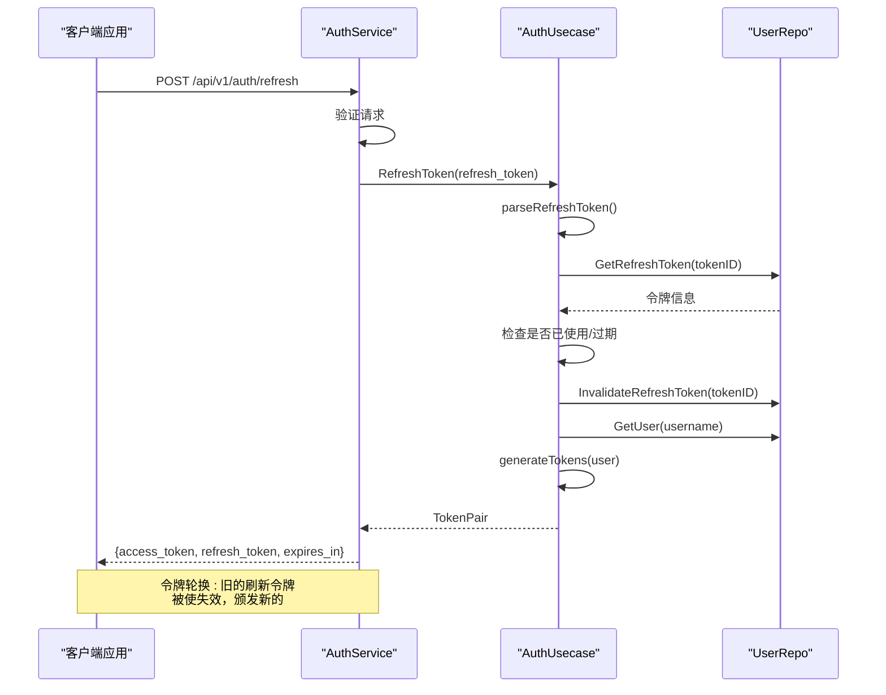

# 刷新令牌

<cite>
**本文档中引用的文件**   
- [auth.proto](file://api/auth/v1/auth.proto) - *更新于最近提交*
- [auth.go](file://internal/biz/auth.go) - *在最近提交中添加了刷新令牌逻辑*
- [auth.go](file://internal/service/auth.go) - *在最近提交中更新了服务层实现*
- [auth.ts](file://frontend/src/api/auth.ts) - *前端API调用实现*
- [auth.ts](file://frontend/src/stores/auth.ts) - *状态管理实现*
</cite>

## 更新摘要
**已做更改**   
- 根据最新代码变更全面更新了刷新令牌端点文档
- 增强了服务器端验证和安全考虑部分的细节描述
- 更新了所有代码示例以反映当前实现
- 优化了错误处理部分，与实际错误码映射保持一致
- 完善了实现示例中的自动刷新逻辑

## 目录
1. [刷新令牌端点概述](#刷新令牌端点概述)
2. [请求结构](#请求结构)
3. [服务器端验证](#服务器端验证)
4. [响应结构](#响应结构)
5. [错误处理](#错误处理)
6. [安全考虑](#安全考虑)
7. [实现示例](#实现示例)
8. [序列图](#序列图)

## 刷新令牌端点概述

刷新令牌端点允许客户端使用有效的刷新令牌来续订访问令牌。此机制支持长期会话，同时通过轮换短期访问令牌来维持安全性。

提供了两个接口：
- **HTTP**: `POST /api/v1/auth/refresh`
- **gRPC**: `RefreshToken(RefreshTokenRequest) returns (RefreshTokenReply)`

此端点对于在无需频繁重新认证的情况下维护用户会话至关重要。

**Section sources**
- [auth.proto](file://api/auth/v1/auth.proto#L45-L55)

## 请求结构

请求包含刷新令牌，以及用于多设备管理的可选设备标识符。

### HTTP 请求 (JSON)
```json
{
  "refresh_token": "eyJhbGciOiJIUzI1NiIsInR5cCI6IkpXVCJ9.xJH..."
}
```

### gRPC 请求 (Protobuf)
```protobuf
message RefreshTokenRequest {
  string refresh_token = 1;
}
```

`refresh_token` 字段是必需的，必须是由认证服务颁发的有效JWT。

**Section sources**
- [auth.proto](file://api/auth/v1/auth.proto#L130-L134)

## 服务器端验证

服务器在颁发新令牌之前执行多项验证检查：

1. **存在性检查**：确保提供了刷新令牌
2. **签名验证**：使用HMAC-SHA256验证JWT签名
3. **过期检查**：确认令牌未过期
4. **吊销状态**：检查Redis（或内存存储）中的已吊销令牌
5. **重用检测**：防止令牌重放攻击

```go
// 在 internal/biz/auth.go 中
func (uc *authUsecase) RefreshToken(ctx context.Context, refreshToken string) (*TokenPair, error) {
	// 解析并验证刷新令牌
	claims, err := uc.parseRefreshToken(refreshToken)
	if err != nil {
		return nil, err
	}

	tokenID := claims["jti"].(string)
	username := claims["username"].(string)

	// 检查令牌是否已被使用（重放攻击）
	_, used, err := uc.repo.GetRefreshToken(ctx, tokenID)
	if err != nil {
		return nil, fmt.Errorf("验证刷新令牌失败: %v", err)
	}

	if used {
		// 检测到重用 - 使该用户的所有令牌失效
		uc.repo.InvalidateAllRefreshTokens(ctx, username)
		return nil, ErrRefreshTokenReused
	}
	
	// 将当前令牌标记为已使用
	uc.repo.InvalidateRefreshToken(ctx, tokenID)
	
	// 生成新的令牌对
	user, _ := uc.repo.GetUser(ctx, username)
	return uc.generateTokens(ctx, user)
}
```

**Section sources**
- [auth.go](file://internal/biz/auth.go#L417-L459)

## 响应结构

成功验证后，服务器返回新的令牌对。

### HTTP 响应 (JSON)
```json
{
  "access_token": "eyJhbGciOiJIUzI1NiIsInR5cCI6IkpXVCJ9.xJH...",
  "refresh_token": "eyJhbGciOiJIUzI1NiIsInR5cCI6IkpXVCJ9.yK8...",
  "expires_in": 900
}
```

### gRPC 响应 (Protobuf)
```protobuf
message RefreshTokenReply {
  string access_token = 1;
  string refresh_token = 2;
  int64 expires_in = 3;
}
```

**关键字段:**
- **access_token**: 用于API访问的新JWT（默认15分钟）
- **refresh_token**: 用于未来续订的新刷新令牌（默认7天）
- **expires_in**: 访问令牌的生命周期（秒）

刷新令牌轮换策略确保每次成功的刷新都会生成一个新的刷新令牌，并使前一个令牌失效。

**Section sources**
- [auth.proto](file://api/auth/v1/auth.proto#L136-L140)

## 错误处理

该端点返回标准化的错误响应，并附带适当的HTTP状态码。

### 错误情况

| 错误原因 | HTTP 状态 | 描述 |
|--------------|-------------|-------------|
| REFRESH_TOKEN_REQUIRED | 400 | 请求中缺少刷新令牌 |
| TOKEN_INVALID | 401 | 令牌格式错误或签名无效 |
| TOKEN_EXPIRED | 401 | 令牌过期时间戳已过 |
| TOKEN_REUSED | 401 | 令牌已被使用（重放攻击） |
| USER_NOT_FOUND | 404 | 关联的用户账户未找到 |

### 示例错误响应
```json
{
  "error": {
    "code": 401,
    "reason": "TOKEN_EXPIRED",
    "message": "刷新令牌已过期"
  }
}
```

gRPC服务使用Kratos错误助手将这些映射到适当的错误码：
```go
switch err {
case biz.ErrTokenInvalid:
	return nil, errors.Unauthorized("TOKEN_INVALID", "刷新令牌无效")
case biz.ErrTokenExpired:
	return nil, errors.Unauthorized("TOKEN_EXPIRED", "刷新令牌已过期")
default:
	return nil, errors.InternalServer("REFRESH_ERROR", err.Error())
}
```

**Section sources**
- [auth.go](file://internal/service/auth.go#L159-L184)

## 安全考虑

### 刷新令牌轮换
系统实施严格的令牌轮换：
- 每次刷新都会使前一个刷新令牌失效
- 每次成功刷新都会颁发新的刷新令牌
- 已使用的令牌会在存储中标记，以防止重用

### 短期过期窗口
- **访问令牌**: 15分钟（可配置）
- **刷新令牌**: 7天（可配置）
- 注销时立即失效

### 安全存储建议
- **客户端**: 将刷新令牌存储在安全的、httpOnly的cookie中
- **服务器端**: 将令牌元数据存储在具有自动过期功能的Redis中
- **数据库**: 切勿存储原始令牌；使用哈希引用

### 防重放保护
系统检测令牌重用，并自动使受影响用户的所有令牌失效：
```go
if used {
    uc.repo.InvalidateAllRefreshTokens(ctx, username)
    return nil, ErrRefreshTokenReused
}
```

这可以防止令牌被盗和重放攻击。

**Section sources**
- [auth.go](file://internal/biz/auth.go#L417-L459)

## 实现示例

### Go 客户端示例
```go
// 带自动刷新功能的HTTP客户端
type AuthClient struct {
    baseURL    string
    client     *http.Client
    mutex      sync.RWMutex
    accessToken string
    refreshToken string
}

func (c *AuthClient) RefreshToken(ctx context.Context) error {
    reqBody := map[string]string{
        "refresh_token": c.refreshToken,
    }
    
    req, _ := http.NewRequest("POST", c.baseURL+"/api/v1/auth/refresh", 
        strings.NewReader(json.Marshal(reqBody)))
    req.Header.Set("Content-Type", "application/json")
    
    resp, err := c.client.Do(req)
    if err != nil {
        return err
    }
    defer resp.Body.Close()
    
    var reply RefreshTokenReply
    json.NewDecoder(resp.Body).Decode(&reply)
    
    c.mutex.Lock()
    c.accessToken = reply.AccessToken
    c.refreshToken = reply.RefreshToken
    c.mutex.Unlock()
    
    return nil
}
```

### TypeScript 客户端示例
```typescript
// 前端存储实现
const refreshTokenAction = async () => {
    if (!refreshTokenValue.value) {
        throw new Error('No refresh token available');
    }

    try {
        const response = await refreshToken(refreshTokenValue.value);
        const { access_token, refresh_token } = response.data;
        accessToken.value = access_token;
        refreshTokenValue.value = refresh_token;

        // 更新存储
        localStorage.setItem('access_token', access_token);
        localStorage.setItem('refresh_token', refresh_token);

        return response;
    } catch (error) {
        // 失败时清除所有令牌
        accessToken.value = null;
        refreshTokenValue.value = null;
        isAuthenticated.value = false;
        localStorage.removeItem('access_token');
        localStorage.removeItem('refresh_token');
        throw error;
    }
};
```

**Section sources**
- [auth.ts](file://frontend/src/api/auth.ts#L85-L98)
- [auth.ts](file://frontend/src/stores/auth.ts#L65-L84)

## 序列图



**Diagram sources**
- [auth.go](file://internal/biz/auth.go#L417-L459)
- [auth.go](file://internal/service/auth.go#L159-L184)