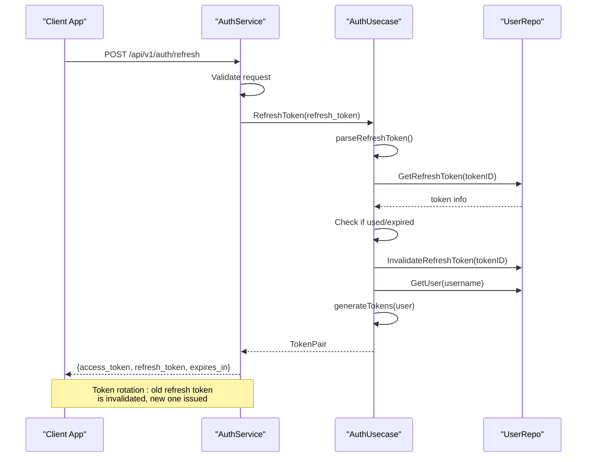

# Refresh Token

<cite>
**Referenced Files in This Document**   
- [auth.proto](file://api/auth/v1/auth.proto#L45-L55)
- [auth.go](file://internal/biz/auth.go#L385-L469)
- [auth.go](file://internal/service/auth.go#L205-L234)
- [auth.ts](file://frontend/src/api/auth.ts#L78-L85)
- [auth.ts](file://frontend/src/stores/auth.ts#L65-L84)
</cite>

## Table of Contents
1. [Refresh Token Endpoint Overview](#refresh-token-endpoint-overview)
2. [Request Structure](#request-structure)
3. [Server-Side Validation](#server-side-validation)
4. [Response Structure](#response-structure)
5. [Error Handling](#error-handling)
6. [Security Considerations](#security-considerations)
7. [Implementation Examples](#implementation-examples)
8. [Sequence Diagram](#sequence-diagram)

## Refresh Token Endpoint Overview

The Refresh Token endpoint allows clients to renew their access tokens using a valid refresh token. This mechanism supports long-lived sessions while maintaining security by rotating short-lived access tokens.

Two interfaces are provided:
- **HTTP**: `POST /api/v1/auth/refresh`
- **gRPC**: `RefreshToken(RefreshTokenRequest) returns (RefreshTokenReply)`

This endpoint is critical for maintaining user sessions without requiring frequent re-authentication.

**Section sources**
- [auth.proto](file://api/auth/v1/auth.proto#L45-L55)

## Request Structure

The request contains the refresh token and optionally a device identifier for multi-device management.

### HTTP Request (JSON)
```json
{
  "refresh_token": "eyJhbGciOiJIUzI1NiIsInR5cCI6IkpXVCJ9.xJH..."
}
```

### gRPC Request (Protobuf)
```protobuf
message RefreshTokenRequest {
  string refresh_token = 1;
}
```

The `refresh_token` field is required and must be a valid JWT issued by the authentication service.

**Section sources**
- [auth.proto](file://api/auth/v1/auth.proto#L130-L134)

## Server-Side Validation

The server performs multiple validation checks before issuing new tokens:

1. **Presence Check**: Ensures the refresh token is provided
2. **Signature Verification**: Validates JWT signature using HMAC-SHA256
3. **Expiration Check**: Confirms the token has not expired
4. **Revocation Status**: Checks Redis (or in-memory store) for revoked tokens
5. **Reuse Detection**: Prevents token replay attacks

```go
// In internal/biz/auth.go
func (uc *authUsecase) RefreshToken(ctx context.Context, refreshToken string) (*TokenPair, error) {
	// Parse and validate refresh token
	claims, err := uc.parseRefreshToken(refreshToken)
	if err != nil {
		return nil, err
	}

	tokenID := claims["jti"].(string)
	username := claims["username"].(string)

	// Check if token has been used (replay attack)
	_, used, err := uc.repo.GetRefreshToken(ctx, tokenID)
	if err != nil {
		return nil, fmt.Errorf("验证刷新令牌失败: %v", err)
	}

	if used {
		// Reuse detected - invalidate all user tokens
		uc.repo.InvalidateAllRefreshTokens(ctx, username)
		return nil, ErrRefreshTokenReused
	}
	
	// Mark current token as used
	uc.repo.InvalidateRefreshToken(ctx, tokenID)
	
	// Generate new token pair
	user, _ := uc.repo.GetUser(ctx, username)
	return uc.generateTokens(ctx, user)
}
```

**Section sources**
- [auth.go](file://internal/biz/auth.go#L385-L469)

## Response Structure

Upon successful validation, the server returns a new token pair.

### HTTP Response (JSON)
```json
{
  "access_token": "eyJhbGciOiJIUzI1NiIsInR5cCI6IkpXVCJ9.xJH...",
  "refresh_token": "eyJhbGciOiJIUzI1NiIsInR5cCI6IkpXVCJ9.yK8...",
  "expires_in": 900
}
```

### gRPC Response (Protobuf)
```protobuf
message RefreshTokenReply {
  string access_token = 1;
  string refresh_token = 2;
  int64 expires_in = 3;
}
```

**Key Fields:**
- **access_token**: New JWT for API access (15-minute default)
- **refresh_token**: New refresh token for future renewals (7-day default)
- **expires_in**: Access token lifetime in seconds

The refresh token rotation policy ensures that each successful refresh generates a new refresh token, invalidating the previous one.

**Section sources**
- [auth.proto](file://api/auth/v1/auth.proto#L136-L140)

## Error Handling

The endpoint returns standardized error responses with appropriate HTTP status codes.

### Error Cases

| Error Reason | HTTP Status | Description |
|--------------|-------------|-------------|
| REFRESH_TOKEN_REQUIRED | 400 | Refresh token missing in request |
| TOKEN_INVALID | 401 | Malformed or invalid signature |
| TOKEN_EXPIRED | 401 | Token expiration timestamp passed |
| TOKEN_REUSED | 401 | Token has already been used (replay attack) |
| USER_NOT_FOUND | 404 | Associated user account not found |

### Example Error Response
```json
{
  "error": {
    "code": 401,
    "reason": "TOKEN_EXPIRED",
    "message": "刷新令牌已过期"
  }
}
```

The gRPC service maps these to appropriate error codes using Kratos error helpers:
```go
switch err {
case biz.ErrTokenInvalid:
	return nil, errors.Unauthorized("TOKEN_INVALID", "刷新令牌无效")
case biz.ErrTokenExpired:
	return nil, errors.Unauthorized("TOKEN_EXPIRED", "刷新令牌已过期")
default:
	return nil, errors.InternalServer("REFRESH_ERROR", err.Error())
}
```

**Section sources**
- [auth.go](file://internal/service/auth.go#L205-L234)

## Security Considerations

### Refresh Token Rotation
The system implements strict token rotation:
- Each refresh invalidates the previous refresh token
- New refresh tokens are issued on every successful refresh
- Used tokens are marked in storage to prevent reuse

### Short Expiration Windows
- **Access Token**: 15 minutes (configurable)
- **Refresh Token**: 7 days (configurable)
- Immediate invalidation on logout

### Secure Storage Recommendations
- **Client-Side**: Store refresh tokens in secure, httpOnly cookies
- **Server-Side**: Store token metadata in Redis with automatic expiration
- **Database**: Never store raw tokens; use hashed references

### Anti-Replay Protection
The system detects token reuse and automatically invalidates all tokens for the affected user:
```go
if used {
    uc.repo.InvalidateAllRefreshTokens(ctx, username)
    return nil, ErrRefreshTokenReused
}
```

This protects against token theft and replay attacks.

**Section sources**
- [auth.go](file://internal/biz/auth.go#L433-L469)

## Implementation Examples

### Go Client Example
```go
// HTTP client with automatic refresh
type AuthClient struct {
    baseURL    string
    client     *http.Client
    mutex      sync.RWMutex
    accessToken string
    refreshToken string
}

func (c *AuthClient) RefreshToken(ctx context.Context) error {
    reqBody := map[string]string{
        "refresh_token": c.refreshToken,
    }
    
    req, _ := http.NewRequest("POST", c.baseURL+"/api/v1/auth/refresh", 
        strings.NewReader(json.Marshal(reqBody)))
    req.Header.Set("Content-Type", "application/json")
    
    resp, err := c.client.Do(req)
    if err != nil {
        return err
    }
    defer resp.Body.Close()
    
    var reply RefreshTokenReply
    json.NewDecoder(resp.Body).Decode(&reply)
    
    c.mutex.Lock()
    c.accessToken = reply.AccessToken
    c.refreshToken = reply.RefreshToken
    c.mutex.Unlock()
    
    return nil
}
```

### TypeScript Client Example
```typescript
// Frontend store implementation
const refreshTokenAction = async () => {
    if (!refreshTokenValue.value) {
        throw new Error('No refresh token available');
    }

    try {
        const response = await refreshToken(refreshTokenValue.value);
        const { access_token, refresh_token } = response.data;
        accessToken.value = access_token;
        refreshTokenValue.value = refresh_token;

        // Update storage
        localStorage.setItem('access_token', access_token);
        localStorage.setItem('refresh_token', refresh_token);

        return response;
    } catch (error) {
        // Clear all tokens on failure
        accessToken.value = null;
        refreshTokenValue.value = null;
        isAuthenticated.value = false;
        localStorage.removeItem('access_token');
        localStorage.removeItem('refresh_token');
        throw error;
    }
};
```

**Section sources**
- [auth.ts](file://frontend/src/api/auth.ts#L78-L85)
- [auth.ts](file://frontend/src/stores/auth.ts#L65-L84)

## Sequence Diagram



**Diagram sources**
- [auth.go](file://internal/biz/auth.go#L385-L469)
- [auth.go](file://internal/service/auth.go#L205-L234)