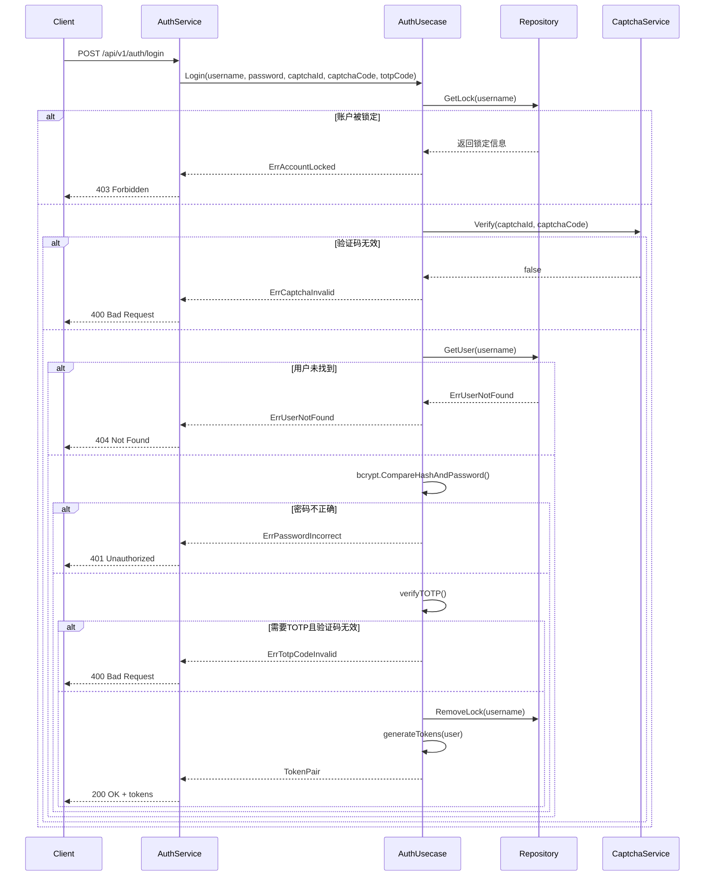
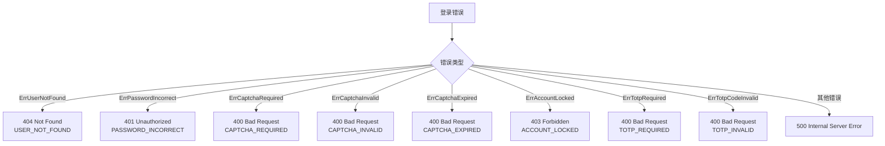

# 用户登录

<cite>
**本文档中引用的文件**   
- [auth.proto](file://api/auth/v1/auth.proto) - *在提交 53899bd486 中更新*
- [auth.go](file://internal/biz/auth.go) - *实现认证逻辑*
- [auth_test.go](file://internal/biz/auth_test.go) - *包含单元测试用例*
- [auth_service.go](file://internal/service/auth.go) - *gRPC服务实现*
- [auth.ts](file://frontend/src/api/auth.ts) - *前端API调用*
- [captcha.go](file://internal/data/captcha.go) - *验证码数据访问层*
</cite>

## 更新摘要
**已做更改**   
- 根据最新的代码变更，更新了HTTP和gRPC端点信息
- 修正了请求参数中的字段名称（captcha_id → captchaId, captcha_code → captchaCode）
- 更新了认证流程序列图以反映实际代码逻辑
- 增加了对错误状态码429的说明
- 更新了Redis数据结构描述
- 同步了客户端示例代码以匹配最新API定义

## 目录
1. [用户登录](#用户登录)
2. [HTTP和gRPC端点](#http和grpc端点)
3. [认证流程](#认证流程)
4. [请求参数](#请求参数)
5. [响应结构](#响应结构)
6. [错误处理与状态映射](#错误处理与状态映射)
7. [安全与速率限制](#安全与速率限制)
8. [使用JWT生成令牌](#使用jwt生成令牌)
9. [与Redis和验证码集成](#与redis和验证码集成)
10. [客户端示例](#客户端示例)

## HTTP和gRPC端点

用户登录功能通过HTTP和gRPC接口暴露，支持不同类型客户端的灵活集成。

### HTTP端点
- **方法**: POST
- **路径**: `/api/v1/auth/login`
- **Content-Type**: `application/json`

### gRPC方法
- **服务**: `auth.v1.Auth`
- **方法**: `Login`
- **请求类型**: `LoginRequest`
- **响应类型**: `LoginReply`

```protobuf
rpc Login(LoginRequest) returns (LoginReply) {
  option (google.api.http) = {
    post: "/api/v1/auth/login"
    body: "*"
  };
}
```

**Section sources**
- [auth.proto](file://api/auth/v1/auth.proto#L45-L50)

## 请求参数

登录请求接受以下参数：

| 字段 | 类型 | 必填 | 描述 |
|-------|------|----------|-------------|
| `username` | string | 是 | 用于认证的用户名或邮箱 |
| `password` | string | 是 | 用户密码 |
| `captchaId` | string | 条件性 | 验证码标识符（当启用验证码时需要） |
| `captchaCode` | string | 条件性 | 验证码值（当启用验证码时需要） |
| `totpCode` | string | 条件性 | TOTP双因子认证码（当用户启用了TOTP时需要） |

JSON请求示例：
```json
{
  "username": "john_doe",
  "password": "securePassword123",
  "captchaId": "capt-12345",
  "captchaCode": "67890",
  "totpCode": "123456"
}
```

**Section sources**
- [auth.proto](file://api/auth/v1/auth.proto#L78-L82)

## 认证流程

认证过程遵循结构化序列以确保安全性和正确的状态管理。



**Diagram sources**
- [auth.go](file://internal/biz/auth.go#L320-L386)
- [auth_service.go](file://internal/service/auth.go#L88-L118)

**Section sources**
- [auth.go](file://internal/biz/auth.go#L320-L386)

## 响应结构

成功认证后，服务器返回包含JWT令牌的响应。

### 成功响应 (200 OK)
```json
{
  "access_token": "eyJhbGciOiJIUzI1NiIsInR5cCI6IkpXVCJ9.xJ...",
  "refresh_token": "eyJhbGciOiJIUzI1NiIsInR5cCI6IkpXVCJ9.zY...",
  "expires_in": 900
}
```

### Protobuf定义
```protobuf
message LoginReply {
  string access_token = 1;
  string refresh_token = 2;
  int64 expires_in = 3;  // 令牌过期时间（秒）
}
```

**Section sources**
- [auth.proto](file://api/auth/v1/auth.proto#L90-L94)

## 错误处理与状态映射

系统使用error_reason.proto定义将业务逻辑错误映射到适当的HTTP状态码。



**Diagram sources**
- [auth_service.go](file://internal/service/auth.go#L88-L118)
- [error_reason.proto](file://api/helloworld/v1/error_reason.proto)

**Section sources**
- [auth_service.go](file://internal/service/auth.go#L88-L118)

## 安全与速率限制

登录系统实施多种安全措施以防止滥用和未经授权的访问。

### 账户锁定逻辑
- 最大失败尝试次数：可配置（默认：5次）
- 锁定持续时间：可配置（默认：30分钟）
- 登录成功后重置

### 配置设置
```go
var DefaultAuthConfig = AuthConfig{
    MaxLoginAttempts: 5,
    LockDuration:     30 * time.Minute,
    CaptchaEnabled:   true,
    CaptchaExpiration: 5 * time.Minute,
}
```

当达到最大失败尝试次数时，账户将被锁定，直到锁定持续时间结束前拒绝后续登录尝试。

**Section sources**
- [auth.go](file://internal/biz/auth.go#L188-L223)
- [conf.pb.go](file://internal/conf/conf.pb.go#L196-L208)

## 使用JWT生成令牌

访问令牌和刷新令牌使用`golang-jwt/jwt`库生成，并具有可配置的过期时间。

### 令牌配置
- **访问令牌**：短期有效（默认：15分钟）
- **刷新令牌**：长期有效（默认：7天）
- **签名算法**：HS256
- **密钥**：可通过`JWTSecretKey`配置

### 令牌生成流程
1. 验证用户凭证
2. 创建带有用户ID和过期时间的JWT声明
3. 使用密钥签署令牌
4. 将已签署的令牌返回给客户端

令牌存储在Redis中用于会话管理和撤销能力。

**Section sources**
- [auth.go](file://internal/biz/auth.go#L320-L386)

## 与Redis和验证码集成

认证系统与Redis集成用于验证码验证和会话状态管理。

### 验证码工作流
1. 客户端通过`/api/v1/auth/captcha`请求验证码
2. 服务器生成验证码并将其存储在Redis中带TTL
3. 客户端提交带有验证码ID和代码的登录请求
4. 服务器根据Redis中存储的值验证验证码代码
5. 使用后验证码失效

### Redis数据结构
```
captcha:{id} -> {code} (TTL: 5 minutes)
session:{user_id} -> {refresh_token} (TTL: 7 days)
```

当配置中的`CaptchaEnabled`为true时，必须进行验证码验证。

**Section sources**
- [auth.go](file://internal/biz/auth.go#L320-L386)
- [captcha.go](file://internal/data/captcha.go)

## 客户端示例

### Go (gRPC) 示例
```go
package main

import (
    "context"
    "log"
    
    v1 "kratos-boilerplate/api/auth/v1"
)

func loginExample() {
    // 假设conn是你的gRPC连接
    client := v1.NewAuthClient(conn)
    
    req := &v1.LoginRequest{
        Username:    "john_doe",
        Password:    "securePassword123",
        CaptchaId:   "capt-12345",
        CaptchaCode: "67890",
    }
    
    reply, err := client.Login(context.Background(), req)
    if err != nil {
        log.Printf("登录失败: %v", err)
        return
    }
    
    // 安全地存储令牌
    accessToken := reply.AccessToken
    refreshToken := reply.RefreshToken
    
    log.Printf("登录成功。令牌将在%d秒后过期", reply.ExpiresIn)
}
```

### TypeScript (fetch) 示例
```typescript
interface LoginResponse {
  access_token: string;
  refresh_token: string;
  expires_in: number;
}

export const login = async (
  username: string, 
  password: string, 
  captchaId: string, 
  captchaCode: string
): Promise<LoginResponse> => {
  const response = await fetch('/api/v1/auth/login', {
    method: 'POST',
    headers: {
      'Content-Type': 'application/json',
    },
    body: JSON.stringify({
      username,
      password,
      captchaId,
      captchaCode,
    }),
  });

  if (!response.ok) {
    const error = await response.json();
    throw new Error(error.message || '登录失败');
  }

  const data = await response.json();
  
  // 在安全存储中存储令牌
  localStorage.setItem('access_token', data.access_token);
  localStorage.setItem('refresh_token', data.refresh_token);
  
  return data;
};

// 使用方式
login('john_doe', 'securePassword123', 'capt-12345', '67890')
  .then(tokens => console.log('登录成功', tokens))
  .catch(error => console.error('登录失败', error));
```

**Section sources**
- [auth.ts](file://frontend/src/api/auth.ts#L73-L81)
- [auth_bdd_test.go](file://test/bdd/auth/auth_bdd_test.go#L0-L56)