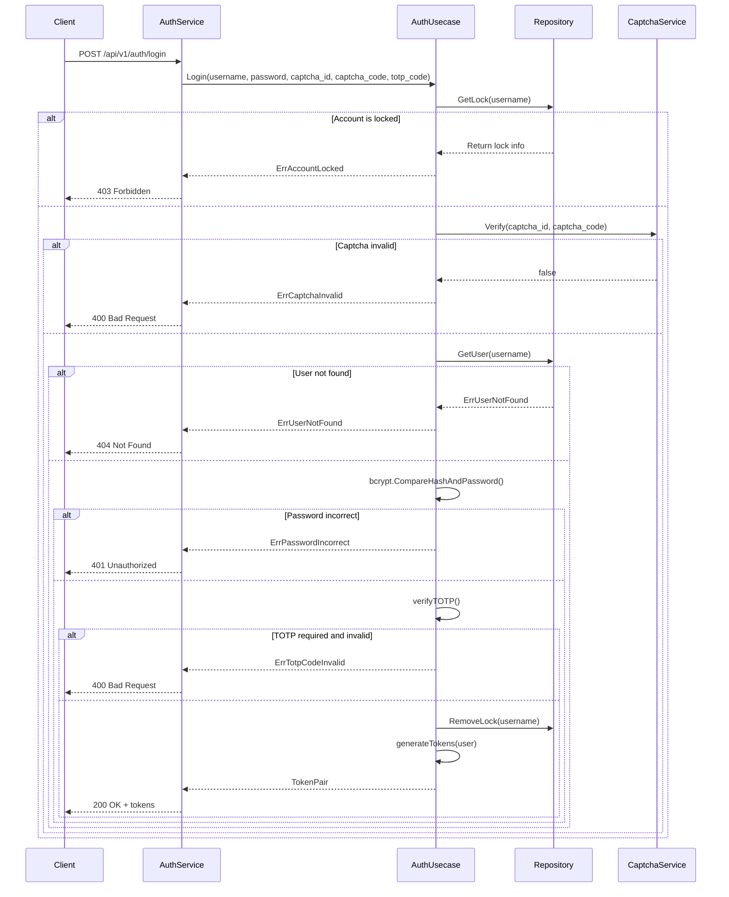
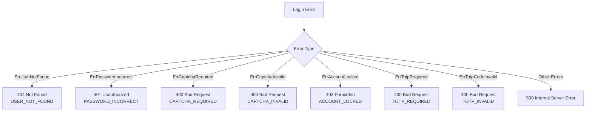

# User Login

<cite>
**Referenced Files in This Document**   
- [auth.proto](file://api/auth/v1/auth.proto)
- [auth.go](file://internal/biz/auth.go)
- [auth_test.go](file://internal/biz/auth_test.go)
- [auth_service.go](file://internal/service/auth.go)
- [auth_bdd_test.go](file://test/bdd/auth/auth_bdd_test.go)
- [auth.ts](file://frontend/src/api/auth.ts)
- [conf.pb.go](file://internal/conf/conf.pb.go)
</cite>

## Table of Contents
1. [User Login](#user-login)
2. [HTTP and gRPC Endpoints](#http-and-grpc-endpoints)
3. [Authentication Flow](#authentication-flow)
4. [Request Parameters](#request-parameters)
5. [Response Structure](#response-structure)
6. [Error Handling and Status Mapping](#error-handling-and-status-mapping)
7. [Security and Rate Limiting](#security-and-rate-limiting)
8. [Token Generation with JWT](#token-generation-with-jwt)
9. [Integration with Redis and Captcha](#integration-with-redis-and-captcha)
10. [Client-Side Examples](#client-side-examples)

## HTTP and gRPC Endpoints

The User Login functionality is exposed through both HTTP and gRPC interfaces, enabling flexible integration across different client types.

### HTTP Endpoint
- **Method**: POST
- **Path**: `/api/v1/auth/login`
- **Content-Type**: `application/json`

### gRPC Method
- **Service**: `auth.v1.Auth`
- **Method**: `Login`
- **Request Type**: `LoginRequest`
- **Response Type**: `LoginReply`

```protobuf
rpc Login(LoginRequest) returns (LoginReply) {
  option (google.api.http) = {
    post: "/api/v1/auth/login"
    body: "*"
  };
}
```

**Section sources**
- [auth.proto](file://api/auth/v1/auth.proto#L45-L50)

## Request Parameters

The login request accepts the following parameters:

| Field | Type | Required | Description |
|-------|------|----------|-------------|
| `username` | string | Yes | Username or email for authentication |
| `password` | string | Yes | User's password |
| `captcha_id` | string | Conditional | Captcha identifier (required if captcha is enabled) |
| `captcha_code` | string | Conditional | Captcha value (required if captcha is enabled) |
| `totp_code` | string | Conditional | TOTP code (required if TOTP is enabled for the user) |

Example JSON request:
```json
{
  "username": "john_doe",
  "password": "securePassword123",
  "captcha_id": "capt-12345",
  "captcha_code": "67890",
  "totp_code": "123456"
}
```

**Section sources**
- [auth.proto](file://api/auth/v1/auth.proto#L78-L82)

## Authentication Flow

The authentication process follows a structured sequence to ensure security and proper state management.



**Diagram sources**
- [auth.go](file://internal/biz/auth.go#L320-L386)
- [auth_service.go](file://internal/service/auth.go#L88-L118)

**Section sources**
- [auth.go](file://internal/biz/auth.go#L320-L386)

## Response Structure

Upon successful authentication, the server returns a response containing JWT tokens.

### Successful Response (200 OK)
```json
{
  "access_token": "eyJhbGciOiJIUzI1NiIsInR5cCI6IkpXVCJ9.xJ...",
  "refresh_token": "eyJhbGciOiJIUzI1NiIsInR5cCI6IkpXVCJ9.zY...",
  "expires_in": 900
}
```

### Protobuf Definition
```protobuf
message LoginReply {
  string access_token = 1;
  string refresh_token = 2;
  int64 expires_in = 3;  // Token expiration in seconds
}
```

**Section sources**
- [auth.proto](file://api/auth/v1/auth.proto#L90-L94)

## Error Handling and Status Mapping

The system maps business logic errors to appropriate HTTP status codes using the error_reason.proto definitions.



**Diagram sources**
- [auth_service.go](file://internal/service/auth.go#L88-L118)
- [error_reason.proto](file://api/helloworld/v1/error_reason.proto)

**Section sources**
- [auth_service.go](file://internal/service/auth.go#L88-L118)

## Security and Rate Limiting

The login system implements multiple security measures to prevent abuse and unauthorized access.

### Account Lockout Logic
- Maximum failed attempts: Configurable (default: 5)
- Lock duration: Configurable (default: 30 minutes)
- Reset on successful login

### Configuration Settings
```go
var DefaultAuthConfig = AuthConfig{
    MaxLoginAttempts: 5,
    LockDuration:     30 * time.Minute,
    CaptchaEnabled:   true,
    CaptchaExpiration: 5 * time.Minute,
}
```

When the maximum number of failed attempts is reached, the account is locked and subsequent login attempts will be rejected until the lock duration expires.

**Section sources**
- [auth.go](file://internal/biz/auth.go#L188-L223)
- [conf.pb.go](file://internal/conf/conf.pb.go#L196-L208)

## Token Generation with JWT

Access and refresh tokens are generated using the `golang-jwt/jwt` library with configurable expiration times.

### Token Configuration
- **Access Token**: Short-lived (default: 15 minutes)
- **Refresh Token**: Long-lived (default: 7 days)
- **Signing Algorithm**: HS256
- **Secret Key**: Configurable via `JWTSecretKey`

### Token Generation Process
1. Validate user credentials
2. Create JWT claims with user ID and expiration
3. Sign token with secret key
4. Return signed token to client

The tokens are stored in Redis for session management and revocation capabilities.

**Section sources**
- [auth.go](file://internal/biz/auth.go#L320-L386)

## Integration with Redis and Captcha

The authentication system integrates with Redis for both captcha verification and session state management.

### Captcha Workflow
1. Client requests captcha via `/api/v1/auth/captcha`
2. Server generates captcha and stores in Redis with TTL
3. Client submits login with captcha ID and code
4. Server verifies captcha code against Redis-stored value
5. Captcha is invalidated after use

### Redis Data Structure
```
captcha:{id} -> {code} (TTL: 5 minutes)
session:{user_id} -> {refresh_token} (TTL: 7 days)
```

Captcha verification is mandatory when `CaptchaEnabled` is true in the configuration.

**Section sources**
- [auth.go](file://internal/biz/auth.go#L320-L386)
- [captcha.go](file://internal/data/captcha.go)

## Client-Side Examples

### Go (gRPC) Example
```go
package main

import (
    "context"
    "log"
    
    v1 "kratos-boilerplate/api/auth/v1"
)

func loginExample() {
    // Assume conn is your gRPC connection
    client := v1.NewAuthClient(conn)
    
    req := &v1.LoginRequest{
        Username:    "john_doe",
        Password:    "securePassword123",
        CaptchaId:   "capt-12345",
        CaptchaCode: "67890",
    }
    
    reply, err := client.Login(context.Background(), req)
    if err != nil {
        log.Printf("Login failed: %v", err)
        return
    }
    
    // Store tokens securely
    accessToken := reply.AccessToken
    refreshToken := reply.RefreshToken
    
    log.Printf("Login successful. Token expires in %d seconds", reply.ExpiresIn)
}
```

### TypeScript (fetch) Example
```typescript
interface LoginResponse {
  access_token: string;
  refresh_token: string;
  expires_in: number;
}

export const login = async (
  username: string, 
  password: string, 
  captchaId: string, 
  captchaCode: string
): Promise<LoginResponse> => {
  const response = await fetch('/api/v1/auth/login', {
    method: 'POST',
    headers: {
      'Content-Type': 'application/json',
    },
    body: JSON.stringify({
      username,
      password,
      captchaId,
      captchaCode,
    }),
  });

  if (!response.ok) {
    const error = await response.json();
    throw new Error(error.message || 'Login failed');
  }

  const data = await response.json();
  
  // Store tokens in secure storage
  localStorage.setItem('access_token', data.access_token);
  localStorage.setItem('refresh_token', data.refresh_token);
  
  return data;
};

// Usage
login('john_doe', 'securePassword123', 'capt-12345', '67890')
  .then(tokens => console.log('Login successful', tokens))
  .catch(error => console.error('Login failed', error));
```

**Section sources**
- [auth.ts](file://frontend/src/api/auth.ts#L73-L81)
- [auth_bdd_test.go](file://test/bdd/auth/auth_bdd_test.go#L0-L56)