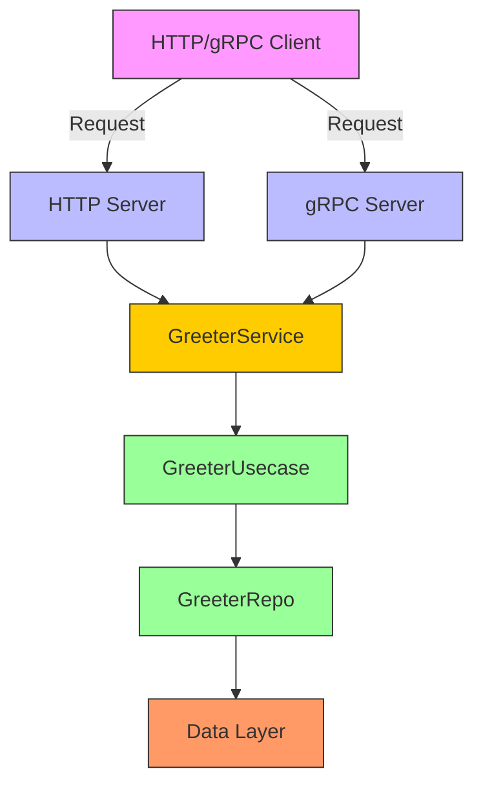
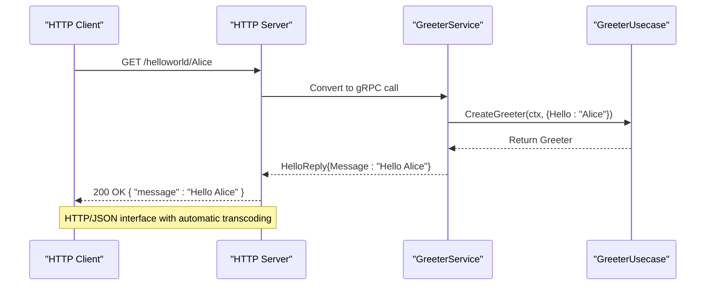
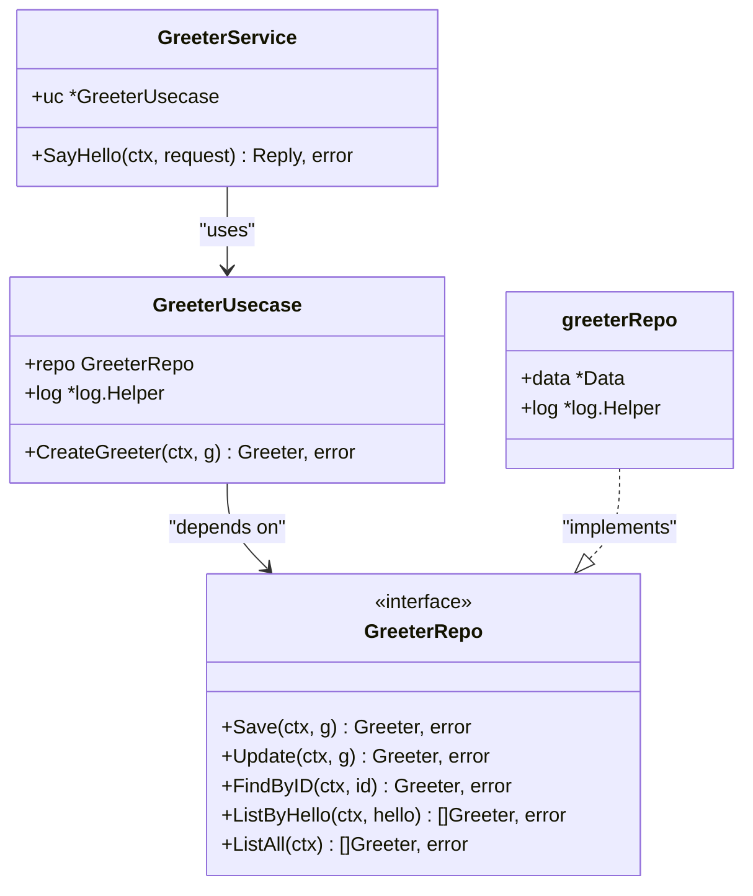

# Greeter API

<cite>
**Referenced Files in This Document**   
- [greeter.proto](file://api/helloworld/v1/greeter.proto#L1-L30)
- [error_reason.proto](file://api/helloworld/v1/error_reason.proto#L1-L13)
- [greeter.go](file://internal/service/greeter.go#L1-L29)
- [greeter.go](file://internal/biz/greeter.go#L1-L38)
- [greeter.go](file://internal/data/greeter.go#L1-L42)
- [http.go](file://internal/server/http.go#L1-L38)
- [grpc.go](file://internal/server/grpc.go#L1-L35)
</cite>

## Table of Contents
1. [Introduction](#introduction)
2. [API Overview](#api-overview)
3. [Service Definition](#service-definition)
4. [Request and Response Messages](#request-and-response-messages)
5. [HTTP and gRPC Interface Mapping](#http-and-grpc-interface-mapping)
6. [Implementation Architecture](#implementation-architecture)
7. [Error Handling and Error Reason](#error-handling-and-error-reason)
8. [Usage Examples](#usage-examples)
9. [Client Code Examples](#client-code-examples)
10. [Security and Authentication](#security-and-authentication)
11. [Rate Limiting and Monitoring](#rate-limiting-and-monitoring)
12. [Conclusion](#conclusion)

## Introduction
The Greeter API is a simple demonstration service within the Kratos boilerplate project, designed to showcase the implementation of a gRPC and HTTP service using the Kratos framework. It provides a basic "Hello World" style endpoint that accepts a name and returns a personalized greeting. This service serves as a reference implementation for building new API services in the Kratos ecosystem, illustrating proper structure, dependency injection, and interface design.

The service is defined using Protocol Buffers (protobuf), enabling both gRPC and HTTP/JSON interfaces through the use of `google.api.http` annotations. It follows a clean architecture pattern with separation between transport, business logic, and data layers.

**Section sources**
- [greeter.proto](file://api/helloworld/v1/greeter.proto#L1-L30)
- [greeter.go](file://internal/service/greeter.go#L1-L29)

## API Overview
The Greeter service exposes a single endpoint, `SayHello`, which accepts a user's name and returns a greeting message. The service is accessible via both gRPC and HTTP protocols, with automatic JSON mapping for HTTP clients. This dual interface is achieved through the Kratos framework's support for transcoding gRPC to HTTP/JSON.

The API is designed to be simple and illustrative, making it ideal for onboarding new developers to the Kratos framework. Despite its simplicity, it demonstrates key architectural patterns including dependency injection via Wire, layered architecture (transport, usecase, data), and proper error handling.



**Diagram sources**
- [greeter.go](file://internal/service/greeter.go#L1-L29)
- [greeter.go](file://internal/biz/greeter.go#L1-L38)
- [http.go](file://internal/server/http.go#L1-L38)
- [grpc.go](file://internal/server/grpc.go#L1-L35)

## Service Definition
The Greeter service is defined in the `greeter.proto` file using Protocol Buffers syntax. It contains a single RPC method, `SayHello`, which takes a `HelloRequest` message and returns a `HelloReply` message.

The service definition includes HTTP mapping via the `google.api.http` annotation, which specifies that the `SayHello` method should be accessible via an HTTP GET request at the path `/helloworld/{name}`, where `{name}` is a path parameter extracted from the request.

```protobuf
service Greeter {
  rpc SayHello (HelloRequest) returns (HelloReply) {
    option (google.api.http) = {
      get: "/helloworld/{name}"
    };
  }
}
```

This annotation enables the Kratos framework to automatically expose the gRPC service as a RESTful HTTP endpoint, providing JSON serialization and deserialization without additional code.

**Section sources**
- [greeter.proto](file://api/helloworld/v1/greeter.proto#L1-L30)

## Request and Response Messages
The Greeter service uses two simple message types for communication: `HelloRequest` and `HelloReply`.

### HelloRequest
This message contains a single field, `name`, which represents the user's name to be greeted.

```protobuf
message HelloRequest {
  string name = 1;
}
```

### HelloReply
This message contains a single field, `message`, which contains the greeting response.

```protobuf
message HelloReply {
  string message = 1;
}
```

Both messages are minimal by design, focusing on the core functionality of the service. In a production environment, additional fields such as metadata, timestamps, or correlation IDs could be added as needed.

**Section sources**
- [greeter.proto](file://api/helloworld/v1/greeter.proto#L1-L30)

## HTTP and gRPC Interface Mapping
The Greeter service demonstrates the powerful interface mapping capabilities of the Kratos framework. Through the `google.api.http` annotation, a single service definition can be accessed via both gRPC and HTTP protocols.

### HTTP Interface
- **Method**: GET
- **Path**: `/helloworld/{name}`
- **Request**: No request body (name is passed as path parameter)
- **Response**: JSON object with message field
- **Example**: `GET /helloworld/Alice` returns `{"message": "Hello Alice"}`

### gRPC Interface
- **Method**: SayHello
- **Request**: HelloRequest protobuf message
- **Response**: HelloReply protobuf message
- **Example**: Call SayHello with `{name: "Alice"}` returns `{message: "Hello Alice"}`

The mapping is handled automatically by the Kratos framework, which uses the HTTP annotation to generate the necessary transcoding logic. This allows clients to choose the protocol that best suits their needs while maintaining a single service implementation.



**Diagram sources**
- [greeter.proto](file://api/helloworld/v1/greeter.proto#L1-L30)
- [http.go](file://internal/server/http.go#L1-L38)
- [greeter.go](file://internal/service/greeter.go#L1-L29)

## Implementation Architecture
The Greeter service follows a clean, layered architecture that separates concerns and promotes testability. The implementation consists of three main layers: transport, usecase, and data.

### Layer Breakdown
1. **Transport Layer**: Handles incoming requests and outgoing responses (gRPC/HTTP)
2. **Usecase Layer**: Contains business logic and coordinates operations
3. **Data Layer**: Manages data persistence and retrieval

### Component Flow
When a request is received:
1. The HTTP or gRPC server receives the request
2. The GreeterService (transport) extracts parameters and calls the usecase
3. The GreeterUsecase (business logic) processes the request and calls the repository
4. The GreeterRepo (data layer) would normally interact with a database (currently returns mock data)
5. The response flows back through the chain to the client



**Diagram sources**
- [greeter.go](file://internal/service/greeter.go#L1-L29)
- [greeter.go](file://internal/biz/greeter.go#L1-L38)
- [greeter.go](file://internal/data/greeter.go#L1-L42)

## Error Handling and Error Reason
The Greeter service includes a basic error handling mechanism through the `error_reason.proto` file, which defines an enumeration of possible error reasons.

### ErrorReason Enum
```protobuf
enum ErrorReason {
  GREETER_UNSPECIFIED = 0;
  USER_NOT_FOUND = 1;
}
```

Currently, the service implementation does not return errors in normal operation, but the framework is in place to support error reporting. The `ErrorReason` enum can be used to provide structured error information to clients, which is particularly useful for internationalization and client-side error handling.

In a production implementation, errors from the data layer would be translated into appropriate gRPC status codes with error details that could include the ErrorReason. For example, if a user lookup failed, the service might return a NOT_FOUND status with ErrorReason.USER_NOT_FOUND.

The error handling follows the Kratos framework conventions, allowing for consistent error reporting across all services in the application.

**Section sources**
- [error_reason.proto](file://api/helloworld/v1/error_reason.proto#L1-L13)
- [greeter.go](file://internal/service/greeter.go#L1-L29)

## Usage Examples
Below are examples of valid requests and responses for the Greeter service in both JSON and protobuf formats.

### HTTP/JSON Example
**Request**
```
GET /helloworld/Alice HTTP/1.1
Host: localhost:8000
Accept: application/json
```

**Response**
```
HTTP/1.1 200 OK
Content-Type: application/json

{
  "message": "Hello Alice"
}
```

### gRPC/Protobuf Example
**Request (Protobuf Text Format)**
```
name: "Alice"
```

**Response (Protobuf Text Format)**
```
message: "Hello Alice"
```

**Request (JSON for gRPC-JSON transcoding)**
```json
{
  "name": "Alice"
}
```

**Response (JSON)**
```json
{
  "message": "Hello Alice"
}
```

The service automatically handles the conversion between protobuf and JSON formats, allowing clients to use whichever format is most convenient.

**Section sources**
- [greeter.proto](file://api/helloworld/v1/greeter.proto#L1-L30)

## Client Code Examples
The following examples demonstrate how to use the Greeter service from Go and TypeScript clients.

### Go Client Example
```go
package main

import (
    "context"
    "log"
    
    "google.golang.org/grpc"
    v1 "kratos-boilerplate/api/helloworld/v1"
)

func main() {
    conn, err := grpc.Dial("localhost:9000", grpc.WithInsecure())
    if err != nil {
        log.Fatal("Failed to connect:", err)
    }
    defer conn.Close()
    
    client := v1.NewGreeterClient(conn)
    resp, err := client.SayHello(context.Background(), &v1.HelloRequest{
        Name: "Alice",
    })
    if err != nil {
        log.Fatal("RPC failed:", err)
    }
    
    log.Println(resp.Message) // Output: Hello Alice
}
```

### TypeScript Client Example
```typescript
// Assuming generated protobuf TypeScript bindings
import { GreeterClient } from 'api/helloworld/v1/greeter.pb';
import { HelloRequest } from 'api/helloworld/v1/greeter.pb';

async function greet() {
  const client = new GreeterClient('http://localhost:8000');
  const request = new HelloRequest();
  request.setName('Alice');
  
  try {
    const response = await client.sayHello(request);
    console.log(response.getMessage()); // Output: Hello Alice
  } catch (error) {
    console.error('RPC failed:', error);
  }
}

greet();
```

These examples show the simplicity of interacting with the service from different programming languages, leveraging the protocol buffer definitions for type safety and code generation.

**Section sources**
- [greeter.proto](file://api/helloworld/v1/greeter.proto#L1-L30)

## Security and Authentication
The current implementation of the Greeter service does not require authentication, making it accessible to any client. This is appropriate for a demonstration service but would not be suitable for production endpoints handling sensitive data.

In the broader Kratos boilerplate project, authentication is handled by the Auth service (defined in `api/auth/v1/auth.proto`) and enforced through middleware. The HTTP and gRPC servers include middleware pipelines that could be extended to include authentication checks.

For production services, authentication would typically be implemented using:
- JWT tokens in the Authorization header
- API keys
- OAuth2 flows

The service could be protected by adding authentication middleware to the server configuration, which would validate credentials before allowing access to the Greeter methods.

The architecture supports secure communication through:
- TLS for encrypted transport
- Structured error handling that avoids information leakage
- Separation of concerns that isolates security logic

**Section sources**
- [http.go](file://internal/server/http.go#L1-L38)
- [grpc.go](file://internal/server/grpc.go#L1-L35)

## Rate Limiting and Monitoring
While the current Greeter service implementation does not include rate limiting or comprehensive monitoring, the Kratos framework provides the necessary hooks to add these features.

### Rate Limiting
Rate limiting could be implemented by adding middleware to the HTTP and gRPC servers. Possible approaches include:
- Token bucket algorithm
- Fixed window counting
- Sliding log window

The middleware would track request rates per client (identified by IP or API key) and reject requests that exceed configured limits.

### Monitoring
The service already includes basic logging through the Kratos logger. Enhanced monitoring could include:
- Prometheus metrics for request rates, latencies, and error rates
- Distributed tracing using OpenTelemetry
- Structured logging with correlation IDs
- Health checks and readiness probes

The `log.Helper` in the GreeterUsecase provides structured logging with context, which can be integrated with monitoring systems. For example, each greeting request is logged with the name being greeted:

```go
uc.log.WithContext(ctx).Infof("CreateGreeter: %v", g.Hello)
```

These logs can be collected and analyzed to monitor service health and usage patterns.

**Section sources**
- [greeter.go](file://internal/biz/greeter.go#L1-L38)
- [http.go](file://internal/server/http.go#L1-L38)
- [grpc.go](file://internal/server/grpc.go#L1-L35)

## Conclusion
The Greeter API serves as an excellent reference implementation for creating new services in the Kratos framework. It demonstrates key architectural patterns including:
- Protocol Buffer-based service definition
- Dual HTTP/gRPC interface through annotation-driven transcoding
- Clean layered architecture with separation of transport, business logic, and data concerns
- Dependency injection using Wire
- Structured logging and error handling

Despite its simplicity, the service illustrates best practices that can be scaled to more complex applications. The clear separation of concerns makes the codebase maintainable and testable, while the use of standard tools and patterns ensures consistency across services.

Developers can use this service as a template for creating new APIs, replacing the greeting logic with their own business functionality while maintaining the same architectural structure. The combination of gRPC for internal communication and HTTP/JSON for external clients provides flexibility for different use cases and client requirements.

The service is well-positioned to be extended with additional features such as authentication, rate limiting, and enhanced monitoring as needed for production deployment.