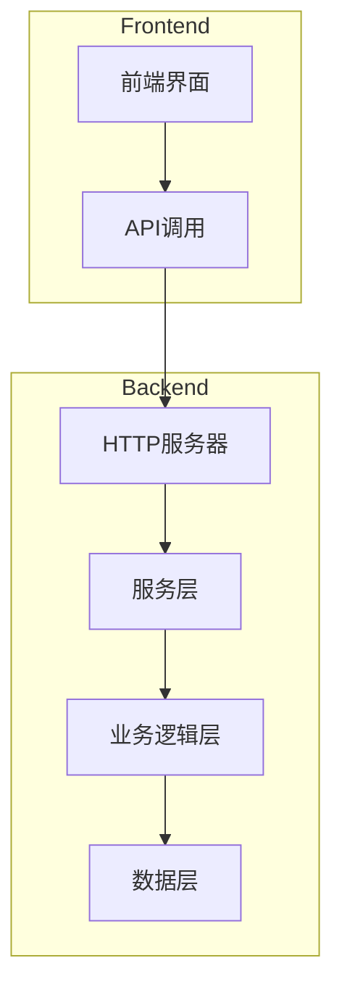
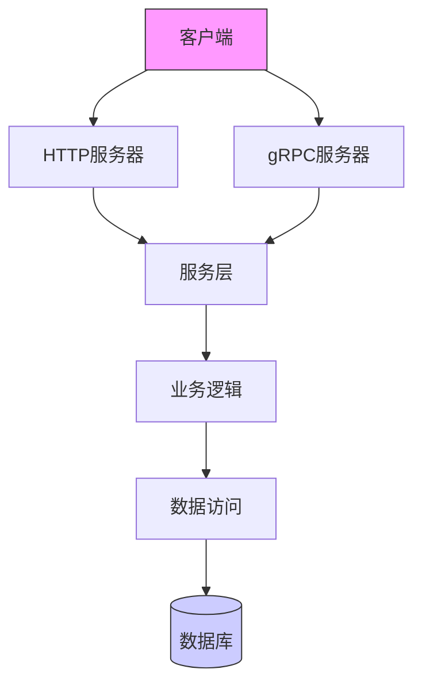
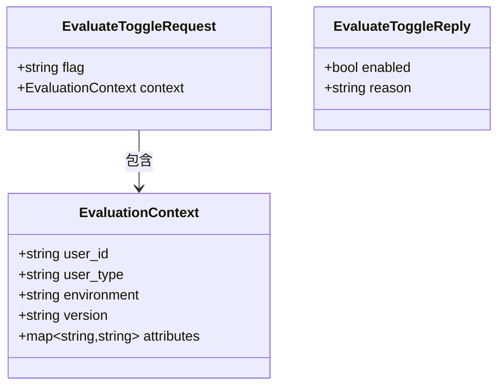
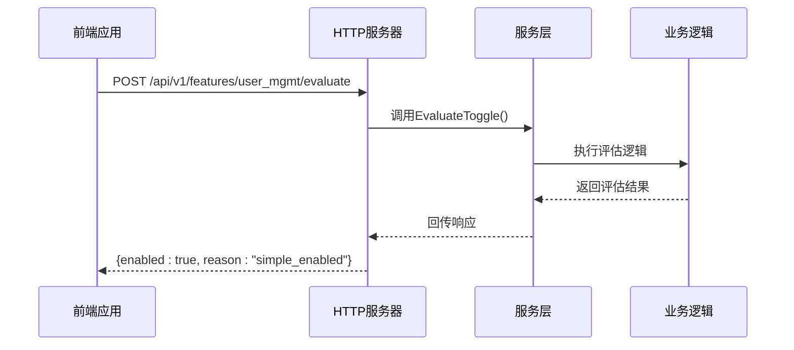
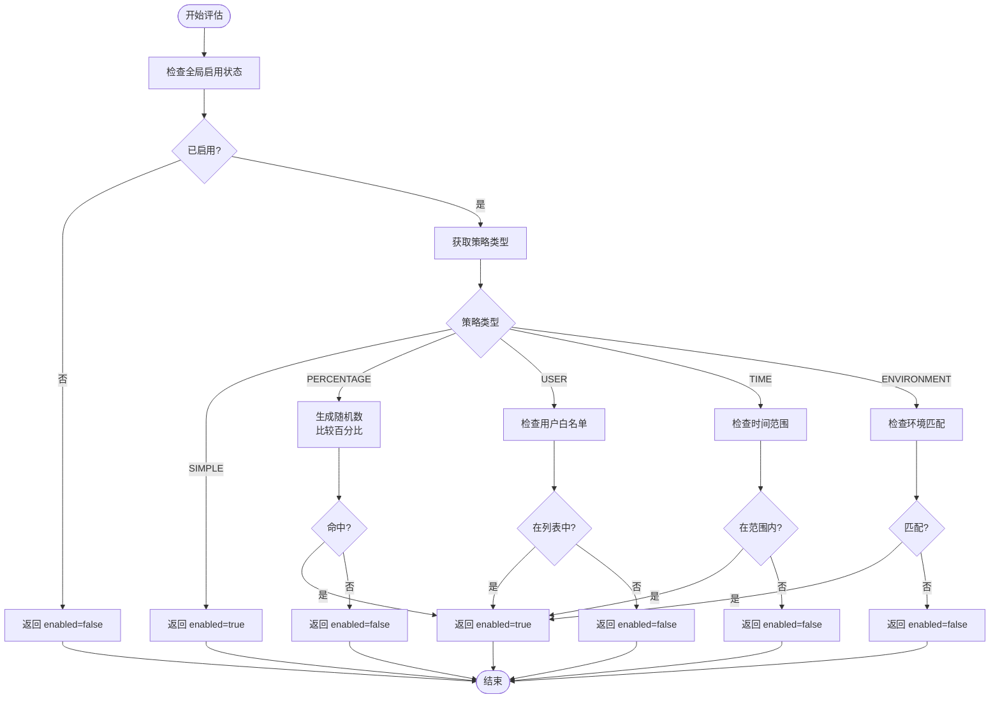
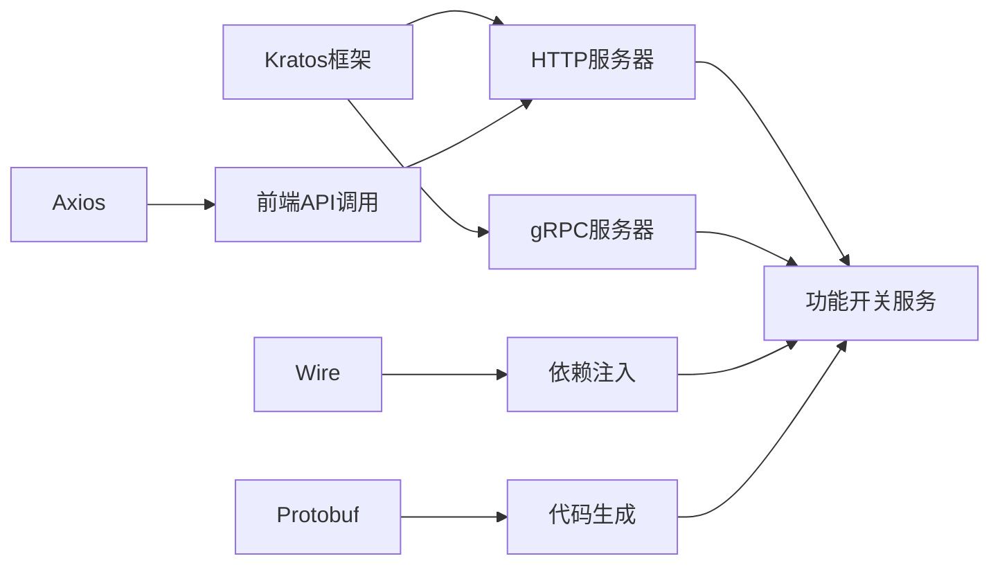

# 功能开关API

<cite>
**本文档引用的文件**
- [feature.proto](file://api/feature/v1/feature.proto)
- [main.go](file://cmd/kratos-boilerplate/main.go)
- [wire.go](file://cmd/kratos-boilerplate/wire.go)
- [request.ts](file://frontend/src/api/request.ts)
- [auth.ts](file://frontend/src/api/auth.ts)
</cite>

## 目录
1. [简介](#简介)
2. [项目结构](#项目结构)
3. [核心组件](#核心组件)
4. [架构概述](#架构概述)
5. [详细组件分析](#详细组件分析)
6. [依赖分析](#依赖分析)
7. [性能考虑](#性能考虑)
8. [故障排除指南](#故障排除指南)
9. [结论](#结论)

## 简介
本API文档详细介绍了功能开关系统的实现，包括通过`feature.proto`定义的`EvaluateFeature` RPC方法。该系统支持基于用户ID、环境和上下文属性的动态功能控制，并提供百分比灰度、用户白名单和时间窗口等策略评估机制。前端可通过HTTP GET `/v1/feature/{name}/evaluate`接口访问此功能，适用于在运行时动态调整UI元素显示逻辑的场景。

## 项目结构
该项目采用分层架构设计，包含API定义、业务逻辑、数据访问和服务层。API使用Protocol Buffers进行定义，位于`api/feature/v1/feature.proto`中，而服务实现则分布在`internal/service`目录下。前端代码位于`frontend`目录，使用TypeScript构建，通过Axios与后端通信。

**图示来源**
- [main.go](file://cmd/kratos-boilerplate/main.go#L1-L90)
- [wire.go](file://cmd/kratos-boilerplate/wire.go#L1-L25)

**本节来源**
- [main.go](file://cmd/kratos-boilerplate/main.go#L1-L90)
- [wire.go](file://cmd/kratos-boilerplate/wire.go#L1-L25)

## 核心组件
核心功能由`FeatureToggle`服务驱动，其主要操作包括列出、获取、更新和评估功能开关。`EvaluateToggle`方法是关键入口点，接收包含用户ID、环境和自定义属性的上下文信息，并返回是否启用特定功能的决策结果。

**本节来源**
- [feature.proto](file://api/feature/v1/feature.proto#L30-L255)

## 架构概述
系统采用Kratos框架构建微服务架构，通过gRPC和HTTP双协议暴露接口。依赖注入使用Wire实现，确保各层之间的松耦合。配置管理集中化，日志和追踪中间件统一处理请求链路。

**图示来源**
- [main.go](file://cmd/kratos-boilerplate/main.go#L1-L90)
- [wire.go](file://cmd/kratos-boilerplate/wire.go#L1-L25)

## 详细组件分析

### 功能开关评估分析
`EvaluateToggleRequest`接受功能标识符和评估上下文，后者包含用户ID、用户类型、部署环境、版本号及自定义属性映射。响应包含`enabled`布尔值和`reason`字符串，用于说明决策依据。

#### 对象关系图

**图示来源**
- [feature.proto](file://api/feature/v1/feature.proto#L205-L255)

#### 请求流程序列图

**图示来源**
- [feature.proto](file://api/feature/v1/feature.proto#L80-L90)
- [main.go](file://cmd/kratos-boilerplate/main.go#L1-L90)

**本节来源**
- [feature.proto](file://api/feature/v1/feature.proto#L1-L255)

### 策略评估逻辑分析
系统支持多种策略类型：简单启用、百分比灰度、用户白名单、时间窗口和环境匹配。这些策略存储在`ToggleConfig.rules`字段中，由业务逻辑解析并决定最终状态。

#### 策略评估流程图

**图示来源**
- [feature.proto](file://api/feature/v1/feature.proto#L95-L140)

**本节来源**
- [feature.proto](file://api/feature/v1/feature.proto#L95-L140)

## 依赖分析
系统依赖Kratos框架提供的gRPC和HTTP支持，以及Wire进行依赖注入。前端依赖Axios进行HTTP通信，后端通过Protobuf生成代码实现类型安全的接口定义。

**图示来源**
- [go.mod](file://go.mod#L1-L20)
- [main.go](file://cmd/kratos-boilerplate/main.go#L1-L90)

**本节来源**
- [main.go](file://cmd/kratos-boilerplate/main.go#L1-L90)
- [wire.go](file://cmd/kratos-boilerplate/wire.go#L1-L25)

## 性能考虑
系统采用缓存策略减少数据库查询压力，统计信息定期上报以监控功能使用情况。HTTP接口路径参数直接映射到`flag`字段，查询参数用于传递上下文属性，避免复杂解析开销。

**本节来源**
- [feature.proto](file://api/feature/v1/feature.proto#L1-L255)

## 故障排除指南
当无法连接服务时，请检查网络配置和认证令牌有效性。若返回默认值（如`enabled=false`），可能是降级机制触发，表明配置中心不可达或策略解析失败。建议查看日志中的`reason`字段定位问题根源。

**本节来源**
- [feature.proto](file://api/feature/v1/feature.proto#L230-L240)
- [auth.ts](file://frontend/src/api/auth.ts#L1-L98)

## 结论
该功能开关系统提供了灵活且可扩展的特性管理能力，支持多维度的启用策略。通过清晰的API设计和健壮的错误处理机制，能够在生产环境中安全地实施渐进式发布和A/B测试。