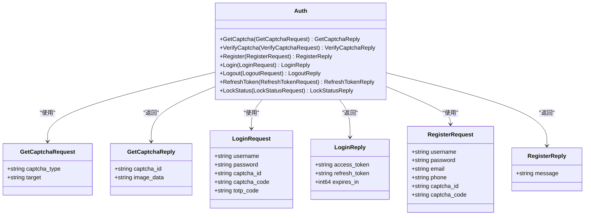

# 认证服务API文档

<cite>
**本文档引用的文件**
- [api/auth/v1/auth.proto](file://api/auth/v1/auth.proto)
- [api/common/v1/error.proto](file://api/common/v1/error.proto)
- [internal/service/auth.go](file://internal/service/auth.go)
- [internal/biz/auth.go](file://internal/biz/auth.go)
- [internal/pkg/auth/auth.go](file://internal/pkg/auth/auth.go)
- [frontend/src/api/auth.ts](file://frontend/src/api/auth.ts)
- [frontend/src/views/Login.vue](file://frontend/src/views/Login.vue)
- [frontend/src/views/Register.vue](file://frontend/src/views/Register.vue)
- [frontend/src/stores/auth.ts](file://frontend/src/stores/auth.ts)
- [configs/config.yaml](file://configs/config.yaml)
- [internal/data/migrations/000001_create_users_table.up.sql](file://internal/data/migrations/000001_create_users_table.up.sql)
</cite>

## 目录
1. [简介](#简介)
2. [项目架构概览](#项目架构概览)
3. [核心认证服务接口](#核心认证服务接口)
4. [JWT令牌系统](#jwt令牌系统)
5. [验证码系统](#验证码系统)
6. [错误处理机制](#错误处理机制)
7. [前端集成示例](#前端集成示例)
8. [安全配置](#安全配置)
9. [故障排除指南](#故障排除指南)
10. [总结](#总结)

## 简介

kratos-boilerplate认证服务是一个基于gRPC和RESTful API的企业级认证解决方案，采用Kratos框架构建。该服务提供了完整的用户认证、授权和会话管理功能，包括密码登录、验证码验证、双因子认证（TOTP）、令牌刷新等核心功能。

### 主要特性

- **多协议支持**：同时支持gRPC和HTTP RESTful API
- **JWT令牌系统**：基于JSON Web Token的标准认证机制
- **验证码保护**：支持图片、短信、邮件等多种验证码形式
- **双因子认证**：可选的TOTP双因子认证增强安全性
- **账户锁定机制**：防止暴力破解攻击
- **灵活的权限控制**：基于角色和权限的细粒度访问控制
- **企业级安全**：支持数据加密、审计日志等功能

## 项目架构概览


**图表来源**
- [internal/service/auth.go](file://internal/service/auth.go#L1-L50)
- [internal/biz/auth.go](file://internal/biz/auth.go#L1-L100)
- [internal/pkg/auth/auth.go](file://internal/pkg/auth/auth.go#L1-L150)

## 核心认证服务接口

### gRPC服务定义

认证服务通过gRPC定义了以下核心接口：



**图表来源**
- [api/auth/v1/auth.proto](file://api/auth/v1/auth.proto#L10-L100)
- [internal/service/auth.go](file://internal/service/auth.go#L25-L150)

### HTTP RESTful API映射

每个gRPC方法都通过google.api.http注解映射到对应的HTTP端点：

| gRPC方法 | HTTP方法 | URL路径 | 描述 |
|---------|---------|---------|------|
| GetCaptcha | GET | `/api/v1/auth/captcha` | 获取验证码 |
| VerifyCaptcha | POST | `/api/v1/auth/captcha/verify` | 验证验证码 |
| Register | POST | `/api/v1/auth/register` | 用户注册 |
| Login | POST | `/api/v1/auth/login` | 用户登录 |
| Logout | POST | `/api/v1/auth/logout` | 退出登录 |
| RefreshToken | POST | `/api/v1/auth/refresh` | 刷新令牌 |
| LockStatus | GET | `/api/v1/auth/lock-status/{username}` | 查询账户锁定状态 |

**章节来源**
- [api/auth/v1/auth.proto](file://api/auth/v1/auth.proto#L10-L80)

## JWT令牌系统

### 令牌类型和生命周期


**图表来源**
- [internal/pkg/auth/auth.go](file://internal/pkg/auth/auth.go#L150-L250)
- [internal/service/auth.go](file://internal/service/auth.go#L100-L150)

### 令牌配置

JWT令牌的配置在`config.yaml`中定义：

```yaml
auth:
  jwt_secret_key: "your-super-secret-jwt-key-here"
  access_token_expiration: "24h"
  refresh_token_expiration: "7d"
  captcha_enabled: true
  captcha_expiration: "5m"
  max_login_attempts: 5
  lock_duration: "30m"
  totp_enabled: false
```

### 令牌结构

JWT令牌包含以下标准声明和自定义属性：

- **标准声明**：
  - `iss`: 签发者（Issuer）
  - `sub`: 主题（Subject）
  - `aud`: 接收方（Audience）
  - `exp`: 过期时间（Expiration Time）
  - `nbf`: 生效时间（Not Before）
  - `iat`: 签发时间（Issued At）
  - `jti`: 唯一标识符（JWT ID）

- **自定义声明**：
  - `type`: 令牌类型（access、refresh、api）
  - `attributes`: 用户属性
  - `permissions`: 权限列表
  - `roles`: 角色列表

**章节来源**
- [internal/pkg/auth/auth.go](file://internal/pkg/auth/auth.go#L80-L150)
- [configs/config.yaml](file://configs/config.yaml#L15-L25)

## 验证码系统

### 验证码类型

系统支持三种类型的验证码：

1. **图片验证码** (`image`)：用于防止机器人攻击
2. **短信验证码** (`sms`)：发送到用户手机
3. **邮件验证码** (`email`)：发送到用户邮箱

### 验证码工作流程


**图表来源**
- [internal/biz/auth.go](file://internal/biz/auth.go#L100-L150)
- [internal/service/auth.go](file://internal/service/auth.go#L30-L80)

### 验证码存储和管理

验证码存储在Redis缓存中，具有以下特性：

- **自动过期**：默认5分钟过期时间
- **一次性使用**：验证码只能使用一次
- **类型区分**：不同类型的验证码独立存储
- **目标关联**：验证码与目标地址（手机号/邮箱）关联

**章节来源**
- [internal/biz/auth.go](file://internal/biz/auth.go#L80-L120)
- [configs/config.yaml](file://configs/config.yaml#L20-L25)

## 错误处理机制

### 统一错误响应格式

系统使用统一的错误响应格式，便于客户端处理：


**图表来源**
- [api/common/v1/error.proto](file://api/common/v1/error.proto#L10-L80)

### 常见错误码

| 错误码 | HTTP状态码 | 描述 | 处理建议 |
|--------|-----------|------|----------|
| `USER_NOT_FOUND` | 404 | 用户不存在 | 检查用户名是否正确 |
| `PASSWORD_INCORRECT` | 401 | 密码错误 | 重试密码输入 |
| `CAPTCHA_INVALID` | 400 | 验证码无效 | 重新获取验证码 |
| `CAPTCHA_EXPIRED` | 400 | 验证码已过期 | 重新获取验证码 |
| `ACCOUNT_LOCKED` | 403 | 账户已锁定 | 等待解锁或联系管理员 |
| `TOTP_REQUIRED` | 400 | 需要TOTP验证码 | 启用双因子认证 |
| `TOKEN_EXPIRED` | 401 | 令牌已过期 | 使用刷新令牌获取新令牌 |
| `INTERNAL_ERROR` | 500 | 内部服务器错误 | 稍后重试或联系技术支持 |

**章节来源**
- [api/common/v1/error.proto](file://api/common/v1/error.proto#L60-L120)
- [internal/service/auth.go](file://internal/service/auth.go#L80-L150)

## 前端集成示例

### Vue.js集成

前端使用Axios作为HTTP客户端，通过Pinia进行状态管理：

```typescript
// 登录示例
const handleLogin = async () => {
  try {
    const response = await login({
      username: 'john_doe',
      password: 'SecurePassword123!',
      captchaId: 'captcha_12345',
      captchaCode: 'ABCD',
      totpCode: '123456'
    });
    
    // 存储令牌
    localStorage.setItem('access_token', response.data.access_token);
    localStorage.setItem('refresh_token', response.data.refresh_token);
    
    // 更新状态
    authStore.isAuthenticated = true;
    
  } catch (error) {
    if (error.response?.data?.code === 'TOTP_REQUIRED') {
      // 显示TOTP输入框
      showTotp.value = true;
    }
  }
};
```

### Axios拦截器配置

```typescript
// 请求拦截器
request.interceptors.request.use((config) => {
  const token = localStorage.getItem('access_token');
  if (token) {
    config.headers.Authorization = `Bearer ${token}`;
  }
  return config;
});

// 响应拦截器
request.interceptors.response.use(
  (response) => response.data,
  (error) => {
    if (error.response?.status === 401) {
      // 处理token过期
      localStorage.removeItem('access_token');
      localStorage.removeItem('refresh_token');
      window.location.href = '/login';
    }
    return Promise.reject(error);
  }
);
```

### 刷新令牌机制

```typescript
// 刷新令牌
const refreshTokenAction = async () => {
  if (!refreshTokenValue.value) {
    throw new Error('No refresh token available');
  }

  try {
    const response = await refreshToken(refreshTokenValue.value);
    const { access_token, refresh_token } = response.data;
    
    // 更新本地存储
    localStorage.setItem('access_token', access_token);
    localStorage.setItem('refresh_token', refresh_token);
    
    // 更新状态
    accessToken.value = access_token;
    refreshTokenValue.value = refresh_token;

  } catch (error) {
    // 刷新失败，清除所有令牌
    accessToken.value = null;
    refreshTokenValue.value = null;
    isAuthenticated.value = false;
    localStorage.removeItem('access_token');
    localStorage.removeItem('refresh_token');
    throw error;
  }
};
```

**章节来源**
- [frontend/src/api/auth.ts](file://frontend/src/api/auth.ts#L1-L99)
- [frontend/src/stores/auth.ts](file://frontend/src/stores/auth.ts#L1-L99)
- [frontend/src/views/Login.vue](file://frontend/src/views/Login.vue#L100-L150)

## 安全配置

### 账户锁定机制

系统实现了智能账户锁定机制来防止暴力破解攻击：


**图表来源**
- [internal/biz/auth.go](file://internal/biz/auth.go#L150-L200)

### 双因子认证（TOTP）

TOTP（Time-based One-Time Password）提供额外的安全层：

- **启用条件**：用户可选择启用TOTP
- **验证方式**：6位数字，每30秒更新一次
- **生成算法**：基于HMAC-SHA1
- **兼容性**：支持Google Authenticator等主流应用

### 数据加密

- **密码加密**：使用bcrypt算法加盐哈希
- **敏感信息**：用户邮箱、手机号等敏感信息加密存储
- **传输安全**：HTTPS强制使用
- **密钥管理**：使用KMS进行密钥管理

**章节来源**
- [configs/config.yaml](file://configs/config.yaml#L25-L35)
- [internal/data/migrations/000001_create_users_table.up.sql](file://internal/data/migrations/000001_create_users_table.up.sql#L1-L13)

## 故障排除指南

### 常见问题和解决方案

#### 1. 登录失败问题

**问题症状**：
- "密码错误"错误
- "用户不存在"错误
- "账户已锁定"错误

**排查步骤**：
1. 检查用户名拼写
2. 验证密码强度
3. 查看账户锁定状态
4. 确认验证码有效性

**解决方案**：
```bash
# 检查账户锁定状态
curl -X GET "http://localhost:8000/api/v1/auth/lock-status/john_doe" \
-H "Authorization: Bearer YOUR_ACCESS_TOKEN"

# 重置账户锁定
# 在业务逻辑层执行清理操作
```

#### 2. 令牌过期问题

**问题症状**：
- 401 Unauthorized错误
- 需要刷新令牌

**解决方案**：
```bash
# 使用刷新令牌获取新访问令牌
curl -X POST "http://localhost:8000/api/v1/auth/refresh" \
-H "Content-Type: application/json" \
-d '{"refresh_token": "YOUR_REFRESH_TOKEN"}'

# 自动刷新逻辑（伪代码）
try {
  await apiCall();
} catch (error) {
  if (error.status === 401) {
    await refreshToken();
    await apiCall(); // 重试原请求
  }
}
```

#### 3. 验证码问题

**问题症状**：
- "验证码无效"错误
- "验证码已过期"错误

**解决方案**：
```bash
# 重新获取验证码
curl -X GET "http://localhost:8000/api/v1/auth/captcha?captcha_type=image"

# 验证验证码
curl -X POST "http://localhost:8000/api/v1/auth/captcha/verify" \
-H "Content-Type: application/json" \
-d '{"captcha_id": "captcha_12345", "captcha_code": "ABCD"}'
```

### 性能优化建议

1. **缓存策略**：
   - 验证码结果缓存5分钟
   - 用户信息缓存1小时
   - 令牌验证结果短期缓存

2. **数据库优化**：
   - 为常用查询添加索引
   - 使用连接池管理数据库连接
   - 定期清理过期数据

3. **网络优化**：
   - 启用HTTP/2协议
   - 使用CDN加速静态资源
   - 实施适当的超时设置

**章节来源**
- [internal/service/auth.go](file://internal/service/auth.go#L150-L200)
- [frontend/src/api/auth.ts](file://frontend/src/api/auth.ts#L20-L50)

## 总结

kratos-boilerplate认证服务提供了一个完整、安全、高性能的企业级认证解决方案。通过gRPC和RESTful API的双重支持，系统能够满足现代Web应用的各种需求。

### 核心优势

1. **安全性**：多层防护机制，包括JWT令牌、验证码、账户锁定等
2. **灵活性**：支持多种认证方式和配置选项
3. **可扩展性**：模块化设计，易于扩展和定制
4. **易用性**：完善的错误处理和文档支持
5. **性能**：优化的数据库设计和缓存策略

### 最佳实践建议

1. **定期更新密钥**：定期更换JWT密钥和验证码密钥
2. **监控告警**：建立异常登录检测和告警机制
3. **备份恢复**：定期备份用户数据和配置信息
4. **版本升级**：及时跟进框架和依赖的安全更新
5. **测试覆盖**：确保充分的单元测试和集成测试

通过遵循本文档的指导和最佳实践，您可以成功部署和维护一个安全可靠的认证服务系统。