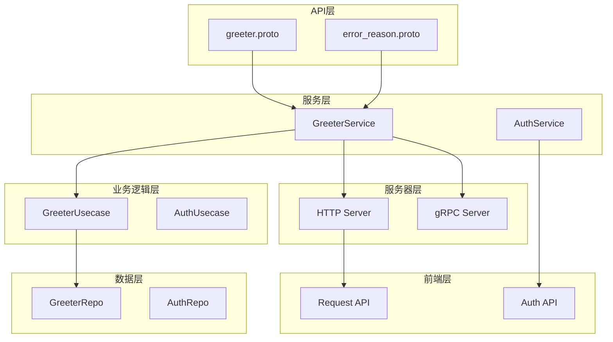
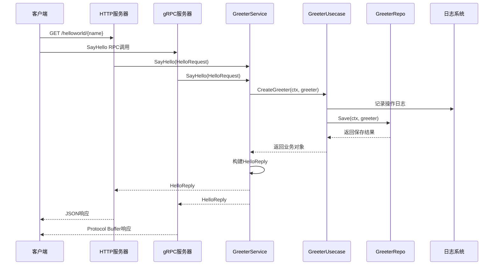
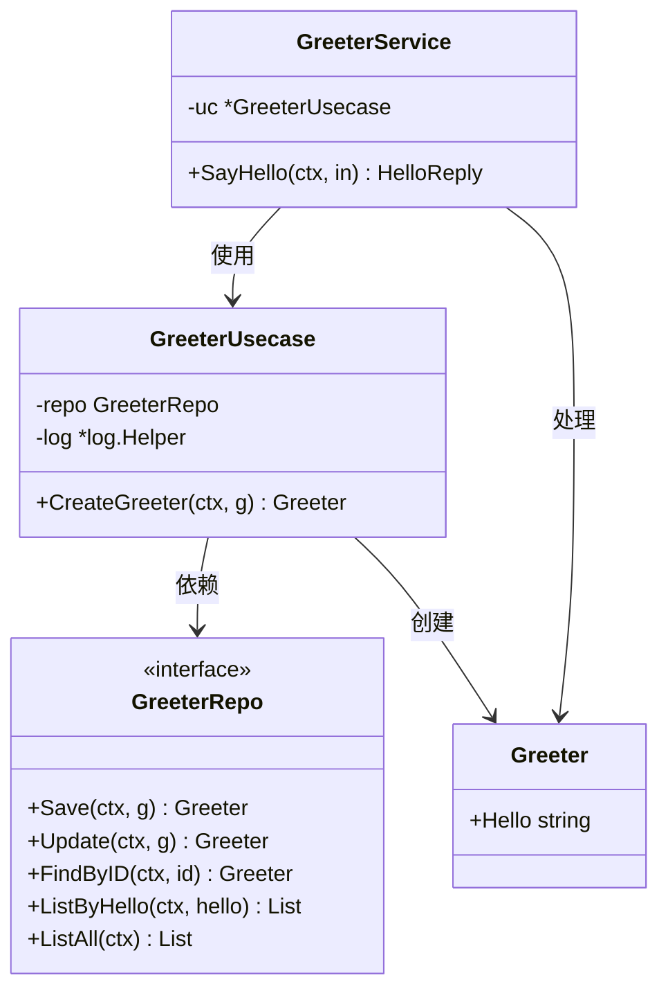
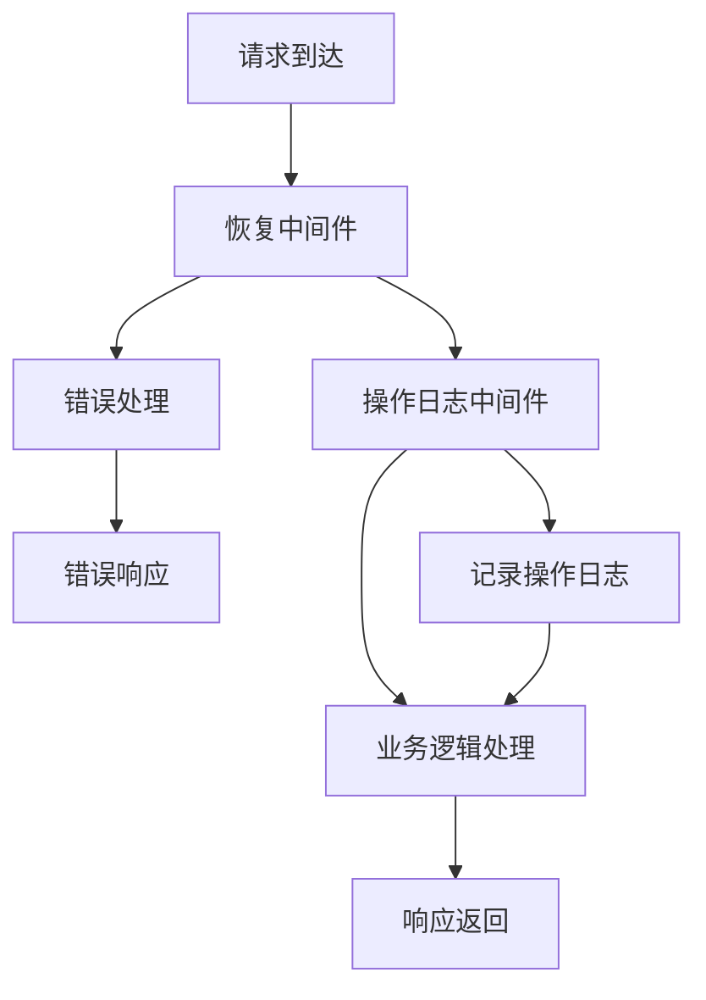
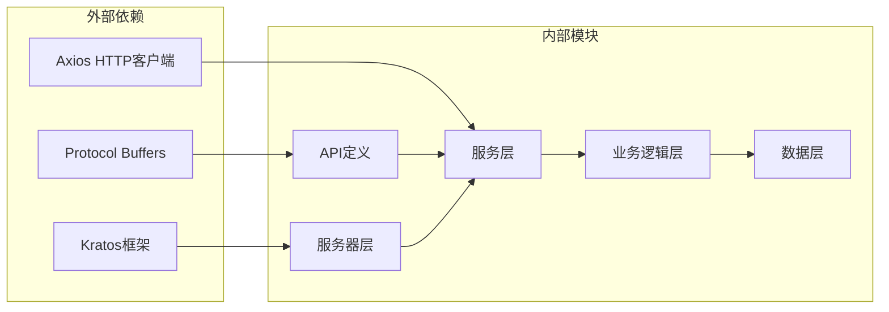

# 问候服务API文档

<cite>
**本文档中引用的文件**
- [greeter.proto](file://api/helloworld/v1/greeter.proto)
- [error_reason.proto](file://api/helloworld/v1/error_reason.proto)
- [greeter.go](file://internal/service/greeter.go)
- [greeter.go](file://internal/biz/greeter.go)
- [http.go](file://internal/server/http.go)
- [grpc.go](file://internal/server/grpc.go)
- [request.ts](file://frontend/src/api/request.ts)
- [auth.ts](file://frontend/src/api/auth.ts)
- [main.go](file://cmd/kratos-boilerplate/main.go)
</cite>

## 目录
1. [简介](#简介)
2. [项目结构](#项目结构)
3. [核心组件](#核心组件)
4. [架构概览](#架构概览)
5. [详细组件分析](#详细组件分析)
6. [依赖关系分析](#依赖关系分析)
7. [性能考虑](#性能考虑)
8. [故障排除指南](#故障排除指南)
9. [结论](#结论)

## 简介

问候服务是一个基于Kratos框架构建的样板服务，展示了如何使用Protocol Buffers定义REST和gRPC接口。该服务提供了SayHello方法，演示了从请求到响应的完整数据流处理过程，包括错误处理、中间件集成和前端API调用模式。

本服务作为Kratos框架的最佳实践示例，包含了日志记录、中间件链执行顺序、错误传播机制等非功能性特征，为开发者提供了完整的API开发参考模板。

## 项目结构

问候服务的项目结构遵循Kratos框架的标准分层架构：



**图表来源**
- [greeter.proto](file://api/helloworld/v1/greeter.proto#L1-L31)
- [greeter.go](file://internal/service/greeter.go#L1-L30)
- [http.go](file://internal/server/http.go#L1-L37)

**章节来源**
- [greeter.proto](file://api/helloworld/v1/greeter.proto#L1-L31)
- [greeter.go](file://internal/service/greeter.go#L1-L30)

## 核心组件

### Protocol Buffers定义

问候服务的核心是通过Protocol Buffers定义的API接口，主要包括以下关键组件：

#### 服务定义
```protobuf
service Greeter {
  rpc SayHello (HelloRequest) returns (HelloReply) {
    option (google.api.http) = {
      get: "/helloworld/{name}"
    };
  }
}
```

#### 请求消息结构
```protobuf
message HelloRequest {
  string name = 1;
}
```

#### 响应消息结构
```protobuf
message HelloReply {
  string message = 1;
}
```

#### 错误原因枚举
```protobuf
enum ErrorReason {
  GREETER_UNSPECIFIED = 0;
  USER_NOT_FOUND = 1;
}
```

**章节来源**
- [greeter.proto](file://api/helloworld/v1/greeter.proto#L1-L31)
- [error_reason.proto](file://api/helloworld/v1/error_reason.proto#L1-L14)

## 架构概览

问候服务采用分层架构设计，实现了清晰的关注点分离：



**图表来源**
- [greeter.go](file://internal/service/greeter.go#L20-L30)
- [greeter.go](file://internal/biz/greeter.go#L25-L38)
- [http.go](file://internal/server/http.go#L20-L25)
- [grpc.go](file://internal/server/grpc.go#L18-L23)

## 详细组件分析

### GreeterService实现

GreeterService是业务逻辑的核心实现，负责协调各个层次之间的交互：



**图表来源**
- [greeter.go](file://internal/service/greeter.go#L10-L30)
- [greeter.go](file://internal/biz/greeter.go#L10-L38)

#### SayHello方法实现

SayHello方法展示了完整的请求处理流程：

1. **请求验证**：接收HelloRequest并提取name字段
2. **业务逻辑**：调用usecase创建Greeter实体
3. **日志记录**：记录操作上下文和参数
4. **响应构建**：组装HelloReply返回给客户端

**章节来源**
- [greeter.go](file://internal/service/greeter.go#L20-L30)
- [greeter.go](file://internal/biz/greeter.go#L25-L38)

### 中间件链执行

服务器配置中集成了多个中间件，形成了完整的处理链：



**图表来源**
- [http.go](file://internal/server/http.go#L18-L25)
- [grpc.go](file://internal/server/grpc.go#L16-L23)

**章节来源**
- [http.go](file://internal/server/http.go#L18-L25)
- [grpc.go](file://internal/server/grpc.go#L16-L23)

### 前端API调用封装

前端提供了统一的API调用封装，支持HTTP请求拦截和错误处理：

```typescript
// 请求拦截器
request.interceptors.request.use(
    (config) => {
        // 添加认证信息
        return config
    },
    (error) => {
        return Promise.reject(error)
    }
)

// 响应拦截器
request.interceptors.response.use(
    (response) => {
        return response.data
    },
    (error) => {
        return Promise.reject(error)
    }
)
```

**章节来源**
- [request.ts](file://frontend/src/api/request.ts#L1-L29)

## 依赖关系分析

问候服务的依赖关系体现了清晰的分层架构：



**图表来源**
- [greeter.proto](file://api/helloworld/v1/greeter.proto#L1-L10)
- [greeter.go](file://internal/service/greeter.go#L1-L10)

**章节来源**
- [greeter.proto](file://api/helloworld/v1/greeter.proto#L1-L10)
- [greeter.go](file://internal/service/greeter.go#L1-L10)

## 性能考虑

### 中间件优化

1. **恢复中间件**：防止服务崩溃，确保系统稳定性
2. **操作日志中间件**：可选启用，避免生产环境性能影响
3. **超时控制**：配置合理的请求超时时间

### 缓存策略

虽然当前实现未包含缓存，但架构支持添加缓存中间件或服务级缓存：

```go
// 示例缓存中间件集成
opts = append(opts, http.Middleware(
    cache.CacheMiddleware(cacheStore),
    recovery.Recovery(),
))
```

### 并发处理

gRPC服务器默认支持并发连接和请求处理，HTTP服务器通过Go的goroutine实现高并发处理能力。

## 故障排除指南

### 常见错误类型

1. **网络连接错误**：检查服务器地址和端口配置
2. **认证失败**：验证访问令牌的有效性
3. **服务不可用**：确认服务已正确启动并监听相应端口

### 调试技巧

1. **日志分析**：利用内置的日志记录功能定位问题
2. **中间件调试**：临时启用操作日志中间件获取详细信息
3. **协议验证**：使用Protobuf工具验证消息格式

**章节来源**
- [http.go](file://internal/server/http.go#L18-L25)
- [grpc.go](file://internal/server/grpc.go#L16-L23)

## 结论

问候服务API展现了Kratos框架的完整功能特性，包括：

1. **标准化的API定义**：通过Protocol Buffers实现跨语言兼容性
2. **清晰的分层架构**：从API到数据的完整处理链路
3. **完善的中间件支持**：涵盖错误处理、日志记录等功能
4. **前后端一体化**：提供完整的客户端调用示例
5. **最佳实践示范**：展示了企业级应用开发的标准模式

该服务不仅是一个功能性的示例，更是学习Kratos框架和现代微服务架构的宝贵资源。开发者可以基于此模板快速构建自己的业务服务，同时借鉴其中的设计理念和实现技巧。