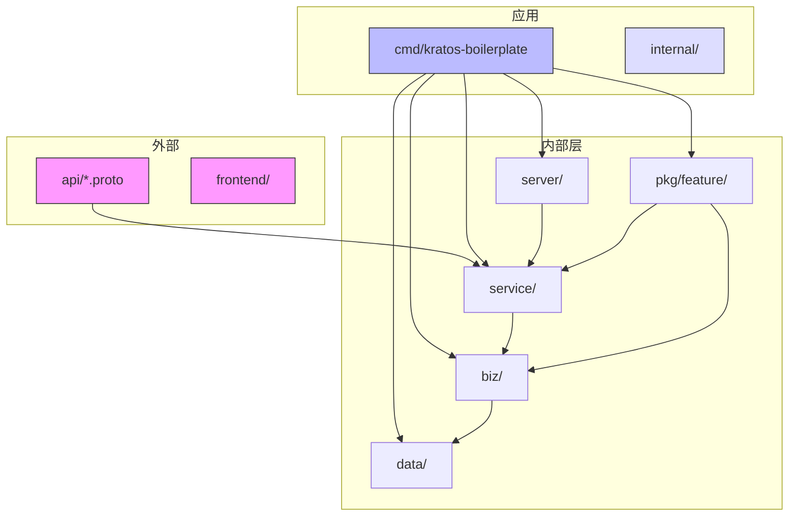
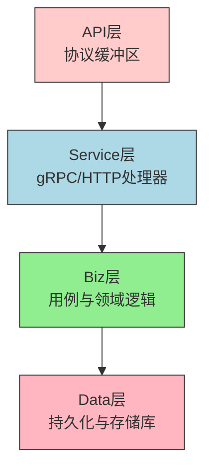
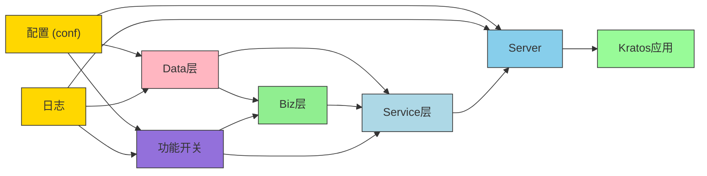
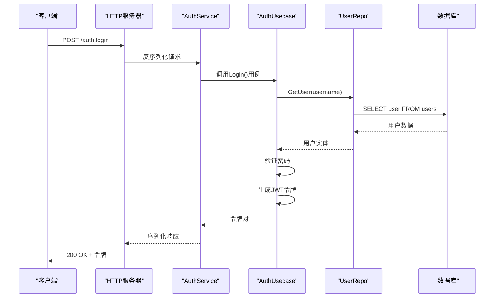
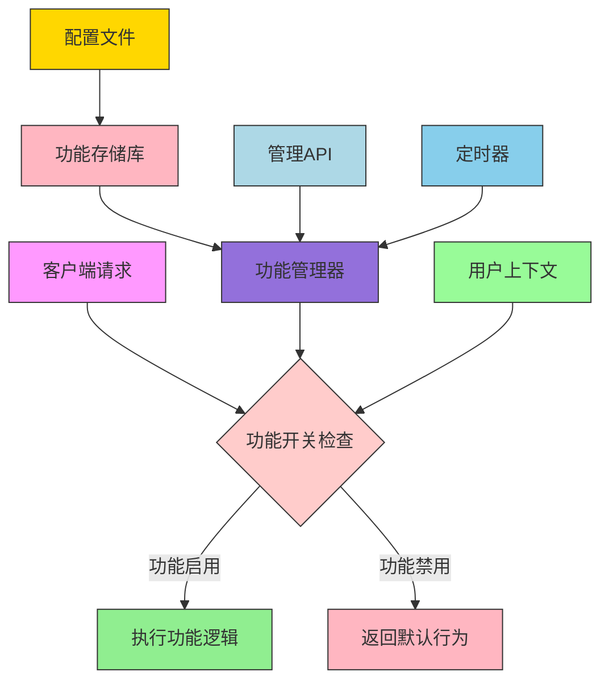

# 架构与设计

<cite>
**本文档引用的文件**   
- [main.go](file://cmd/kratos-boilerplate/main.go) - *在最近的提交中更新*
- [wire.go](file://cmd/kratos-boilerplate/wire.go) - *在最近的提交中更新*
- [wire_gen.go](file://cmd/kratos-boilerplate/wire_gen.go)
- [auth.go](file://internal/biz/auth.go)
- [biz.go](file://internal/biz/biz.go)
- [greeter.go](file://internal/biz/greeter.go)
- [auth.go](file://internal/data/auth.go)
- [data.go](file://internal/data/data.go)
- [greeter.go](file://internal/data/greeter.go)
- [server.go](file://internal/server/server.go)
- [http.go](file://internal/server/http.go)
- [grpc.go](file://internal/server/grpc.go)
- [auth.proto](file://api/auth/v1/auth.proto)
- [greeter.proto](file://api/helloworld/v1/greeter.proto)
- [feature/wire.go](file://internal/pkg/feature/wire.go) - *新增功能开关系统*
- [toggle_manager.go](file://internal/pkg/feature/toggle_manager.go) - *功能开关管理器实现*
- [feature.proto](file://api/feature/v1/feature.proto) - *功能开关API定义*
</cite>

## 更新摘要
**已做更改**   
- 在依赖注入部分增加了功能开关系统的集成说明
- 新增了功能开关系统架构章节
- 更新了项目结构描述以包含功能开关组件
- 增加了功能开关系统的交互流程图
- 更新了依赖注入图以显示功能开关系统的集成

## 目录
1. [简介](#简介)
2. [项目结构](#项目结构)
3. [四层架构](#四层架构)
4. [协议缓冲区优先的API设计](#协议缓冲区优先的api设计)
5. [使用Wire进行依赖注入](#使用wire进行依赖注入)
6. [组件交互与数据流](#组件交互与数据流)
7. [控制反转与层间依赖](#控制反转与层间依赖)
8. [功能开关系统](#功能开关系统)
9. [设计权衡与可扩展性](#设计权衡与可扩展性)
10. [可测试性与可维护性](#可测试性与可维护性)
11. [结论](#结论)

## 简介
本文档提供了kratos-boilerplate仓库中Clean Architecture实现的全面分析。该系统遵循四层架构模式（API、Service、Biz、Data），具有严格的依赖规则，实现了关注点分离、可测试性和可维护性。架构采用协议缓冲区定义API契约，并使用Wire进行编译时依赖注入。本文档详细说明了系统的结构、交互和设计原则。

## 项目结构
项目遵循与Clean Architecture原则一致的分层目录结构。顶层目录按关注点组织组件：

- `api/`: 包含定义gRPC和HTTP API契约的`.proto`文件
- `cmd/kratos-boilerplate/`: 应用程序入口点和依赖注入配置
- `configs/`: 不同环境的配置文件
- `internal/`: 私有应用逻辑，按层划分
- `internal/biz/`: 业务用例和领域逻辑
- `internal/data/`: 数据访问和持久化实现
- `internal/server/`: 服务器传输（HTTP/gRPC）设置
- `internal/service/`: gRPC和HTTP服务实现
- `internal/pkg/feature/`: 功能开关系统实现
- `plugins/`: 可扩展性的插件实现
- `third_party/`: 外部协议缓冲区定义

此结构强制执行架构层之间的清晰边界，促进可维护性。



**图源**
- [main.go](file://cmd/kratos-boilerplate/main.go#L1-L91)
- [wire.go](file://cmd/kratos-boilerplate/wire.go#L1-L27)

**本节来源**
- [main.go](file://cmd/kratos-boilerplate/main.go#L1-L91)
- [wire.go](file://cmd/kratos-boilerplate/wire.go#L1-L27)

## 四层架构

系统实现了具有四个不同层的Clean Architecture：API、Service、Biz和Data。每一层都有特定的职责，并遵循严格的依赖规则。

### API层
位于`api/`，此层使用协议缓冲区（`.proto`）文件定义外部接口。这些文件指定gRPC服务、消息和HTTP绑定。API契约是技术无关的，作为客户端-服务器通信的单一事实来源。

### Service层
位于`internal/service/`，此层实现`.proto`文件中定义的API契约。服务结构体在API消息和领域模型之间转换，处理请求验证、身份验证以及Biz层业务逻辑的编排。

### Biz层
`internal/biz/`目录包含用例和领域逻辑。此层定义存储库接口并封装业务规则。它独立于框架和数据库，专注于业务行为。

### Data层
位于`internal/data/`，此层处理数据持久化和外部集成。它实现Biz层定义的存储库接口，通过数据库或其他存储机制提供具体的数据访问。



**图源**
- [auth.proto](file://api/auth/v1/auth.proto)
- [greeter.proto](file://api/helloworld/v1/greeter.proto)
- [auth.go](file://internal/service/auth.go)
- [greeter.go](file://internal/service/greeter.go)
- [auth.go](file://internal/biz/auth.go)
- [greeter.go](file://internal/biz/greeter.go)
- [auth.go](file://internal/data/auth.go)
- [greeter.go](file://internal/data/greeter.go)

**本节来源**
- [auth.go](file://internal/biz/auth.go#L1-L695)
- [greeter.go](file://internal/biz/greeter.go#L1-L39)
- [auth.go](file://internal/data/auth.go)
- [greeter.go](file://internal/data/greeter.go)

## 协议缓冲区优先的API设计

系统采用协议缓冲区优先的API设计方法，其中`.proto`文件作为API契约的规范定义。

### API契约定义
API在`api/`目录中使用协议缓冲区语法定义。例如，`api/auth/v1/auth.proto`使用gRPC方法和相关消息定义认证服务：

```protobuf
service AuthService {
  rpc Register (RegisterRequest) returns (RegisterResponse);
  rpc Login (LoginRequest) returns (LoginResponse);
  rpc RefreshToken (RefreshTokenRequest) returns (RefreshTokenResponse);
}
```

这些定义包括通过注解的HTTP绑定，允许多个gRPC和RESTful访问同一服务。

### 代码生成
`.proto`文件用于生成Go代码（gRPC服务接口、消息类型和HTTP处理器），通过Kratos的proto生成器等工具。这确保了API规范与实现之间的一致性。

### 优势
- **单一事实来源**：API契约定义一次，在客户端和服务器端使用
- **语言无关**：协议缓冲区支持多种语言
- **版本支持**：内置向后兼容变更支持
- **文档**：生成的代码包括API文档
- **验证**：与验证库集成（如`validate.proto`）

**本节来源**
- [auth.proto](file://api/auth/v1/auth.proto)
- [greeter.proto](file://api/helloworld/v1/greeter.proto)
- [error_reason.proto](file://api/helloworld/v1/error_reason.proto)

## 使用Wire进行依赖注入

系统使用Google Wire进行编译时依赖注入，管理跨层的对象创建和依赖关系。

### Wire配置
`cmd/kratos-boilerplate/`中的`wire.go`文件使用提供者集定义依赖注入图：

```go
func wireApp(*conf.Server, *conf.Data, *conf.Auth, *conf.Bootstrap, log.Logger) (*kratos.App, func(), error) {
    wire.Build(server.ProviderSet, data.ProviderSet, biz.ProviderSet, 
               service.ProviderSet, feature.ProviderSet, newApp)
    return nil, nil, nil
}
```

### 生成的注入
Wire生成`wire_gen.go`，其中包含实际的依赖注入代码。此文件按正确顺序创建实例并连接依赖：

```go
func wireApp(confServer *conf.Server, confData *conf.Data, auth *conf.Auth, logger log.Logger) (*kratos.App, func(), error) {
    dataData, cleanup, err := data.NewData(confData, logger)
    // ... 其他依赖
    greeterRepo := data.NewGreeterRepo(dataData, logger)
    greeterUsecase := biz.NewGreeterUsecase(greeterRepo, logger)
    greeterService := service.NewGreeterService(greeterUsecase)
    // ... 连接所有组件
}
```

### 编译时DI的优势
- **性能**：运行时无反射
- **安全性**：依赖在编译时验证
- **透明性**：生成的代码可读且可调试
- **无运行时开销**：与基于反射的DI框架不同



**图源**
- [wire.go](file://cmd/kratos-boilerplate/wire.go#L1-L27)
- [wire_gen.go](file://cmd/kratos-boilerplate/wire_gen.go#L1-L54)
- [feature/wire.go](file://internal/pkg/feature/wire.go#L1-L120)

**本节来源**
- [wire.go](file://cmd/kratos-boilerplate/wire.go#L1-L27)
- [wire_gen.go](file://cmd/kratos-boilerplate/wire_gen.go#L1-L54)
- [feature/wire.go](file://internal/pkg/feature/wire.go#L1-L120)

## 组件交互与数据流

本节详细说明系统中的请求流，从传入请求到数据库操作再返回。

### 认证请求流
当用户登录请求到达时，它遵循以下路径：



### 关键交互模式
- **请求处理**：HTTP/gRPC请求由传输层接收
- **服务转换**：服务层将API消息转换为领域模型
- **用例执行**：Biz层通过用例执行业务逻辑
- **数据访问**：存储库接口由数据层实现
- **响应生成**：结果被转换回API响应

**图源**
- [http.go](file://internal/server/http.go)
- [auth.go](file://internal/service/auth.go)
- [auth.go](file://internal/biz/auth.go)
- [auth.go](file://internal/data/auth.go)

**本节来源**
- [auth.go](file://internal/service/auth.go)
- [auth.go](file://internal/biz/auth.go)
- [auth.go](file://internal/data/auth.go)

## 控制反转与层间依赖

架构严格遵循Clean Architecture的依赖规则：源代码依赖只能指向内层，朝向更高级别的策略。

### 依赖规则
- **Data层**：不依赖应用内的任何内容（仅外部库）
- **Biz层**：仅依赖领域实体，不依赖数据或服务层
- **Service层**：依赖Biz层用例
- **API层**：依赖服务层实现

### 接口定义位置
接口在使用它们的层中定义，而不是在实现它们的层中定义。例如，`UserRepo`接口在`internal/biz/auth.go`中定义，而其在`internal/data/auth.go`中实现。

### 优势
- **可测试性**：层可以使用模拟隔离测试
- **灵活性**：实现可以交换而不影响高层
- **解耦**：数据存储的更改不影响业务逻辑
- **可维护性**：清晰的边界减少连锁反应

```mermaid
graph TD
A[API层] --> B[Service层]
B --> C[Biz层]
C --> D[Data层]
style A fill:#ffcccb,stroke:#333
style B fill:#add8e6,stroke:#333
style C fill:#90ee90,stroke:#333
style D fill:#ffb6c1,stroke:#333
classDef layerStyle fill:#e0e0e0,stroke:#333,stroke-width:1px;
class A,B,C,D layerStyle
note right of C: 在此处定义接口<br>例如，UserRepo，GreeterRepo
note right of D: 实现来自Biz层的接口
```

**图源**
- [auth.go](file://internal/biz/auth.go#L1-L695)
- [auth.go](file://internal/data/auth.go)

**本节来源**
- [auth.go](file://internal/biz/auth.go#L1-L695)
- [auth.go](file://internal/data/auth.go)

## 功能开关系统

系统集成了一个全面的分层功能开关系统，作为核心组件之一。

### 系统架构
功能开关系统位于`internal/pkg/feature/`，提供动态功能管理能力。系统包括：

- **功能开关管理器** (`ToggleManager`): 核心管理组件
- **策略评估器** (`StrategyEvaluator`): 支持多种启用策略
- **存储库接口** (`FeatureRepository`): 配置持久化
- **分层功能支持**: 支持域和模块的分层结构

### 功能特性
- **多种启用策略**:
  - 简单开关 (`StrategySimple`)
  - 百分比策略 (`StrategyPercentage`)
  - 用户属性策略 (`StrategyUser`)
  - 时间策略 (`StrategyTime`)
  - 环境策略 (`StrategyEnvironment`)
- **分层功能结构**: 支持`domain.module`格式的功能路径
- **动态配置**: 运行时启用/禁用功能
- **变更通知**: 支持变更回调
- **批量检查**: 支持多个功能的组合检查

### 依赖注入集成
功能开关系统通过Wire集成到应用初始化流程中：

```go
func wireApp(*conf.Server, *conf.Data, *conf.Auth, *conf.Bootstrap, log.Logger) (*kratos.App, func(), error) {
    wire.Build(server.ProviderSet, data.ProviderSet, biz.ProviderSet, 
               service.ProviderSet, feature.ProviderSet, newApp)
    return nil, nil, nil
}
```

### 配置管理
系统支持从配置文件加载功能开关配置，默认使用`./configs/features.yaml`：

```yaml
features:
  enabled: true
  config_file: "./configs/features.yaml"
  config_format: "yaml"
  watch_config: true
  default_environment: "production"
  repository:
    type: "file"
    config_path: "./configs/features.yaml"
    format: "yaml"
```



**图源**
- [main.go](file://cmd/kratos-boilerplate/main.go#L1-L91)
- [wire.go](file://cmd/kratos-boilerplate/wire.go#L1-L27)
- [toggle_manager.go](file://internal/pkg/feature/toggle_manager.go#L1-L643)
- [interfaces.go](file://internal/pkg/feature/interfaces.go#L1-L238)
- [strategies.go](file://internal/pkg/feature/strategies.go#L1-L278)

**本节来源**
- [wire.go](file://cmd/kratos-boilerplate/wire.go#L1-L27)
- [toggle_manager.go](file://internal/pkg/feature/toggle_manager.go#L1-L643)
- [interfaces.go](file://internal/pkg/feature/interfaces.go#L1-L238)
- [strategies.go](file://internal/pkg/feature/strategies.go#L1-L278)
- [feature.proto](file://api/feature/v1/feature.proto)

## 设计权衡与可扩展性

### 权衡
- **复杂性 vs. 可维护性**：分层架构增加了复杂性，但提高了长期可维护性
- **性能 vs. 可测试性**：基于接口的设计有最小开销，但支持全面测试
- **灵活性 vs. 约定**：Wire DI需要额外工具，但提供编译时安全
- **功能开关开销**：功能开关系统引入了评估开销，但提供了强大的运行时控制

### 可扩展性考虑
- **水平扩展**：服务的无状态性允许轻松水平扩展
- **数据库扩展**：存储库模式便于数据库分片和读写分离
- **微服务就绪**：清晰的边界支持未来服务提取
- **插件架构**：通过插件实现横切关注点的可扩展性
- **功能开关**：支持渐进式发布和A/B测试

### 性能特征
- **低开销**：请求和处理之间有最少的抽象层
- **高效DI**：Wire的编译时注入消除了运行时反射成本
- **缓存机会**：清晰的分离支持在服务或数据层进行策略性缓存
- **功能开关优化**：功能开关评估经过优化，支持缓存和快速路径

**本节来源**
- [main.go](file://cmd/kratos-boilerplate/main.go)
- [wire.go](file://cmd/kratos-boilerplate/wire.go)
- [auth.go](file://internal/biz/auth.go)
- [toggle_manager.go](file://internal/pkg/feature/toggle_manager.go)

## 可测试性与可维护性

架构的设计目标是可测试性和可维护性。

### 测试策略
- **单元测试**：Biz层用例可以在没有数据库的情况下测试
- **集成测试**：数据层使用真实数据库连接测试
- **端到端测试**：完整请求流验证
- **模拟**：接口支持依赖的轻松模拟

### 可维护性特性
- **清晰分离**：每层有单一职责
- **文档**：协议缓冲区作为活文档
- **重构安全**：编译时检查捕获依赖问题
- **入职**：代码库中的一致模式
- **功能开关**：支持功能的动态启用/禁用，便于灰度发布和故障恢复

### 示例：测试AuthUsecase
`AuthUsecase`可以通过模拟`UserRepo`和`CaptchaService`接口进行隔离测试，允许在没有外部依赖的情况下对业务逻辑进行全面测试。

**本节来源**
- [auth_test.go](file://internal/biz/auth_test.go)
- [auth_database_test.go](file://internal/data/auth_database_test.go)
- [auth_integration_test.go](file://test/integration/database/auth_integration_test.go)
- [toggle_manager_test.go](file://internal/pkg/feature/toggle_manager_test.go)

## 结论
kratos-boilerplate实现了健壮的Clean Architecture，通过其四层结构实现了关注点的清晰分离。协议缓冲区优先的方法确保了定义良好的API契约，而Wire提供了高效的编译时依赖注入。架构优先考虑可测试性、可维护性和可扩展性，适合企业级应用。通过遵守控制反转原则和严格的依赖规则，系统在组件间实现了高内聚和低耦合。此设计支持代码库的长期演进，同时支持单体和微服务部署模式。新增的功能开关系统进一步增强了系统的灵活性和运维能力，支持渐进式发布、A/B测试和运行时功能控制。