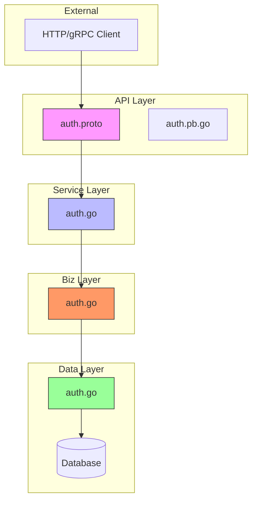
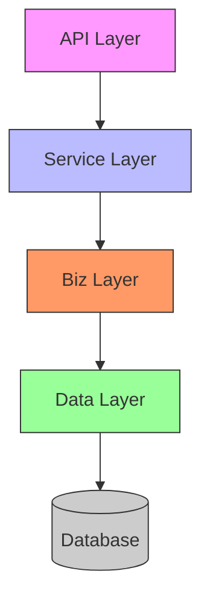
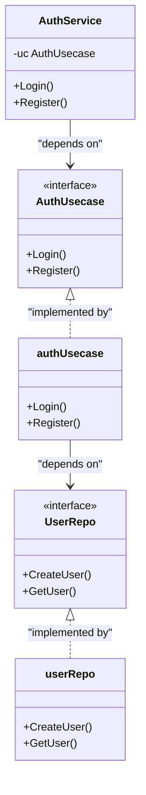
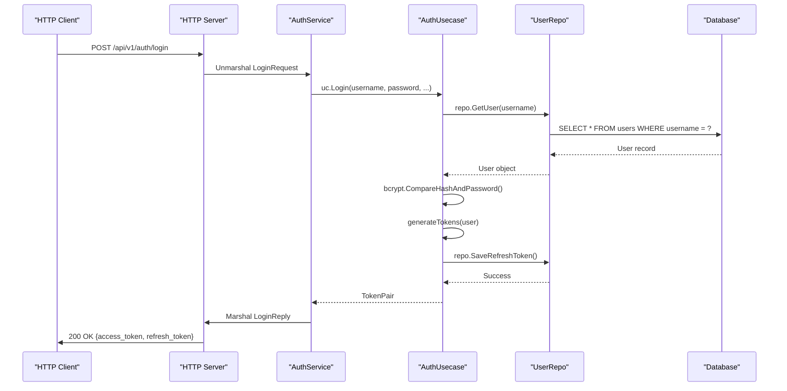

# Clean Architecture

<cite>
**Referenced Files in This Document**   
- [main.go](file://cmd/kratos-boilerplate/main.go)
- [wire.go](file://cmd/kratos-boilerplate/wire.go)
- [auth.proto](file://api/auth/v1/auth.proto)
- [auth.go](file://internal/biz/auth.go)
- [auth.go](file://internal/data/auth.go)
- [auth.go](file://internal/service/auth.go)
</cite>

## Table of Contents
1. [Introduction](#introduction)
2. [Project Structure](#project-structure)
3. [Architecture Overview](#architecture-overview)
4. [Layered Architecture Analysis](#layered-architecture-analysis)
5. [Dependency Flow and Inversion of Control](#dependency-flow-and-inversion-of-control)
6. [Request Flow Analysis](#request-flow-analysis)
7. [Testability and Maintainability](#testability-and-maintainability)
8. [Conclusion](#conclusion)

## Introduction
This document provides a comprehensive analysis of the Clean Architecture implementation in the kratos-boilerplate repository. The architecture follows the four-layer structure defined by Kratos framework: API, Service, Biz, and Data layers. This design promotes separation of concerns, enhances testability, and supports maintainability through loose coupling. The document details the responsibilities of each layer, dependency rules, inversion of control patterns, and illustrates the complete request flow from HTTP/gRPC endpoints through middleware to data persistence.

## Project Structure
The project follows a well-organized directory structure that aligns with Clean Architecture principles. The top-level directories separate concerns into distinct components:

- **api**: Contains Protocol Buffer definitions that define the API contracts
- **cmd**: Application entry points and dependency injection configuration
- **configs**: Configuration files for the application
- **internal**: Private implementation details organized by architectural layers
- **frontend**: Client-side application code
- **migrations**: Database schema migration scripts
- **plugins**: Extension points for the application
- **test**: Comprehensive test suite including BDD and integration tests



**Diagram sources**
- [auth.proto](file://api/auth/v1/auth.proto)
- [auth.go](file://internal/service/auth.go)
- [auth.go](file://internal/biz/auth.go)
- [auth.go](file://internal/data/auth.go)

**Section sources**
- [main.go](file://cmd/kratos-boilerplate/main.go)

## Architecture Overview
The kratos-boilerplate implements Clean Architecture with four distinct layers: API, Service, Biz, and Data. Each layer has specific responsibilities and follows strict dependency rules where dependencies flow inward from outer layers to inner layers.



**Diagram sources**
- [main.go](file://cmd/kratos-boilerplate/main.go)
- [wire.go](file://cmd/kratos-boilerplate/wire.go)

## Layered Architecture Analysis

### API Layer
The API layer defines the contract between the service and its clients using Protocol Buffers. The `auth.proto` file specifies the service interface, messages, and HTTP mappings.

```protobuf
service Auth {
  rpc GetCaptcha(GetCaptchaRequest) returns (GetCaptchaReply) {
    option (google.api.http) = {
      get: "/api/v1/auth/captcha"
    };
  }
  rpc Login(LoginRequest) returns (LoginReply) {
    option (google.api.http) = {
      post: "/api/v1/auth/login"
      body: "*"
    };
  }
}
```

This layer is responsible for:
- Defining the service interface
- Specifying request/response message structures
- Mapping RPC methods to HTTP endpoints
- Generating client and server stubs

**Section sources**
- [auth.proto](file://api/auth/v1/auth.proto)

### Service Layer
The Service layer implements the API contract defined in the API layer. It acts as an adapter between the transport layer and business logic.

```go
type AuthService struct {
	v1.UnimplementedAuthServer
	uc  biz.AuthUsecase
	log *log.Helper
}

func NewAuthService(uc biz.AuthUsecase, logger log.Logger) *AuthService {
	return &AuthService{
		uc:  uc,
		log: log.NewHelper(logger),
	}
}
```

Key responsibilities:
- Translating API requests to business use case calls
- Handling transport-specific concerns (metadata, headers)
- Converting business errors to appropriate API error responses
- Implementing service-specific middleware

**Section sources**
- [auth.go](file://internal/service/auth.go)

### Biz Layer
The Biz layer contains the core business logic and use cases. It defines interfaces that represent business capabilities.

```go
type AuthUsecase interface {
	Register(ctx context.Context, username, password, email, phone, captchaID, captchaCode string) error
	Login(ctx context.Context, username, password, captchaID, captchaCode, totpCode string) (*TokenPair, error)
	Logout(ctx context.Context, accessToken string) error
	RefreshToken(ctx context.Context, refreshToken string) (*TokenPair, error)
}

type authUsecase struct {
	repo           UserRepo
	captchaService CaptchaService
	config         AuthConfig
	log            *log.Helper
	tokenBlacklist sync.Map
}
```

Key responsibilities:
- Implementing business rules and logic
- Coordinating between different domain entities
- Enforcing business constraints
- Managing transactions

**Section sources**
- [auth.go](file://internal/biz/auth.go)

### Data Layer
The Data layer handles data persistence and retrieval. It implements the repositories defined in the Biz layer.

```go
type userRepo struct {
	data *Data
	log  *log.Helper
	enc  crypto.Encryptor
	kms  kms.KMSManager
}

func NewUserRepo(data *Data, logger log.Logger, kmsManager kms.KMSManager) (biz.UserRepo, error) {
	return &userRepo{
		data: data,
		log:  log.NewHelper(logger),
		enc:  enc,
		kms:  kmsManager,
	}, nil
}
```

Key responsibilities:
- Implementing data access interfaces
- Handling database operations
- Managing data encryption/decryption
- Providing data caching mechanisms

**Section sources**
- [auth.go](file://internal/data/auth.go)

## Dependency Flow and Inversion of Control

### Dependency Rules
The architecture enforces strict dependency rules where dependencies flow inward from higher-level layers to lower-level layers. Higher layers define interfaces that are implemented by lower layers, enabling dependency inversion.



**Diagram sources**
- [auth.go](file://internal/service/auth.go)
- [auth.go](file://internal/biz/auth.go)
- [auth.go](file://internal/data/auth.go)

### Inversion of Control with Wire
Dependency injection is managed using Google Wire, which generates the dependency graph at compile time.

```go
func wireApp(*conf.Server, *conf.Data, *conf.Auth, *conf.Bootstrap, log.Logger) (*kratos.App, func(), error) {
	wire.Build(server.ProviderSet, data.ProviderSet, biz.ProviderSet, service.ProviderSet, plugin.ProviderSet, feature.ProviderSet, newApp)
	return nil, nil, nil
}
```

This approach provides:
- Compile-time dependency checking
- No runtime reflection overhead
- Clear visibility of dependency graphs
- Easy testing through dependency substitution

**Section sources**
- [wire.go](file://cmd/kratos-boilerplate/wire.go)

## Request Flow Analysis

### Login Request Flow
The following sequence diagram illustrates the complete flow of a login request from HTTP endpoint to database and back.



**Diagram sources**
- [auth.go](file://internal/service/auth.go)
- [auth.go](file://internal/biz/auth.go)
- [auth.go](file://internal/data/auth.go)

### Key Interactions
The auth module demonstrates the layered interaction pattern:

1. **API to Service**: Protocol Buffer definitions generate server stubs that the Service layer implements
2. **Service to Biz**: Service methods delegate to corresponding use case methods with appropriate error translation
3. **Biz to Data**: Business logic calls repository methods to persist or retrieve data
4. **Data to Database**: Repository implementations execute database operations

Each layer only depends on the layer immediately below it, creating a unidirectional flow of dependencies.

**Section sources**
- [auth.proto](file://api/auth/v1/auth.proto)
- [auth.go](file://internal/service/auth.go)
- [auth.go](file://internal/biz/auth.go)
- [auth.go](file://internal/data/auth.go)

## Testability and Maintainability

### Testability
The Clean Architecture design enables comprehensive testing at multiple levels:

- **Unit Tests**: Business logic can be tested in isolation by mocking repositories
- **Integration Tests**: Data layer can be tested with real database connections
- **BDD Tests**: End-to-end business workflows can be validated

```go
// Example of testable business logic
func (uc *authUsecase) Login(ctx context.Context, username, password, ...) (*TokenPair, error) {
    // Account lock check
    lock, err := uc.repo.GetLock(ctx, username)
    if lock != nil && lock.LockUntil.After(time.Now()) {
        return nil, ErrAccountLocked
    }
    
    // Password verification
    user, err := uc.repo.GetUser(ctx, username)
    if err != nil {
        return nil, ErrUserNotFound
    }
    
    if err := bcryptCompareHashAndPassword([]byte(user.Password), []byte(password)); err != nil {
        return nil, ErrPasswordIncorrect
    }
    
    // Token generation
    return uc.generateTokens(ctx, user)
}
```

By using a variable for `bcryptCompareHashAndPassword`, the function can be replaced during testing to simulate different scenarios.

**Section sources**
- [auth.go](file://internal/biz/auth.go)

### Maintainability
The architecture supports maintainability through:

- **Loose Coupling**: Changes in one layer minimally impact others
- **Clear Boundaries**: Well-defined responsibilities for each layer
- **Easy Refactoring**: Components can be replaced without affecting the entire system
- **Technology Agnosticism**: Business logic is independent of frameworks and databases

For example, the data storage mechanism can be changed from PostgreSQL to MongoDB without affecting the business logic, as long as the repository interface is satisfied.

**Section sources**
- [auth.go](file://internal/biz/auth.go)
- [auth.go](file://internal/data/auth.go)

## Conclusion
The Clean Architecture implementation in kratos-boilerplate demonstrates a well-structured approach to building maintainable and testable applications. The four-layer architecture with strict dependency rules ensures separation of concerns, while dependency inversion enables flexibility and testability. The use of Protocol Buffers for API definition provides language-agnostic contracts, and Google Wire enables compile-time dependency injection. This architecture facilitates long-term maintainability by isolating business logic from technical implementation details, allowing the system to evolve without major refactoring efforts.