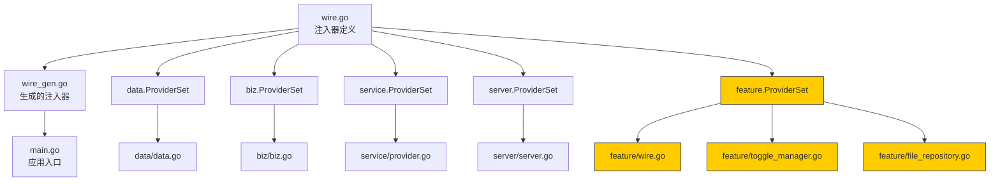
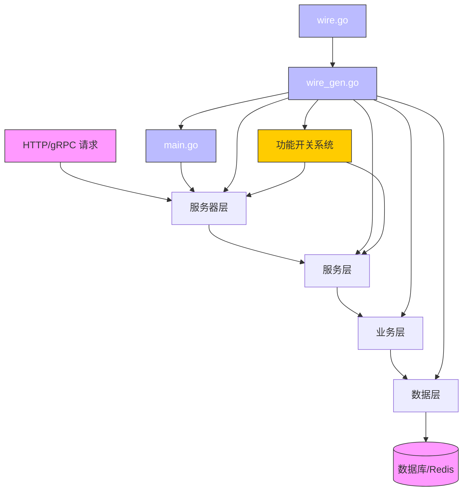
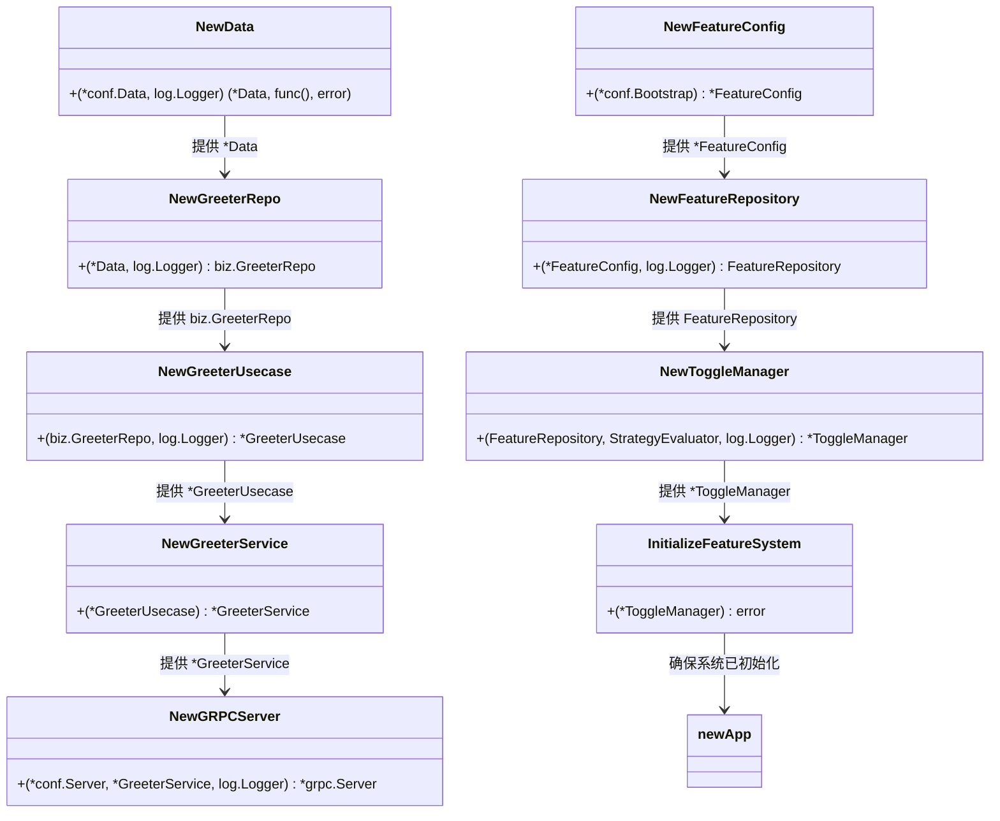
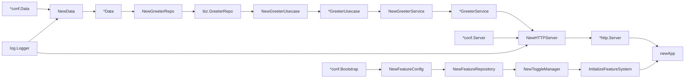

# 使用 Wire 进行依赖注入

<cite>
**本文档引用的文件**   
- [main.go](file://cmd/kratos-boilerplate/main.go) - *在最近的提交中更新*
- [wire.go](file://cmd/kratos-boilerplate/wire.go) - *在最近的提交中更新*
- [wire_gen.go](file://cmd/kratos-boilerplate/wire_gen.go)
- [data.go](file://internal/data/data.go)
- [biz.go](file://internal/biz/biz.go)
- [server.go](file://internal/server/server.go)
- [provider.go](file://internal/service/provider.go)
- [feature/wire.go](file://internal/pkg/feature/wire.go) - *在提交 1fd3d29 中新增*
- [feature/toggle_manager.go](file://internal/pkg/feature/toggle_manager.go) - *在提交 1fd3d29 中新增*
- [feature/interfaces.go](file://internal/pkg/feature/interfaces.go) - *在提交 1fd3d29 中新增*
- [feature/file_repository.go](file://internal/pkg/feature/file_repository.go) - *在提交 1fd3d29 中新增*
- [configs/features.yaml](file://configs/features.yaml) - *功能开关配置文件*
</cite>

## 更新摘要
**已做更改**   
- 在 `wire.go` 中新增了对功能开关系统（feature toggle system）的依赖注入支持
- 在 `main.go` 的初始化流程中集成了功能开关系统的初始化
- 新增了 `internal/pkg/feature` 模块，包含完整的分层功能开关系统
- 更新了架构图以反映功能开关系统的集成位置
- 增加了关于功能开关系统设计与使用的详细说明

## 目录
1. [简介](#简介)
2. [项目结构](#项目结构)
3. [核心组件](#核心组件)
4. [架构概述](#架构概述)
5. [详细组件分析](#详细组件分析)
6. [依赖分析](#依赖分析)
7. [性能考虑](#性能考虑)
8. [故障排除指南](#故障排除指南)
9. [结论](#结论)

## 简介
本文档全面介绍了基于 Kratos 框架的服务架构中使用 Google Wire 实现的编译时依赖注入系统。它解释了如何跨层（数据、业务、服务、服务器）使用提供者集和注入器函数来连接依赖项。该系统消除了运行时反射，提高了启动性能，并确保了编译时安全性。本指南涵盖了实现、优势、常见问题以及在大型 Go 服务中扩展 Wire 使用的最佳实践。特别地，文档重点说明了新集成的分层功能开关系统如何通过 Wire 进行依赖注入，成为系统的核心组件之一。

## 项目结构
该项目遵循基于 Kratos 框架的分层 Go 微服务架构。依赖注入系统以 `cmd/kratos-boilerplate` 目录为中心，其中 `wire.go` 定义注入器，`wire_gen.go` 包含生成的代码。核心业务逻辑组织在 `internal/biz` 中，数据访问在 `internal/data` 中，服务在 `internal/service` 中，服务器在 `internal/server` 中。每一层都暴露一个 `ProviderSet`，Wire 使用它来构建依赖图。新增的 `internal/pkg/feature` 模块实现了功能开关系统，并通过 `feature.ProviderSet` 集成到依赖注入流程中。



**图示来源**
- [wire.go](file://cmd/kratos-boilerplate/wire.go#L1-L27) - *更新以包含 feature.ProviderSet*
- [data.go](file://internal/data/data.go#L18-L18)
- [biz.go](file://internal/biz/biz.go#L10-L10)
- [provider.go](file://internal/service/provider.go#L7-L11)
- [server.go](file://internal/server/server.go#L7-L7)
- [feature/wire.go](file://internal/pkg/feature/wire.go#L1-L23) - *新增*

**本节来源**
- [wire.go](file://cmd/kratos-boilerplate/wire.go#L1-L27)
- [data.go](file://internal/data/data.go#L18-L18)
- [feature/wire.go](file://internal/pkg/feature/wire.go#L1-L23) - *新增*

## 核心组件
依赖注入系统的核心在于 `wire.go` 文件，它定义了 `wireApp` 注入器函数。此函数使用 Google Wire 生成一个构造函数，该函数基于各层的提供者集来连接所有组件。`wire_gen.go` 中生成的代码显式地构造每个依赖项，确保类型安全并消除运行时开销。

`main.go` 文件调用 `wireApp` 并传入配置和日志记录器实例，接收一个完全构造的 `*kratos.App` 和一个清理函数。此模式确保所有依赖项都在编译时解析，任何缺失或循环依赖都会导致构建错误。**关键更新**：`wireApp` 现在包含了 `feature.ProviderSet`，确保功能开关系统在应用启动时被正确初始化。

**本节来源**
- [main.go](file://cmd/kratos-boilerplate/main.go#L50-L90)
- [wire.go](file://cmd/kratos-boilerplate/wire.go#L15-L26)

## 架构概述
该应用遵循具有清晰层间分离的整洁架构。数据层提供仓库和数据库访问，业务层包含业务逻辑和用例，服务层暴露 gRPC 和 HTTP 端点，服务器层管理传输服务器。Google Wire 通过提供者集连接这些层。



**图示来源**
- [main.go](file://cmd/kratos-boilerplate/main.go#L1-L90)
- [wire.go](file://cmd/kratos-boilerplate/wire.go#L1-L27)
- [wire_gen.go](file://cmd/kratos-boilerplate/wire_gen.go#L1-L54)
- [feature/toggle_manager.go](file://internal/pkg/feature/toggle_manager.go#L1-L643) - *新增*

## 详细组件分析

### Wire 注入器和提供者集
Google Wire 在编译时通过分析提供者函数和注入器规范来生成依赖注入代码。在本项目中，每一层都定义了一个 `ProviderSet`，Wire 使用它来构建依赖图。

#### 提供者集定义
每一层都导出一个 `ProviderSet` 变量，该变量列出了 Wire 应使用的提供者函数：

```go
// internal/data/data.go
var ProviderSet = wire.NewSet(NewData, NewGreeterRepo, NewUserRepo, /* ... */)
```

```go
// internal/biz/biz.go
var ProviderSet = wire.NewSet(NewGreeterUsecase, NewAuthUsecase, NewAuthConfig)
```

```go
// internal/service/provider.go
var ProviderSet = wire.NewSet(NewGreeterService, NewAuthService, NewFeatureToggleService)
```

```go
// internal/server/server.go
var ProviderSet = wire.NewSet(NewGRPCServer, NewHTTPServer)
```

```go
// internal/pkg/feature/wire.go
var ProviderSet = wire.NewSet(
    NewFeatureConfig,
    NewFeatureRepository,
    NewCompositeStrategy,
    NewToggleManager,
    NewServiceDecorator,
    NewConditionalDecorator,
    NewGradualRolloutDecorator,
    NewCircuitBreakerDecorator,
    wire.Bind(new(FeatureToggle), new(*ToggleManager)),
    wire.Bind(new(HierarchicalFeatureToggle), new(*ToggleManager)),
    wire.Bind(new(StrategyEvaluator), new(*CompositeStrategy)),
)
```

这些集合在 `wire.go` 中组合，形成完整的依赖图。

#### 注入器函数
`wire.go` 中的 `wireApp` 函数指定了如何构造最终的应用程序：

```go
func wireApp(*conf.Server, *conf.Data, *conf.Auth, *conf.Bootstrap, log.Logger) (*kratos.App, func(), error) {
    wire.Build(server.ProviderSet, data.ProviderSet, biz.ProviderSet, service.ProviderSet, feature.ProviderSet, newApp)
    return nil, nil, nil
}
```

Wire 分析此函数并生成一个具体的实现在 `wire_gen.go` 中，该实现显式地按正确顺序调用每个提供者。

#### 生成的注入代码
生成的 `wire_gen.go` 包含实际的依赖构造逻辑：

```go
func wireApp(confServer *conf.Server, confData *conf.Data, auth *conf.Auth, bc *conf.Bootstrap, logger log.Logger) (*kratos.App, func(), error) {
    // ... (数据、业务、服务、服务器的构造)
    
    // 新增：功能开关系统
    featureConfig := feature.NewFeatureConfig(bc)
    featureRepository := feature.NewFeatureRepository(featureConfig, logger)
    compositeStrategy := feature.NewCompositeStrategy(logger)
    toggleManager := feature.NewToggleManager(featureRepository, compositeStrategy, logger)
    if err := feature.InitializeFeatureSystem(toggleManager); err != nil {
        return nil, nil, err
    }

    // ... (继续构造其他依赖，如服务和服务器)
    app := newApp(logger, grpcServer, httpServer)
    return app, func() { cleanup(); toggleManager.Cleanup() }, nil
}
```

此生成的代码显示了从数据到服务器层的显式依赖链，现在还包括了功能开关系统的初始化。



**图示来源**
- [data.go](file://internal/data/data.go#L18-L18)
- [biz.go](file://internal/biz/biz.go#L10-L10)
- [provider.go](file://internal/service/provider.go#L7-L11)
- [server.go](file://internal/server/server.go#L7-L7)
- [feature/wire.go](file://internal/pkg/feature/wire.go#L1-L23) - *新增*
- [feature/toggle_manager.go](file://internal/pkg/feature/toggle_manager.go#L1-L643) - *新增*

**本节来源**
- [data.go](file://internal/data/data.go#L18-L18)
- [biz.go](file://internal/biz/biz.go#L10-L10)
- [provider.go](file://internal/service/provider.go#L7-L11)
- [server.go](file://internal/server/server.go#L7-L7)
- [feature/wire.go](file://internal/pkg/feature/wire.go#L1-L23) - *新增*

### 分层功能开关系统
新集成的 `internal/pkg/feature` 模块提供了一个强大的、分层的功能开关系统，通过 Wire 进行依赖注入。

#### 核心概念
- **分层标识符**：功能开关使用点分隔的路径（如 `user.management`、`report.advanced`）来表示域和功能，支持分层管理和批量操作。
- **功能集合**：一个功能开关可以代表一个功能集合，包含多个能力（权限、API、路由等），实现基于功能的访问控制。
- **多种策略**：支持简单开关、基于用户属性、基于时间、基于环境和基于百分比等多种启用策略。
- **动态配置**：通过 `FileRepository` 从 `features.yaml` 文件加载配置，并使用 `fsnotify` 监听文件变化，实现配置热更新。

#### 依赖注入集成
功能开关系统通过 `feature.ProviderSet` 无缝集成到 Wire 依赖图中。`wireApp` 函数现在要求 `*conf.Bootstrap` 配置，用于初始化 `FeatureConfig`。`ToggleManager` 被创建并初始化，其生命周期由主应用的清理函数管理。

#### 主要接口
- `HierarchicalFeatureToggle`：提供分层功能检查、批量检查和能力查询。
- `FeatureToggle`：向后兼容的基础功能开关接口。
- `FeatureRepository`：抽象了功能开关配置的持久化，当前实现为 `FileRepository`。
- `StrategyEvaluator`：评估不同策略（如 `CompositeStrategy`）以决定功能是否启用。

**本节来源**
- [feature/wire.go](file://internal/pkg/feature/wire.go#L1-L23)
- [feature/toggle_manager.go](file://internal/pkg/feature/toggle_manager.go#L1-L643)
- [feature/interfaces.go](file://internal/pkg/feature/interfaces.go#L1-L237)
- [feature/file_repository.go](file://internal/pkg/feature/file_repository.go#L1-L594)
- [configs/features.yaml](file://configs/features.yaml)

## 依赖分析
依赖图完全在编译时使用 Wire 构建。每个提供者函数将其依赖项声明为参数，Wire 通过匹配返回类型和参数类型来解析它们。

### 关键依赖
- **数据层**：`NewData` 需要 `*conf.Data` 和 `log.Logger`，返回 `*Data` 和用于清理的 `func()`
- **业务层**：用例依赖于仓库和日志记录器
- **服务层**：服务依赖于用例
- **服务器层**：服务器依赖于服务和配置
- **功能层**：`ToggleManager` 依赖于 `FeatureRepository` 和 `StrategyEvaluator`，而 `FeatureRepository` 依赖于 `FeatureConfig`

### 接口绑定
Wire 使用 `wire.Bind` 将接口绑定到具体实现，从而实现多态注入：

```go
wire.Bind(new(biz.UserRepo), new(*userRepoImpl))
```

此模式在插件和功能模块中用于注入策略模式和装饰器。



**图示来源**
- [wire_gen.go](file://cmd/kratos-boilerplate/wire_gen.go#L1-L54)
- [data.go](file://internal/data/data.go#L30-L50)
- [biz.go](file://internal/biz/biz.go#L15-L20)
- [feature/wire.go](file://internal/pkg/feature/wire.go#L1-L23) - *新增*

## 性能考虑
使用 Google Wire 进行编译时依赖注入提供了几个性能优势：

- **减少启动时间**：无需运行时反射或扫描；依赖项被直接构造
- **内存效率**：无需依赖容器或缓存
- **二进制大小**：生成的代码由编译器优化和内联
- **类型安全**：所有依赖项在编译时验证，消除了运行时注入错误

由于注入器是生成的代码，它避免了运行时 DI 框架的开销，同时保持了关注点的清晰分离。

## 故障排除指南
使用 Google Wire 时的常见问题及其解决方案：

### 缺少提供者
**错误**：`wire: data.Data is unresolvable`
**原因**：某个类型被用作参数但没有提供者返回它
**解决方案**：将缺失的提供者添加到相应的 `ProviderSet`

### 循环依赖
**错误**：`wire: found circular dependency`
**原因**：A 依赖于 B，而 B 依赖于 A
**解决方案**：
- 重构以使用接口
- 引入第三个组件来打破循环
- 使用 `wire.InterfaceValue` 进行延迟绑定

### 接口绑定问题
**错误**：`wire: *service.GreeterService does not satisfy biz.GreeterRepo`
**原因**：接口绑定未正确配置
**解决方案**：确保在提供者集中使用了 `wire.Bind`

### 配置问题
确保构建标签正确：
- `wire.go` 必须有 `//go:build wireinject`
- `wire_gen.go` 是用 `//go:build !wireinject` 生成的

运行 `wire` 命令以重新生成：
```bash
cd cmd/kratos-boilerplate
wire
```

**本节来源**
- [wire.go](file://cmd/kratos-boilerplate/wire.go#L1-L27)
- [wire_gen.go](file://cmd/kratos-boilerplate/wire_gen.go#L1-L54)

## 结论
Google Wire 提供了一个强大、编译时的依赖注入解决方案，增强了 Go 服务中的性能、安全性和可维护性。通过定义提供者集和注入器函数，该系统自动生成高效、类型安全的依赖注入代码。这种方法消除了运行时开销，确保了早期错误检测，并通过允许轻松的依赖替换简化了测试。当被正确组织时，Wire 可以有效地扩展到具有复杂依赖图的大型服务。新集成的分层功能开关系统是 Wire 强大功能的一个典范，它作为一个核心组件被无缝注入，实现了动态、可配置的功能管理。