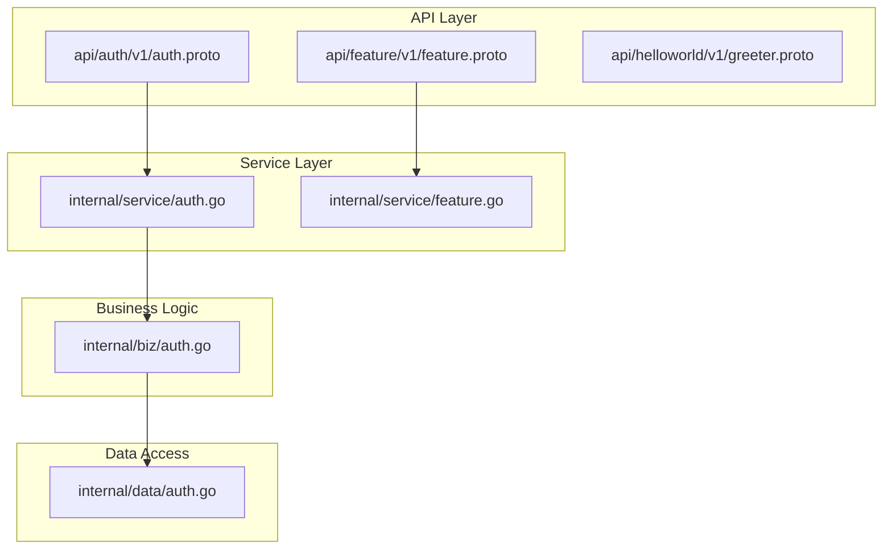
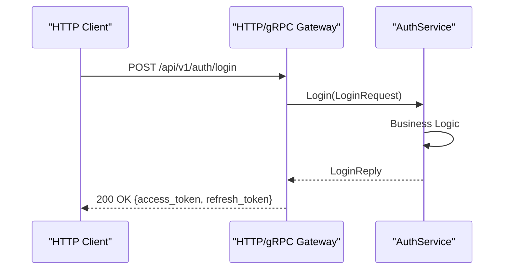
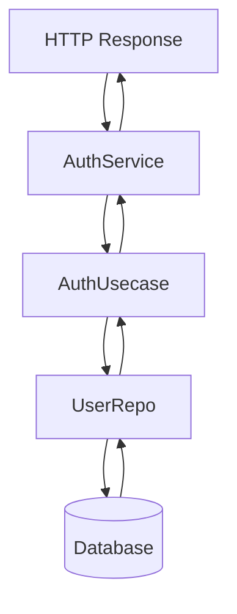

# Protocol Buffer-First API Design

<cite>
**Referenced Files in This Document**   
- [auth.proto](file://api/auth/v1/auth.proto)
- [auth.go](file://internal/service/auth.go)
- [auth.go](file://internal/biz/auth.go)
- [auth.go](file://internal/data/auth.go)
- [conf.proto](file://internal/conf/conf.proto)
- [feature.go](file://internal/service/feature.go)
</cite>

## Table of Contents
1. [Introduction](#introduction)
2. [Project Structure and API Organization](#project-structure-and-api-organization)
3. [Core API Definition with Protocol Buffers](#core-api-definition-with-protocol-buffers)
4. [HTTP and gRPC Endpoint Mapping](#http-and-grpc-endpoint-mapping)
5. [Service Implementation Flow](#service-implementation-flow)
6. [Configuration via Protocol Buffers](#configuration-via-protocol-buffers)
7. [Code Generation and API Consistency](#code-generation-and-api-consistency)
8. [Backward Compatibility and Versioning](#backward-compatibility-and-versioning)
9. [Extending APIs and Best Practices](#extending-apis-and-best-practices)
10. [Conclusion](#conclusion)

## Introduction

The kratos-boilerplate project implements a Protocol Buffer-first API design strategy, where all service interfaces are defined in `.proto` files before any implementation code is written. This approach ensures API consistency, enables automatic client SDK generation, and supports both gRPC and HTTP/JSON protocols through a single source of truth. This document details how the system uses Protocol Buffers to define authentication and feature toggle services, maps them to RESTful endpoints, and implements business logic in Go.

## Project Structure and API Organization

The project follows a clean, layered architecture with a strong emphasis on API-first design. The `api/` directory contains all Protocol Buffer definitions, organized by service and version. Each service (e.g., `auth`, `feature`, `helloworld`) has its own subdirectory with versioned `.proto` files, enabling clear version management and backward compatibility.



**Diagram sources**
- [auth.proto](file://api/auth/v1/auth.proto)
- [auth.go](file://internal/service/auth.go)
- [auth.go](file://internal/biz/auth.go)
- [auth.go](file://internal/data/auth.go)

**Section sources**
- [auth.proto](file://api/auth/v1/auth.proto)
- [auth.go](file://internal/service/auth.go)

## Core API Definition with Protocol Buffers

The authentication service is defined in `api/auth/v1/auth.proto`, which specifies the service interface, request/response messages, and HTTP mappings. The `.proto` file uses `google.api.http` annotations to define RESTful endpoints, allowing a single definition to serve both gRPC and HTTP clients.

The `Auth` service includes methods for user registration, login, logout, token refresh, and captcha management. Each method has strongly typed request and response messages, ensuring type safety and clear API contracts.

```protobuf
service Auth {
  rpc Register(RegisterRequest) returns (RegisterReply) {
    option (google.api.http) = {
      post: "/api/v1/auth/register"
      body: "*"
    };
  }
  
  rpc Login(LoginRequest) returns (LoginReply) {
    option (google.api.http) = {
      post: "/api/v1/auth/login"
      body: "*"
    };
  }
}
```

Message definitions such as `LoginRequest` and `LoginReply` specify the exact structure of data exchanged between client and server, including field types and semantics.

**Section sources**
- [auth.proto](file://api/auth/v1/auth.proto#L1-L155)

## HTTP and gRPC Endpoint Mapping

The Protocol Buffer definitions use `google.api.http` annotations to map gRPC methods to HTTP/JSON endpoints. This enables the same service to be accessed via both gRPC (for internal services) and HTTP (for web/mobile clients) without duplicating logic.

For example, the `Login` RPC method is mapped to the HTTP POST endpoint `/api/v1/auth/login` with `body: "*"` indicating that the entire request message should be parsed from the request body. Similarly, `GetCaptcha` maps to a GET endpoint with a path parameter.



**Diagram sources**
- [auth.proto](file://api/auth/v1/auth.proto#L1-L155)
- [auth.go](file://internal/service/auth.go#L1-L235)

**Section sources**
- [auth.proto](file://api/auth/v1/auth.proto#L1-L155)

## Service Implementation Flow

The implementation follows a clean architecture pattern with service, biz (usecase), and data layers. The `AuthService` in `internal/service/auth.go` implements the gRPC service interface generated from `auth.proto`, acting as an adapter between the API and business logic.

Each RPC method in `AuthService` delegates to the corresponding method in `AuthUsecase` (defined in `internal/biz/auth.go`), which contains the core business logic. The usecase layer interacts with repositories to persist data and enforce business rules.



For example, the `Login` method in `AuthService` calls `uc.Login()` which validates credentials, checks account lock status, verifies captcha, and generates JWT tokens.

**Section sources**
- [auth.go](file://internal/service/auth.go#L1-L235)
- [auth.go](file://internal/biz/auth.go#L1-L695)

## Configuration via Protocol Buffers

Configuration is defined in `internal/conf/conf.proto`, which uses Protocol Buffers to specify the structure of the application's configuration. The `Bootstrap` message contains nested messages for server, data, auth, and features configuration.

This approach enables type-safe configuration with automatic code generation, validation, and support for multiple formats (YAML, JSON). The generated Go structs can be directly used by the application, eliminating manual parsing and reducing errors.

```protobuf
message Auth {
  string jwt_secret_key = 1;
  google.protobuf.Duration access_token_expiration = 2;
  google.protobuf.Duration refresh_token_expiration = 3;
  bool captcha_enabled = 4;
  int32 max_login_attempts = 6;
}
```

The configuration is injected into services and usecases, allowing easy testing and dynamic reconfiguration.

**Section sources**
- [conf.proto](file://internal/conf/conf.proto#L1-L68)

## Code Generation and API Consistency

The Protocol Buffer-first approach ensures API consistency across the entire system. When `auth.proto` is compiled, it generates:
- Go service interface (`AuthServer`)
- Request/response message structs
- gRPC client stubs
- HTTP gateway bindings
- OpenAPI/Swagger documentation

This guarantees that the API contract is enforced at compile time, preventing mismatches between documentation and implementation. Client SDKs can be generated for multiple languages, enabling consistent integration across platforms.

The use of `google.api.http` annotations ensures that HTTP endpoints, methods, and request/response formats are consistent with the gRPC definitions, reducing the risk of API drift.

**Section sources**
- [auth.proto](file://api/auth/v1/auth.proto#L1-L155)
- [conf.proto](file://internal/conf/conf.proto#L1-L68)

## Backward Compatibility and Versioning

The project maintains backward compatibility through versioned API directories (e.g., `v1/`). When changes are needed, new versions can be introduced alongside existing ones, allowing clients to migrate at their own pace.

Breaking changes are avoided by:
- Only adding new fields to messages (never removing or changing existing ones)
- Using `optional` fields for new data
- Maintaining old HTTP endpoints until deprecation
- Returning default values for unrecognized fields

The versioning strategy follows semantic versioning principles, with major version increments for breaking changes and minor versions for backward-compatible additions.

**Section sources**
- [auth.proto](file://api/auth/v1/auth.proto#L1-L155)

## Extending APIs and Best Practices

To extend the API, follow these steps:
1. Define new methods and messages in the `.proto` file
2. Regenerate code using the build system
3. Implement the new methods in the service layer
4. Add business logic in the usecase layer
5. Update data access if needed

Best practices include:
- Always define clear request/response messages
- Use `google.api.http` annotations for HTTP mappings
- Keep business logic in the `biz` layer, not in `service`
- Use error details from `google.rpc.Status` for rich error reporting
- Validate input in both service and usecase layers
- Maintain backward compatibility in message definitions

For feature toggles, the system uses a similar pattern with `feature.proto` defining the service interface and `feature.go` implementing the logic, demonstrating the reusability of this design pattern across different domains.

**Section sources**
- [auth.proto](file://api/auth/v1/auth.proto#L1-L155)
- [feature.go](file://internal/service/feature.go#L250-L295)

## Conclusion

The Protocol Buffer-first API design in kratos-boilerplate provides a robust foundation for building consistent, maintainable, and scalable services. By defining APIs in `.proto` files, the system ensures that gRPC and HTTP interfaces remain synchronized, enables automatic client SDK generation, and supports clean separation of concerns. The layered architecture promotes testability and maintainability, while versioning and backward compatibility practices ensure smooth evolution of the API over time. This approach is particularly effective for microservices architectures where API consistency and client integration are critical.