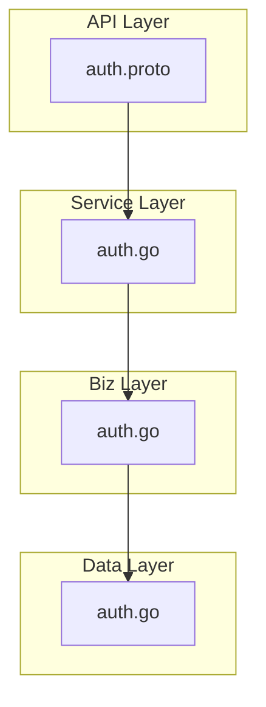
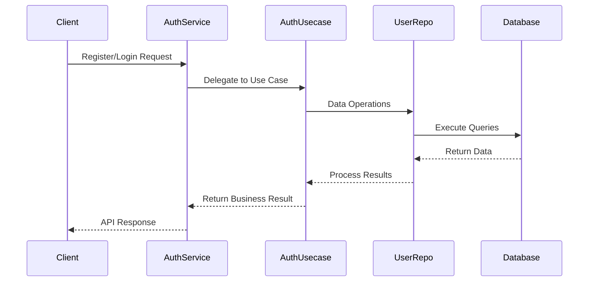
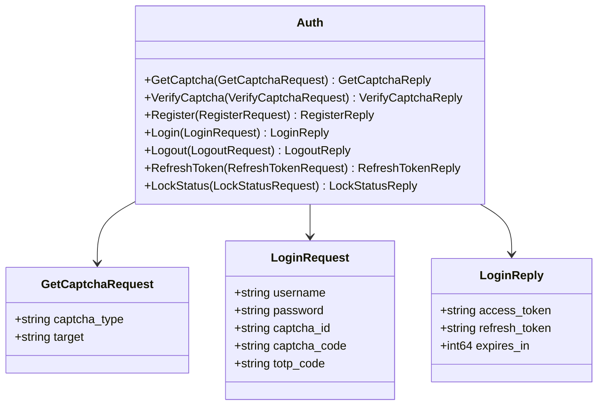
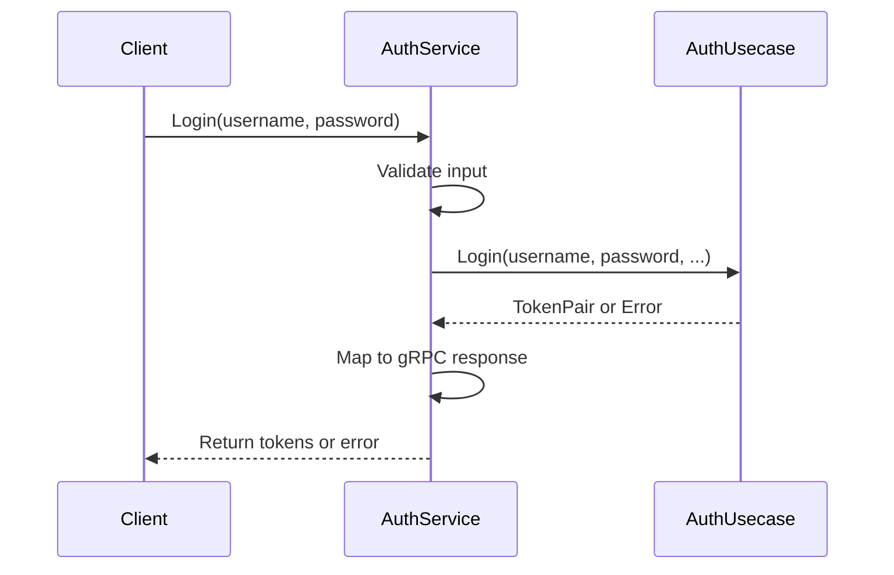
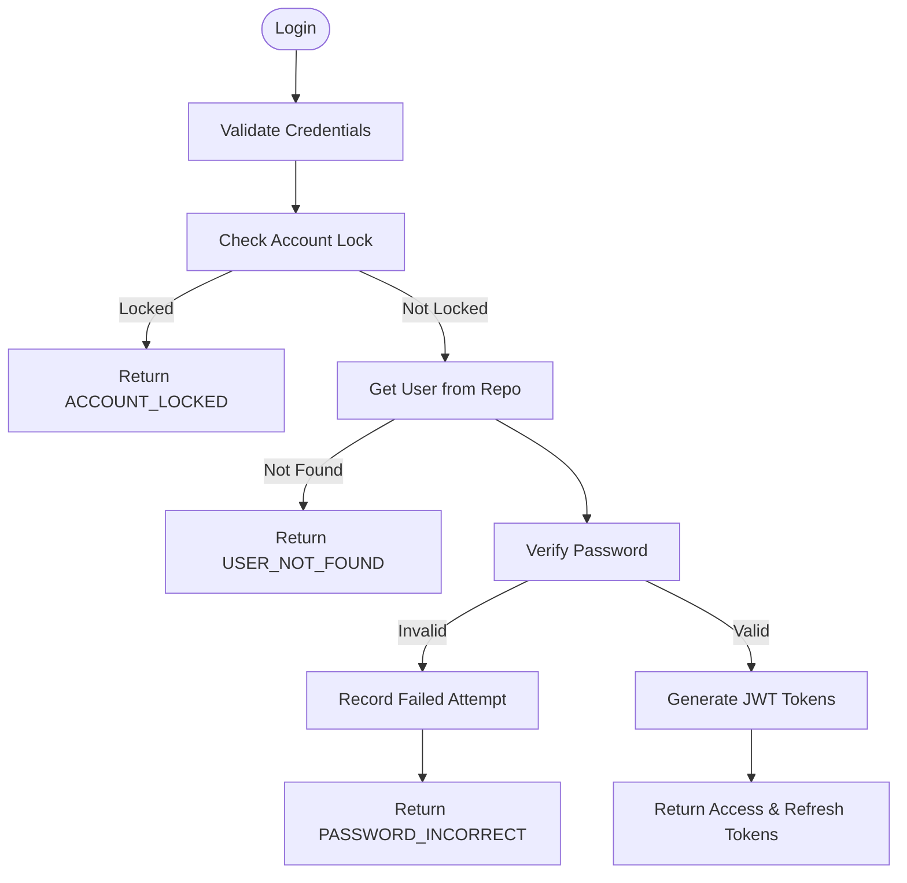
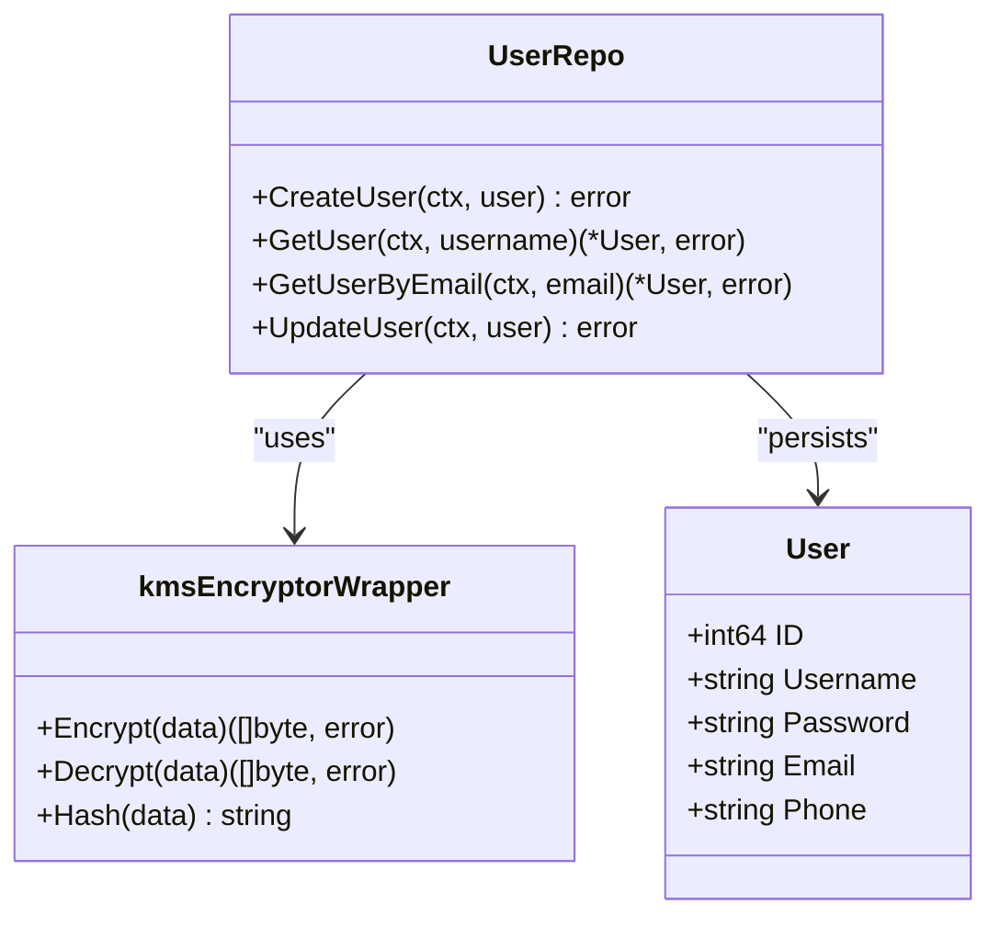
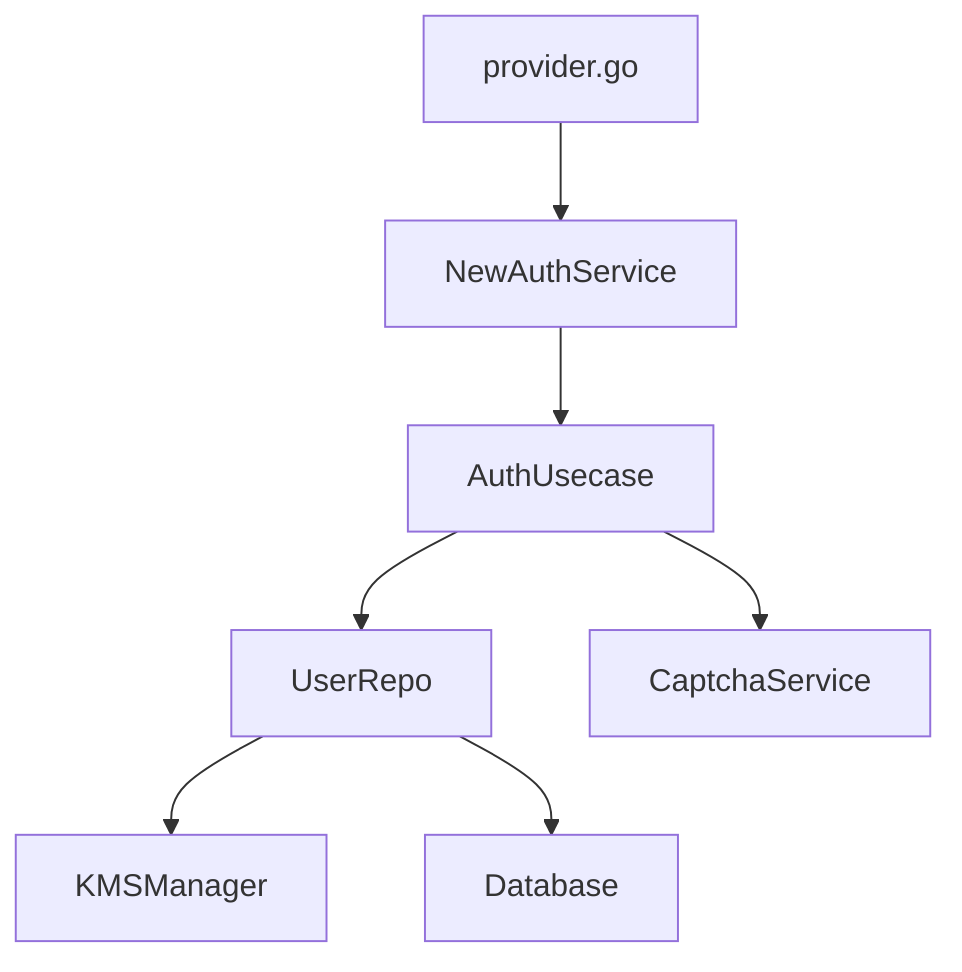

# Authentication Service

<cite>
**Referenced Files in This Document**   
- [auth.proto](file://api/auth/v1/auth.proto)
- [auth.go](file://internal/service/auth.go)
- [auth.go](file://internal/biz/auth.go)
- [auth.go](file://internal/data/auth.go)
- [provider.go](file://internal/service/provider.go)
</cite>

## Table of Contents
1. [Introduction](#introduction)
2. [Project Structure](#project-structure)
3. [Core Components](#core-components)
4. [Architecture Overview](#architecture-overview)
5. [Detailed Component Analysis](#detailed-component-analysis)
6. [Dependency Analysis](#dependency-analysis)
7. [Performance Considerations](#performance-considerations)
8. [Troubleshooting Guide](#troubleshooting-guide)
9. [Conclusion](#conclusion)

## Introduction
The Authentication Service in kratos-boilerplate provides a secure and extensible foundation for user identity management. It supports standard authentication operations including registration, login, logout, session management, and token refresh. The service is built using a clean architecture pattern with clear separation between API, business logic, and data layers. It integrates with JWT-based token authentication, supports multi-factor authentication via TOTP, implements account lockout mechanisms, and includes captcha-based bot protection. The service is defined via gRPC/HTTP APIs and follows Kratos framework conventions for dependency injection and error handling.

## Project Structure
The authentication service spans multiple layers of the application architecture:
- **API Layer**: `api/auth/v1/auth.proto` defines gRPC services and messages
- **Service Layer**: `internal/service/auth.go` implements gRPC handlers
- **Business Logic Layer**: `internal/biz/auth.go` contains core authentication logic
- **Data Layer**: `internal/data/auth.go` manages user persistence and encryption
- **Dependency Injection**: `internal/service/provider.go` wires components together

**Diagram sources**
- [auth.proto](file://api/auth/v1/auth.proto)
- [internal/service/auth.go](file://internal/service/auth.go)
- [internal/biz/auth.go](file://internal/biz/auth.go)
- [internal/data/auth.go](file://internal/data/auth.go)

**Section sources**
- [auth.proto](file://api/auth/v1/auth.proto)
- [internal/service/auth.go](file://internal/service/auth.go)
- [internal/biz/auth.go](file://internal/biz/auth.go)
- [internal/data/auth.go](file://internal/data/auth.go)

## Core Components
The authentication system consists of three main components:
1. **AuthService**: gRPC service implementation that handles API requests
2. **AuthUsecase**: Business logic layer that orchestrates authentication workflows
3. **UserRepo**: Data access layer responsible for user persistence and encryption

The service uses dependency injection via Wire to connect these components. Error handling is standardized using Kratos errors with custom error codes for different failure scenarios (e.g., PASSWORD_INCORRECT, ACCOUNT_LOCKED).

**Section sources**
- [internal/service/auth.go](file://internal/service/auth.go#L1-L50)
- [internal/biz/auth.go](file://internal/biz/auth.go#L1-L100)
- [internal/data/auth.go](file://internal/data/auth.go#L1-L50)

## Architecture Overview
The authentication service follows a layered architecture with clear separation of concerns:

**Diagram sources**
- [internal/service/auth.go](file://internal/service/auth.go#L50-L100)
- [internal/biz/auth.go](file://internal/biz/auth.go#L100-L150)
- [internal/data/auth.go](file://internal/data/auth.go#L50-L100)

## Detailed Component Analysis

### API Layer Analysis
The API layer is defined in `auth.proto` using Protocol Buffers, exposing RESTful endpoints via HTTP annotations.

**Diagram sources**
- [auth.proto](file://api/auth/v1/auth.proto#L10-L50)

**Section sources**
- [auth.proto](file://api/auth/v1/auth.proto#L1-L155)

### Service Layer Analysis
The `AuthService` struct implements the gRPC service interface, validating requests and delegating to the business logic layer.

**Diagram sources**
- [internal/service/auth.go](file://internal/service/auth.go#L50-L150)

**Section sources**
- [internal/service/auth.go](file://internal/service/auth.go#L1-L235)

### Business Logic Analysis
The `authUsecase` implements core authentication workflows with comprehensive error handling and security controls.

**Diagram sources**
- [internal/biz/auth.go](file://internal/biz/auth.go#L300-L400)

**Section sources**
- [internal/biz/auth.go](file://internal/biz/auth.go#L1-L695)

### Data Layer Analysis
The data layer handles user persistence with field-level encryption for sensitive data using KMS integration.

**Diagram sources**
- [internal/data/auth.go](file://internal/data/auth.go#L50-L100)

**Section sources**
- [internal/data/auth.go](file://internal/data/auth.go#L1-L438)

## Dependency Analysis
The authentication components are wired together using Google Wire for dependency injection.

**Diagram sources**
- [internal/service/provider.go](file://internal/service/provider.go)
- [internal/service/auth.go](file://internal/service/auth.go#L10-L20)

**Section sources**
- [internal/service/provider.go](file://internal/service/provider.go#L1-L13)

## Performance Considerations
The authentication service includes several performance optimizations:
- In-memory storage for captcha and refresh token state (can be replaced with Redis in production)
- Field-level encryption with hashing for efficient lookups
- Concurrent-safe data structures for token blacklists
- Connection pooling through the database layer
- Lightweight JWT token parsing and validation

For production deployment, consider:
1. Replacing in-memory stores with Redis for distributed environments
2. Implementing database indexing on frequently queried fields (username, email_hash, phone_hash)
3. Adding response caching for frequently accessed user data
4. Using connection pooling with appropriate sizing

## Troubleshooting Guide
Common issues and their solutions:

### Failed Login Scenarios
**Section sources**
- [internal/biz/auth.go](file://internal/biz/auth.go#L300-L350)
- [internal/service/auth.go](file://internal/service/auth.go#L100-L130)

| Error Code | Cause | Solution |
|-----------|------|----------|
| USER_NOT_FOUND | Username doesn't exist | Verify username spelling |
| PASSWORD_INCORRECT | Invalid password | Reset password if needed |
| CAPTCHA_REQUIRED | Missing captcha | Provide valid captcha |
| ACCOUNT_LOCKED | Too many failed attempts | Wait for lockout period or contact admin |
| TOTP_REQUIRED | 2FA enabled | Provide TOTP code |

### Token Issues
**Section sources**
- [internal/biz/auth.go](file://internal/biz/auth.go#L500-L550)
- [internal/service/auth.go](file://internal/service/auth.go#L180-L210)

| Issue | Diagnosis | Resolution |
|------|-----------|------------|
| TOKEN_EXPIRED | Access token expired | Use refresh token to get new pair |
| TOKEN_INVALID | Malformed or tampered token | Re-authenticate |
| REFRESH_TOKEN_REUSED | Token reuse detected | Force password reset (security measure) |

### Account Lockout
The system locks accounts after 5 failed attempts (configurable) for 30 minutes. Use the `LockStatus` API to check lockout status. The `recordFailedAttempt` method in `authUsecase` handles incrementing failure counters and setting lockout times.

## Conclusion
The Authentication Service in kratos-boilerplate provides a robust foundation for user identity management with strong security practices. Its layered architecture separates concerns clearly, making it maintainable and testable. Key strengths include JWT-based authentication, account lockout protection, captcha integration, and field-level encryption for sensitive data. The service is extensible through the provider interface and can be enhanced with additional authentication methods. For production use, consider enhancing the in-memory stores with Redis and implementing more sophisticated password policies.