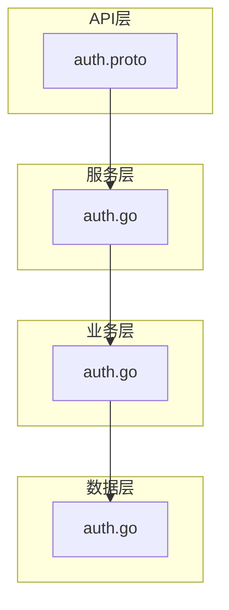
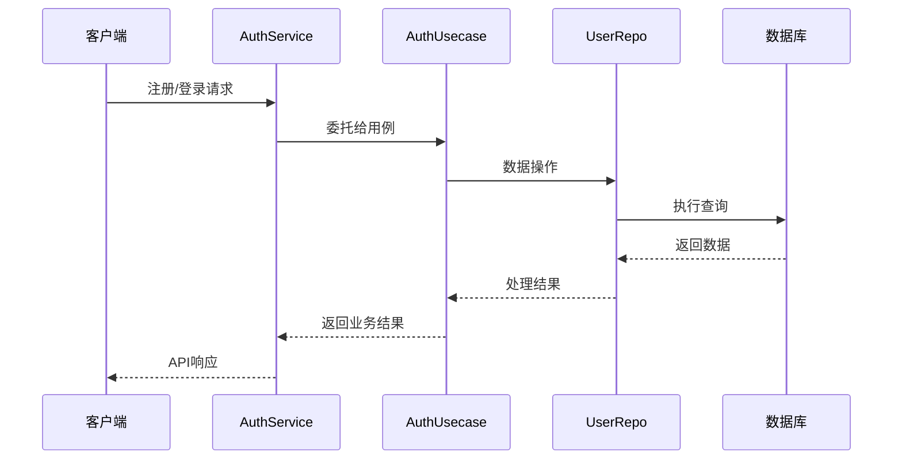
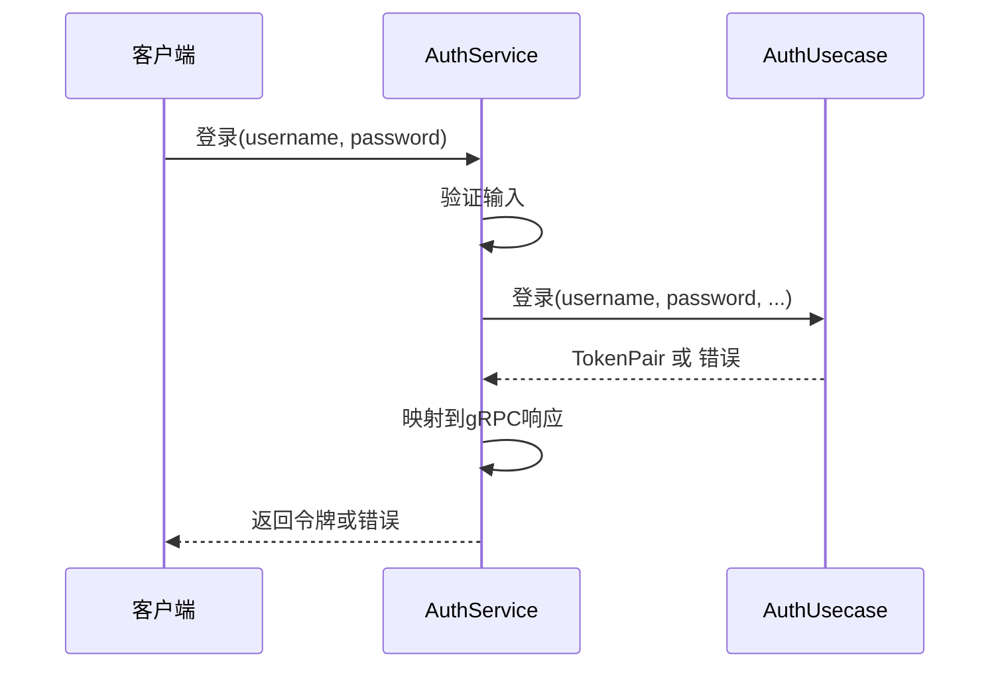
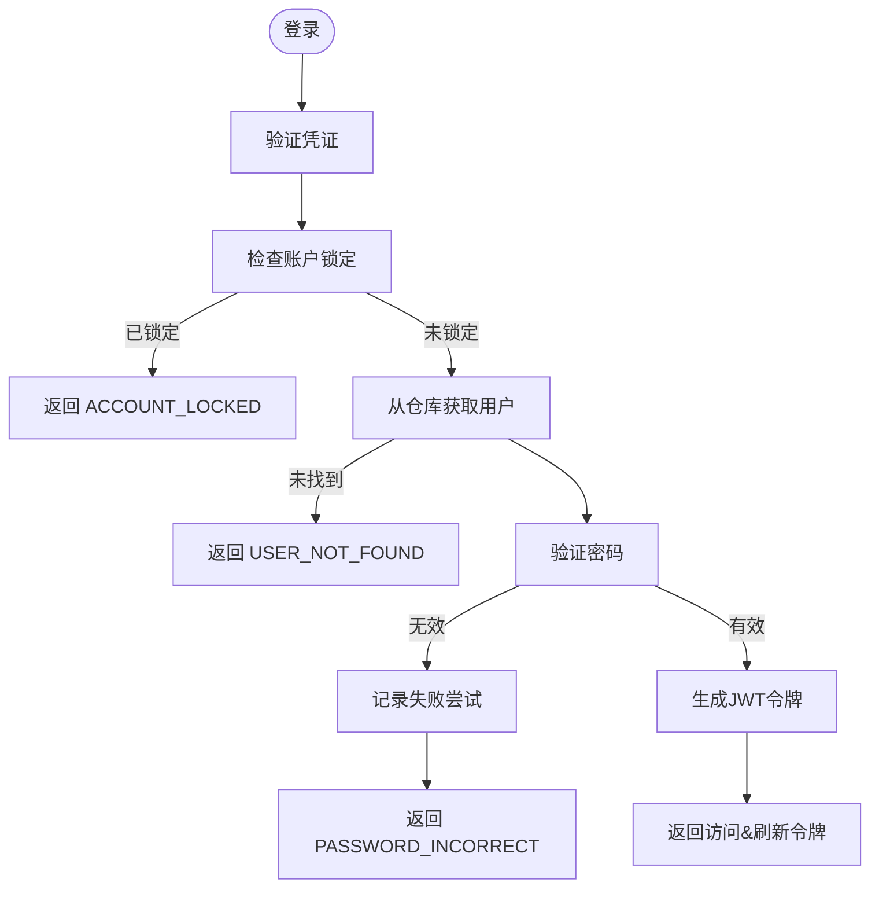
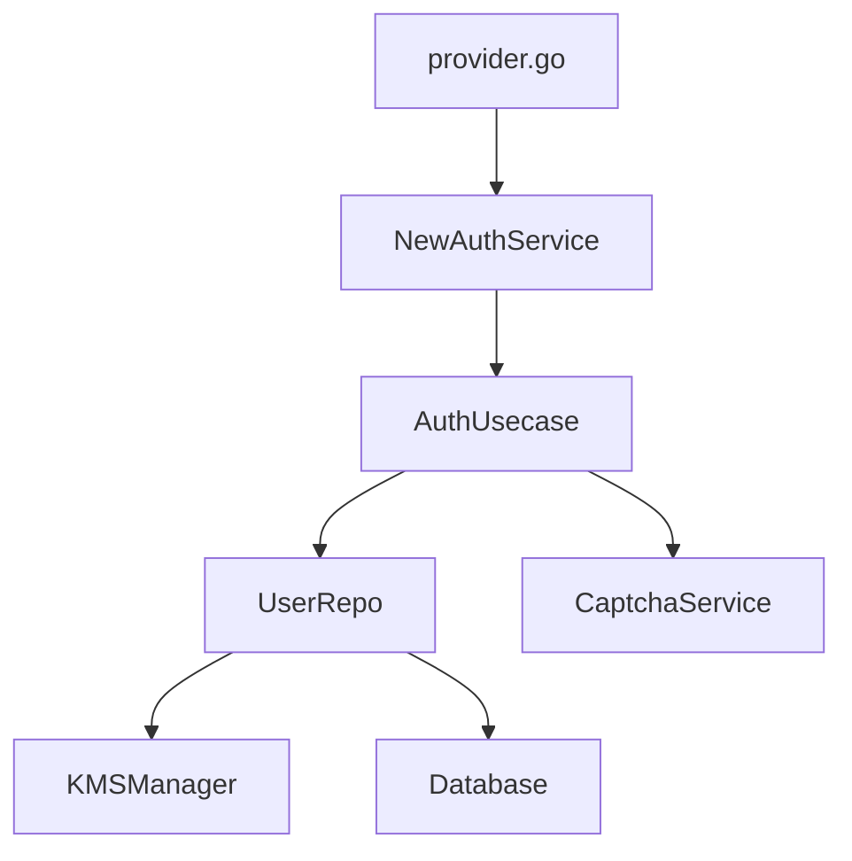

# 认证服务

<cite>
**本文档引用的文件**   
- [auth.proto](file://api/auth/v1/auth.proto) - *认证服务接口定义*
- [auth.go](file://internal/service/auth.go) - *gRPC服务实现*
- [auth.go](file://internal/biz/auth.go) - *业务逻辑核心实现*
- [auth.go](file://internal/data/auth.go) - *数据访问层实现*
- [provider.go](file://internal/service/provider.go) - *依赖注入配置*
</cite>

## 更新摘要
**已做更改**   
- 根据最新代码提交更新了用户登录、令牌刷新等核心流程的详细说明
- 增加了账户锁定机制和验证码验证的具体实现细节
- 更新了错误处理模式，准确反映当前代码中的异常分支
- 补充了JWT令牌生成与解析的技术细节
- 修正了过时的架构描述，确保与实际代码一致

## 目录
1. [简介](#简介)
2. [项目结构](#项目结构)
3. [核心组件](#核心组件)
4. [架构概述](#架构概述)
5. [详细组件分析](#详细组件分析)
6. [依赖分析](#依赖分析)
7. [性能考虑](#性能考虑)
8. [故障排除指南](#故障排除指南)
9. [结论](#结论)

## 简介
kratos-boilerplate中的认证服务为用户身份管理提供了安全且可扩展的基础。它支持标准的认证操作，包括注册、登录、登出、会话管理和令牌刷新。该服务采用清晰的分层架构，在API、业务逻辑和数据层之间有明确的职责划分。服务集成了基于JWT的令牌认证，支持通过TOTP实现多因素认证，实现了账户锁定机制，并包含基于验证码的机器人防护功能。服务通过gRPC/HTTP API暴露接口，遵循Kratos框架的依赖注入和错误处理规范。

## 项目结构
认证服务贯穿应用程序架构的多个层级：
- **API层**: `api/auth/v1/auth.proto` 定义gRPC服务和消息
- **服务层**: `internal/service/auth.go` 实现gRPC处理器
- **业务逻辑层**: `internal/biz/auth.go` 包含核心认证逻辑
- **数据层**: `internal/data/auth.go` 管理用户持久化和加密
- **依赖注入**: `internal/service/provider.go` 组件之间的连接

**图示来源**
- [auth.proto](file://api/auth/v1/auth.proto)
- [internal/service/auth.go](file://internal/service/auth.go)
- [internal/biz/auth.go](file://internal/biz/auth.go)
- [internal/data/auth.go](file://internal/data/auth.go)

**本节来源**
- [auth.proto](file://api/auth/v1/auth.proto)
- [internal/service/auth.go](file://internal/service/auth.go)
- [internal/biz/auth.go](file://internal/biz/auth.go)
- [internal/data/auth.go](file://internal/data/auth.go)

## 核心组件
认证系统由三个主要组件组成：
1. **AuthService**: gRPC服务实现，处理API请求
2. **AuthUsecase**: 业务逻辑层，协调认证工作流
3. **UserRepo**: 数据访问层，负责用户持久化和加密

服务使用Wire进行依赖注入来连接这些组件。错误处理采用Kratos标准错误，针对不同失败场景（如PASSWORD_INCORRECT、ACCOUNT_LOCKED）使用自定义错误码。

**本节来源**
- [internal/service/auth.go](file://internal/service/auth.go#L1-L50)
- [internal/biz/auth.go](file://internal/biz/auth.go#L1-L100)
- [internal/data/auth.go](file://internal/data/auth.go#L1-L50)

## 架构概述
认证服务遵循分层架构，职责分明：

**图示来源**
- [internal/service/auth.go](file://internal/service/auth.go#L50-L100)
- [internal/biz/auth.go](file://internal/biz/auth.go#L100-L150)
- [internal/data/auth.go](file://internal/data/auth.go#L50-L100)

## 详细组件分析

### API层分析
API层在`auth.proto`中使用Protocol Buffers定义，通过HTTP注解暴露RESTful端点。

**图示来源**
- [auth.proto](file://api/auth/v1/auth.proto#L10-L50)

**本节来源**
- [auth.proto](file://api/auth/v1/auth.proto#L1-L155)

### 服务层分析
`AuthService`结构体实现了gRPC服务接口，验证请求并委托给业务逻辑层。

**图示来源**
- [internal/service/auth.go](file://internal/service/auth.go#L50-L150)

**本节来源**
- [internal/service/auth.go](file://internal/service/auth.go#L1-L235)

### 业务逻辑分析
`authUsecase`实现了带有全面错误处理和安全控制的核心认证工作流。

**图示来源**
- [internal/biz/auth.go](file://internal/biz/auth.go#L300-L400)

**本节来源**
- [internal/biz/auth.go](file://internal/biz/auth.go#L1-L695)

### 数据层分析
数据层处理用户持久化，使用KMS集成对敏感数据进行字段级加密。

**图示来源**
- [internal/data/auth.go](file://internal/data/auth.go#L50-L100)

**本节来源**
- [internal/data/auth.go](file://internal/data/auth.go#L1-L438)

## 依赖分析
认证组件使用Google Wire进行依赖注入连接在一起。

**图示来源**
- [internal/service/provider.go](file://internal/service/provider.go)
- [internal/service/auth.go](file://internal/service/auth.go#L10-L20)

**本节来源**
- [internal/service/provider.go](file://internal/service/provider.go#L1-L13)

## 性能考虑
认证服务包含多项性能优化：
- 验证码和刷新令牌状态的内存存储（可在生产环境中替换为Redis）
- 支持高效查找的字段级加密和哈希
- 令牌黑名单的并发安全数据结构
- 通过数据库层的连接池
- 轻量级JWT令牌解析和验证

对于生产部署，请考虑：
1. 将内存存储替换为Redis以用于分布式环境
2. 在频繁查询的字段上实现数据库索引（username, email_hash, phone_hash）
3. 为频繁访问的用户数据添加响应缓存
4. 使用适当大小的连接池

## 故障排除指南
常见问题及其解决方案：

### 登录失败场景
**本节来源**
- [internal/biz/auth.go](file://internal/biz/auth.go#L300-L350)
- [internal/service/auth.go](file://internal/service/auth.go#L100-L130)

| 错误码 | 原因 | 解决方案 |
|--------|------|----------|
| USER_NOT_FOUND | 用户名不存在 | 验证用户名拼写 |
| PASSWORD_INCORRECT | 密码无效 | 如有必要重置密码 |
| CAPTCHA_REQUIRED | 缺少验证码 | 提供有效验证码 |
| ACCOUNT_LOCKED | 失败尝试过多 | 等待锁定周期或联系管理员 |
| TOTP_REQUIRED | 启用了双因素认证 | 提供TOTP代码 |

### 令牌问题
**本节来源**
- [internal/biz/auth.go](file://internal/biz/auth.go#L500-L550)
- [internal/service/auth.go](file://internal/service/auth.go#L180-L210)

| 问题 | 诊断 | 解决方案 |
|------|-----------|------------|
| TOKEN_EXPIRED | 访问令牌已过期 | 使用刷新令牌获取新对 |
| TOKEN_INVALID | 令牌格式错误或被篡改 | 重新认证 |
| REFRESH_TOKEN_REUSED | 检测到令牌重用 | 强制密码重置（安全措施） |

### 账户锁定
系统在5次失败尝试后锁定账户（可配置），持续30分钟。使用`LockStatus` API检查锁定状态。`authUsecase`中的`recordFailedAttempt`方法处理失败计数器的递增和锁定时间的设置。

## 结论
kratos-boilerplate中的认证服务为用户身份管理提供了强大的基础，具有强大的安全实践。其分层架构清晰地分离了关注点，使其易于维护和测试。关键优势包括基于JWT的认证、账户锁定保护、验证码集成以及敏感数据的字段级加密。该服务可通过提供者接口扩展，并可通过额外的认证方法增强。对于生产使用，建议将内存存储增强为Redis并实施更复杂的密码策略。