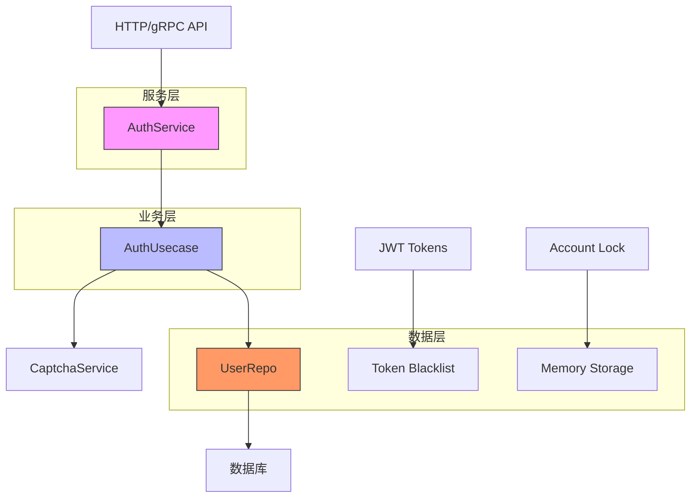
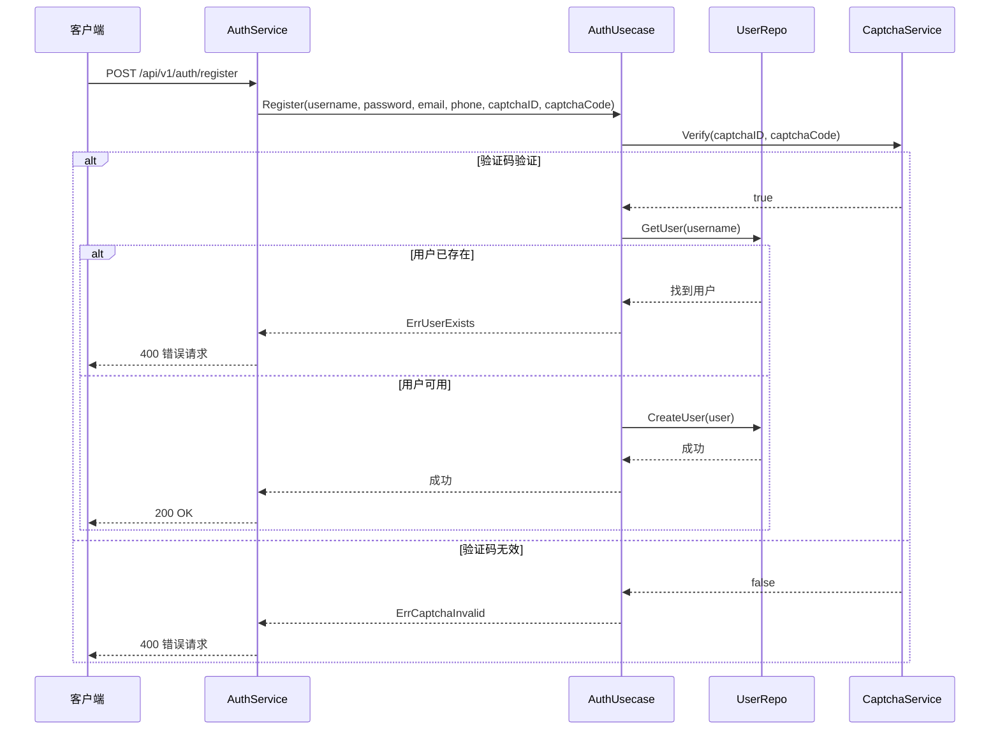
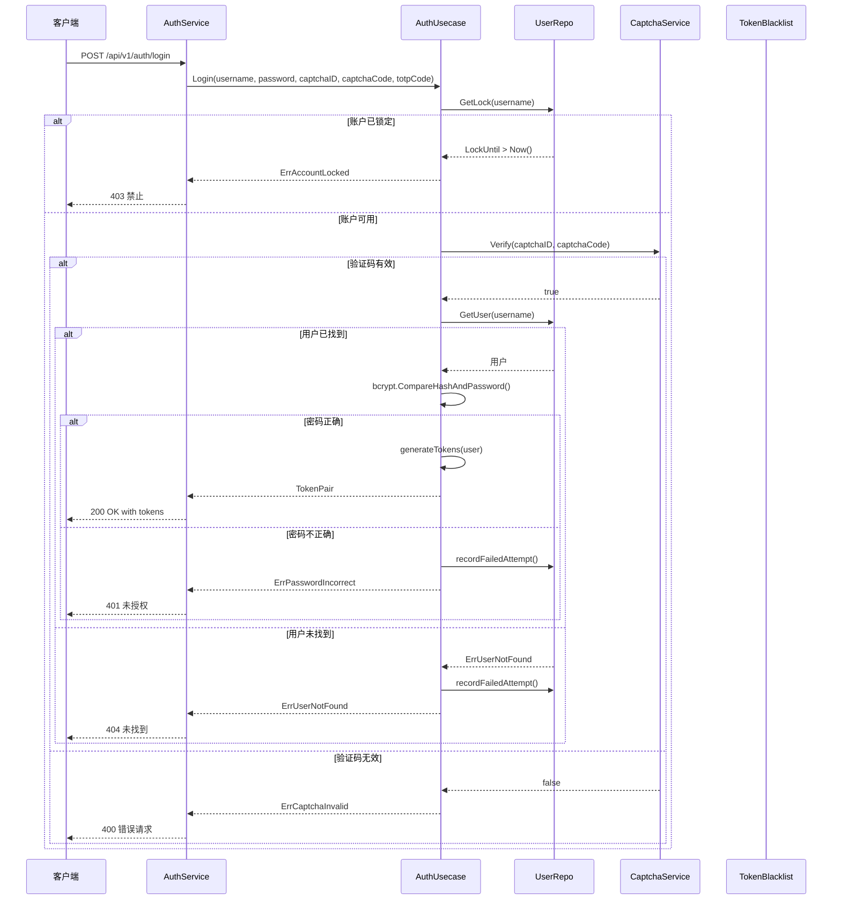
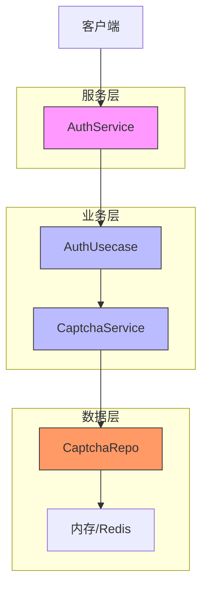
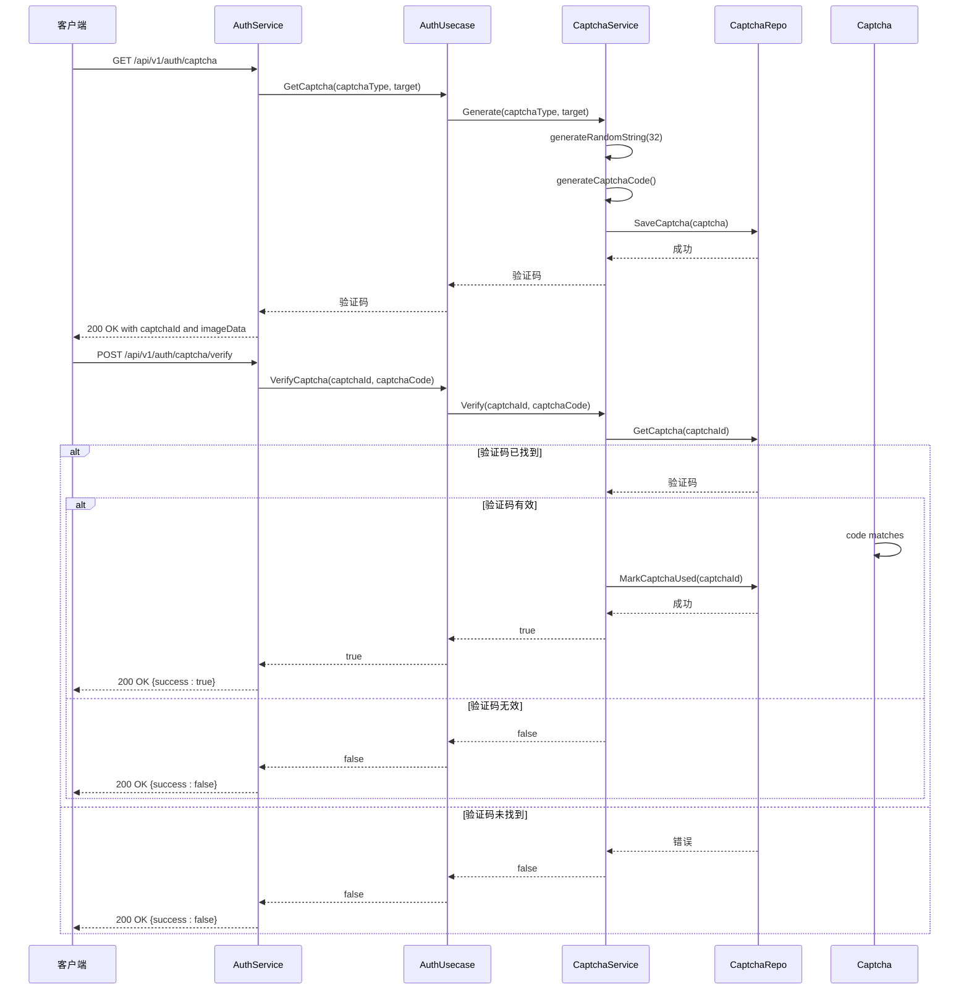
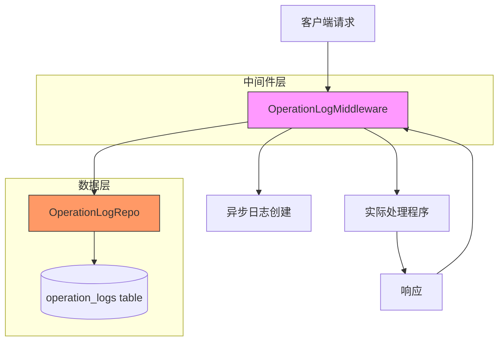
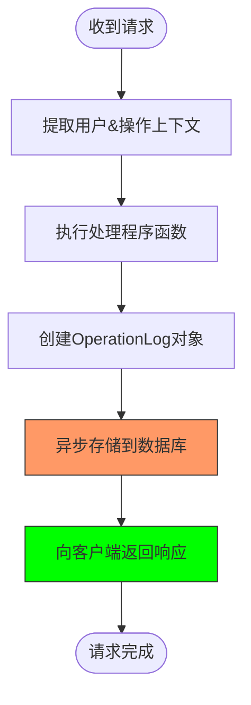
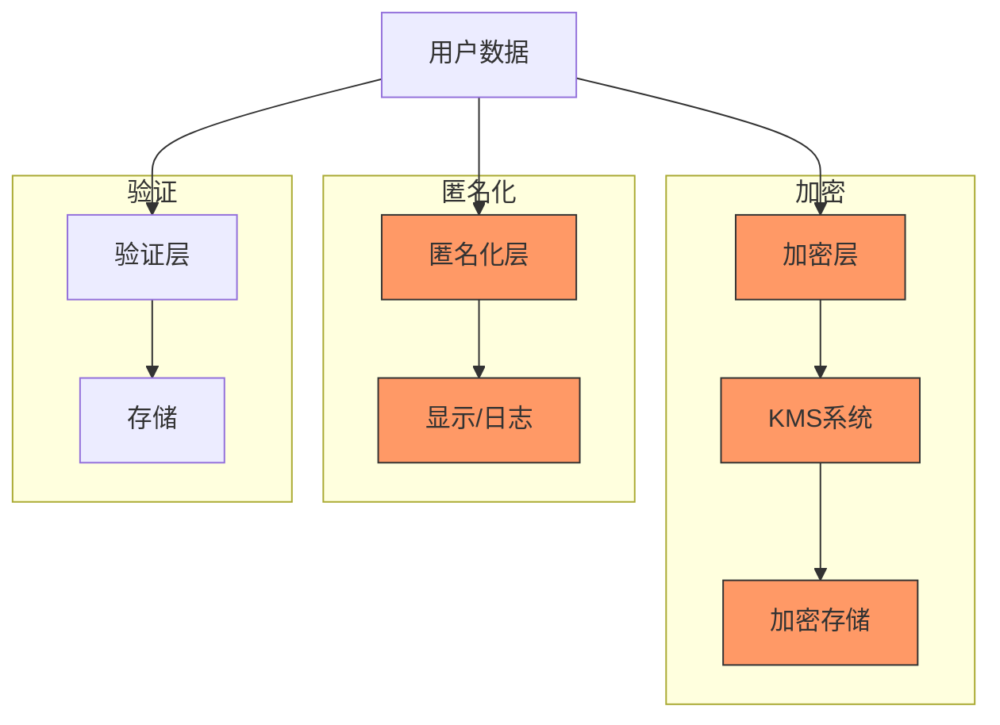
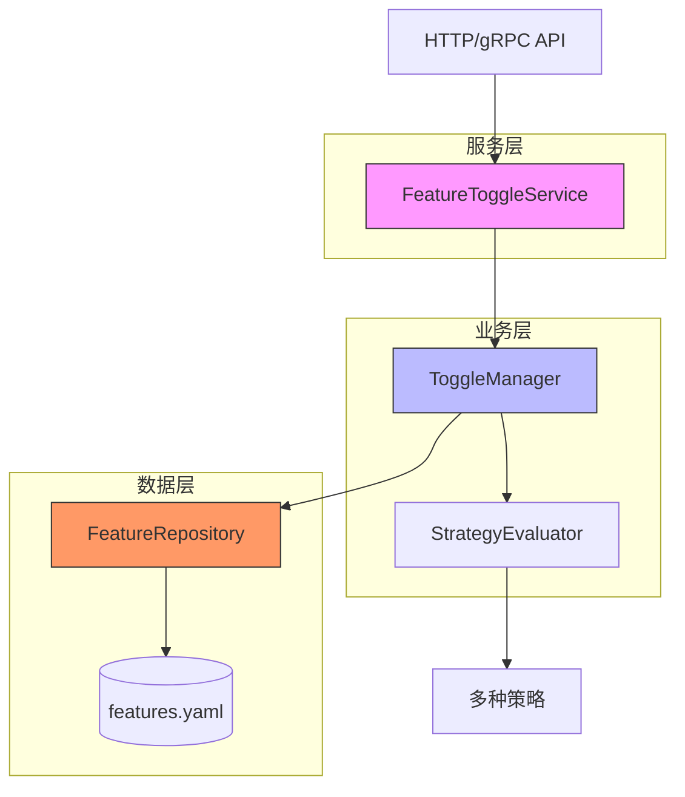
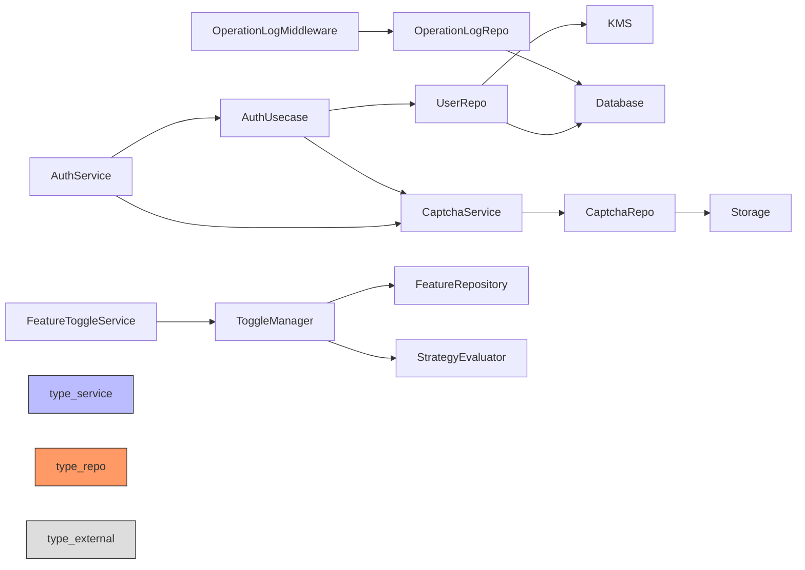

# 后端服务

<cite>
**本文档中引用的文件**   
- [auth.go](file://internal/biz/auth.go)
- [auth_test.go](file://internal/biz/auth_test.go)
- [auth.go](file://internal/data/auth.go)
- [auth_database_test.go](file://internal/data/auth_database_test.go)
- [auth_simple_test.go](file://internal/data/auth_simple_test.go)
- [auth.go](file://internal/service/auth.go)
- [auth_test.go](file://internal/service/auth_test.go)
- [captcha.go](file://internal/pkg/captcha/captcha.go)
- [captcha_test.go](file://internal/pkg/captcha/captcha_test.go)
- [captcha.go](file://internal/data/captcha.go)
- [captcha_simple_test.go](file://internal/data/captcha_simple_test.go)
- [operation_log.go](file://internal/biz/operation_log.go)
- [operation_log.go](file://internal/data/operation_log.go)
- [operation_log.go](file://internal/middleware/operation_log.go)
- [operation_log.go](file://internal/server/middleware/operation_log.go)
- [operation_log_test.go](file://internal/data/operation_log_test.go)
- [middleware_test.go](file://internal/middleware/operation_log_test.go)
- [anonymizer.go](file://internal/pkg/sensitive/anonymizer.go)
- [structured_logger.go](file://internal/pkg/sensitive/structured_logger.go)
- [crypto_service.go](file://internal/pkg/kms/crypto_service.go)
- [auth.proto](file://api/auth/v1/auth.proto)
- [feature.proto](file://api/feature/v1/feature.proto)
- [feature.go](file://internal/service/feature.go)
- [toggle_manager.go](file://internal/pkg/feature/toggle_manager.go)
- [strategies.go](file://internal/pkg/feature/strategies.go)
- [interfaces.go](file://internal/pkg/feature/interfaces.go)
- [wire.go](file://internal/pkg/feature/wire.go)
- [auth_bdd_test.go](file://test/bdd/auth/auth_bdd_test.go)
- [auth_e2e_test.go](file://test/e2e/scenarios/auth_e2e_test.go)
</cite>

## 更新摘要
**已做更改**   
- 新增了功能开关服务章节，详细说明分层功能开关系统的实现
- 在服务关系和共享组件部分增加了功能开关系统的依赖关系
- 更新了文档引用文件列表，包含新功能相关的源文件
- 在共享组件部分增加了功能开关配置管理内容

## 目录
1. [简介](#简介)
2. [认证服务](#认证服务)
3. [验证码服务](#验证码服务)
4. [操作日志](#操作日志)
5. [敏感数据处理](#敏感数据处理)
6. [功能开关服务](#功能开关服务)
7. [服务关系和共享组件](#服务关系和共享组件)
8. [错误管理与常见问题](#错误管理与常见问题)
9. [结论](#结论)

## 简介
kratos-boilerplate 项目实现了一个具有强大安全性和操作功能的综合后端系统。本文档提供了核心后端服务的详细分析，重点关注认证服务、验证码服务、操作日志和敏感数据处理。该系统遵循清晰架构模式，在服务、业务逻辑（biz）和数据（持久化）层之间有明确的分离。认证通过JWT令牌实现，包含刷新令牌轮换和账户锁定机制。验证码功能提供针对自动化攻击的保护。全面的操作日志记录系统活动以供审计和监控。敏感数据处理通过加密和数据匿名化技术确保隐私和安全。

## 认证服务

认证服务在 kratos-boilerplate 中提供全面的用户认证功能，包括注册、登录、会话管理和账户安全特性。该服务在多个层面上实现，遵循清晰架构模式。

### 实现架构
认证系统遵循具有明确关注点分离的分层架构：



**图示来源**
- [auth.go](file://internal/service/auth.go)
- [auth.go](file://internal/biz/auth.go)
- [auth.go](file://internal/data/auth.go)

### 注册流程
用户注册流程验证输入，检查现有用户，并安全存储用户凭据：



**图示来源**
- [auth.go](file://internal/service/auth.go#L100-L130)
- [auth.go](file://internal/biz/auth.go#L350-L400)
- [auth.proto](file://api/auth/v1/auth.proto#L30-L37)

**本节来源**
- [auth.go](file://internal/service/auth.go#L100-L130)
- [auth.go](file://internal/biz/auth.go#L350-L400)
- [auth.proto](file://api/auth/v1/auth.proto#L30-L37)

### 登录和会话管理
登录流程包含多层安全措施，包括验证码验证、密码验证和账户锁定保护：



**图示来源**
- [auth.go](file://internal/service/auth.go#L132-L170)
- [auth.go](file://internal/biz/auth.go#L402-L480)
- [auth.proto](file://api/auth/v1/auth.proto#L38-L45)

**本节来源**
- [auth.go](file://internal/service/auth.go#L132-L170)
- [auth.go](file://internal/biz/auth.go#L402-L480)
- [auth.proto](file://api/auth/v1/auth.proto#L38-L45)

### 令牌管理
系统实现基于JWT的认证，使用访问令牌和刷新令牌进行安全会话管理：

```go
// TokenPair 结构用于认证令牌
type TokenPair struct {
    AccessToken  string
    RefreshToken string
    ExpiresIn    int64 // 访问令牌过期时间（秒）
}

// generateTokens 创建JWT访问和刷新令牌
func (uc *authUsecase) generateTokens(ctx context.Context, user *User) (*TokenPair, error) {
    now := time.Now()
    
    // 生成访问令牌
    accessExp := now.Add(uc.config.AccessTokenExpiration)
    accessClaims := jwt.MapClaims{
        "user_id":  user.ID,
        "username": user.Username,
        "exp":      accessExp.Unix(),
        "iat":      now.Unix(),
        "type":     "access",
    }
    accessToken := jwt.NewWithClaims(jwt.SigningMethodHS256, accessClaims)
    signedAccessToken, err := accessToken.SignedString([]byte(uc.config.JWTSecretKey))
    
    // 生成刷新令牌
    refreshExp := now.Add(uc.config.RefreshTokenExpiration)
    tokenID := generateRandomString(32)
    refreshClaims := jwt.MapClaims{
        "user_id":  user.ID,
        "username": user.Username,
        "exp":      refreshExp.Unix(),
        "iat":      now.Unix(),
        "type":     "refresh",
        "jti":      tokenID,
    }
    refreshToken := jwt.NewWithClaims(jwt.SigningMethodHS256, refreshClaims)
    signedRefreshToken, err := refreshToken.SignedString([]byte(uc.config.JWTSecretKey))
    
    // 存储刷新令牌
    if err := uc.repo.SaveRefreshToken(ctx, user.Username, tokenID, refreshExp); err != nil {
        return nil, fmt.Errorf("保存刷新令牌失败: %v", err)
    }
    
    return &TokenPair{
        AccessToken:  signedAccessToken,
        RefreshToken: signedRefreshToken,
        ExpiresIn:    int64(uc.config.AccessTokenExpiration.Seconds()),
    }, nil
}
```

**本节来源**
- [auth.go](file://internal/biz/auth.go#L600-L650)

### 账户锁定机制
系统实现安全特性，通过在多次登录失败后锁定账户来防止暴力攻击：

```go
// recordFailedAttempt 跟踪失败的登录尝试并锁定账户
func (uc *authUsecase) recordFailedAttempt(ctx context.Context, username string) {
    lock, err := uc.repo.GetLock(ctx, username)
    if err != nil && err != ErrUserNotFound {
        uc.log.Errorf("获取账户锁定失败: %v", err)
        return
    }
    
    if lock == nil {
        lock = &AccountLock{
            Username:       username,
            FailedAttempts: 0,
            LastAttempt:    time.Now(),
        }
    }
    
    now := time.Now()
    lock.FailedAttempts++
    lock.LastAttempt = now
    
    // 如果超过最大尝试次数则锁定账户
    if lock.FailedAttempts >= uc.config.MaxLoginAttempts {
        lock.LockUntil = now.Add(uc.config.LockDuration)
    }
    
    if err := uc.repo.SaveLock(ctx, lock); err != nil {
        uc.log.Errorf("保存账户锁定失败: %v", err)
    }
}
```

**本节来源**
- [auth.go](file://internal/biz/auth.go#L700-L730)

## 验证码服务

验证码服务通过验证码挑战验证人类交互，防止自动化攻击。该服务设计为可扩展的，支持多种验证码类型。

### 验证码架构
验证码系统遵循模块化设计，在生成、存储和验证之间有明确的分离：



**图示来源**
- [auth.go](file://internal/service/auth.go#L60-L80)
- [auth.go](file://internal/biz/auth.go#L200-L250)
- [captcha.go](file://internal/pkg/captcha/captcha.go)

### 验证码生成和验证
验证码工作流程包括生成挑战、安全存储和验证用户响应：



**图示来源**
- [auth.go](file://internal/service/auth.go#L60-L90)
- [auth.go](file://internal/biz/auth.go#L250-L300)
- [captcha.go](file://internal/pkg/captcha/captcha.go#L50-L100)
- [auth.proto](file://api/auth/v1/auth.proto#L10-L29)

**本节来源**
- [auth.go](file://internal/service/auth.go#L60-L90)
- [auth.go](file://internal/biz/auth.go#L250-L300)
- [captcha.go](file://internal/pkg/captcha/captcha.go#L50-L100)

### 验证码数据模型
验证码系统使用简单但有效的数据模型来存储挑战信息：

```go
// Captcha 表示验证码挑战
type Captcha struct {
    ID       string    // 验证码的唯一标识符
    Code     string    // 实际验证码
    Type     string    // 验证码类型: "sms", "email", "image"
    Target   string    // 短信或邮件验证码的接收者
    ExpireAt time.Time // 过期时间
    Used     bool      // 验证码是否已被使用
}

// CaptchaService 验证码操作接口
type CaptchaService interface {
    Generate(ctx context.Context, captchaType, target string) (*Captcha, error)
    Verify(ctx context.Context, captchaID, captchaCode string) (bool, error)
}
```

**本节来源**
- [auth.go](file://internal/biz/auth.go#L150-L170)

## 操作日志

操作日志系统通过记录用户操作和系统事件提供全面的审计能力。实现使用基于中间件的方法自动捕获操作。

### 日志架构
操作日志系统遵循具有自动中间件集成的分层架构：



**图示来源**
- [operation_log.go](file://internal/server/middleware/operation_log.go)
- [operation_log.go](file://internal/data/operation_log.go)
- [operation_log.go](file://internal/biz/operation_log.go)

### 操作日志数据模型
系统捕获具有标准化字段的全面操作日志：

```go
// OperationLog 表示操作日志条目
type OperationLog struct {
    ID        int64     `json:"id"`
    UserID    int64     `json:"user_id"`
    Username  string    `json:"username"`
    Operation string    `json:"operation"`
    Target    string    `json:"target"`
    Content   string    `json:"content"`
    Result    string    `json:"result"`
    CreatedAt time.Time `json:"created_at"`
}

// OperationLogRepo 操作日志持久化接口
type OperationLogRepo interface {
    CreateLog(ctx context.Context, log *OperationLog) error
    ListLogs(ctx context.Context, userID int64, startTime, endTime time.Time) ([]*OperationLog, error)
}
```

**本节来源**
- [operation_log.go](file://internal/biz/operation_log.go#L10-L30)

### 中间件实现
操作日志中间件自动捕获请求信息并创建日志条目：

```go
// OperationLogMiddleware 创建操作日志中间件
func OperationLogMiddleware(repo biz.OperationLogRepo) middleware.Middleware {
    return func(handler middleware.Handler) middleware.Handler {
        return func(ctx context.Context, req interface{}) (reply interface{}, err error) {
            // 从上下文提取用户信息
            userID := getUserIDFromContext(ctx)
            username := getUsernameFromContext(ctx)
            
            // 提取操作详情
            operation := getOperation(ctx)
            target := getTarget(ctx)
            
            // 执行实际处理程序
            reply, err = handler(ctx, req)
            
            // 创建操作日志
            log := &biz.OperationLog{
                UserID:    userID,
                Username:  username,
                Operation: operation,
                Target:    target,
                Content:   formatContent(req),
                Result:    formatResult(reply, err),
                CreatedAt: time.Now(),
            }
            
            // 异步创建日志条目
            go func() {
                if err := repo.CreateLog(context.Background(), log); err != nil {
                    // 处理日志失败（可选）
                }
            }()
            
            return reply, err
        }
    }
}
```

**本节来源**
- [operation_log.go](file://internal/server/middleware/operation_log.go#L10-L50)

### 日志创建流程
操作日志创建遵循特定序列以确保可靠性：



**图示来源**
- [operation_log.go](file://internal/server/middleware/operation_log.go#L10-L50)
- [operation_log.go](file://internal/data/operation_log.go#L30-L40)

## 敏感数据处理

敏感数据处理系统通过加密、匿名化和安全日志记录提供对个人和机密信息的全面保护。

### 数据保护架构
敏感数据处理系统实现多层保护：



**图示来源**
- [auth.go](file://internal/data/auth.go#L50-L100)
- [crypto_service.go](file://internal/pkg/kms/crypto_service.go)
- [anonymizer.go](file://internal/pkg/sensitive/anonymizer.go)

### 字段级加密
系统使用密钥管理系统（KMS）实现字段级加密：

```go
// kmsEncryptorWrapper 使用KMS实现crypto.Encryptor
type kmsEncryptorWrapper struct {
    cryptoService kms.CryptoService
}

func (w *kmsEncryptorWrapper) Encrypt(data []byte) ([]byte, error) {
    encryptedField, err := w.cryptoService.EncryptField(context.Background(), "user_data", data)
    if err != nil {
        return nil, err
    }
    
    // 序列化加密字段
    return []byte(fmt.Sprintf("%s:%s:%x", encryptedField.Version, encryptedField.Algorithm, encryptedField.Value)), nil
}

func (w *kmsEncryptorWrapper) Decrypt(data []byte) ([]byte, error) {
    parts := strings.Split(string(data), ":")
    if len(parts) != 3 {
        return nil, fmt.Errorf("无效的加密数据格式")
    }
    
    ciphertext, err := hex.DecodeString(parts[2])
    if err != nil {
        return nil, fmt.Errorf("无效的密文格式: %w", err)
    }
    
    encryptedField := &biz.EncryptedField{
        Value:     ciphertext,
        Version:   parts[0],
        Algorithm: parts[1],
    }
    
    decrypted, err := w.cryptoService.DecryptField(context.Background(), encryptedField)
    if err != nil {
        return nil, err
    }
    
    return decrypted, nil
}
```

**本节来源**
- [auth.go](file://internal/data/auth.go#L30-L50)

### 数据匿名化
系统为显示和日志记录提供自动数据匿名化：

```go
// User 为敏感字段实现匿名化
func (u *User) GetSensitiveFields() []string {
    return []string{"email", "phone", "name", "password", "totp_secret"}
}

func (u *User) Anonymize() interface{} {
    if u == nil {
        return nil
    }
    
    rules := u.GetAnonymizeRules()
    anonymizer := sensitive.NewAnonymizer()
    
    return map[string]interface{}{
        "id":          u.ID,
        "username":    u.Username,
        "password":    "[REDACTED]",
        "email":       anonymizer.AnonymizeString(u.Email, rules["email"]),
        "phone":       anonymizer.AnonymizeString(u.Phone, rules["phone"]),
        "name":        anonymizer.AnonymizeString(u.Name, rules["name"]),
        "totp_secret": "[REDACTED]",
        "created_at":  u.CreatedAt,
        "updated_at":  u.UpdatedAt,
    }
}
```

**本节来源**
- [auth.go](file://internal/biz/auth.go#L50-L100)

### 安全日志
系统实现安全日志记录以防止敏感数据暴露：

```go
// LogSafeString 为User实现安全日志记录
func (u *User) LogSafeString() string {
    if u == nil {
        return "<nil>"
    }
    
    anonymized := u.Anonymize()
    return fmt.Sprintf("%+v", anonymized)
}

// 敏感数据规则配置
func (u *User) GetAnonymizeRules() map[string]sensitive.AnonymizeRule {
    rules := sensitive.GetDefaultRules()
    
    rules["password"] = sensitive.AnonymizeRule{
        FieldName: "password",
        CustomFunc: func(string) string {
            return "[REDACTED]"
        },
    }
    
    rules["totp_secret"] = sensitive.AnonymizeRule{
        FieldName: "totp_secret",
        CustomFunc: func(string) string {
            return "[REDACTED]"
        },
    }
    
    return rules
}
```

**本节来源**
- [auth.go](file://internal/biz/auth.go#L100-L150)

## 功能开关服务

功能开关服务提供分层功能开关系统，支持功能列表、获取、更新、启用、禁用、删除和评估等操作。该系统设计为可扩展的，支持多种策略类型。

### 功能开关架构
功能开关系统遵循模块化设计，在服务、业务逻辑和数据层之间有明确的分离：



**图示来源**
- [feature.go](file://internal/service/feature.go)
- [toggle_manager.go](file://internal/pkg/feature/toggle_manager.go)
- [feature.proto](file://api/feature/v1/feature.proto)

### 功能开关数据模型
系统使用结构化数据模型来存储功能开关配置：

```go
// ToggleConfig 功能开关配置
type ToggleConfig struct {
    Enabled      bool                   `yaml:"enabled" json:"enabled"`
    Strategy     FeatureStrategy        `yaml:"strategy" json:"strategy"`
    Rules        map[string]interface{} `yaml:"rules" json:"rules"`
    Capabilities *FeatureCapabilities   `yaml:"capabilities,omitempty" json:"capabilities,omitempty"`
    Description  string                 `yaml:"description" json:"description"`
    Tags         []string               `yaml:"tags" json:"tags"`
    CreatedAt    time.Time              `yaml:"created_at" json:"created_at"`
    UpdatedAt    time.Time              `yaml:"updated_at" json:"updated_at"`
}

// FeatureToggle 功能开关管理接口
type FeatureToggle interface {
    IsEnabled(ctx context.Context, flag FeatureFlag) bool
    IsEnabledWithContext(ctx context.Context, flag FeatureFlag, evalCtx *EvaluationContext) bool
    GetToggleConfig(flag FeatureFlag) (*ToggleConfig, error)
    UpdateToggle(flag FeatureFlag, config *ToggleConfig) error
    ListToggles() map[FeatureFlag]*ToggleConfig
    EnableFeature(flag FeatureFlag) error
    DisableFeature(flag FeatureFlag) error
    DeleteToggle(flag FeatureFlag) error
    Subscribe(callback ToggleChangeCallback) error
    Unsubscribe(callback ToggleChangeCallback) error
}
```

**本节来源**
- [interfaces.go](file://internal/pkg/feature/interfaces.go#L100-L150)
- [toggle_manager.go](file://internal/pkg/feature/toggle_manager.go#L50-L100)

### 功能开关策略
系统支持多种功能开关策略，包括简单开关、百分比、用户属性、时间和环境策略：

```go
// SimpleStrategy 简单开关策略评估器
type SimpleStrategy struct{}

func (s *SimpleStrategy) Evaluate(ctx context.Context, config *ToggleConfig, evalCtx *EvaluationContext) bool {
    return config.Enabled
}

// PercentageStrategy 百分比策略评估器
type PercentageStrategy struct{}

func (p *PercentageStrategy) Evaluate(ctx context.Context, config *ToggleConfig, evalCtx *EvaluationContext) bool {
    if !config.Enabled {
        return false
    }

    percentage, ok := config.Rules["percentage"].(float64)
    if !ok {
        return false
    }

    if percentage <= 0 {
        return false
    }
    if percentage >= 100 {
        return true
    }

    // 使用用户ID进行一致性哈希
    if evalCtx == nil || evalCtx.UserID == "" {
        return false
    }

    hash := simpleHash(evalCtx.UserID)
    return float64(hash%100) < percentage
}
```

**本节来源**
- [strategies.go](file://internal/pkg/feature/strategies.go#L10-L50)

### 功能开关API
功能开关服务提供全面的RESTful API来管理功能开关：

```go
// ListToggles 获取所有功能开关
func (s *FeatureToggleService) ListToggles(ctx context.Context, req *v1.ListTogglesRequest) (*v1.ListTogglesReply, error) {
    toggles := s.toggleManager.ListToggles()

    var filteredToggles []*v1.FeatureToggleInfo

    for flag, config := range toggles {
        // 根据启用状态过滤
        if req.EnabledOnly != nil && *req.EnabledOnly && !config.Enabled {
            continue
        }

        // 根据标签过滤
        if len(req.Tags) > 0 {
            if !s.hasAnyTag(config.Tags, req.Tags) {
                continue
            }
        }

        toggle := &v1.FeatureToggleInfo{
            Flag:   string(flag),
            Config: s.convertToProtoConfig(config),
        }

        filteredToggles = append(filteredToggles, toggle)
    }

    total := len(filteredToggles)

    // 分页处理
    page := req.Page
    pageSize := req.PageSize
    if page <= 0 {
        page = 1
    }
    if pageSize <= 0 {
        pageSize = 20
    }

    start := int((page - 1) * pageSize)
    end := int(page * pageSize)

    if start >= total {
        filteredToggles = []*v1.FeatureToggleInfo{}
    } else if end > total {
        filteredToggles = filteredToggles[start:]
    } else {
        filteredToggles = filteredToggles[start:end]
    }

    return &v1.ListTogglesReply{
        Toggles:  filteredToggles,
        Total:    int32(total),
        Page:     page,
        PageSize: pageSize,
    }, nil
}
```

**本节来源**
- [feature.go](file://internal/service/feature.go#L30-L100)

## 服务关系和共享组件

kratos-boilerplate中的后端服务设计有明确的依赖关系和共享组件，能够实现协同功能。

### 服务依赖图
服务通过明确定义的接口相互连接：



**图示来源**
- [auth.go](file://internal/service/auth.go)
- [auth.go](file://internal/biz/auth.go)
- [auth.go](file://internal/data/auth.go)
- [captcha.go](file://internal/pkg/captcha/captcha.go)
- [operation_log.go](file://internal/server/middleware/operation_log.go)
- [feature.go](file://internal/service/feature.go)
- [toggle_manager.go](file://internal/pkg/feature/toggle_manager.go)

### 共享组件
多个组件在多个服务之间共享，以确保一致性：

**配置管理**
系统使用集中式配置方法：

```go
// FeatureConfig 功能开关配置
type FeatureConfig struct {
    Enabled            bool             `json:"enabled"`
    ConfigFile         string           `json:"config_file"`
    ConfigFormat       string           `json:"config_format"`
    WatchConfig        bool             `json:"watch_config"`
    DefaultEnvironment string           `json:"default_environment"`
    Repository         RepositoryConfig `json:"repository"`
}

// NewFeatureConfig 创建功能开关配置
func NewFeatureConfig(c *conf.Bootstrap) *FeatureConfig {
    if c.Features == nil {
        // 返回默认配置
        return &FeatureConfig{
            Enabled:            true,
            ConfigFile:         "./configs/features.yaml",
            ConfigFormat:       "yaml",
            WatchConfig:        true,
            DefaultEnvironment: "production",
            Repository: RepositoryConfig{
                Type:       "file",
                ConfigPath: "./configs/features.yaml",
                Format:     "yaml",
            },
        }
    }
    // ... 配置处理逻辑
}
```

**错误处理**
在服务中实现了一致的错误处理策略：

```go
// 标准错误类型
var (
    ErrUserNotFound        = errors.New("用户未找到")
    ErrUserExists          = errors.New("用户已存在")
    ErrPasswordIncorrect   = errors.New("密码不正确")
    ErrCaptchaRequired     = errors.New("需要验证码")
    ErrCaptchaInvalid      = errors.New("验证码无效")
    ErrCaptchaExpired      = errors.New("验证码已过期")
    ErrAccountLocked       = errors.New("账户已锁定")
    ErrTokenInvalid        = errors.New("令牌无效")
    ErrTokenExpired        = errors.New("令牌已过期")
)
```

**本节来源**
- [interfaces.go](file://internal/pkg/feature/interfaces.go#L10-L50)
- [toggle_manager.go](file://internal/pkg/feature/toggle_manager.go#L50-L100)

## 错误管理与常见问题

系统实现全面的错误处理以确保可靠性并提供有意义的反馈。

### 认证失败
常见的认证问题及其处理：

**无效凭据**
```mermaid
flowchart TD
Start([登录尝试]) --> ValidateCredentials["验证用户名/密码"]
ValidateCredentials --> CheckUser["用户是否存在?"]
alt 用户存在
CheckUser --> VerifyPassword["验证密码"]
alt 密码正确
VerifyPassword --> GenerateTokens["生成JWT令牌"]
GenerateTokens --> Success["返回令牌"]
else 密码不正确
VerifyPassword --> RecordAttempt["记录失败尝试"]
RecordAttempt --> CheckLock["检查锁定状态"]
CheckLock --> Response["返回401未授权"]
end
else 用户未找到
CheckUser --> RecordAttempt["记录失败尝试"]
RecordAttempt --> Response["返回404未找到"]
end
```

**账户锁定**
当账户因多次失败尝试而被锁定时：

```go
// TestLogin_AccountLocked 验证账户锁定行为
func TestLogin_AccountLocked(t *testing.T) {
    // 配置模拟行为 - 账户已锁定
    lock := &AccountLock{
        Username:       "testuser",
        FailedAttempts: 5,
        LockUntil:      time.Now().Add(time.Hour),
        LastAttempt:    time.Now(),
    }
    repo.On("GetLock", mock.Anything, "testuser").Return(lock, nil)
    
    // 执行登录
    tokenPair, err := uc.Login(context.Background(), "testuser", "Password123", "captcha123", "123456", "")
    
    // 验证结果
    assert.Equal(t, ErrAccountLocked, err)
    assert.Nil(t, tokenPair)
}
```

**本节来源**
- [auth_test.go](file://internal/biz/auth_test.go#L244-L289)
- [auth_e2e_test.go](file://test/e2e/scenarios/auth_e2e_test.go#L215-L256)

### 验证码验证错误
与验证码相关的错误及其处理：

**缺少验证码参数**
```go
// VerifyCaptcha 验证验证码参数
func (s *AuthService) VerifyCaptcha(ctx context.Context, req *v1.VerifyCaptchaRequest) (*v1.VerifyCaptchaReply, error) {
    if req.CaptchaId == "" {
        return nil, errors.BadRequest("CAPTCHA_ID_REQUIRED", "验证码ID不能为空")
    }
    if req.CaptchaCode == "" {
        return nil, errors.BadRequest("CAPTCHA_CODE_REQUIRED", "验证码不能为空")
    }
    
    valid, err := s.uc.VerifyCaptcha(ctx, req.CaptchaId, req.CaptchaCode)
    // ... 错误处理
}
```

**过期或无效验证码**
```go
// 处理验证码验证错误
switch err {
case biz.ErrCaptchaExpired:
    return nil, errors.BadRequest("CAPTCHA_EXPIRED", "验证码已过期")
case biz.ErrCaptchaInvalid:
    return nil, errors.BadRequest("CAPTCHA_INVALID", "验证码无效")
default:
    return nil, errors.InternalServer("CAPTCHA_ERROR", err.Error())
}
```

**本节来源**
- [auth.go](file://internal/service/auth.go#L70-L90)
- [auth_test.go](file://internal/service/auth_test.go#L487-L536)

### 日志性能考虑
操作日志系统设计为最小化性能影响：

**异步日志记录**
```go
// 操作日志异步创建
go func() {
    if err := repo.CreateLog(context.Background(), log); err != nil {
        // 处理日志失败而不影响主流程
    }
}()
```

这种方法确保日志失败不会影响主要业务逻辑，并且日志过程不会给用户请求引入延迟。

**本节来源**
- [operation_log.go](file://internal/server/middleware/operation_log.go#L40-L45)

## 结论
kratos-boilerplate后端服务为安全和可扩展的应用程序提供了坚实的基础。认证服务实现了包括JWT认证、账户锁定机制和刷新令牌轮换在内的全面安全特性。验证码服务通过灵活和可扩展的设计保护免受自动化攻击。操作日志通过基于中间件的自动日志记录提供全面的审计能力。敏感数据处理通过字段级加密、数据匿名化和安全日志实践确保隐私和安全。具有明确关注点分离的分层架构实现了可维护性和可测试性。该系统展示了错误处理、性能优化和安全方面的最佳实践。这些组件协同工作，创建了一个安全、可靠和可审计的后端系统，适用于具有严格安全要求的生产应用程序。