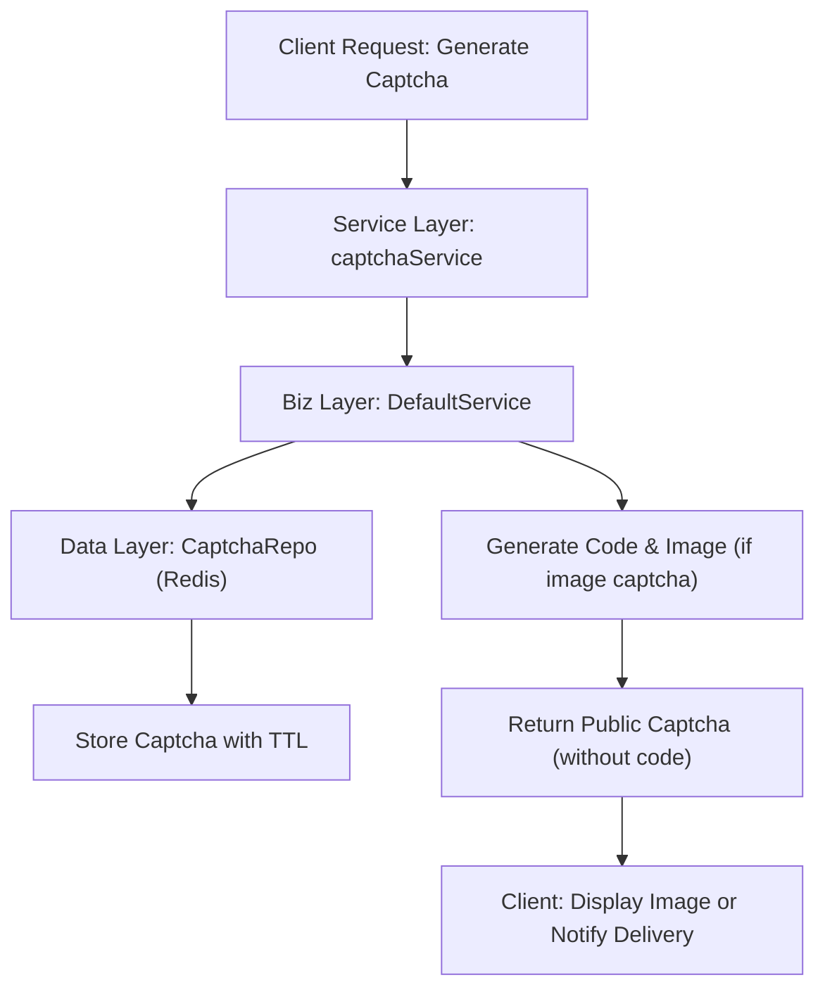
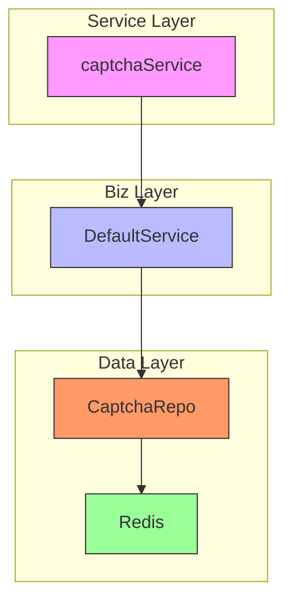
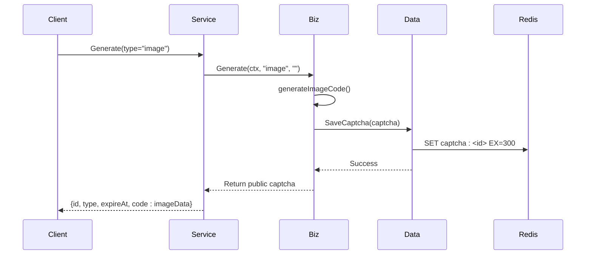
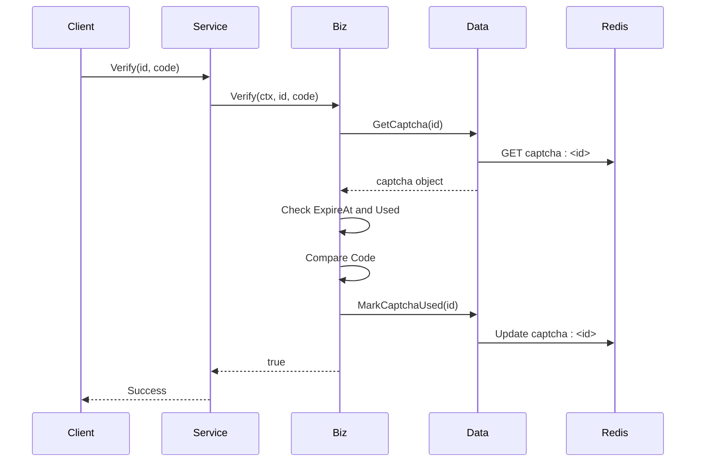

# Captcha Service

<cite>
**Referenced Files in This Document**   
- [internal/pkg/captcha/captcha.go](file://internal/pkg/captcha/captcha.go#L1-L282)
- [internal/biz/auth.go](file://internal/biz/auth.go#L1-L694)
- [internal/data/captcha.go](file://internal/data/captcha.go#L1-L55)
- [internal/service/captcha.go](file://internal/service/captcha.go#L1-L81)
</cite>

## Table of Contents
1. [Introduction](#introduction)
2. [Captcha Service Overview](#captcha-service-overview)
3. [Architecture and Layer Interaction](#architecture-and-layer-interaction)
4. [Captcha Generation and Verification Flow](#captcha-generation-and-verification-flow)
5. [Implementation Details](#implementation-details)
6. [Security Considerations](#security-considerations)
7. [Common Issues and Troubleshooting](#common-issues-and-troubleshooting)
8. [Conclusion](#conclusion)

## Introduction
The Captcha Service in the kratos-boilerplate project provides a secure and extensible mechanism for generating and verifying image, SMS, and email-based captchas. It is designed to prevent automated abuse of authentication endpoints such as registration and login. This document details the implementation, architecture, and integration of the captcha system across service, biz, and data layers.

**Section sources**
- [internal/pkg/captcha/captcha.go](file://internal/pkg/captcha/captcha.go#L1-L282)
- [internal/biz/auth.go](file://internal/biz/auth.go#L1-L694)

## Captcha Service Overview
The captcha service supports three types of captchas:
- **Image captcha**: Visual challenge-response test
- **SMS captcha**: One-time code sent via SMS
- **Email captcha**: One-time code sent via email

Each captcha has a unique ID, a code value, an expiration time (default 5 minutes), and a usage flag to prevent reuse. The service is configurable to enable or disable specific captcha types.



**Diagram sources**
- [internal/pkg/captcha/captcha.go](file://internal/pkg/captcha/captcha.go#L1-L282)
- [internal/data/captcha.go](file://internal/data/captcha.go#L1-L55)

**Section sources**
- [internal/pkg/captcha/captcha.go](file://internal/pkg/captcha/captcha.go#L1-L282)

## Architecture and Layer Interaction
The captcha system follows a clean architecture with separation of concerns across layers:

- **Service Layer**: Exposes captcha functionality via API
- **Biz Layer**: Contains business logic for captcha generation and verification
- **Data Layer**: Handles persistence using Redis



**Diagram sources**
- [internal/service/captcha.go](file://internal/service/captcha.go#L1-L81)
- [internal/pkg/captcha/captcha.go](file://internal/pkg/captcha/captcha.go#L1-L282)
- [internal/data/captcha.go](file://internal/data/captcha.go#L1-L55)

**Section sources**
- [internal/service/captcha.go](file://internal/service/captcha.go#L1-L81)
- [internal/pkg/captcha/captcha.go](file://internal/pkg/captcha/captcha.go#L1-L282)
- [internal/data/captcha.go](file://internal/data/captcha.go#L1-L55)

## Captcha Generation and Verification Flow

### Generation Flow
When a client requests a captcha, the system:
1. Validates the captcha type (image, sms, email)
2. Generates a random code
3. Creates a captcha record with ID, code, type, target, expiration, and used status
4. Stores it in Redis with TTL
5. Returns a public version (without the actual code) to the client



**Diagram sources**
- [internal/pkg/captcha/captcha.go](file://internal/pkg/captcha/captcha.go#L1-L282)
- [internal/data/captcha.go](file://internal/data/captcha.go#L1-L55)

### Verification Flow
When verifying a captcha:
1. Retrieve the captcha by ID from Redis
2. Check if it's already used
3. Check if it's expired
4. Compare the provided code (case-insensitive)
5. Mark as used to prevent reuse
6. Return success or appropriate error



**Diagram sources**
- [internal/pkg/captcha/captcha.go](file://internal/pkg/captcha/captcha.go#L1-L282)
- [internal/data/captcha.go](file://internal/data/captcha.go#L1-L55)

**Section sources**
- [internal/pkg/captcha/captcha.go](file://internal/pkg/captcha/captcha.go#L1-L282)

## Implementation Details

### Code Generation
The system uses cryptographically secure random number generation for captcha IDs and pseudo-random generation for codes:

- **Captcha ID**: 32-character random string using base64.URLEncoding
- **Code**: 6-digit numeric for SMS/email, alphanumeric for image
- **Image Data**: Base64-encoded placeholder (in mock implementation)

### Storage
Captcha data is stored in Redis with:
- Key: `captcha:<id>`
- Value: Serialized captcha object
- TTL: Set to match `ExpireAt` duration

```go
func (r *captchaRepo) SaveCaptcha(ctx context.Context, captcha *biz.Captcha) error {
    key := "captcha:" + captcha.ID
    return r.data.redis.Set(ctx, key, captcha, time.Until(captcha.ExpireAt)).Err()
}
```

**Section sources**
- [internal/data/captcha.go](file://internal/data/captcha.go#L1-L55)

### Configuration
The captcha service supports configuration via the `Config` struct:
- Enable/disable SMS, email, image captchas
- Set expiration time
- Configure SMS/email providers (incomplete in current implementation)

```go
type Config struct {
    EnableSMS   bool
    EnableEmail bool
    EnableImage bool
    Expiration  time.Duration
    SMSProvider string
    EmailSMTP   string
    // ... other fields
}
```

**Section sources**
- [internal/pkg/captcha/captcha.go](file://internal/pkg/captcha/captcha.go#L1-L282)

## Security Considerations

### Brute-Force Protection
- Captchas expire after 5 minutes by default
- Each captcha can only be used once
- Case-insensitive code comparison prevents simple guessing
- Random codes use secure entropy sources where possible

### Reuse Prevention
The `Used` flag ensures one-time use:
```go
if captcha.Used {
    return false, fmt.Errorf("验证码已使用")
}
```

### Storage Security
- Captchas stored in Redis with automatic expiration
- No persistent database storage
- In-memory only after retrieval

### Integration with Auth
The auth usecase integrates captcha verification:
```go
if uc.config.CaptchaEnabled {
    valid, err := uc.captchaService.Verify(ctx, captchaID, captchaCode)
    if !valid {
        return ErrCaptchaInvalid
    }
}
```

**Section sources**
- [internal/pkg/captcha/captcha.go](file://internal/pkg/captcha/captcha.go#L1-L282)
- [internal/biz/auth.go](file://internal/biz/auth.go#L1-L694)

## Common Issues and Troubleshooting

### Captcha Expiration
**Issue**: Captcha expires before user submits
- **Solution**: Ensure client displays expiration timer
- Consider increasing `Expiration` in config

### Delivery Failures
**Issue**: SMS/email not delivered
- **Solution**: Implement real SMS/email providers
- Add retry logic and delivery status tracking

### Accessibility Concerns
**Issue**: Image captcha not accessible
- **Solution**: Provide audio alternative
- Support multiple captcha types (email as fallback)

### Testing and Mocking
The current implementation uses mock logging and simulated delivery:
```go
s.log.Infof("【模拟发送短信】目标: %s, 验证码: %s", phone, code)
```
Replace with actual providers in production.

**Section sources**
- [internal/pkg/captcha/captcha.go](file://internal/pkg/captcha/captcha.go#L1-L282)

## Conclusion
The captcha service in kratos-boilerplate provides a modular, secure foundation for preventing automated abuse. Its layered architecture enables easy extension and testing. While currently using mock implementations for delivery, it is designed to integrate with real SMS and email services. Key strengths include one-time use enforcement, configurable expiration, and clean separation of concerns.