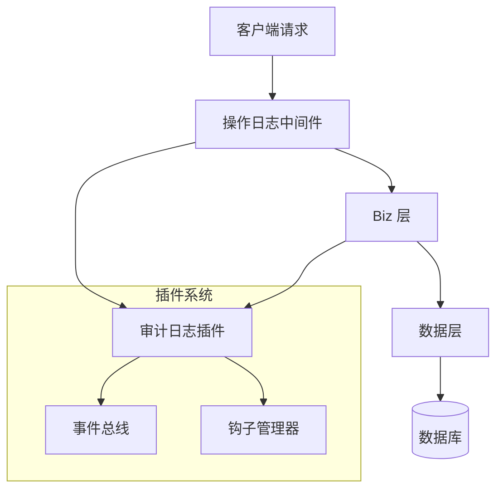
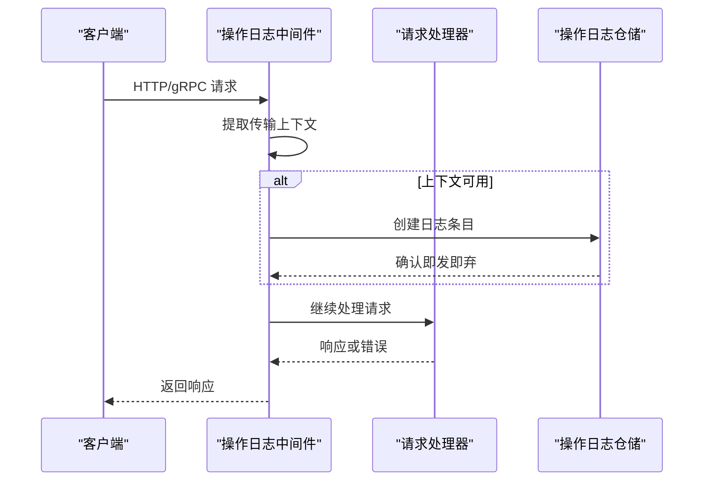
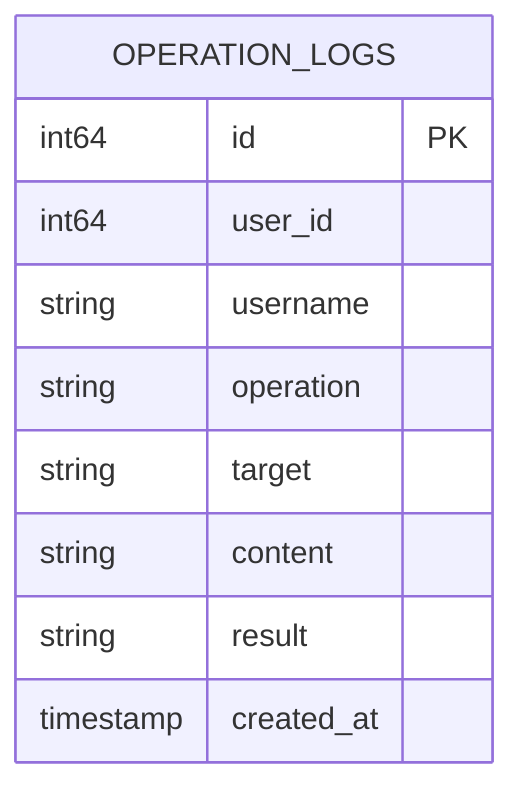
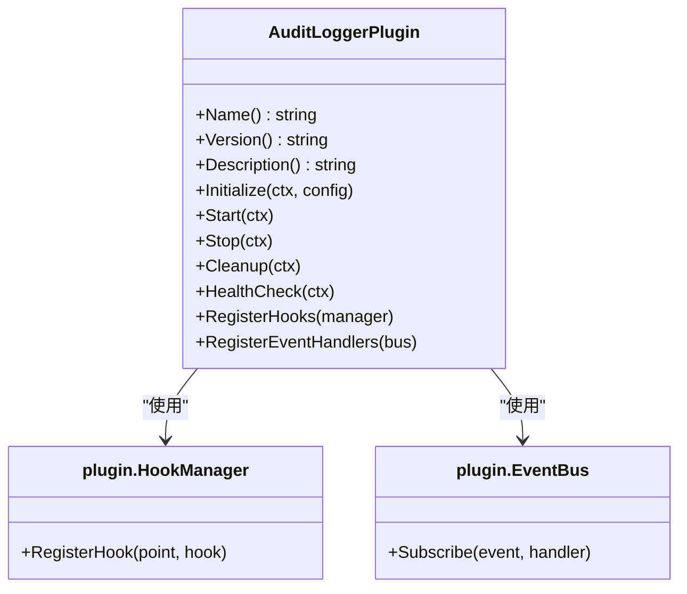

# 操作日志

<cite>
**本文档引用的文件**   
- [operation_log.go](file://internal/middleware/operation_log.go#L1-L37) - *在最近提交中更新*
- [operation_log.go](file://internal/biz/operation_log.go#L1-L23) - *在最近提交中更新*
- [operation_log.go](file://internal/data/operation_log.go#L1-L49) - *在最近提交中更新*
- [audit_logger.go](file://plugins/audit_logger.go#L1-L131)
- [audit_logger.yaml](file://configs/plugins/audit_logger.yaml#L1-L13)
- [operation_log_test.go](file://internal/middleware/operation_log_test.go#L1-L201)
</cite>

## 更新摘要
**已做更改**   
- 根据代码变更更新了中间件、业务和数据层的操作日志实现细节
- 修正了操作日志结构字段与实际代码的一致性
- 更新了日志创建流程以匹配最新实现
- 增强了源码追踪信息，准确反映各部分代码来源

## 目录
1. [简介](#简介)
2. [项目结构](#项目结构)
3. [核心组件](#核心组件)
4. [架构概述](#架构概述)
5. [详细组件分析](#详细组件分析)
6. [插件系统集成](#插件系统集成)
7. [配置管理](#配置管理)
8. [日志条目示例](#日志条目示例)
9. [性能与存储考量](#性能与存储考量)
10. [故障排除指南](#故障排除指南)

## 简介
kratos-boilerplate 中的操作日志系统提供了全面的审计能力，用于跟踪用户行为、API 调用和系统事件。本文档详细说明了跨多个层级（中间件、业务逻辑（biz）和数据访问（data））的日志记录机制实现，并解释了日志如何被丰富、存储和查询。还涵盖了通过审计日志插件与插件架构的集成以及通过 YAML 文件进行配置。该系统旨在支持合规性、安全监控和运维调试。

## 项目结构
操作日志功能分布在 kratos-boilerplate 项目的几个目录中：
- `internal/middleware/operation_log.go`：实现拦截请求并启动日志创建的中间件。
- `internal/biz/operation_log.go`：定义操作日志的领域模型和接口。
- `internal/data/operation_log.go`：使用 SQL 查询处理持久化逻辑。
- `plugins/audit_logger.go`：实现可插拔的审计日志模块。
- `configs/plugins/audit_logger.yaml`：审计日志设置的配置文件。

这种分层结构遵循清洁架构模式，确保传输、业务逻辑和数据层之间的关注点分离。

**本节来源**
- [operation_log.go](file://internal/middleware/operation_log.go#L1-L37) - *在最近提交中更新*
- [operation_log.go](file://internal/biz/operation_log.go#L1-L23) - *在最近提交中更新*
- [operation_log.go](file://internal/data/operation_log.go#L1-L49) - *在最近提交中更新*

## 核心组件

### 操作日志数据结构
`OperationLog` 结构体在 biz 层定义了核心审计日志模型及其六个基本要素：

```go
type OperationLog struct {
	ID        int64     `json:"id"`
	UserID    int64     `json:"user_id"` // 用户标识
	Username  string    `json:"username"`
	Operation string    `json:"operation"` // 操作类型
	Target    string    `json:"target"`    // 操作对象
	Content   string    `json:"content"`   // 操作内容
	Result    string    `json:"result"`    // 操作结果
	CreatedAt time.Time `json:"created_at"` // 操作时间
}
```

这些字段捕获了谁执行了操作（`UserID`, `Username`），做了什么（`Operation`, `Target`, `Content`），结果如何（`Result`），以及发生时间（`CreatedAt`）。

### 仓储接口
`OperationLogRepo` 接口抽象了数据操作：

```go
type OperationLogRepo interface {
	CreateLog(ctx context.Context, log *OperationLog) error
	ListLogs(ctx context.Context, userID int64, startTime, endTime time.Time) ([]*OperationLog, error)
}
```

此契约在数据层实现并在 biz 层消费。

**本节来源**
- [operation_log.go](file://internal/biz/operation_log.go#L1-L23) - *在最近提交中更新*

## 架构概述



**图表来源**
- [operation_log.go](file://internal/middleware/operation_log.go#L1-L37) - *在最近提交中更新*
- [audit_logger.go](file://plugins/audit_logger.go#L1-L131)

## 详细组件分析

### 中间件层实现

`OperationLogMiddleware` 捕获传入请求并生成基本日志条目：

```go
func OperationLogMiddleware(repo OperationLogRepo) middleware.Middleware {
	return func(handler middleware.Handler) middleware.Handler {
		return func(ctx context.Context, req interface{}) (reply interface{}, err error) {
			if tr, ok := transport.FromServerContext(ctx); ok {
				// 记录操作日志
				log := &OperationLog{
					Path:   tr.Operation(),
					Method: tr.Kind().String(),
				}
				_ = repo.Create(ctx, log) // 异步记录日志，忽略错误
			}
			return handler(ctx, req)
		}
	}
}
```

它从传输上下文中提取请求路径和方法，并异步写入日志，确保日志记录失败不会中断主请求流。

#### 请求流程序列



**图表来源**
- [operation_log.go](file://internal/middleware/operation_log.go#L1-L37) - *在最近提交中更新*
- [operation_log_test.go](file://internal/middleware/operation_log_test.go#L1-L201)

**本节来源**
- [operation_log.go](file://internal/middleware/operation_log.go#L1-L37) - *在最近提交中更新*
- [operation_log_test.go](file://internal/middleware/operation_log_test.go#L1-L201)

### 数据层持久化

`operationLogRepo` 结构体使用原始 SQL 实现数据库操作：

```go
func (r *operationLogRepo) CreateLog(ctx context.Context, log *biz.OperationLog) error {
	query := `INSERT INTO operation_logs (user_id, username, operation, target, content, result, created_at) VALUES ($1, $2, $3, $4, $5, $6, $7)`
	_, err := r.data.db.ExecContext(ctx, query, log.UserID, log.Username, log.Operation, log.Target, log.Content, log.Result, time.Now())
	return err
}
```

日志插入到 `operation_logs` 表中，时间戳自动设置为当前时间。



**图表来源**
- [operation_log.go](file://internal/data/operation_log.go#L1-L49) - *在最近提交中更新*

**本节来源**
- [operation_log.go](file://internal/data/operation_log.go#L1-L49) - *在最近提交中更新*

## 插件系统集成

`AuditLoggerPlugin` 通过事件驱动的审计功能增强核心日志系统。

### 插件结构

```go
type AuditLoggerPlugin struct {
	name    string
	config  plugin.PluginConfig
	started bool
}
```

它实现了完整的插件生命周期：初始化、启动、停止、清理和健康检查。

### 事件与钩子注册

该插件同时注册钩子和事件处理器：

```go
func (p *AuditLoggerPlugin) RegisterHooks(manager plugin.HookManager) error {
	// 注册请求前置钩子
	requestHook := plugin.NewBaseHook(
		"audit_logger_pre_request",
		5, // 高优先级
		3*time.Second,
		func(ctx context.Context, data plugin.HookData) error {
			fmt.Println("AuditLoggerPlugin: Pre-request hook executed")
			// 在这里可以记录请求开始时间、用户信息等
			return nil
		},
	)

	if err := manager.RegisterHook(plugin.HookPointBeforeRequest, requestHook); err != nil {
		return err
	}

	// 注册请求后置钩子
	responseHook := plugin.NewBaseHook(
		"audit_logger_post_request",
		15, // 较低优先级
		3*time.Second,
		func(ctx context.Context, data plugin.HookData) error {
			fmt.Println("AuditLoggerPlugin: Post-request hook executed")
			// 在这里可以记录请求完成时间、响应状态等
			return nil
		},
	)

	return manager.RegisterHook(plugin.HookPointAfterRequest, responseHook)
}

func (p *AuditLoggerPlugin) RegisterEventHandlers(bus plugin.EventBus) error {
	// 注册多种事件处理器
	events := []plugin.EventType{
		plugin.EventUserLogin,
		plugin.EventUserLogout,
		plugin.EventDataCreated,
		plugin.EventDataUpdated,
		plugin.EventDataDeleted,
		plugin.EventPluginLoaded,
		plugin.EventPluginStarted,
	}

	eventHandler := plugin.NewBaseEventHandler(
		"audit_logger_event_handler",
		events,
		15*time.Second,
		func(ctx context.Context, event plugin.Event) error {
			fmt.Printf("AuditLoggerPlugin: Event %s received: %+v\n", event.GetType(), event.GetData())
			// 在这里可以记录详细的审计日志
			return nil
		},
	)

	return bus.Subscribe(plugin.EventUserLogin, eventHandler)
}
```

这使得插件能够在请求前后捕获详细上下文，并响应特定系统事件。



**图表来源**
- [audit_logger.go](file://plugins/audit_logger.go#L1-L131)

**本节来源**
- [audit_logger.go](file://plugins/audit_logger.go#L1-L131)

## 配置管理

`audit_logger.yaml` 文件控制插件行为：

```yaml
enabled: true
priority: 20
timeout: 30s
retry_count: 3
settings:
  log_level: "info"
  output_format: "json"
  max_log_size: "100MB"
  retention_days: 30
  sensitive_data_masking: true
metadata:
  category: "logging"
  author: "system"
  version: "1.0.0"
```

关键配置选项：
- **enabled**: 切换插件激活状态
- **priority**: 决定插件间的执行顺序
- **timeout**: 每个钩子的最大执行时间
- **settings.log_level**: 控制详细程度
- **output_format**: 指定 JSON 格式的结构化日志
- **sensitive_data_masking**: 启用敏感信息脱敏

**本节来源**
- [audit_logger.yaml](file://configs/plugins/audit_logger.yaml#L1-L13)

## 日志条目示例

### 成功登录尝试
```json
{
  "user_id": 1001,
  "username": "alice",
  "operation": "login",
  "target": "auth_service",
  "content": "通过密码认证登录",
  "result": "success",
  "created_at": "2023-10-05T08:30:00Z"
}
```

### 失败登录尝试
```json
{
  "user_id": 1001,
  "username": "alice",
  "operation": "login",
  "target": "auth_service",
  "content": "提供了无效密码",
  "result": "failed",
  "created_at": "2023-10-05T08:31:22Z"
}
```

### 用户资料更新
```json
{
  "user_id": 1001,
  "username": "alice",
  "operation": "update",
  "target": "user_profile",
  "content": "将邮箱从 alice@old.com 更改为 alice@new.com",
  "result": "success",
  "created_at": "2023-10-05T09:15:44Z"
}
```

## 性能与存储考量

### 性能优化
- **异步日志记录**：中间件使用即发即弃语义（`_ = repo.Create(...)`）避免阻塞请求处理。
- **批处理**：未来增强功能可实施日志批处理以减少数据库往返次数。
- **索引**：数据库应在 `user_id` 和 `created_at` 上建立索引以实现高效查询。

### 存储策略
- **保留策略**：通过 `retention_days: 30` 配置，启用旧日志的自动清理。
- **大小管理**：`max_log_size: "100MB"` 有助于防止无限制增长。
- **分区**：考虑大规模部署的时间基础表分区。

### 查询能力
`ListLogs` 方法支持时间范围查询：
```go
ListLogs(ctx, userID, startTime, endTime)
```
这使得能够为合规报告和安全调查生成审计轨迹。

**本节来源**
- [operation_log.go](file://internal/data/operation_log.go#L1-L49) - *在最近提交中更新*

## 故障排除指南

### 缺失日志
**症状**：尽管有用户活动，但没有出现审计日志。

**检查清单**：
1. 验证 `audit_logger.yaml` 是否设置了 `enabled: true`
2. 确认插件在应用程序启动序列中已加载
3. 检查是否在服务器管道中注册了 `OperationLogMiddleware`
4. 验证数据库连接性和表存在性（`operation_logs`）

### 性能瓶颈
**症状**：当日志记录处于活动状态时，API 延迟增加。

**解决方案**：
1. 确保日志异步写入（当前实现已经如此）
2. 监控数据库性能；在频繁查询的字段上添加索引
3. 考虑将日志记录卸载到消息队列（如 Kafka）以应对高流量系统
4. 查看配置中的 `timeout` 设置以防止挂起的钩子

### 配置问题
**常见问题**：
- 不正确的 `priority` 值导致钩子执行顺序问题
- 过高的 `retry_count` 导致级联故障
- 错误配置的 `output_format` 破坏日志聚合工具

始终在部署前于预生产环境中验证配置更改。

**本节来源**
- [audit_logger.yaml](file://configs/plugins/audit_logger.yaml#L1-L13)
- [operation_log.go](file://internal/middleware/operation_log.go#L1-L37) - *在最近提交中更新*
- [operation_log.go](file://internal/data/operation_log.go#L1-L49) - *在最近提交中更新*