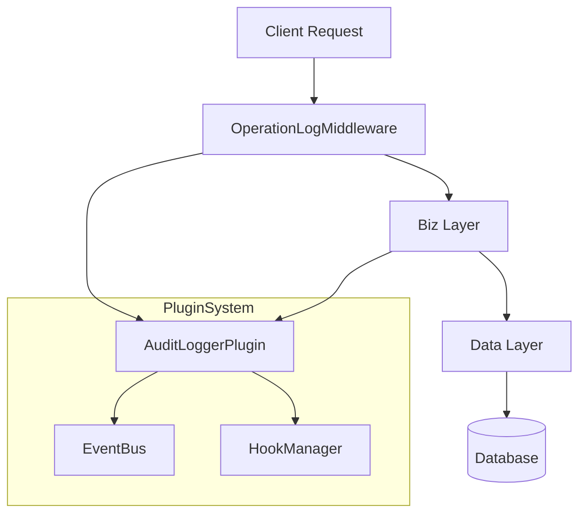
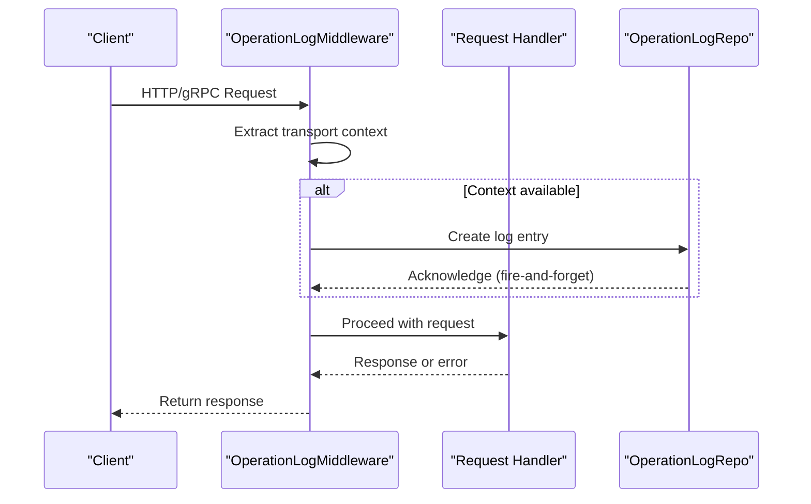
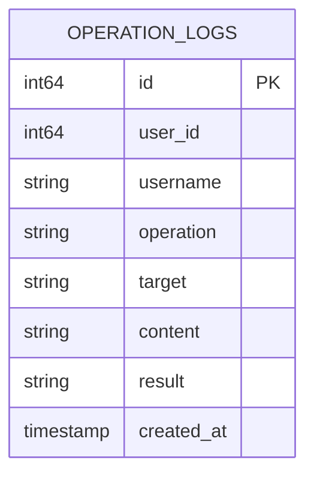
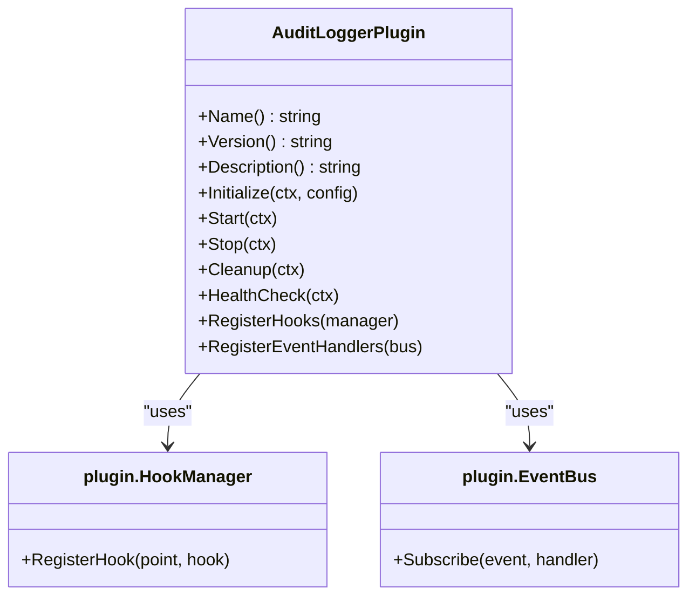

# Operation Logging

<cite>
**Referenced Files in This Document**   
- [operation_log.go](file://internal/middleware/operation_log.go#L1-L37)
- [operation_log.go](file://internal/biz/operation_log.go#L1-L23)
- [operation_log.go](file://internal/data/operation_log.go#L1-L49)
- [audit_logger.go](file://plugins/audit_logger.go#L1-L131)
- [audit_logger.yaml](file://configs/plugins/audit_logger.yaml#L1-L13)
- [operation_log_test.go](file://internal/middleware/operation_log_test.go#L1-L201)
</cite>

## Table of Contents
1. [Introduction](#introduction)
2. [Project Structure](#project-structure)
3. [Core Components](#core-components)
4. [Architecture Overview](#architecture-overview)
5. [Detailed Component Analysis](#detailed-component-analysis)
6. [Integration with Plugin System](#integration-with-plugin-system)
7. [Configuration Management](#configuration-management)
8. [Log Entry Examples](#log-entry-examples)
9. [Performance and Storage Considerations](#performance-and-storage-considerations)
10. [Troubleshooting Guide](#troubleshooting-guide)

## Introduction
The Operation Logging system in kratos-boilerplate provides comprehensive audit capabilities for tracking user actions, API calls, and system events. This document details the implementation of the logging mechanism across multiple layers—middleware, business logic (biz), and data access (data)—and explains how logs are enriched, stored, and queried. It also covers integration with the plugin architecture via the Audit Logger plugin and configuration through YAML files. The system is designed to support compliance, security monitoring, and operational debugging.

## Project Structure
The operation logging functionality is distributed across several directories in the kratos-boilerplate project:
- `internal/middleware/operation_log.go`: Implements the middleware that intercepts requests and initiates log creation.
- `internal/biz/operation_log.go`: Defines the domain model and interface for operation logs.
- `internal/data/operation_log.go`: Handles persistence logic using SQL queries.
- `plugins/audit_logger.go`: Implements a pluggable audit logging module.
- `configs/plugins/audit_logger.yaml`: Configuration file for audit logger settings.

This layered structure follows the Clean Architecture pattern, ensuring separation of concerns between transport, business logic, and data layers.

**Section sources**
- [operation_log.go](file://internal/middleware/operation_log.go#L1-L37)
- [operation_log.go](file://internal/biz/operation_log.go#L1-L23)
- [operation_log.go](file://internal/data/operation_log.go#L1-L49)

## Core Components

### Operation Log Data Structure
The `OperationLog` struct in the biz layer defines the core audit log model with six essential elements:

```go
type OperationLog struct {
	ID        int64     `json:"id"`
	UserID    int64     `json:"user_id"`
	Username  string    `json:"username"`
	Operation string    `json:"operation"`
	Target    string    `json:"target"`
	Content   string    `json:"content"`
	Result    string    `json:"result"`
	CreatedAt time.Time `json:"created_at"`
}
```

These fields capture who performed an action (`UserID`, `Username`), what was done (`Operation`, `Target`, `Content`), the outcome (`Result`), and when it occurred (`CreatedAt`).

### Repository Interface
The `OperationLogRepo` interface abstracts data operations:

```go
type OperationLogRepo interface {
	CreateLog(ctx context.Context, log *OperationLog) error
	ListLogs(ctx context.Context, userID int64, startTime, endTime time.Time) ([]*OperationLog, error)
}
```

This contract is implemented in the data layer and consumed by the biz layer.

**Section sources**
- [operation_log.go](file://internal/biz/operation_log.go#L1-L23)

## Architecture Overview



**Diagram sources**
- [operation_log.go](file://internal/middleware/operation_log.go#L1-L37)
- [audit_logger.go](file://plugins/audit_logger.go#L1-L131)

## Detailed Component Analysis

### Middleware Layer Implementation

The `OperationLogMiddleware` captures incoming requests and generates basic log entries:

```go
func OperationLogMiddleware(repo OperationLogRepo) middleware.Middleware {
	return func(handler middleware.Handler) middleware.Handler {
		return func(ctx context.Context, req interface{}) (reply interface{}, err error) {
			if tr, ok := transport.FromServerContext(ctx); ok {
				log := &OperationLog{
					Path:   tr.Operation(),
					Method: tr.Kind().String(),
				}
				_ = repo.Create(ctx, log)
			}
			return handler(ctx, req)
		}
	}
}
```

It extracts the request path and method from the transport context and asynchronously writes the log, ensuring that logging failures do not disrupt the main request flow.

#### Request Flow Sequence



**Diagram sources**
- [operation_log.go](file://internal/middleware/operation_log.go#L1-L37)
- [operation_log_test.go](file://internal/middleware/operation_log_test.go#L1-L201)

**Section sources**
- [operation_log.go](file://internal/middleware/operation_log.go#L1-L37)
- [operation_log_test.go](file://internal/middleware/operation_log_test.go#L1-L201)

### Data Layer Persistence

The `operationLogRepo` struct implements database operations using raw SQL:

```go
func (r *operationLogRepo) CreateLog(ctx context.Context, log *biz.OperationLog) error {
	query := `INSERT INTO operation_logs (user_id, username, operation, target, content, result, created_at) VALUES ($1, $2, $3, $4, $5, $6, $7)`
	_, err := r.data.db.ExecContext(ctx, query, log.UserID, log.Username, log.Operation, log.Target, log.Content, log.Result, time.Now())
	return err
}
```

Logs are inserted into the `operation_logs` table with timestamps automatically set to the current time.



**Diagram sources**
- [operation_log.go](file://internal/data/operation_log.go#L1-L49)

**Section sources**
- [operation_log.go](file://internal/data/operation_log.go#L1-L49)

## Integration with Plugin System

The `AuditLoggerPlugin` enhances the core logging system with event-driven auditing capabilities.

### Plugin Structure

```go
type AuditLoggerPlugin struct {
	name    string
	config  plugin.PluginConfig
	started bool
}
```

It implements the full plugin lifecycle: Initialize, Start, Stop, Cleanup, and HealthCheck.

### Event and Hook Registration

The plugin registers both hooks and event handlers:

```go
func (p *AuditLoggerPlugin) RegisterHooks(manager plugin.HookManager) error {
	// Pre-request hook
	requestHook := plugin.NewBaseHook("audit_logger_pre_request", 5, 3*time.Second, preRequestHandler)
	manager.RegisterHook(plugin.HookPointBeforeRequest, requestHook)

	// Post-request hook
	responseHook := plugin.NewBaseHook("audit_logger_post_request", 15, 3*time.Second, postRequestHandler)
	return manager.RegisterHook(plugin.HookPointAfterRequest, responseHook)
}

func (p *AuditLoggerPlugin) RegisterEventHandlers(bus plugin.EventBus) error {
	events := []plugin.EventType{
		plugin.EventUserLogin,
		plugin.EventUserLogout,
		// ... other events
	}
	handler := plugin.NewBaseEventHandler("audit_logger_event_handler", events, 15*time.Second, eventHandler)
	return bus.Subscribe(plugin.EventUserLogin, handler)
}
```

This allows the plugin to capture detailed context before and after requests and respond to specific system events.



**Diagram sources**
- [audit_logger.go](file://plugins/audit_logger.go#L1-L131)

**Section sources**
- [audit_logger.go](file://plugins/audit_logger.go#L1-L131)

## Configuration Management

The `audit_logger.yaml` file controls plugin behavior:

```yaml
enabled: true
priority: 20
timeout: 30s
retry_count: 3
settings:
  log_level: "info"
  output_format: "json"
  max_log_size: "100MB"
  retention_days: 30
  sensitive_data_masking: true
metadata:
  category: "logging"
  author: "system"
  version: "1.0.0"
```

Key configuration options:
- **enabled**: Toggles plugin activation
- **priority**: Determines execution order among plugins
- **timeout**: Maximum execution time per hook
- **settings.log_level**: Controls verbosity
- **output_format**: Specifies JSON format for structured logging
- **sensitive_data_masking**: Enables redaction of sensitive information

**Section sources**
- [audit_logger.yaml](file://configs/plugins/audit_logger.yaml#L1-L13)

## Log Entry Examples

### Successful Login Attempt
```json
{
  "user_id": 1001,
  "username": "alice",
  "operation": "login",
  "target": "auth_service",
  "content": "Login via password authentication",
  "result": "success",
  "created_at": "2023-10-05T08:30:00Z"
}
```

### Failed Login Attempt
```json
{
  "user_id": 1001,
  "username": "alice",
  "operation": "login",
  "target": "auth_service",
  "content": "Invalid password provided",
  "result": "failed",
  "created_at": "2023-10-05T08:31:22Z"
}
```

### User Profile Update
```json
{
  "user_id": 1001,
  "username": "alice",
  "operation": "update",
  "target": "user_profile",
  "content": "Changed email from alice@old.com to alice@new.com",
  "result": "success",
  "created_at": "2023-10-05T09:15:44Z"
}
```

## Performance and Storage Considerations

### Performance Optimization
- **Asynchronous Logging**: The middleware uses fire-and-forget semantics (`_ = repo.Create(...)`) to avoid blocking request processing.
- **Batching**: Future enhancements could implement log batching to reduce database round trips.
- **Indexing**: The database should have indexes on `user_id` and `created_at` for efficient querying.

### Storage Strategy
- **Retention Policy**: Configured via `retention_days: 30`, enabling automatic cleanup of old logs.
- **Size Management**: `max_log_size: "100MB"` helps prevent unbounded growth.
- **Partitioning**: Consider time-based table partitioning for large-scale deployments.

### Querying Capabilities
The `ListLogs` method supports time-range queries:
```go
ListLogs(ctx, userID, startTime, endTime)
```
This enables audit trail generation for compliance reporting and security investigations.

**Section sources**
- [operation_log.go](file://internal/data/operation_log.go#L1-L49)

## Troubleshooting Guide

### Missing Logs
**Symptoms**: No audit logs appear despite user activity.

**Checklist**:
1. Verify `audit_logger.yaml` has `enabled: true`
2. Confirm plugin is loaded in the application startup sequence
3. Check if `OperationLogMiddleware` is registered in the server pipeline
4. Validate database connectivity and table existence (`operation_logs`)

### Performance Bottlenecks
**Symptoms**: Increased API latency when logging is active.

**Solutions**:
1. Ensure logs are written asynchronously (current implementation already does this)
2. Monitor database performance; add indexes on frequently queried fields
3. Consider offloading logging to a message queue (e.g., Kafka) for high-volume systems
4. Review `timeout` setting in configuration to prevent hanging hooks

### Configuration Issues
**Common Problems**:
- Incorrect `priority` values causing hook execution order issues
- Excessive `retry_count` leading to cascading failures
- Misconfigured `output_format` breaking log aggregation tools

Always validate configuration changes in a staging environment before deployment.

**Section sources**
- [audit_logger.yaml](file://configs/plugins/audit_logger.yaml#L1-L13)
- [operation_log.go](file://internal/middleware/operation_log.go#L1-L37)
- [operation_log.go](file://internal/data/operation_log.go#L1-L49)