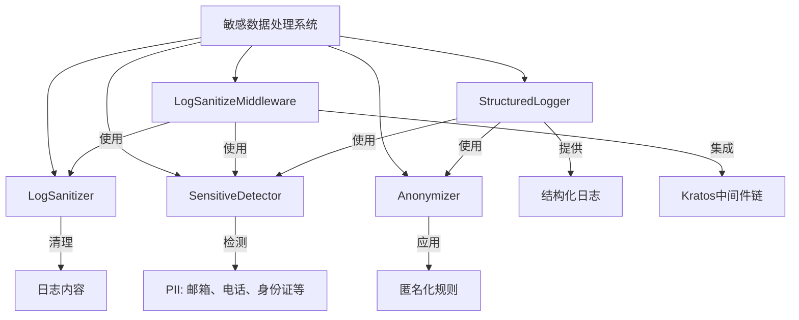
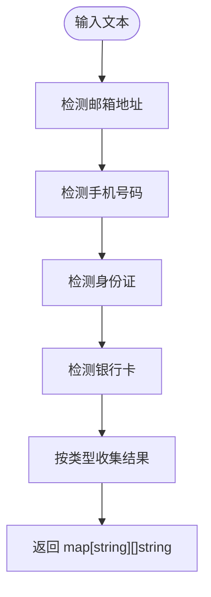
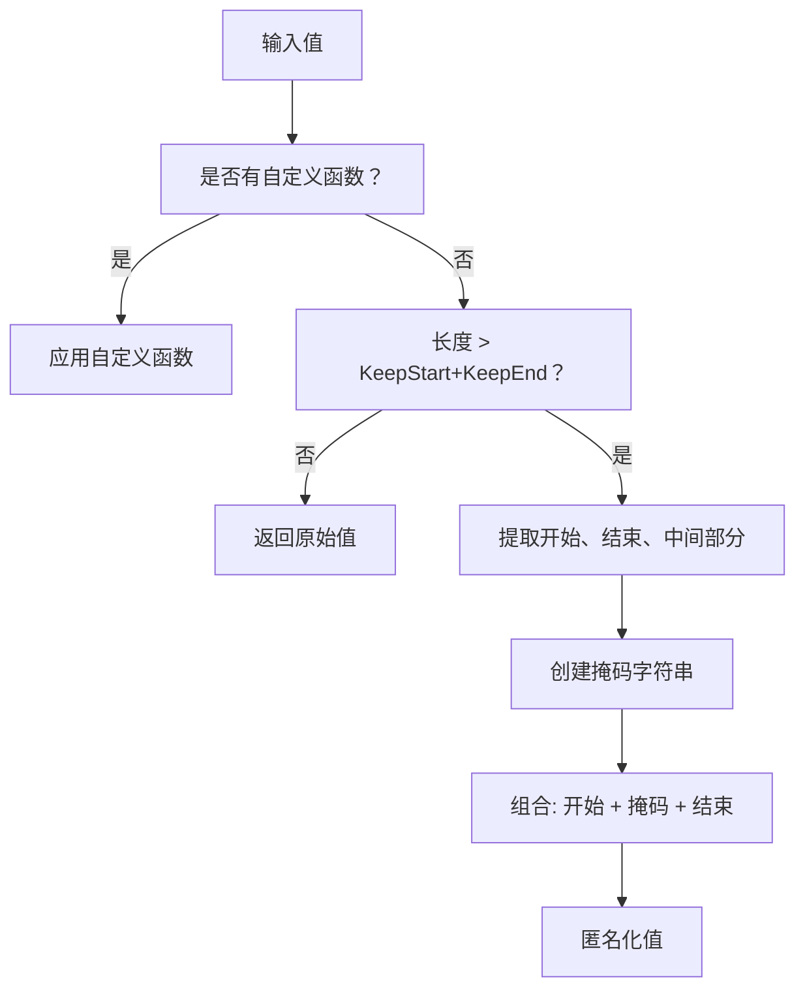
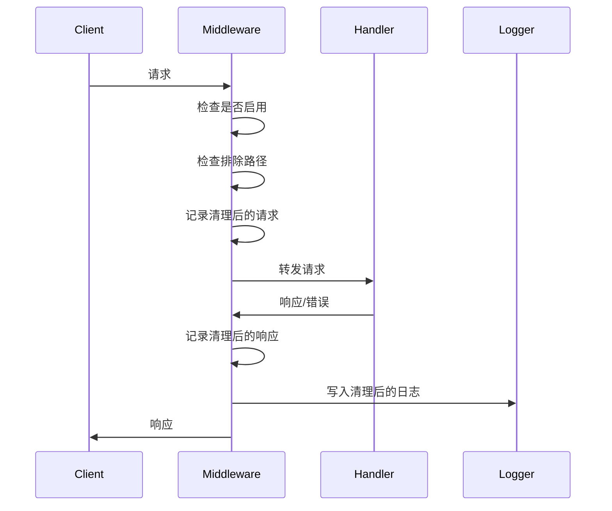
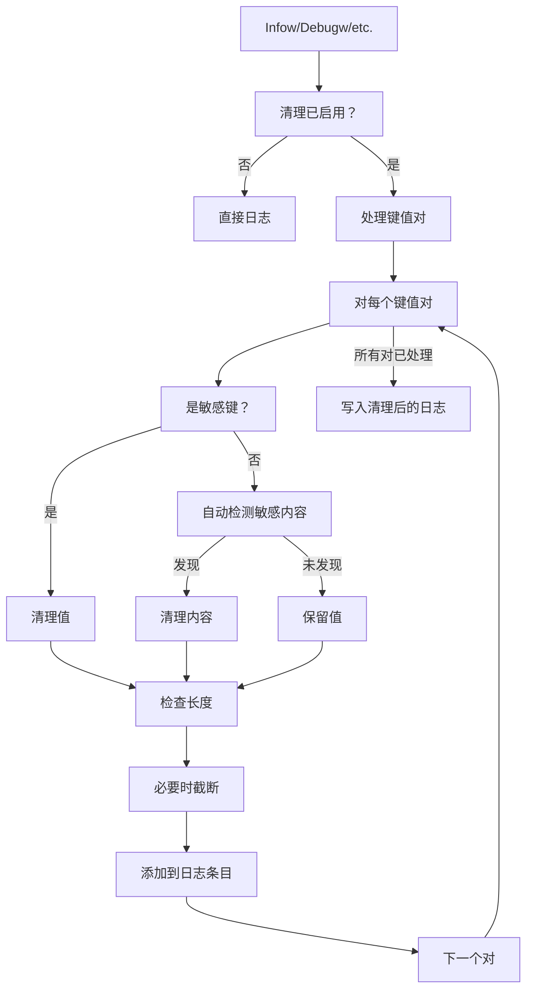

# 敏感数据处理

<cite>
**本文档引用的文件**   
- [anonymizer.go](file://internal/pkg/sensitive/anonymizer.go) - *在最近提交中更新*
- [rules.go](file://internal/pkg/sensitive/rules.go) - *在最近提交中更新*
- [middleware.go](file://internal/pkg/sensitive/middleware.go)
- [structured_logger.go](file://internal/pkg/sensitive/structured_logger.go)
- [interfaces.go](file://internal/pkg/sensitive/interfaces.go)
- [config.yaml](file://configs/config.yaml)
- [features.yaml](file://configs/features.yaml)
</cite>

## 更新摘要
**已做更改**   
- 根据最新代码实现更新了敏感数据检测机制和脱敏规则部分
- 增强了匿名化策略的技术细节描述
- 更新了核心组件架构图以反映实际代码结构
- 添加了对新支持的敏感数据类型（姓名、地址）的说明
- 修正了配置管理部分以匹配当前实现

## 目录
1. [简介](#简介)
2. [核心组件与架构](#核心组件与架构)
3. [敏感数据检测机制](#敏感数据检测机制)
4. [匿名化规则与策略](#匿名化规则与策略)
5. [安全日志中间件集成](#安全日志中间件集成)
6. [结构化日志器实现](#结构化日志器实现)
7. [配置与功能管理](#配置与功能管理)
8. [性能考量](#性能考量)
9. [扩展检测规则](#扩展检测规则)
10. [结论](#结论)

## 简介
kratos-boilerplate中的敏感数据处理系统为个人身份信息(PII)、凭证和其他敏感数据在整个应用生命周期中提供全面保护。本文档详细介绍了自动检测、匿名化和安全日志记录机制，确保符合数据隐私法规的同时保持可调试性。该系统采用模式匹配、正则表达式和可配置规则，在请求、响应、日志和结构化数据中实时识别和清除敏感信息。

## 核心组件与架构
敏感数据处理系统由多个相互连接的组件组成，共同协作以安全地检测、匿名化和记录敏感信息。架构遵循分层方法，在检测、匿名化和日志记录责任之间有明确的关注点分离。



**图表来源**
- [anonymizer.go](file://internal/pkg/sensitive/anonymizer.go#L15-L30)
- [middleware.go](file://internal/pkg/sensitive/middleware.go#L25-L40)
- [structured_logger.go](file://internal/pkg/sensitive/structured_logger.go#L15-L30)

**本节来源**
- [anonymizer.go](file://internal/pkg/sensitive/anonymizer.go#L1-L50)
- [middleware.go](file://internal/pkg/sensitive/middleware.go#L1-L50)
- [structured_logger.go](file://internal/pkg/sensitive/structured_logger.go#L1-L50)

## 敏感数据检测机制
系统实现了强大的检测机制，使用正则表达式和模式匹配自动识别各种类型的敏感信息。`SensitiveDetector`接口定义了检测能力的契约，具体实现`sensitiveDetector`提供了针对不同类型数据的特定模式识别。

### 检测能力
检测器可以识别以下类型的敏感信息：
- 电子邮件地址
- 手机号码
- 身份证号码
- 银行卡号码
- 姓名
- 地址

### 检测实现
检测逻辑在`sensitiveDetector`结构体中实现，使用编译后的正则表达式高效扫描文本内容：

```go
type sensitiveDetector struct {
    emailRegex    *regexp.Regexp
    phoneRegex    *regexp.Regexp
    idCardRegex   *regexp.Regexp
    bankCardRegex *regexp.Regexp
}
```

每个正则表达式都针对其特定数据类型进行了优化：
- 邮箱：`[a-zA-Z0-9._%+-]+@[a-zA-Z0-9.-]+\.[a-zA-Z]{2,}`
- 手机：`1[3-9]\d{9}` (中国手机号码)
- 身份证：`[1-9]\d{5}(18|19|20)\d{2}(0[1-9]|1[0-2])(0[1-9]|[12]\d|3[01])\d{3}[\dXx]`
- 银行卡：`[1-9]\d{11,19}`

`DetectAll`方法扫描输入文本并按类型返回检测到的敏感信息映射：



**图表来源**
- [anonymizer.go](file://internal/pkg/sensitive/anonymizer.go#L350-L380)
- [interfaces.go](file://internal/pkg/sensitive/interfaces.go#L45-L55)

**本节来源**
- [anonymizer.go](file://internal/pkg/sensitive/anonymizer.go#L350-L380)
- [interfaces.go](file://internal/pkg/sensitive/interfaces.go#L45-L55)

## 匿名化规则与策略
系统提供灵活的匿名化规则，定义如何屏蔽或清除敏感数据。这些规则支持标准模式和自定义函数，以满足特殊的匿名化需求。

### 默认匿名化规则
系统包含常见敏感数据类型的预定义规则：

```go
// EmailRule: 保留用户名前缀和域名
CustomFunc: func(email string) string {
    if !isValidEmail(email) {
        return email
    }
    parts := strings.Split(email, "@")
    if len(parts) != 2 {
        return email
    }
    username := parts[0]
    domain := parts[1]
    
    if len(username) <= 2 {
        return email
    }
    
    maskedUsername := username[:2] + strings.Repeat("*", len(username)-2)
    return maskedUsername + "@" + domain
}

// PhoneRule: 掩盖中间数字 (138****8000)
CustomFunc: func(phone string) string {
    if !isValidPhone(phone) {
        return phone
    }
    // 中国手机号格式：138****8000
    if len(phone) == 11 {
        return phone[:3] + "****" + phone[7:]
    }
    // 其他格式使用通用规则
    rule := AnonymizeRule{KeepStart: 3, KeepEnd: 4, MaskChar: "*"}
    return anonymizeWithRule(phone, rule)
}

// IDCardRule: 掩盖中间8位数字 (110101********1234)
CustomFunc: func(idCard string) string {
    if !isValidIDCard(idCard) {
        return idCard
    }
    // 身份证号格式：110101********1234
    if len(idCard) == 18 {
        return idCard[:6] + "********" + idCard[14:]
    }
    rule := AnonymizeRule{KeepStart: 6, KeepEnd: 4, MaskChar: "*"}
    return anonymizeWithRule(idCard, rule)
}
```

### 规则结构
`AnonymizeRule`结构体定义了每个匿名化规则的配置：

```go
type AnonymizeRule struct {
    FieldName  string              // 字段名称标识符
    KeepStart  int                 // 保留开头字符数
    KeepEnd    int                 // 保留结尾字符数
    MaskChar   string              // 掩码字符（默认：*）
    CustomFunc func(string) string // 自定义匿名化函数
}
```

### 匿名化过程
匿名化过程遵循优先级顺序：
1. 如果定义了`CustomFunc`，它具有最高优先级
2. 否则，使用通用的`anonymizeWithRule`函数
3. 函数保留`KeepStart`和`KeepEnd`个字符，用`MaskChar`替换中间部分



**图表来源**
- [rules.go](file://internal/pkg/sensitive/rules.go#L15-L100)
- [anonymizer.go](file://internal/pkg/sensitive/anonymizer.go#L300-L320)

**本节来源**
- [rules.go](file://internal/pkg/sensitive/rules.go#L15-L224)
- [anonymizer.go](file://internal/pkg/sensitive/anonymizer.go#L300-L320)

## 安全日志中间件集成
系统通过中间件组件与Kratos框架集成，该组件在日志记录前自动清理请求和响应数据。这确保了敏感信息永远不会以明文形式写入日志文件。

### LogSanitizeMiddleware 配置
中间件通过`LogSanitizeConfig`结构体进行配置，提供对清理行为的细粒度控制：

```go
type LogSanitizeConfig struct {
    Enabled          bool                     // 启用/禁用清理
    SanitizeRequest  bool                     // 清理请求数据
    SanitizeResponse bool                     // 清理响应数据
    SanitizeHeaders  bool                     // 清理请求头
    CustomRules      map[string]AnonymizeRule // 自定义匿名化规则
    ExcludePaths     []string                 // 从清理中排除的路径
    MaxLogLength     int                      // 最大日志条目长度
}
```

### 请求处理流程
中间件按以下顺序拦截请求和响应：



### 头部清理
特别针对敏感HTTP头部进行清除：

```go
func (m *LogSanitizeMiddleware) isSensitiveHeader(headerName string) bool {
    sensitiveHeaders := []string{
        "authorization",
        "cookie",
        "set-cookie",
        "x-api-key",
        "x-auth-token",
        "password",
        "secret",
        "token",
    }
    // 不区分大小写的部分匹配
    headerLower := strings.ToLower(headerName)
    for _, sensitive := range sensitiveHeaders {
        if strings.Contains(headerLower, sensitive) {
            return true
        }
    }
    return false
}
```

当检测到敏感头部时，其值在日志中被替换为"[REDACTED]"。

**图表来源**
- [middleware.go](file://internal/pkg/sensitive/middleware.go#L50-L100)
- [middleware.go](file://internal/pkg/sensitive/middleware.go#L150-L200)

**本节来源**
- [middleware.go](file://internal/pkg/sensitive/middleware.go#L50-L327)

## 结构化日志器实现
`StructuredLogger`为安全的结构化日志记录提供了综合解决方案，具有自动检测和匿名化敏感数据的功能。

### 配置选项
结构化日志器通过`StructuredLogConfig`高度可配置：

```go
type StructuredLogConfig struct {
    Enabled           bool                     // 启用/禁用日志器
    AutoDetect        bool                     // 启用自动检测
    CustomRules       map[string]AnonymizeRule // 自定义规则
    SensitiveKeys     []string                 // 敏感字段名称
    MaxValueLength    int                      // 最大值长度
    TruncateThreshold int                      // 截断阈值
}
```

### 关键特性
结构化日志器提供几个重要特性：

#### 自动字段检测
日志器基于以下条件自动识别敏感字段：
- 字段名包含敏感关键词（password, token, secret等）
- 字段匹配预定义的敏感键模式
- 字段具有特定的匿名化规则

#### 值截断
为防止过大的日志条目，日志器可以截断值：

```go
func (s *StructuredLogger) truncateIfNeeded(value interface{}) interface{} {
    strValue := fmt.Sprintf("%v", value)
    if len(strValue) > s.config.MaxValueLength {
        if s.config.TruncateThreshold > 0 && len(strValue) > s.config.TruncateThreshold {
            return strValue[:s.config.TruncateThreshold] + "...[truncated]"
        }
        return strValue[:s.config.MaxValueLength] + "..."
    }
    return value
}
```

#### 上下文保留
日志器在添加清理功能的同时保持与现有Kratos日志模式的兼容性：

```go
// 带清理的标准结构化日志方法
func (s *StructuredLogger) Infow(msg string, keysAndValues ...interface{})
func (s *StructuredLogger) Debugw(msg string, keysAndValues ...interface{})
func (s *StructuredLogger) Errorw(msg string, keysAndValues ...interface{})
```



**图表来源**
- [structured_logger.go](file://internal/pkg/sensitive/structured_logger.go#L15-L100)
- [structured_logger.go](file://internal/pkg/sensitive/structured_logger.go#L200-L250)

**本节来源**
- [structured_logger.go](file://internal/pkg/sensitive/structured_logger.go#L1-L388)

## 配置与功能管理
敏感数据处理系统通过配置文件和功能标志进行控制，允许在不同环境中灵活部署。

### 配置文件
系统使用YAML配置文件管理设置：

**config.yaml** 启用插件系统和功能框架：
```yaml
plugins:
  enabled: true
  directory: "./plugins"
  config_directory: "./configs/plugins"
  auto_load: true

features:
  enabled: true
  config_file: "./configs/features.yaml"
  config_format: "yaml"
```

**features.yaml** 包含敏感数据功能标志：
```yaml
sensitive_data:
  enabled: true
  strategy: simple
  rules: {}
  description: "敏感数据处理开关"
  tags: ["data", "security", "privacy"]
```

### 默认配置
中间件和结构化日志器都提供合理的默认值：

```go
func DefaultLogSanitizeConfig() *LogSanitizeConfig {
    return &LogSanitizeConfig{
        Enabled:         true,
        SanitizeRequest: true,
        SanitizeResponse: true,
        SanitizeHeaders:  true,
        CustomRules:      GetDefaultRules(),
        ExcludePaths:     []string{"/health", "/metrics", "/ping"},
        MaxLogLength:     10000,
    }
}

func DefaultStructuredLogConfig() *StructuredLogConfig {
    return &StructuredLogConfig{
        Enabled:           true,
        AutoDetect:        true,
        CustomRules:       GetDefaultRules(),
        SensitiveKeys:     []string{"password", "token", "secret", "key", "auth", "credential"},
        MaxValueLength:    1000,
        TruncateThreshold: 500,
    }
}
```

这些默认值确保敏感数据保护默认启用，同时允许根据需要进行自定义。

**本节来源**
- [config.yaml](file://configs/config.yaml#L25-L35)
- [features.yaml](file://configs/features.yaml#L135-L145)
- [middleware.go](file://internal/pkg/sensitive/middleware.go#L45-L65)
- [structured_logger.go](file://internal/pkg/sensitive/structured_logger.go#L45-L65)

## 性能考量
敏感数据处理系统设计为最小化性能影响，同时提供全面保护。

### 检测效率
检测系统使用编译后的正则表达式实现最佳性能：
- 正则表达式在初始化期间编译一次
- 模式匹配单次通过完成
- 多个模式并发检查

### 内存管理
系统采用多种策略减少内存开销：
- 重用正则表达式匹配器
- 在可能的情况下分块处理数据
- 避免不必要的字符串分配

### 性能权衡
系统通过可配置选项平衡安全性和性能：
- **排除路径**：像/health和/metrics这样的关键端点默认排除
- **选择性清理**：可以单独启用/禁用各个组件（请求、响应、头部）
- **长度限制**：最大日志长度防止通过大负载导致拒绝服务

### 基准测试
实现包括全面测试以确保性能保持可接受：

```go
func TestSensitiveDetector_DetectAll_Performance(t *testing.T) {
    detector := NewSensitiveDetector()
    text := generateLargeText() // 用于性能测试的大文本
    
    start := time.Now()
    result := detector.DetectAll(text)
    duration := time.Since(start)
    
    assert.Less(t, duration.Milliseconds(), int64(100)) // 应在<100ms内完成
    assert.NotNil(t, result)
}
```

这些基准测试确保检测和匿名化过程不会给请求处理引入不可接受的延迟。

## 扩展检测规则
系统提供多种机制来扩展检测规则，以处理自定义的敏感数据类型。

### 自定义规则创建
可以使用`CreateCustomRule`函数创建新规则：

```go
func CreateCustomRule(
    fieldName string, 
    keepStart, keepEnd int, 
    maskChar string, 
    customFunc func(string) string
) AnonymizeRule
```

示例：创建医疗记录号规则
```go
medicalRecordRule := CreateCustomRule(
    "medical_record",
    3, 2, "*",
    func(value string) string {
        if len(value) < 8 {
            return value
        }
        return value[:3] + "****" + value[len(value)-2:]
    },
)
```

### 规则合并
自定义规则可以与默认规则合并：

```go
func MergeRules(rules ...map[string]AnonymizeRule) map[string]AnonymizeRule

// 使用示例
customRules := map[string]AnonymizeRule{
    "medical_record": medicalRecordRule,
    "employee_id": employeeIdRule,
}

allRules := MergeRules(GetDefaultRules(), customRules)
```

### 集成方法
可以通过多种方式集成自定义规则：

#### 1. 中间件配置
```go
config := &LogSanitizeConfig{
    CustomRules: customRules,
    // 其他设置...
}
middleware := NewLogSanitizeMiddleware(config, logger)
```

#### 2. 结构化日志器配置
```go
config := &StructuredLogConfig{
    CustomRules: customRules,
    // 其他设置...
}
logger := NewStructuredLogger(helper, config)
```

#### 3. 动态规则更新
```go
// 运行时更新规则
structuredLogger.UpdateRules(newRules)
```

#### 4. 敏感键扩展
```go
// 添加自定义敏感字段名
structuredLogger.AddSensitiveKey("medical_record")
structuredLogger.AddSensitiveKey("patient_id")
```

这种可扩展性确保系统能够适应组织特定的敏感数据保护要求。

## 结论
kratos-boilerplate中的敏感数据处理系统为保护敏感信息提供了全面、灵活且高性能的解决方案。通过结合自动检测、可配置的匿名化规则以及与日志基础设施的无缝集成，该系统确保PII和凭证永远不会暴露在日志中，同时保持操作支持所需的可调试性。

系统的关键优势包括：
- **全面覆盖**：检测多种敏感数据类型
- **灵活配置**：对清理行为的细粒度控制
- **性能优化**：高效的模式匹配，开销最小
- **可扩展设计**：轻松添加自定义规则和检测模式
- **符合标准**：帮助满足数据保护的监管要求

该系统在安全性和可用性之间取得了有效平衡，提供强大的保护，而不会损害故障排除和监控应用行为的能力。通过利用Kratos中间件框架和结构化日志模式，它无缝集成到现有架构中，同时增加了关键的数据保护功能。