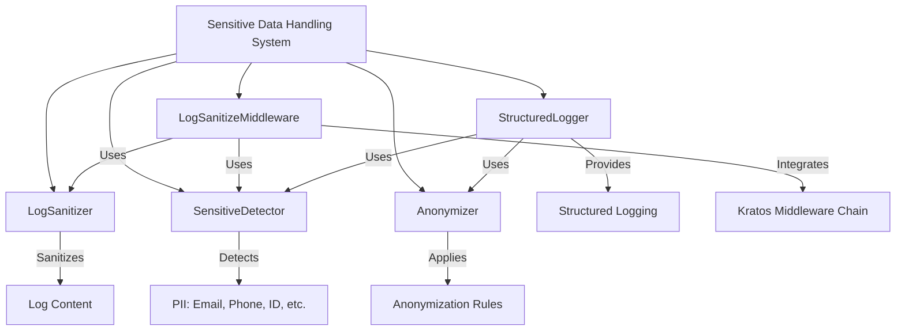
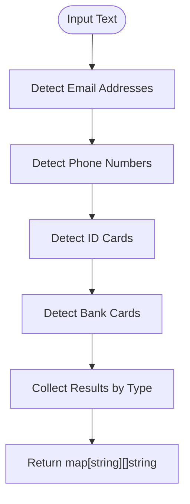
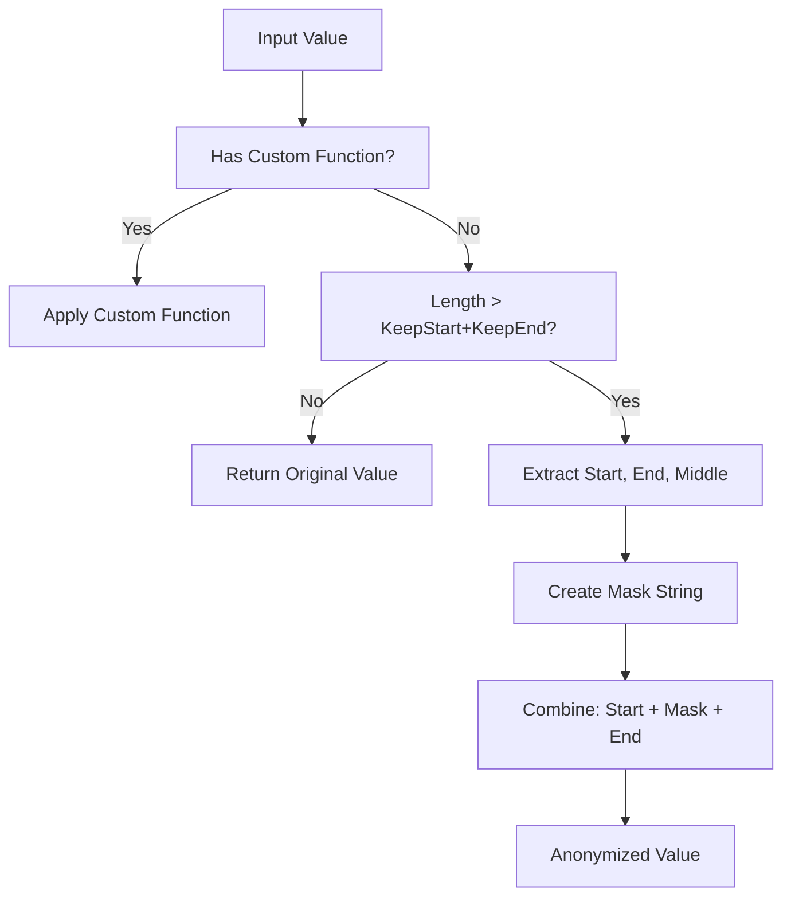
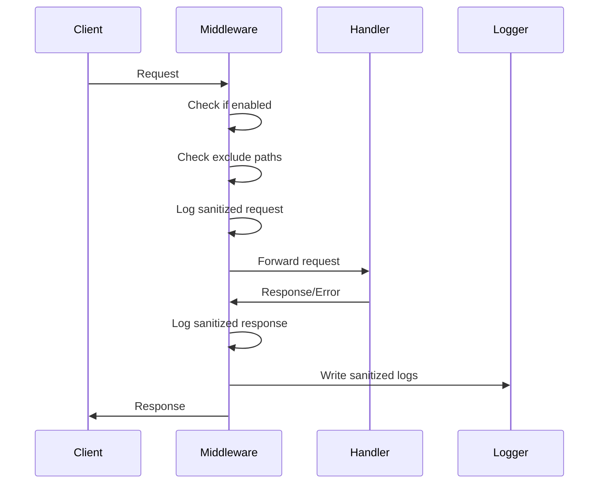
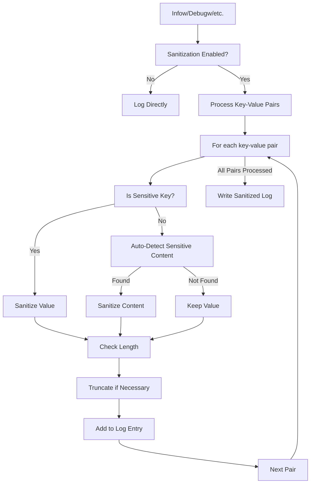

# Sensitive Data Handling

<cite>
**Referenced Files in This Document**   
- [anonymizer.go](file://internal/pkg/sensitive/anonymizer.go)
- [rules.go](file://internal/pkg/sensitive/rules.go)
- [middleware.go](file://internal/pkg/sensitive/middleware.go)
- [structured_logger.go](file://internal/pkg/sensitive/structured_logger.go)
- [interfaces.go](file://internal/pkg/sensitive/interfaces.go)
- [config.yaml](file://configs/config.yaml)
- [features.yaml](file://configs/features.yaml)
</cite>

## Table of Contents
1. [Introduction](#introduction)
2. [Core Components and Architecture](#core-components-and-architecture)
3. [Sensitive Data Detection Mechanism](#sensitive-data-detection-mechanism)
4. [Anonymization Rules and Strategies](#anonymization-rules-and-strategies)
5. [Middleware Integration for Secure Logging](#middleware-integration-for-secure-logging)
6. [Structured Logger Implementation](#structured-logger-implementation)
7. [Configuration and Feature Management](#configuration-and-feature-management)
8. [Performance Considerations](#performance-considerations)
9. [Extending Detection Rules](#extending-detection-rules)
10. [Conclusion](#conclusion)

## Introduction
The Sensitive Data Handling system in kratos-boilerplate provides comprehensive protection for Personally Identifiable Information (PII), credentials, and other sensitive data throughout the application lifecycle. This document details the automatic detection, anonymization, and secure logging mechanisms that ensure compliance with data privacy regulations while maintaining debuggability. The system employs pattern matching, regular expressions, and configurable rules to identify and redact sensitive information in real-time across requests, responses, logs, and structured data.

## Core Components and Architecture
The sensitive data handling system is composed of several interconnected components that work together to detect, anonymize, and log sensitive information securely. The architecture follows a layered approach with clear separation of concerns between detection, anonymization, and logging responsibilities.



**Diagram sources**
- [anonymizer.go](file://internal/pkg/sensitive/anonymizer.go#L15-L30)
- [middleware.go](file://internal/pkg/sensitive/middleware.go#L25-L40)
- [structured_logger.go](file://internal/pkg/sensitive/structured_logger.go#L15-L30)

**Section sources**
- [anonymizer.go](file://internal/pkg/sensitive/anonymizer.go#L1-L50)
- [middleware.go](file://internal/pkg/sensitive/middleware.go#L1-L50)
- [structured_logger.go](file://internal/pkg/sensitive/structured_logger.go#L1-L50)

## Sensitive Data Detection Mechanism
The system implements a robust detection mechanism that automatically identifies various types of sensitive information using regular expressions and pattern matching. The `SensitiveDetector` interface defines the contract for detection capabilities, with the concrete `sensitiveDetector` implementation providing specific pattern recognition for different data types.

### Detection Capabilities
The detector can identify the following sensitive information types:
- Email addresses
- Mobile phone numbers
- Identity card numbers
- Bank card numbers

### Detection Implementation
The detection logic is implemented in the `sensitiveDetector` struct, which uses compiled regular expressions to efficiently scan text content:

```go
type sensitiveDetector struct {
    emailRegex    *regexp.Regexp
    phoneRegex    *regexp.Regexp
    idCardRegex   *regexp.Regexp
    bankCardRegex *regexp.Regexp
}
```

Each regular expression is optimized for its specific data type:
- Email: `[a-zA-Z0-9._%+-]+@[a-zA-Z0-9.-]+\.[a-zA-Z]{2,}`
- Phone: `1[3-9]\d{9}` (Chinese mobile numbers)
- ID Card: `[1-9]\d{5}(18|19|20)\d{2}(0[1-9]|1[0-2])(0[1-9]|[12]\d|3[01])\d{3}[\dXx]`
- Bank Card: `[1-9]\d{11,19}`

The `DetectAll` method scans input text and returns a map of detected sensitive information by type:



**Diagram sources**
- [anonymizer.go](file://internal/pkg/sensitive/anonymizer.go#L350-L380)
- [interfaces.go](file://internal/pkg/sensitive/interfaces.go#L45-L55)

**Section sources**
- [anonymizer.go](file://internal/pkg/sensitive/anonymizer.go#L350-L380)
- [interfaces.go](file://internal/pkg/sensitive/interfaces.go#L45-L55)

## Anonymization Rules and Strategies
The system provides flexible anonymization rules that define how sensitive data should be masked or redacted. These rules support both standard patterns and custom functions for specialized anonymization requirements.

### Default Anonymization Rules
The system includes predefined rules for common sensitive data types:

```go
// EmailRule: preserves username prefix and domain
CustomFunc: func(email string) string {
    parts := strings.Split(email, "@")
    username := parts[0]
    return username[:2] + strings.Repeat("*", len(username)-2) + "@" + parts[1]
}

// PhoneRule: masks middle digits (138****8000)
CustomFunc: func(phone string) string {
    return phone[:3] + "****" + phone[7:]
}

// IDCardRule: masks middle 8 digits (110101********1234)
CustomFunc: func(idCard string) string {
    return idCard[:6] + "********" + idCard[14:]
}
```

### Rule Structure
The `AnonymizeRule` struct defines the configuration for each anonymization rule:

```go
type AnonymizeRule struct {
    FieldName  string              // Field name identifier
    KeepStart  int                 // Number of leading characters to preserve
    KeepEnd    int                 // Number of trailing characters to preserve
    MaskChar   string              // Masking character (default: *)
    CustomFunc func(string) string // Custom anonymization function
}
```

### Anonymization Process
The anonymization process follows a priority order:
1. If a `CustomFunc` is defined, it takes precedence
2. Otherwise, the generic `anonymizeWithRule` function is used
3. The function preserves `KeepStart` and `KeepEnd` characters, replacing the middle portion with `MaskChar`



**Diagram sources**
- [rules.go](file://internal/pkg/sensitive/rules.go#L15-L100)
- [anonymizer.go](file://internal/pkg/sensitive/anonymizer.go#L300-L320)

**Section sources**
- [rules.go](file://internal/pkg/sensitive/rules.go#L15-L224)
- [anonymizer.go](file://internal/pkg/sensitive/anonymizer.go#L300-L320)

## Middleware Integration for Secure Logging
The system integrates with the Kratos framework through a middleware component that automatically sanitizes request and response data before logging. This ensures that sensitive information is never written to log files in plaintext.

### LogSanitizeMiddleware Configuration
The middleware is configured through the `LogSanitizeConfig` struct, which provides granular control over sanitization behavior:

```go
type LogSanitizeConfig struct {
    Enabled          bool                     // Enable/disable sanitization
    SanitizeRequest  bool                     // Sanitize request data
    SanitizeResponse bool                     // Sanitize response data
    SanitizeHeaders  bool                     // Sanitize request headers
    CustomRules      map[string]AnonymizeRule // Custom anonymization rules
    ExcludePaths     []string                 // Paths to exclude from sanitization
    MaxLogLength     int                      // Maximum log entry length
}
```

### Request Processing Flow
The middleware intercepts requests and responses in the following sequence:



### Header Sanitization
Sensitive HTTP headers are specifically targeted for redaction:

```go
func (m *LogSanitizeMiddleware) isSensitiveHeader(headerName string) bool {
    sensitiveHeaders := []string{
        "authorization",
        "cookie",
        "set-cookie",
        "x-api-key",
        "x-auth-token",
        "password",
        "secret",
        "token",
    }
    // Case-insensitive partial match
    headerLower := strings.ToLower(headerName)
    for _, sensitive := range sensitiveHeaders {
        if strings.Contains(headerLower, sensitive) {
            return true
        }
    }
    return false
}
```

When sensitive headers are detected, their values are replaced with "[REDACTED]" in the logs.

**Diagram sources**
- [middleware.go](file://internal/pkg/sensitive/middleware.go#L50-L100)
- [middleware.go](file://internal/pkg/sensitive/middleware.go#L150-L200)

**Section sources**
- [middleware.go](file://internal/pkg/sensitive/middleware.go#L50-L327)

## Structured Logger Implementation
The `StructuredLogger` provides a comprehensive solution for secure structured logging with automatic detection and anonymization of sensitive data.

### Configuration Options
The structured logger is highly configurable through the `StructuredLogConfig`:

```go
type StructuredLogConfig struct {
    Enabled           bool                     // Enable/disable logger
    AutoDetect        bool                     // Enable auto-detection
    CustomRules       map[string]AnonymizeRule // Custom rules
    SensitiveKeys     []string                 // Sensitive field names
    MaxValueLength    int                      // Maximum value length
    TruncateThreshold int                      // Threshold for truncation
}
```

### Key Features
The structured logger provides several important features:

#### Automatic Field Detection
The logger automatically identifies sensitive fields based on:
- Field names containing sensitive keywords (password, token, secret, etc.)
- Fields matching predefined sensitive key patterns
- Fields with specific anonymization rules

#### Value Truncation
To prevent excessively large log entries, the logger can truncate values:

```go
func (s *StructuredLogger) truncateIfNeeded(value interface{}) interface{} {
    strValue := fmt.Sprintf("%v", value)
    if len(strValue) > s.config.MaxValueLength {
        if s.config.TruncateThreshold > 0 && len(strValue) > s.config.TruncateThreshold {
            return strValue[:s.config.TruncateThreshold] + "...[truncated]"
        }
        return strValue[:s.config.MaxValueLength] + "..."
    }
    return value
}
```

#### Context Preservation
The logger maintains compatibility with existing Kratos logging patterns while adding sanitization:

```go
// Standard structured logging methods with sanitization
func (s *StructuredLogger) Infow(msg string, keysAndValues ...interface{})
func (s *StructuredLogger) Debugw(msg string, keysAndValues ...interface{})
func (s *StructuredLogger) Errorw(msg string, keysAndValues ...interface{})
```



**Diagram sources**
- [structured_logger.go](file://internal/pkg/sensitive/structured_logger.go#L15-L100)
- [structured_logger.go](file://internal/pkg/sensitive/structured_logger.go#L200-L250)

**Section sources**
- [structured_logger.go](file://internal/pkg/sensitive/structured_logger.go#L1-L388)

## Configuration and Feature Management
The sensitive data handling system is controlled through configuration files and feature flags, allowing for flexible deployment across different environments.

### Configuration Files
The system uses YAML configuration files to manage settings:

**config.yaml** enables the plugin system and features framework:
```yaml
plugins:
  enabled: true
  directory: "./plugins"
  config_directory: "./configs/plugins"
  auto_load: true

features:
  enabled: true
  config_file: "./configs/features.yaml"
  config_format: "yaml"
```

**features.yaml** contains the sensitive data feature flag:
```yaml
sensitive_data:
  enabled: true
  strategy: simple
  rules: {}
  description: "Sensitive data processing switch"
  tags: ["data", "security", "privacy"]
```

### Default Configuration
Both the middleware and structured logger provide sensible defaults:

```go
func DefaultLogSanitizeConfig() *LogSanitizeConfig {
    return &LogSanitizeConfig{
        Enabled:         true,
        SanitizeRequest: true,
        SanitizeResponse: true,
        SanitizeHeaders:  true,
        CustomRules:      GetDefaultRules(),
        ExcludePaths:     []string{"/health", "/metrics", "/ping"},
        MaxLogLength:     10000,
    }
}

func DefaultStructuredLogConfig() *StructuredLogConfig {
    return &StructuredLogConfig{
        Enabled:           true,
        AutoDetect:        true,
        CustomRules:       GetDefaultRules(),
        SensitiveKeys:     []string{"password", "token", "secret", "key", "auth", "credential"},
        MaxValueLength:    1000,
        TruncateThreshold: 500,
    }
}
```

These defaults ensure that sensitive data protection is enabled by default while allowing for customization as needed.

**Section sources**
- [config.yaml](file://configs/config.yaml#L25-L35)
- [features.yaml](file://configs/features.yaml#L135-L145)
- [middleware.go](file://internal/pkg/sensitive/middleware.go#L45-L65)
- [structured_logger.go](file://internal/pkg/sensitive/structured_logger.go#L45-L65)

## Performance Considerations
The sensitive data handling system is designed to minimize performance impact while providing comprehensive protection.

### Detection Efficiency
The detection system uses compiled regular expressions for optimal performance:
- Regular expressions are compiled once during initialization
- Pattern matching is performed in a single pass
- Multiple patterns are checked concurrently

### Memory Management
The system employs several strategies to reduce memory overhead:
- Reuses regular expression matchers
- Processes data in chunks when possible
- Avoids unnecessary string allocations

### Performance Trade-offs
The system balances security and performance through configurable options:
- **Exclude Paths**: Critical endpoints like /health and /metrics are excluded by default
- **Selective Sanitization**: Individual components (request, response, headers) can be enabled/disabled
- **Length Limits**: Maximum log length prevents denial-of-service via large payloads

### Benchmarking
The implementation includes comprehensive tests to ensure performance remains acceptable:

```go
func TestSensitiveDetector_DetectAll_Performance(t *testing.T) {
    detector := NewSensitiveDetector()
    text := generateLargeText() // Large text for performance testing
    
    start := time.Now()
    result := detector.DetectAll(text)
    duration := time.Since(start)
    
    assert.Less(t, duration.Milliseconds(), int64(100)) // Should complete in <100ms
    assert.NotNil(t, result)
}
```

These benchmarks ensure that the detection and anonymization processes do not introduce unacceptable latency to request processing.

## Extending Detection Rules
The system provides multiple mechanisms for extending detection rules to handle custom sensitive data types.

### Custom Rule Creation
New rules can be created using the `CreateCustomRule` function:

```go
func CreateCustomRule(
    fieldName string, 
    keepStart, keepEnd int, 
    maskChar string, 
    customFunc func(string) string
) AnonymizeRule
```

Example: Creating a rule for medical record numbers
```go
medicalRecordRule := CreateCustomRule(
    "medical_record",
    3, 2, "*",
    func(value string) string {
        if len(value) < 8 {
            return value
        }
        return value[:3] + "****" + value[len(value)-2:]
    },
)
```

### Rule Merging
Custom rules can be merged with default rules:

```go
func MergeRules(rules ...map[string]AnonymizeRule) map[string]AnonymizeRule

// Usage example
customRules := map[string]AnonymizeRule{
    "medical_record": medicalRecordRule,
    "employee_id": employeeIdRule,
}

allRules := MergeRules(GetDefaultRules(), customRules)
```

### Integration Methods
Custom rules can be integrated through multiple approaches:

#### 1. Middleware Configuration
```go
config := &LogSanitizeConfig{
    CustomRules: customRules,
    // other settings...
}
middleware := NewLogSanitizeMiddleware(config, logger)
```

#### 2. Structured Logger Configuration
```go
config := &StructuredLogConfig{
    CustomRules: customRules,
    // other settings...
}
logger := NewStructuredLogger(helper, config)
```

#### 3. Dynamic Rule Updates
```go
// Update rules at runtime
structuredLogger.UpdateRules(newRules)
```

#### 4. Sensitive Key Expansion
```go
// Add custom sensitive field names
structuredLogger.AddSensitiveKey("medical_record")
structuredLogger.AddSensitiveKey("patient_id")
```

This extensibility ensures that the system can adapt to organization-specific requirements for sensitive data protection.

## Conclusion
The Sensitive Data Handling system in kratos-boilerplate provides a comprehensive, flexible, and performant solution for protecting sensitive information. By combining automatic detection, configurable anonymization rules, and seamless integration with the logging infrastructure, the system ensures that PII and credentials are never exposed in logs while maintaining the debuggability needed for operational support.

Key strengths of the system include:
- **Comprehensive Coverage**: Detection of multiple sensitive data types
- **Flexible Configuration**: Granular control over sanitization behavior
- **Performance Optimized**: Efficient pattern matching with minimal overhead
- **Extensible Design**: Easy addition of custom rules and detection patterns
- **Standards Compliant**: Helps meet regulatory requirements for data protection

The system strikes an effective balance between security and usability, providing robust protection without compromising the ability to troubleshoot and monitor application behavior. By leveraging the Kratos middleware framework and structured logging patterns, it integrates seamlessly into the existing architecture while adding critical data protection capabilities.