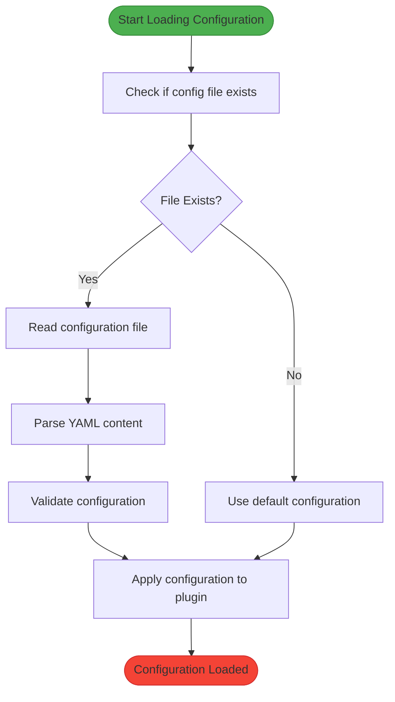
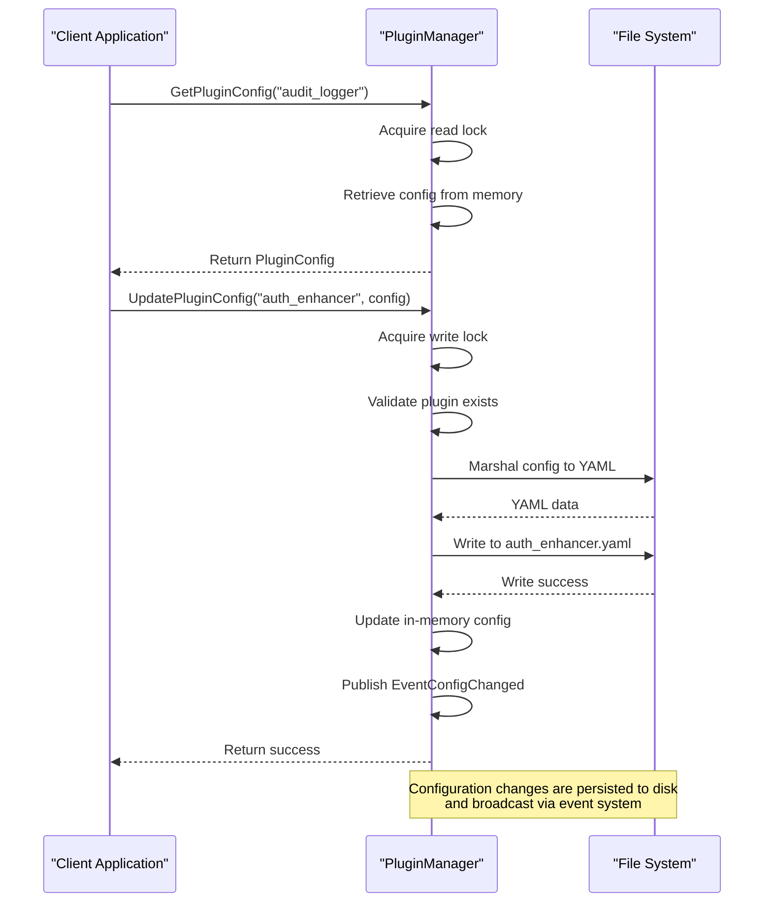
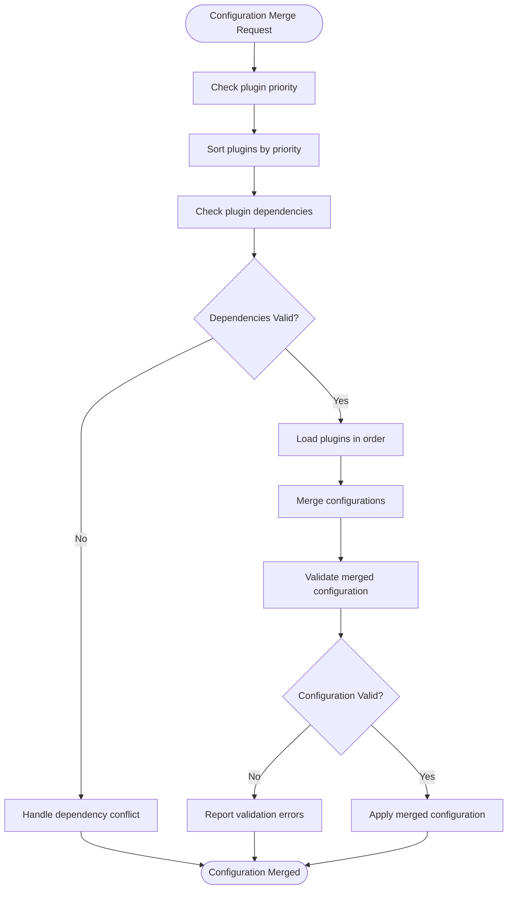
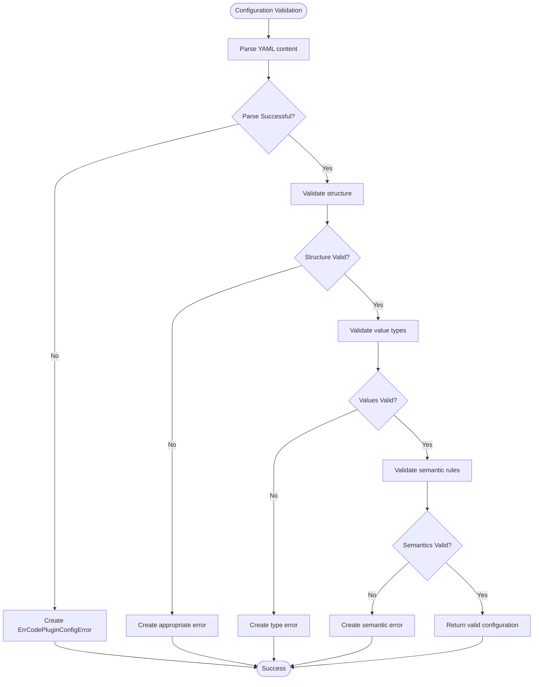

# Plugin Configuration

<cite>
**Referenced Files in This Document**   
- [plugin_manager.go](file://internal/pkg/plugin/plugin_manager.go#L0-L441)
- [types.go](file://internal/pkg/plugin/types.go#L0-L95)
- [interfaces.go](file://internal/pkg/plugin/interfaces.go#L0-L69)
- [audit_logger.yaml](file://configs/plugins/audit_logger.yaml)
- [auth_enhancer.yaml](file://configs/plugins/auth_enhancer.yaml)
</cite>

## Table of Contents
1. [Introduction](#introduction)
2. [Plugin Configuration Structure](#plugin-configuration-structure)
3. [Configuration Loading Mechanism](#configuration-loading-mechanism)
4. [Plugin Configuration Management](#plugin-configuration-management)
5. [Configuration Merging and Conflict Handling](#configuration-merging-and-conflict-handling)
6. [Custom Plugin Behavior Configuration](#custom-plugin-behavior-configuration)
7. [Configuration Validation](#configuration-validation)
8. [Best Practices for Plugin Configuration](#best-practices-for-plugin-configuration)

## Introduction
The kratos-boilerplate framework implements a modular plugin system that allows for extensible functionality through configurable plugins. This document details how plugins such as audit_logger and auth_enhancer load and manage their configuration from the configs/plugins/ directory. The plugin configuration system provides a flexible mechanism for controlling plugin behavior, enabling/disabling features, setting operational parameters, and defining security policies. The plugin manager handles the loading, merging, and validation of plugin-specific configurations, ensuring proper integration with the main application configuration.

## Plugin Configuration Structure
The plugin configuration system in kratos-boilerplate follows a standardized structure that defines both operational parameters and plugin-specific settings. Each plugin has its own YAML configuration file located in the configs/plugins/ directory.

### audit_logger Plugin Configuration
The audit_logger plugin configuration file (audit_logger.yaml) contains the following structure:

```yaml
enabled: true
priority: 20
timeout: 30s
retry_count: 3
settings:
  log_level: "info"
  output_format: "json"
  max_log_size: "100MB"
  retention_days: 30
  sensitive_data_masking: true
metadata:
  category: "logging"
  author: "system"
  version: "1.0.0"
```

**Key configuration parameters:**
- **enabled**: Controls whether the plugin is active
- **priority**: Determines loading order (lower values load first)
- **timeout**: Maximum execution time for plugin operations
- **retry_count**: Number of retry attempts for failed operations
- **settings**: Plugin-specific configuration options
- **metadata**: Descriptive information about the plugin

### auth_enhancer Plugin Configuration
The auth_enhancer plugin configuration file (auth_enhancer.yaml) contains the following structure:

```yaml
enabled: true
priority: 10
timeout: 30s
retry_count: 3
settings:
  jwt_validation: true
  rate_limiting: true
  max_requests_per_minute: 100
  token_expiry: 3600
  audit_logging: true
metadata:
  category: "authentication"
  author: "system"
  version: "1.0.0"
```

**Key configuration parameters:**
- **jwt_validation**: Enables/disables JWT token validation
- **rate_limiting**: Controls rate limiting functionality
- **max_requests_per_minute**: Maximum allowed requests per minute
- **token_expiry**: JWT token expiration time in seconds
- **audit_logging**: Enables audit logging for authentication events

```mermaid
classDiagram
class PluginConfig {
+bool enabled
+int priority
+time.Duration timeout
+int retry_count
+map[string]interface{} settings
+map[string]string metadata
}
class PluginMetadata {
+string name
+string version
+string description
+string author
+[]string dependencies
+[]string tags
+map[string]string metadata
}
class PluginInfo {
+PluginMetadata metadata
+PluginStatus status
+time.Time load_time
+*time.Time start_time
+*time.Time stop_time
+string error_msg
+string path
+string config_path
}
PluginConfig --> PluginMetadata : "contains"
PluginInfo --> PluginMetadata : "contains"
PluginInfo --> PluginConfig : "references"
```

**Diagram sources**
- [types.go](file://internal/pkg/plugin/types.go#L49-L75)

**Section sources**
- [audit_logger.yaml](file://configs/plugins/audit_logger.yaml)
- [auth_enhancer.yaml](file://configs/plugins/auth_enhancer.yaml)

## Configuration Loading Mechanism
The plugin configuration loading mechanism is implemented in the plugin manager and follows a systematic approach to locate, parse, and apply plugin configurations.

### Configuration Loading Process
The plugin manager loads configurations through the following steps:

1. **Configuration Path Resolution**: The manager constructs the configuration file path using the plugin name and configuration directory.
2. **File Existence Check**: The system checks if the configuration file exists in the specified directory.
3. **Default Configuration**: If the file doesn't exist, default configuration values are used.
4. **YAML Parsing**: The configuration file is parsed from YAML format into a structured configuration object.
5. **Configuration Validation**: Basic validation is performed on the loaded configuration.

```go
// loadPluginConfig loads plugin configuration from file
func (pm *pluginManagerImpl) loadPluginConfig(pluginName string) (PluginConfig, error) {
	configPath := filepath.Join(pm.configDir, pluginName+".yaml")

	config := PluginConfig{
		Enabled:    true,
		Priority:   100,
		Settings:   make(map[string]interface{}),
		Timeout:    30 * time.Second,
		RetryCount: 3,
		Metadata:   make(map[string]string),
	}

	if _, err := os.Stat(configPath); os.IsNotExist(err) {
		// Configuration file doesn't exist, use default configuration
		return config, nil
	}

	data, err := os.ReadFile(configPath)
	if err != nil {
		return config, NewPluginError(ErrCodePluginConfigError, "failed to read config file", pluginName, err)
	}

	if err := yaml.Unmarshal(data, &config); err != nil {
		return config, NewPluginError(ErrCodePluginConfigError, "failed to parse config file", pluginName, err)
	}

	return config, nil
}
```

### Configuration Loading Flow


**Diagram sources**
- [plugin_manager.go](file://internal/pkg/plugin/plugin_manager.go#L314-L368)

**Section sources**
- [plugin_manager.go](file://internal/pkg/plugin/plugin_manager.go#L314-L368)

## Plugin Configuration Management
The plugin manager provides a comprehensive API for managing plugin configurations throughout the plugin lifecycle.

### Configuration Management Operations
The PluginManager interface exposes the following configuration management methods:

```go
// PluginManager 插件管理器接口
type PluginManager interface {
    // 配置管理
    UpdatePluginConfig(name string, config PluginConfig) error
    GetPluginConfig(name string) (PluginConfig, error)
}
```

#### GetPluginConfig
Retrieves the current configuration for a specified plugin:

```go
// GetPluginConfig 获取插件配置
func (pm *pluginManagerImpl) GetPluginConfig(name string) (PluginConfig, error) {
	pm.mu.RLock()
	defer pm.mu.RUnlock()

	wrapper, exists := pm.plugins[name]
	if !exists {
		return PluginConfig{}, NewPluginError(ErrCodePluginNotFound, "plugin not found", name, nil)
	}

	return wrapper.config, nil
}
```

#### UpdatePluginConfig
Updates the configuration for a specified plugin and persists it to disk:

```go
// UpdatePluginConfig 更新插件配置
func (pm *pluginManagerImpl) UpdatePluginConfig(name string, config PluginConfig) error {
	pm.mu.Lock()
	defer pm.mu.Unlock()

	wrapper, exists := pm.plugins[name]
	if !exists {
		return NewPluginError(ErrCodePluginNotFound, "plugin not found", name, nil)
	}

	// 保存配置到文件
	if err := pm.savePluginConfig(name, config); err != nil {
		return err
	}

	wrapper.config = config

	// 发布配置变更事件
	pm.eventBus.PublishAsync(context.Background(), NewEvent(
		EventConfigChanged,
		"plugin_manager",
		map[string]interface{}{
			"plugin": name,
			"config": config,
		},
	))

	return nil
}
```

#### savePluginConfig
Persists the plugin configuration to disk in YAML format:

```go
// savePluginConfig 保存插件配置
func (pm *pluginManagerImpl) savePluginConfig(pluginName string, config PluginConfig) error {
	configPath := filepath.Join(pm.configDir, pluginName+".yaml")

	data, err := yaml.Marshal(config)
	if err != nil {
		return NewPluginError(ErrCodePluginConfigError, "failed to marshal config", pluginName, err)
	}

	if err := os.WriteFile(configPath, data, 0644); err != nil {
		return NewPluginError(ErrCodePluginConfigError, "failed to write config file", pluginName, err)
	}

	return nil
}
```



**Diagram sources**
- [plugin_manager.go](file://internal/pkg/plugin/plugin_manager.go#L314-L368)

**Section sources**
- [plugin_manager.go](file://internal/pkg/plugin/plugin_manager.go#L314-L368)

## Configuration Merging and Conflict Handling
The plugin configuration system handles configuration merging and conflict resolution through a well-defined process that ensures consistent behavior across the application.

### Configuration Merging Strategy
When the main application configuration is merged with plugin configurations, the following strategy is applied:

1. **Hierarchical Precedence**: Plugin-specific configurations take precedence over global configurations for plugin-related settings.
2. **Type-Safe Merging**: Configuration values are merged with type checking to prevent incompatible value assignments.
3. **Event-Driven Updates**: Configuration changes trigger events that allow other components to react to configuration updates.

### Conflict Resolution Mechanisms
The system implements several mechanisms to handle configuration conflicts:

#### Priority-Based Loading
Plugins are loaded according to their priority value, with lower priority numbers loading first:

```go
// GetLoadOrder 获取插件加载顺序
func (pr *pluginRegistryImpl) GetLoadOrder() ([]Plugin, error) {
	// Implementation uses topological sorting
	// to resolve dependencies and priority
}
```

#### Dependency Resolution
The system checks for plugin dependencies before loading:

```go
// checkDependencies 检查插件依赖关系
func (pr *pluginRegistryImpl) checkDependencies(plugin Plugin) error {
	dependencies := plugin.Dependencies()
	for _, dep := range dependencies {
		if _, exists := pr.plugins[dep]; !exists {
			return NewPluginError(ErrCodePluginDependency, "dependency not found: "+dep, plugin.Name(), nil)
		}
	}
	return nil
}
```

#### Circular Dependency Detection
The system detects and prevents circular dependencies using topological sorting:

```go
// topologicalSort 拓扑排序
func (pr *pluginRegistryImpl) topologicalSort(graph map[string][]string) ([]string, error) {
	// Implementation detects cycles in dependency graph
	if len(result) != len(graph) {
		return nil, NewPluginError(ErrCodePluginDependency, "circular dependency detected", "", nil)
	}
}
```



**Diagram sources**
- [plugin_registry.go](file://internal/pkg/plugin/plugin_registry.go#L121-L240)

**Section sources**
- [plugin_registry.go](file://internal/pkg/plugin/plugin_registry.go#L121-L240)

## Custom Plugin Behavior Configuration
The plugin system supports extensive customization of plugin behavior through configuration parameters and dynamic configuration updates.

### Dynamic Configuration Updates
Plugins can be reconfigured at runtime without requiring restart:

```go
// Example: Updating auth_enhancer configuration
config, err := pm.GetPluginConfig("auth_enhancer")
if err != nil {
    log.Error("Failed to get plugin config:", err)
    return
}

// Modify configuration
config.Settings["max_requests_per_minute"] = 200
config.Settings["token_expiry"] = 7200

// Update and persist configuration
err = pm.UpdatePluginConfig("auth_enhancer", config)
if err != nil {
    log.Error("Failed to update plugin config:", err)
    return
}
```

### Plugin-Specific Configuration Examples

#### audit_logger Customization
```yaml
settings:
  log_level: "debug"  # More verbose logging
  output_format: "json"  # JSON format for log entries
  max_log_size: "500MB"  # Larger log files
  retention_days: 90  # Longer retention period
  sensitive_data_masking: true  # Enable sensitive data masking
  include_request_body: false  # Exclude request body from logs
  exclude_endpoints:  # Exclude specific endpoints from logging
    - "/health"
    - "/metrics"
```

#### auth_enhancer Customization
```yaml
settings:
  jwt_validation: true
  rate_limiting: true
  max_requests_per_minute: 200
  token_expiry: 7200
  refresh_token_expiry: 604800
  allowed_origins:
    - "https://example.com"
    - "https://api.example.com"
  allowed_methods:
    - "GET"
    - "POST"
    - "PUT"
    - "DELETE"
  allowed_headers:
    - "Content-Type"
    - "Authorization"
    - "X-Requested-With"
  expose_headers:
    - "Content-Length"
    - "Content-Type"
  max_age: 86400
  credentials: true
  audit_logging: true
  failed_login_lockout: true
  max_failed_attempts: 5
  lockout_duration: 900
```

```mermaid
classDiagram
class PluginConfig {
+bool enabled
+int priority
+time.Duration timeout
+int retry_count
+map[string]interface{} settings
+map[string]string metadata
}
class AuditLoggerConfig {
+string log_level
+string output_format
+string max_log_size
+int retention_days
+bool sensitive_data_masking
+bool include_request_body
+[]string exclude_endpoints
}
class AuthEnhancerConfig {
+bool jwt_validation
+bool rate_limiting
+int max_requests_per_minute
+int token_expiry
+int refresh_token_expiry
+[]string allowed_origins
+[]string allowed_methods
+[]string allowed_headers
+[]string expose_headers
+int max_age
+bool credentials
+bool audit_logging
+bool failed_login_lockout
+int max_failed_attempts
+int lockout_duration
}
PluginConfig --> AuditLoggerConfig : "contains settings"
PluginConfig --> AuthEnhancerConfig : "contains settings"
```

**Diagram sources**
- [audit_logger.yaml](file://configs/plugins/audit_logger.yaml)
- [auth_enhancer.yaml](file://configs/plugins/auth_enhancer.yaml)

**Section sources**
- [audit_logger.yaml](file://configs/plugins/audit_logger.yaml)
- [auth_enhancer.yaml](file://configs/plugins/auth_enhancer.yaml)

## Configuration Validation
The plugin system implements robust configuration validation to ensure configuration integrity and prevent runtime errors.

### Built-in Validation Mechanisms
The system performs several levels of validation:

#### File System Validation
```go
// Check if configuration file exists
if _, err := os.Stat(configPath); os.IsNotExist(err) {
    return config, nil // Use defaults
}
```

#### YAML Parsing Validation
```go
// Validate YAML structure
if err := yaml.Unmarshal(data, &config); err != nil {
    return config, NewPluginError(ErrCodePluginConfigError, "failed to parse config file", pluginName, err)
}
```

#### Type Safety Validation
The configuration system uses strongly-typed structures to ensure type safety:

```go
type PluginConfig struct {
    Enabled    bool                   `json:"enabled" yaml:"enabled"`
    Priority   int                    `json:"priority" yaml:"priority"`
    Settings   map[string]interface{} `json:"settings" yaml:"settings"`
    Timeout    time.Duration          `json:"timeout" yaml:"timeout"`
    RetryCount int                    `json:"retry_count" yaml:"retry_count"`
    Metadata   map[string]string      `json:"metadata" yaml:"metadata"`
}
```

### Validation Error Handling
The system uses a comprehensive error handling mechanism:

```go
// NewPluginError creates a structured error
func NewPluginError(code, message, plugin string, cause error) *PluginError {
    return &PluginError{
        Code:    code,
        Message: message,
        Plugin:  plugin,
        Cause:   cause,
    }
}

// Predefined error codes
const (
    ErrCodePluginConfigError = "PLUGIN_CONFIG_ERROR"
    // Other error codes...
)
```



**Diagram sources**
- [plugin_manager.go](file://internal/pkg/plugin/plugin_manager.go#L314-L368)

**Section sources**
- [plugin_manager.go](file://internal/pkg/plugin/plugin_manager.go#L314-L368)

## Best Practices for Plugin Configuration
To ensure optimal plugin configuration management, follow these best practices:

### Organization and Structure
1. **Consistent Naming**: Use consistent naming conventions for configuration files and parameters.
2. **Logical Grouping**: Group related settings under meaningful categories in the settings section.
3. **Documentation**: Include comments in configuration files to explain non-obvious settings.

### Version Compatibility
1. **Semantic Versioning**: Use semantic versioning in plugin metadata to indicate compatibility.
2. **Backward Compatibility**: Maintain backward compatibility when updating configuration schemas.
3. **Migration Scripts**: Provide migration scripts for configuration changes between versions.

### Security Considerations
1. **File Permissions**: Ensure configuration files have appropriate file permissions (e.g., 644).
2. **Sensitive Data**: Avoid storing sensitive data in configuration files; use environment variables or secure storage.
3. **Validation**: Always validate configuration inputs to prevent injection attacks.

### Performance Optimization
1. **Caching**: Cache frequently accessed configuration values to reduce file I/O.
2. **Lazy Loading**: Load configuration only when needed, not at application startup.
3. **Memory Efficiency**: Use efficient data structures for configuration storage.

### Monitoring and Logging
1. **Configuration Changes**: Log configuration changes for audit purposes.
2. **Error Reporting**: Provide clear error messages for configuration issues.
3. **Health Checks**: Implement health checks that verify configuration validity.

### Example: Well-Structured Configuration
```yaml
# audit_logger.yaml - Audit logging plugin configuration
enabled: true
priority: 20
timeout: 30s
retry_count: 3
settings:
  # Logging configuration
  log_level: "info"
  output_format: "json"
  max_log_size: "100MB"
  retention_days: 30
  
  # Data protection
  sensitive_data_masking: true
  masked_fields:
    - "password"
    - "ssn"
    - "credit_card"
  
  # Performance
  buffer_size: 1000
  flush_interval: 5s
  
  # Filtering
  exclude_endpoints:
    - "/health"
    - "/metrics"
    - "/swagger"
metadata:
  category: "logging"
  author: "system"
  version: "1.0.0"
  description: "Audit logging plugin for tracking system events"
```

**Section sources**
- [audit_logger.yaml](file://configs/plugins/audit_logger.yaml)
- [auth_enhancer.yaml](file://configs/plugins/auth_enhancer.yaml)