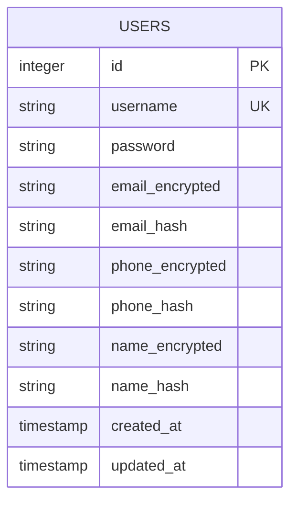
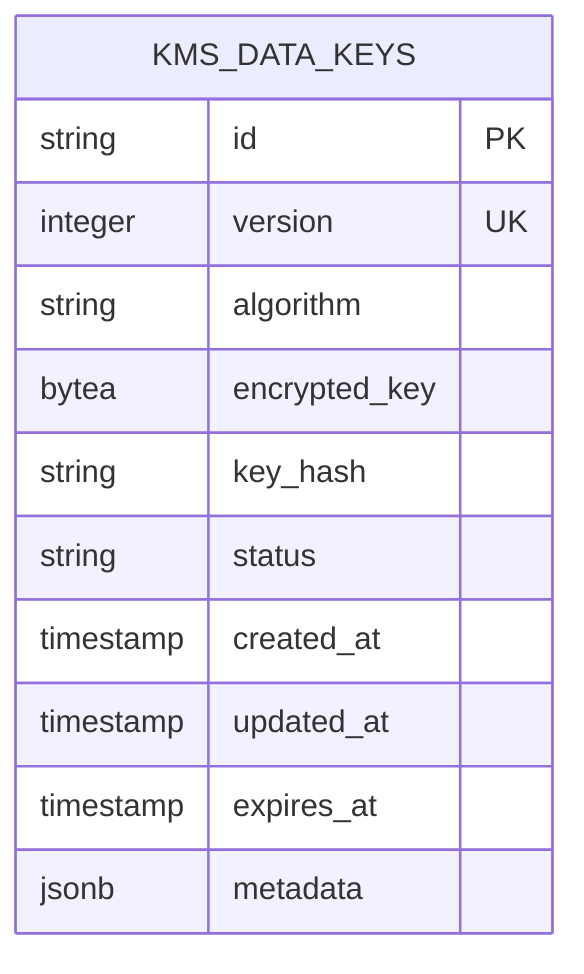
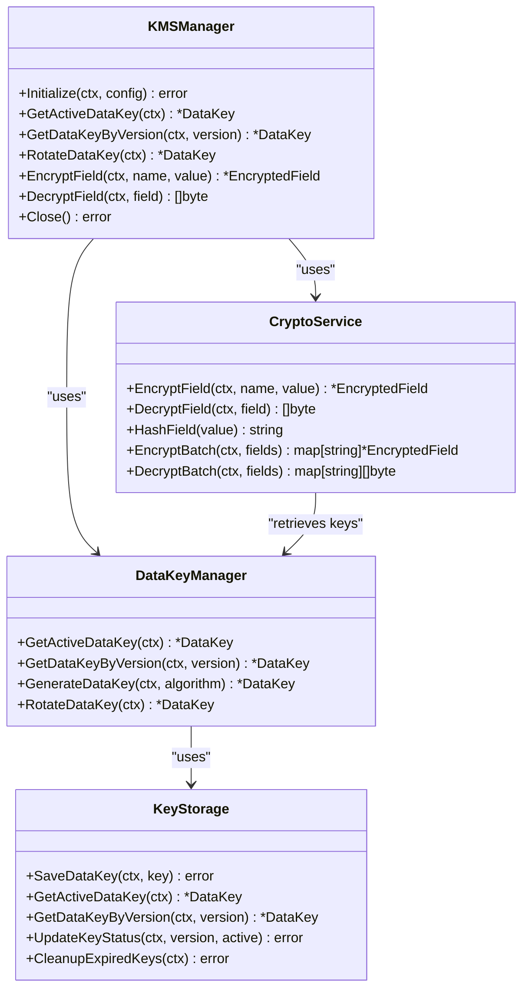
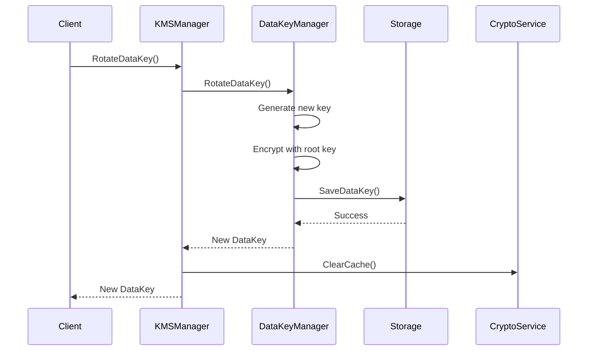
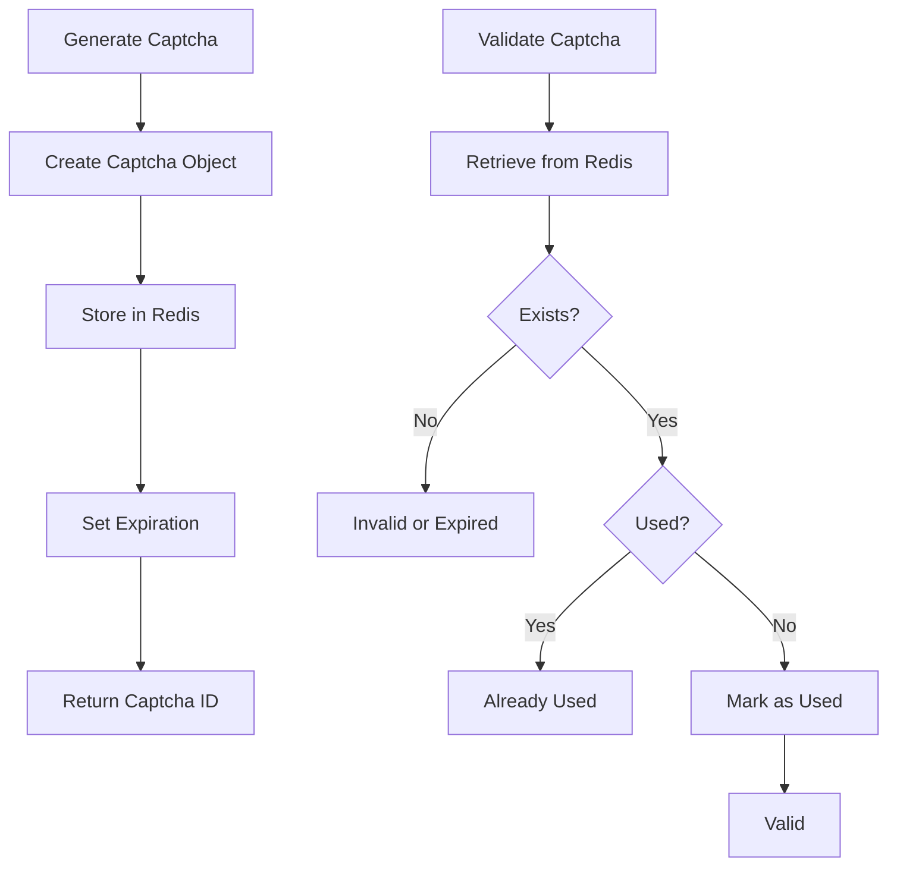

# Data Management

<cite>
**Referenced Files in This Document**   
- [000001_create_users_table.up.sql](file://internal/data/migrations/000001_create_users_table.up.sql)
- [000002_create_data_keys_table.up.sql](file://internal/data/migrations/000002_create_data_keys_table.up.sql)
- [000001_init_schema.up.sql](file://migrations/000001_init_schema.up.sql)
- [000002_create_kms_data_keys.up.sql](file://migrations/000002_create_kms_data_keys.up.sql)
- [kms.go](file://internal/biz/kms.go)
- [crypto_service.go](file://internal/pkg/kms/crypto_service.go)
- [manager.go](file://internal/pkg/kms/manager.go)
- [captcha.go](file://internal/data/captcha.go)
</cite>

## Table of Contents
1. [Data Model Overview](#data-model-overview)
2. [Database Schema](#database-schema)
3. [Key Management System (KMS)](#key-management-system-kms)
4. [Data Access Layer](#data-access-layer)
5. [Redis Usage for Caching and Session Storage](#redis-usage-for-caching-and-session-storage)
6. [Data Lifecycle and Security](#data-lifecycle-and-security)

## Data Model Overview

The kratos-boilerplate system implements a secure data management architecture with a focus on protecting sensitive user information through encryption and key management. The core data entities include users and cryptographic keys, with a layered approach to data access and security.

The system follows a repository pattern for data access, separating business logic from storage concerns. Sensitive fields such as email, phone, and name are stored in encrypted form, with corresponding hash values maintained for efficient lookup operations without compromising security.

**Section sources**
- [kms.go](file://internal/biz/kms.go#L1-L139)
- [000001_create_users_table.up.sql](file://internal/data/migrations/000001_create_users_table.up.sql#L1-L13)

## Database Schema

### Users Table

The users table stores user account information with sensitive fields encrypted at rest:



**Diagram sources**
- [000001_create_users_table.up.sql](file://internal/data/migrations/000001_create_users_table.up.sql#L1-L13)

**Field Definitions:**
- **id**: Primary key, auto-incrementing integer
- **username**: Unique identifier, must be unique across all users
- **password**: Hashed password value (not encrypted)
- **email_encrypted**: Encrypted email address stored as VARCHAR
- **email_hash**: SHA-256 hash of email for lookup operations
- **phone_encrypted**: Encrypted phone number stored as VARCHAR
- **phone_hash**: SHA-256 hash of phone number for lookup
- **name_encrypted**: Encrypted full name stored as VARCHAR
- **name_hash**: SHA-256 hash of name for lookup
- **created_at**: Timestamp of record creation
- **updated_at**: Timestamp of last modification

Indexes are created on hash fields to enable efficient lookups:
- idx_users_email_hash on email_hash
- idx_users_phone_hash on phone_hash  
- idx_users_name_hash on name_hash

### KMS Data Keys Table

The KMS system manages cryptographic keys in the kms_data_keys table:



**Diagram sources**
- [000002_create_kms_data_keys.up.sql](file://migrations/000002_create_kms_data_keys.up.sql#L1-L70)

**Field Definitions:**
- **id**: Unique identifier (UUID) for the key
- **version**: Integer version number, unique when status is 'active'
- **algorithm**: Encryption algorithm (constrained to specific values)
- **encrypted_key**: Key material encrypted with root key
- **key_hash**: Hash of key for integrity verification
- **status**: Key state (active, inactive, expired, revoked)
- **created_at**: Creation timestamp with timezone
- **updated_at**: Last modification timestamp with timezone
- **expires_at**: Optional expiration timestamp
- **metadata**: JSONB field for additional key attributes

**Constraints:**
- CHECK constraint on status values
- CHECK constraint on allowed algorithms
- Unique index on version and status where status = 'active'

**Section sources**
- [000002_create_kms_data_keys.up.sql](file://migrations/000002_create_kms_data_keys.up.sql#L1-L70)

## Key Management System (KMS)

The KMS implementation provides centralized cryptographic key management with automatic rotation and secure storage.

### Architecture



**Diagram sources**
- [manager.go](file://internal/pkg/kms/manager.go#L1-L307)
- [crypto_service.go](file://internal/pkg/kms/crypto_service.go#L1-L320)
- [kms.go](file://internal/biz/kms.go#L1-L139)

### Key Lifecycle Management

The KMS system follows a comprehensive key lifecycle:

1. **Initialization**: The system generates a root key from seed and salt values
2. **Key Generation**: Data keys are derived from the root key using PBKDF2
3. **Activation**: New keys are marked as active, previous keys are deactivated
4. **Rotation**: Automatic key rotation based on configured interval
5. **Expiration**: Keys are automatically expired based on policy
6. **Cleanup**: Expired keys are removed during maintenance operations

Key rotation is handled by the `RotateDataKey` method, which:
- Generates a new data key with incremented version
- Encrypts the new key with the root key
- Stores the encrypted key in the database
- Updates the active key status
- Clears internal caches to ensure new key usage



**Diagram sources**
- [manager.go](file://internal/pkg/kms/manager.go#L150-L180)
- [crypto_service.go](file://internal/pkg/kms/crypto_service.go#L250-L300)

### Configuration

The KMS system is configured through the KMSConfig structure:

**Configuration Parameters:**
- **seed**: Seed value for root key generation
- **salt**: Salt value for key derivation
- **iterations**: PBKDF2 iteration count (minimum 10,000)
- **key_length**: Length of generated keys in bytes (minimum 16)
- **rotate_interval**: Time interval between automatic key rotations
- **algorithm**: Default encryption algorithm
- **storage_type**: Backend storage type (database/file)

Configuration validation ensures security requirements are met before initialization.

**Section sources**
- [kms.go](file://internal/biz/kms.go#L80-L100)

## Data Access Layer

The data access layer implements the repository pattern, providing an abstraction between business logic and storage mechanisms.

### Repository Pattern Implementation

The system uses Go interfaces to define repository contracts, with concrete implementations for different storage backends. The UserRepo interface handles user-related operations, while KMSRepo manages cryptographic key storage.

```go
type UserRepo interface {
    CreateUser(ctx context.Context, user *User) error
    GetUserByUsername(ctx context.Context, username string) (*User, error)
    UpdateUser(ctx context.Context, user *User) error
    SaveCaptcha(ctx context.Context, captcha *Captcha) error
    GetCaptcha(ctx context.Context, id string) (*Captcha, error)
}
```

### Data Key Repository

The KMSRepo interface defines operations for key management:

```go
type KMSRepo interface {
    SaveDataKey(ctx context.Context, key *DataKey) error
    GetActiveDataKey(ctx context.Context) (*DataKey, error)
    GetDataKeyByVersion(ctx context.Context, version string) (*DataKey, error)
    UpdateKeyStatus(ctx context.Context, version string, isActive bool) error
    CleanupExpiredKeys(ctx context.Context) error
}
```

The repository implementation handles database operations, including proper error handling and transaction management.

**Section sources**
- [kms.go](file://internal/biz/kms.go#L30-L75)
- [captcha.go](file://internal/data/captcha.go#L1-L54)

## Redis Usage for Caching and Session Storage

Redis is utilized for temporary data storage, primarily for short-lived values that require high performance access.

### Captcha Storage

The system uses Redis to store captcha information with automatic expiration:



**Diagram sources**
- [captcha.go](file://internal/data/captcha.go#L1-L54)

Each captcha is stored with a key pattern `captcha:{id}` and automatically expires after the configured timeout period. The repository implementation handles Redis connection management and error recovery.

### Session Management

Although not explicitly shown in the provided code, the architecture supports session storage in Redis for authenticated users. Session tokens are stored with appropriate TTL values, and the system can invalidate sessions by removing the corresponding Redis keys.

**Section sources**
- [captcha.go](file://internal/data/captcha.go#L1-L54)

## Data Lifecycle and Security

### Data Encryption Strategy

The system implements a comprehensive encryption strategy for sensitive data:

1. **Field-Level Encryption**: Individual sensitive fields are encrypted
2. **Key Hierarchy**: Root key encrypts data keys, data keys encrypt data
3. **Key Rotation**: Regular automatic rotation of data keys
4. **Secure Storage**: Encrypted keys stored in database, root key in memory

The encryption process follows these steps:
1. Retrieve active data key from KMS
2. Generate random nonce
3. Encrypt data using AES-GCM mode
4. Prepend nonce to ciphertext
5. Store encrypted value with key version and algorithm

### Security Requirements

**Sensitive Data Protection:**
- All PII (email, phone, name) must be encrypted at rest
- Passwords are hashed using secure algorithms (not shown in code)
- Encryption keys are never stored in plaintext
- Key material is cleared from memory when no longer needed

**Access Control:**
- KMS operations require system initialization
- Key rotation requires appropriate privileges
- Audit logging should be implemented for key operations

**Data Retention:**
- User data retention follows organizational policies
- Expired cryptographic keys are cleaned up automatically
- Backup procedures must preserve encryption integrity

### Error Handling

The system defines specific error types for cryptographic operations:

- ErrKeyNotFound: Requested key does not exist
- ErrNoActiveKey: No active key available for encryption
- ErrKeyExpired: Attempted to use an expired key
- ErrInvalidCiphertext: Malformed or corrupted encrypted data
- ErrKMSNotInitialized: KMS system not properly initialized

Error handling follows Go idioms with wrapped errors providing context while maintaining security by not exposing sensitive information.

**Section sources**
- [kms.go](file://internal/biz/kms.go#L110-L139)
- [crypto_service.go](file://internal/pkg/kms/crypto_service.go#L1-L320)