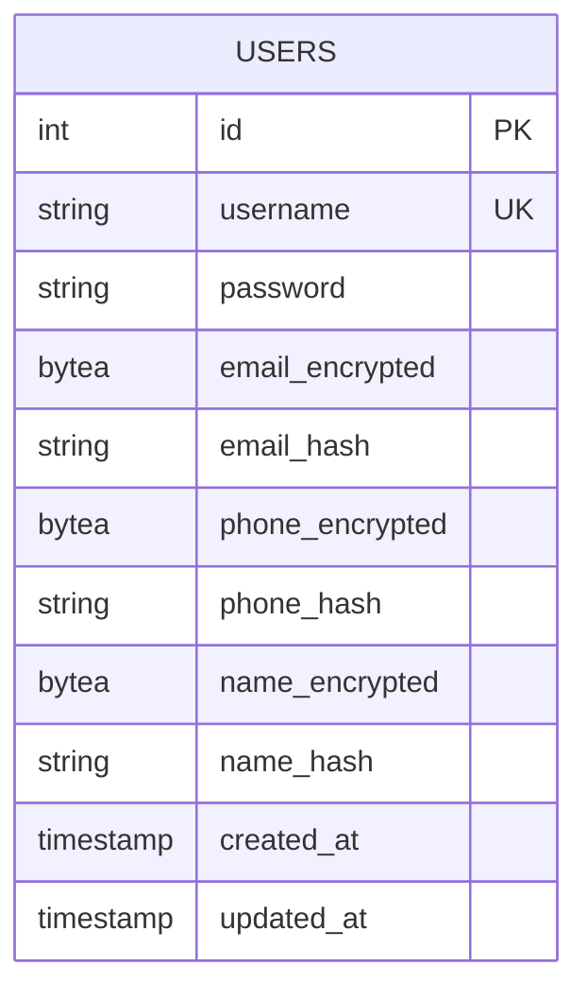
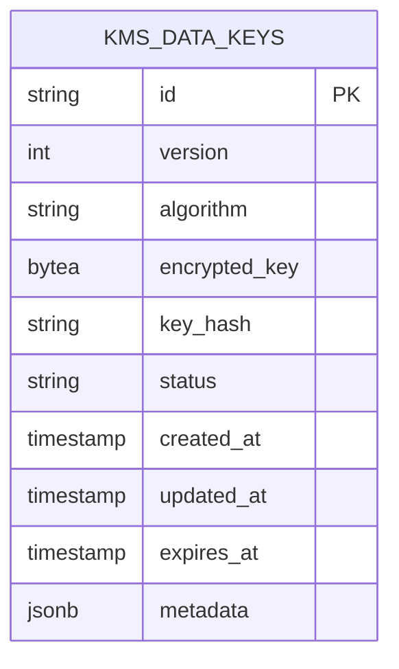
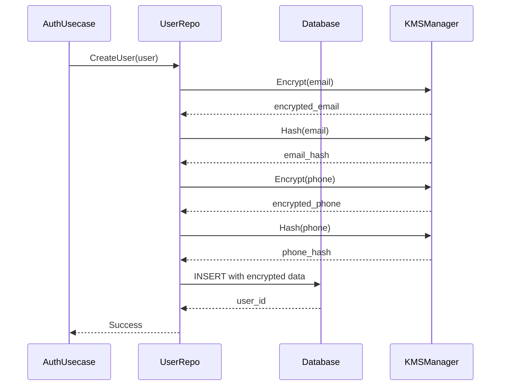

# Database Schema

<cite>
**Referenced Files in This Document**   
- [000001_init_schema.up.sql](file://migrations/000001_init_schema.up.sql)
- [000002_create_kms_data_keys.up.sql](file://migrations/000002_create_kms_data_keys.up.sql)
- [000001_create_users_table.up.sql](file://internal/data/migrations/000001_create_users_table.up.sql)
- [000002_create_data_keys_table.up.sql](file://internal/data/migrations/000002_create_data_keys_table.up.sql)
- [auth.go](file://internal/data/auth.go)
- [kms.go](file://internal/data/kms.go)
- [kms.go](file://internal/biz/kms.go)
- [auth.go](file://internal/biz/auth.go)
</cite>

## Table of Contents
1. [Introduction](#introduction)
2. [Users Table Structure](#users-table-structure)
3. [Data Keys Table Structure](#data-keys-table-structure)
4. [Entity Relationships and Constraints](#entity-relationships-and-constraints)
5. [Sample SQL Queries](#sample-sql-queries)
6. [Data Access Layer Implementation](#data-access-layer-implementation)
7. [Security and Data Validation](#security-and-data-validation)

## Introduction
This document provides comprehensive documentation for the core database schema in the kratos-boilerplate application. It details the structure of the `users` and `kms_data_keys` tables, including field definitions, constraints, indexes, and data access patterns. The schema supports secure user management and cryptographic key management through a Key Management System (KMS). The design emphasizes data security, with sensitive user information encrypted at rest and protected by hashing for efficient lookup.

## Users Table Structure
The `users` table stores user account information with encryption for sensitive fields. The schema uses deterministic hashing to enable search operations on encrypted data.

**Field Specifications:**
- **id**: SERIAL PRIMARY KEY - Auto-incrementing unique identifier
- **username**: VARCHAR(255) NOT NULL UNIQUE - User's login name with uniqueness constraint
- **password**: VARCHAR(255) NOT NULL - Hashed password (using bcrypt)
- **email_encrypted**: BYTEA - Encrypted email address stored in binary format
- **email_hash**: VARCHAR(64) - SHA-256 hash of email for lookup operations
- **phone_encrypted**: BYTEA - Encrypted phone number stored in binary format
- **phone_hash**: VARCHAR(64) - SHA-256 hash of phone number for lookup
- **name_encrypted**: BYTEA - Encrypted full name stored in binary format
- **name_hash**: VARCHAR(64) - SHA-256 hash of name for lookup
- **created_at**: TIMESTAMP NOT NULL DEFAULT CURRENT_TIMESTAMP - Record creation time
- **updated_at**: TIMESTAMP NOT NULL DEFAULT CURRENT_TIMESTAMP - Last modification time

**Constraints:**
- Primary Key: id
- Unique Constraint: username
- Indexes: idx_users_email_hash (email_hash), idx_users_phone_hash (phone_hash), idx_users_name_hash (name_hash)



**Diagram sources**
- [000001_init_schema.up.sql](file://migrations/000001_init_schema.up.sql#L1-L16)
- [000001_create_users_table.up.sql](file://internal/data/migrations/000001_create_users_table.up.sql#L1-L12)

**Section sources**
- [000001_init_schema.up.sql](file://migrations/000001_init_schema.up.sql#L1-L16)
- [auth.go](file://internal/data/auth.go#L50-L437)

## Data Keys Table Structure
The `kms_data_keys` table stores cryptographic keys used by the Key Management System for data encryption and decryption operations.

**Field Specifications:**
- **id**: VARCHAR(36) PRIMARY KEY - Unique identifier for the key
- **version**: INTEGER NOT NULL - Key version number
- **algorithm**: VARCHAR(50) NOT NULL DEFAULT 'AES-256-GCM' - Encryption algorithm used
- **encrypted_key**: BYTEA NOT NULL - Key material encrypted with root key
- **key_hash**: VARCHAR(64) NOT NULL - Hash of the key for integrity verification
- **status**: VARCHAR(20) NOT NULL DEFAULT 'active' - Current key status
- **created_at**: TIMESTAMP WITH TIME ZONE NOT NULL DEFAULT CURRENT_TIMESTAMP - Creation timestamp
- **updated_at**: TIMESTAMP WITH TIME ZONE NOT NULL DEFAULT CURRENT_TIMESTAMP - Last update timestamp
- **expires_at**: TIMESTAMP WITH TIME ZONE - Optional expiration timestamp
- **metadata**: JSONB - Additional key metadata in JSON format

**Constraints:**
- Primary Key: id
- Check Constraints: 
  - status IN ('active', 'inactive', 'expired', 'revoked')
  - algorithm IN ('AES-256-GCM', 'AES-256-CBC', 'ChaCha20-Poly1305', 'SM4-GCM')
- Unique Index: idx_kms_data_keys_version_status (version, status) WHERE status = 'active'
- Indexes: idx_kms_data_keys_version, idx_kms_data_keys_status, idx_kms_data_keys_created_at, idx_kms_data_keys_expires_at, idx_kms_data_keys_key_hash



**Diagram sources**
- [000002_create_kms_data_keys.up.sql](file://migrations/000002_create_kms_data_keys.up.sql#L1-L69)
- [kms.go](file://internal/biz/kms.go#L10-L40)

**Section sources**
- [000002_create_kms_data_keys.up.sql](file://migrations/000002_create_kms_data_keys.up.sql#L1-L69)
- [kms.go](file://internal/data/kms.go#L10-L304)

## Entity Relationships and Constraints
The database schema consists of two primary tables with no direct foreign key relationships. The KMS system and user management system operate independently but are integrated through the application logic layer.

**Key Constraints:**
- **Uniqueness**: Username must be unique across all users
- **Data Integrity**: Email, phone, and name hashes ensure referential integrity for encrypted fields
- **Key Management**: Only one active key version can exist at any time
- **Status Validation**: Key status is constrained to predefined values
- **Algorithm Validation**: Only approved encryption algorithms are permitted

**Business Rules:**
- A user cannot be created with an email or phone number that already exists
- Passwords are hashed using bcrypt before storage
- Sensitive user data (email, phone, name) is encrypted using keys from the KMS
- Each data key has a defined lifecycle with creation, activation, and expiration
- Active keys must not be expired (expires_at > current time)

## Sample SQL Queries
Common database operations for user and key management:

**User Lookup by Username:**
```sql
SELECT id, username, password, email_encrypted, phone_encrypted, name_encrypted, created_at, updated_at 
FROM users 
WHERE username = $1;
```

**User Lookup by Email:**
```sql
SELECT id, username, password, email_encrypted, phone_encrypted, name_encrypted, created_at, updated_at 
FROM users 
WHERE email_hash = $1;
```

**Retrieve Active Data Key:**
```sql
SELECT id, version, algorithm, key_data, encrypted_key, created_at, expires_at, is_active
FROM kms_data_keys
WHERE status = 'active' AND (expires_at IS NULL OR expires_at > CURRENT_TIMESTAMP)
ORDER BY created_at DESC
LIMIT 1;
```

**List All Active Keys:**
```sql
SELECT id, version, algorithm, created_at, expires_at 
FROM kms_data_keys 
WHERE status = 'active' 
ORDER BY version DESC;
```

**Create New User:**
```sql
INSERT INTO users (
    username, password, 
    email_encrypted, email_hash,
    phone_encrypted, phone_hash,
    name_encrypted, name_hash,
    created_at, updated_at
) VALUES ($1, $2, $3, $4, $5, $6, $7, $8, $9, $10)
RETURNING id;
```

**Update User Information:**
```sql
UPDATE users SET 
    email_encrypted = $1, email_hash = $2,
    phone_encrypted = $3, phone_hash = $4,
    name_encrypted = $5, name_hash = $6,
    updated_at = $7
WHERE id = $8;
```

## Data Access Layer Implementation
The data access layer implements the repository pattern, providing an abstraction between business logic and database operations.

**Users Repository:**
- Implements `biz.UserRepo` interface
- Handles encryption/decryption of sensitive fields using KMS
- Manages user CRUD operations
- Provides search capabilities via hash lookups
- Handles transaction management

**KMS Repository:**
- Implements `biz.KMSRepo` interface
- Manages lifecycle of data encryption keys
- Provides methods for key rotation and retrieval
- Maintains key statistics and monitoring
- Enforces key activation/deactivation rules



**Diagram sources**
- [auth.go](file://internal/data/auth.go#L50-L437)
- [kms.go](file://internal/data/kms.go#L10-L304)

**Section sources**
- [auth.go](file://internal/data/auth.go#L50-L437)
- [kms.go](file://internal/data/kms.go#L10-L304)

## Security and Data Validation
The schema and implementation prioritize security for sensitive user information.

**Data Validation Rules:**
- Username: 3-255 characters, alphanumeric with underscores
- Password: Minimum 8 characters with complexity requirements
- Email: Valid email format, uniqueness enforced
- Phone: Valid phone number format
- Key Version: Positive integer, unique per status

**Security Considerations:**
- **Password Storage**: Uses bcrypt with cost factor 10
- **Field Encryption**: Sensitive fields encrypted using AES-256-GCM or similar algorithms
- **Deterministic Hashing**: SHA-256 used for creating lookup hashes (with consideration of potential rainbow table attacks)
- **Key Management**: Regular key rotation supported with versioning
- **Access Control**: Database access restricted to application layer
- **Audit Trail**: Created/updated timestamps for all records

**Sensitive Data Handling:**
- Email, phone, and name fields are always encrypted at rest
- Hashes allow search without decrypting data
- The KMS system separates key management from data storage
- Memory safety: Sensitive data cleared after use when possible
- Logging: Sensitive fields are redacted in logs

**Section sources**
- [auth.go](file://internal/biz/auth.go#L10-L694)
- [kms.go](file://internal/biz/kms.go#L10-L139)
- [auth.go](file://internal/data/auth.go#L50-L437)