# Key Management System (KMS) Design

<cite>
**Referenced Files in This Document**   
- [kms.go](file://internal/biz/kms.go#L1-L140)
- [kms.go](file://internal/data/kms.go#L1-L332)
- [manager.go](file://internal/pkg/kms/manager.go#L1-L308)
- [crypto_service.go](file://internal/pkg/kms/crypto_service.go#L1-L321)
- [datakey.go](file://internal/pkg/kms/datakey.go#L1-L251)
- [rootkey.go](file://internal/pkg/kms/rootkey.go#L1-L94)
- [000002_create_kms_data_keys.up.sql](file://migrations/000002_create_kms_data_keys.up.sql#L1-L15)
</cite>

## Table of Contents
1. [Introduction](#introduction)
2. [Project Structure](#project-structure)
3. [Core Components](#core-components)
4. [Architecture Overview](#architecture-overview)
5. [Detailed Component Analysis](#detailed-component-analysis)
6. [Key Lifecycle and Data Flow](#key-lifecycle-and-data-flow)
7. [Security Considerations](#security-considerations)
8. [Performance and Caching](#performance-and-caching)
9. [Conclusion](#conclusion)

## Introduction
The Key Management System (KMS) in kratos-boilerplate provides a secure, hierarchical cryptographic infrastructure for protecting sensitive data. It implements envelope encryption using a root key and data key hierarchy, where the root key encrypts data keys, and data keys encrypt application data. The system supports automatic key rotation, secure key storage in a database, and efficient cryptographic operations through caching. This document details the design, implementation, and operational characteristics of the KMS, focusing on its architecture, component interactions, security model, and performance optimization strategies.

## Project Structure
The KMS implementation is organized across multiple layers of the application architecture, following a clean separation of concerns. The core KMS logic resides in the `internal/pkg/kms` directory, while data persistence is handled by the `internal/data` package, and business logic interfaces are defined in `internal/biz`. Configuration is managed through YAML files in the `configs` directory, and database schema is defined in migration scripts.

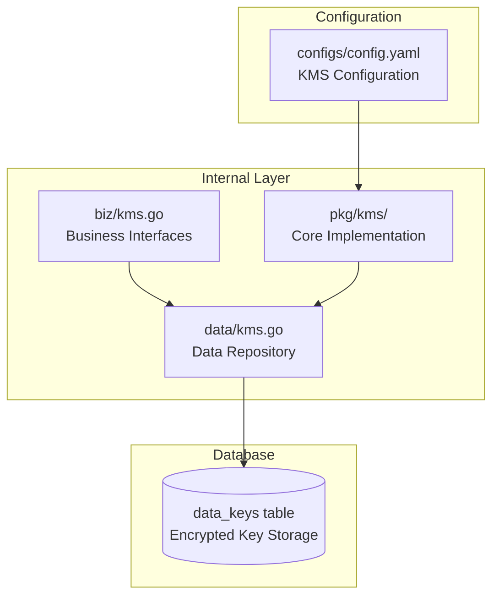

**Diagram sources**
- [kms.go](file://internal/biz/kms.go#L1-L140)
- [kms.go](file://internal/data/kms.go#L1-L332)
- [manager.go](file://internal/pkg/kms/manager.go#L1-L308)

**Section sources**
- [kms.go](file://internal/biz/kms.go#L1-L140)
- [kms.go](file://internal/data/kms.go#L1-L332)
- [manager.go](file://internal/pkg/kms/manager.go#L1-L308)

## Core Components
The KMS system consists of several core components that work together to provide secure key management and cryptographic services. The main components include the KMS Manager, Crypto Service, Data Key Manager, Root Key Generator, and Key Storage interface. These components are designed with dependency injection in mind, allowing for flexible configuration and testing. The system follows the principle of least privilege, with each component having only the necessary access to perform its function.

**Section sources**
- [kms.go](file://internal/biz/kms.go#L1-L140)
- [manager.go](file://internal/pkg/kms/manager.go#L1-L308)
- [crypto_service.go](file://internal/pkg/kms/crypto_service.go#L1-L321)

## Architecture Overview
The KMS architecture implements a layered design with clear separation between business logic, data access, and cryptographic operations. The system uses envelope encryption, where a root key encrypts data keys, and data keys encrypt application data. This hierarchical approach provides both security and flexibility, allowing for key rotation without re-encrypting all data.

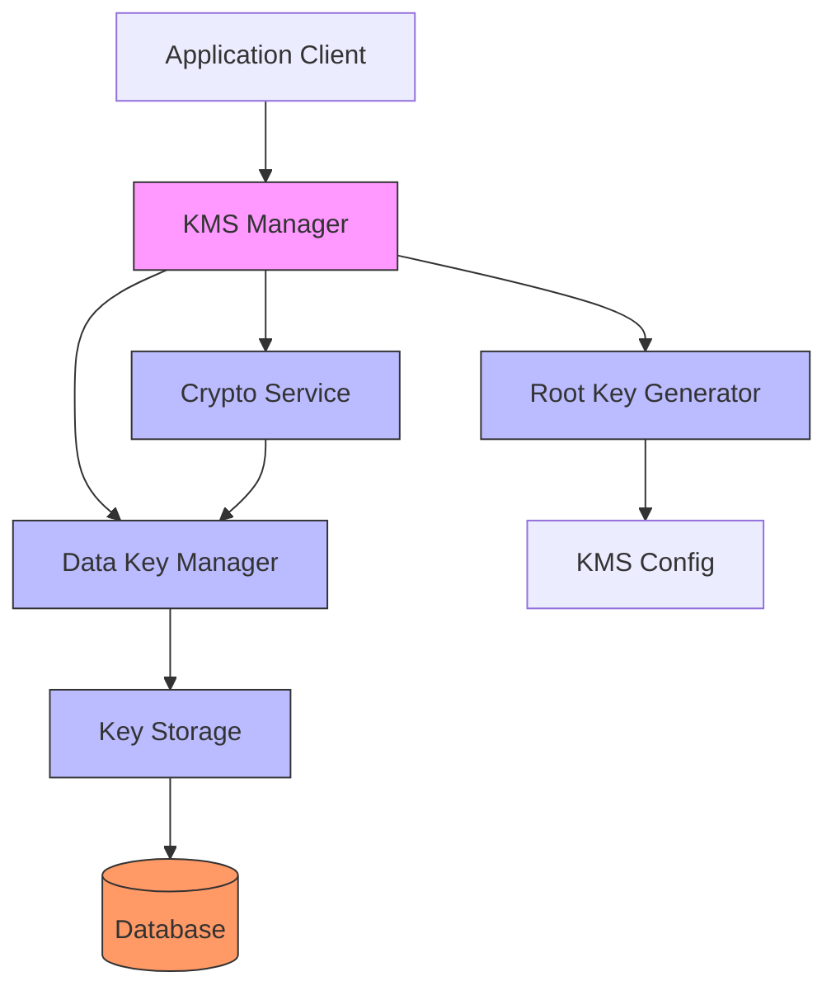

**Diagram sources**
- [manager.go](file://internal/pkg/kms/manager.go#L1-L308)
- [crypto_service.go](file://internal/pkg/kms/crypto_service.go#L1-L321)
- [datakey.go](file://internal/pkg/kms/datakey.go#L1-L251)
- [rootkey.go](file://internal/pkg/kms/rootkey.go#L1-L94)
- [kms.go](file://internal/data/kms.go#L1-L332)

## Detailed Component Analysis

### KMS Manager Analysis
The KMS Manager serves as the primary entry point for the Key Management System, orchestrating the various components and providing a unified interface for key operations. It handles system initialization, lifecycle management, and coordinates between the crypto service, data key manager, and storage components.

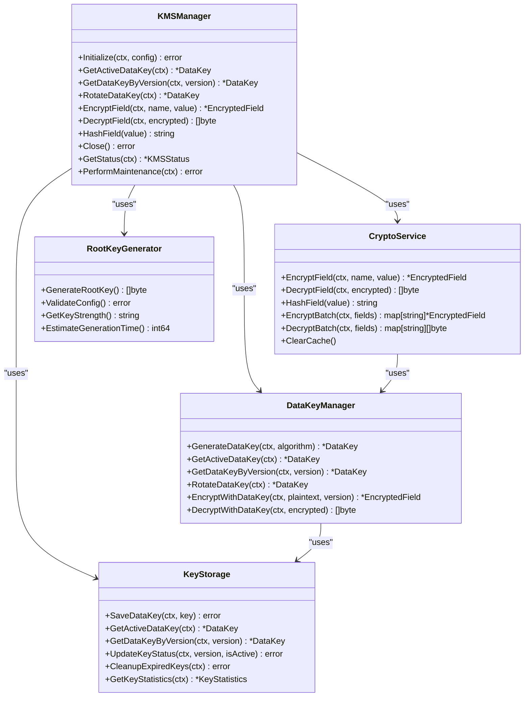

**Diagram sources**
- [manager.go](file://internal/pkg/kms/manager.go#L1-L308)
- [crypto_service.go](file://internal/pkg/kms/crypto_service.go#L1-L321)
- [datakey.go](file://internal/pkg/kms/datakey.go#L1-L251)
- [rootkey.go](file://internal/pkg/kms/rootkey.go#L1-L94)
- [kms.go](file://internal/data/kms.go#L1-L332)

**Section sources**
- [manager.go](file://internal/pkg/kms/manager.go#L1-L308)

### Crypto Service Analysis
The Crypto Service provides the primary encryption and decryption functionality for application data. It implements caching to improve performance and uses the data key manager to retrieve appropriate keys for cryptographic operations. The service supports both single field and batch operations, making it efficient for processing multiple sensitive fields.

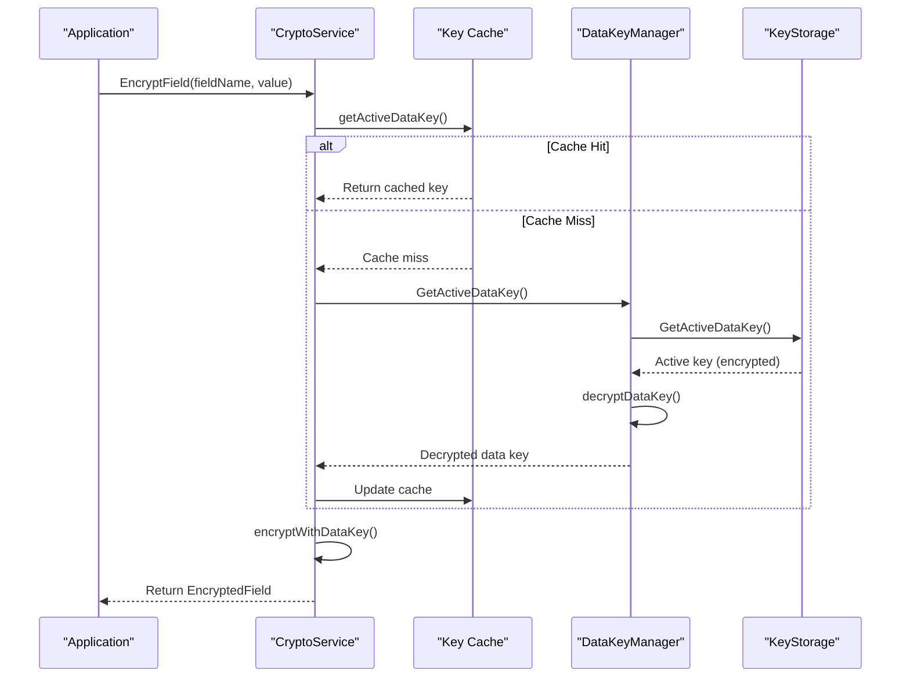

**Diagram sources**
- [crypto_service.go](file://internal/pkg/kms/crypto_service.go#L1-L321)
- [datakey.go](file://internal/pkg/kms/datakey.go#L1-L251)
- [kms.go](file://internal/data/kms.go#L1-L332)

**Section sources**
- [crypto_service.go](file://internal/pkg/kms/crypto_service.go#L1-L321)

### Data Key Management Analysis
The Data Key Manager handles the creation, retrieval, and rotation of data keys. It uses the root key to encrypt data keys before storage and decrypts them when needed for cryptographic operations. The manager ensures that only one active key exists at a time and properly manages the transition between key versions during rotation.

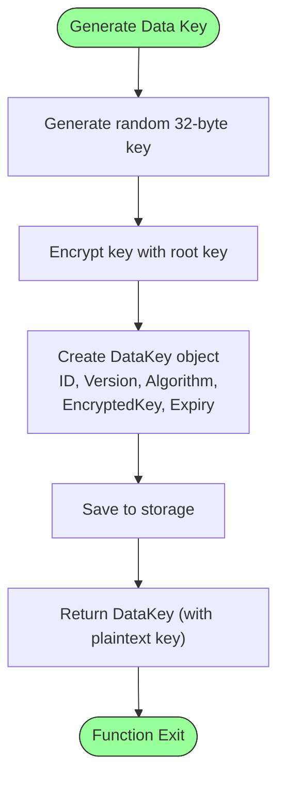

**Diagram sources**
- [datakey.go](file://internal/pkg/kms/datakey.go#L1-L251)
- [rootkey.go](file://internal/pkg/kms/rootkey.go#L1-L94)
- [kms.go](file://internal/data/kms.go#L1-L332)

**Section sources**
- [datakey.go](file://internal/pkg/kms/datakey.go#L1-L251)

### Root Key Generation Analysis
The Root Key Generator creates the master key used to encrypt all data keys. It uses PBKDF2 with configurable parameters (seed, salt, iterations, key length) to derive a cryptographically strong root key. The generator validates configuration parameters to ensure cryptographic strength and security.

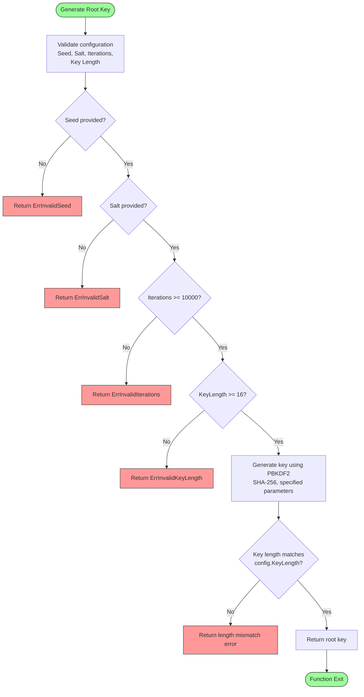

**Diagram sources**
- [rootkey.go](file://internal/pkg/kms/rootkey.go#L1-L94)
- [kms.go](file://internal/biz/kms.go#L1-L140)

**Section sources**
- [rootkey.go](file://internal/pkg/kms/rootkey.go#L1-L94)

## Key Lifecycle and Data Flow

### Key Generation and Initialization Flow
The KMS initialization process creates the root key, generates an initial data key, and sets up the system for cryptographic operations. This process ensures that the system is ready to encrypt data as soon as it's initialized.

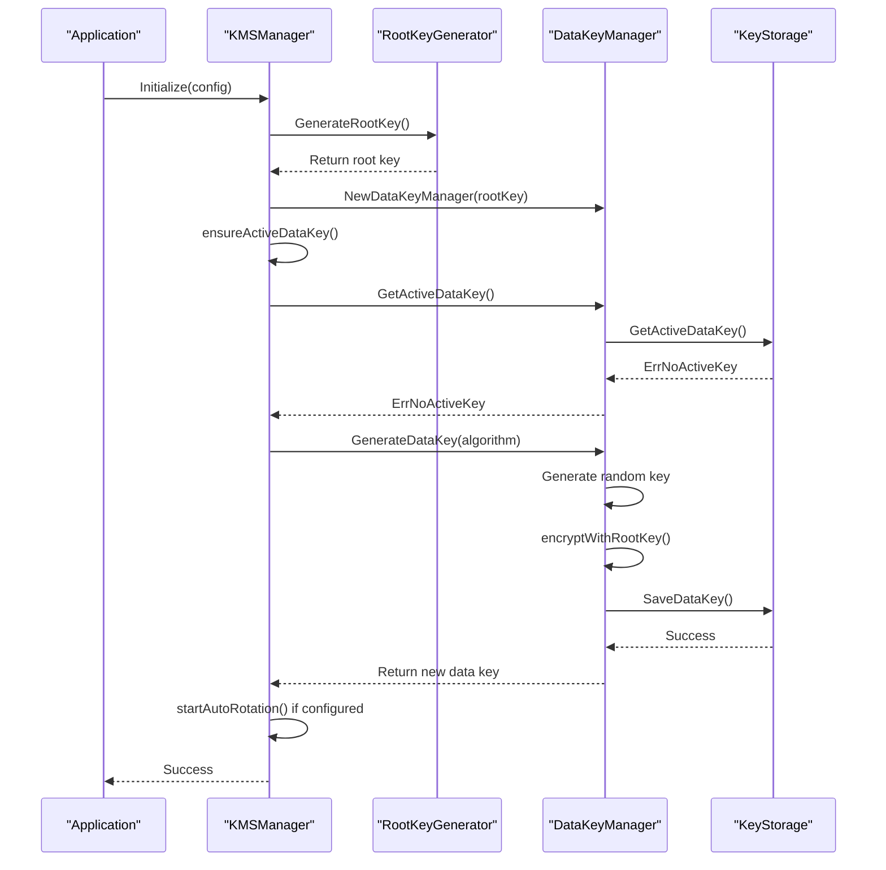

**Diagram sources**
- [manager.go](file://internal/pkg/kms/manager.go#L1-L308)
- [rootkey.go](file://internal/pkg/kms/rootkey.go#L1-L94)
- [datakey.go](file://internal/pkg/kms/datakey.go#L1-L251)
- [kms.go](file://internal/data/kms.go#L1-L332)

**Section sources**
- [manager.go](file://internal/pkg/kms/manager.go#L1-L308)

### Data Encryption and Decryption Flow
The data encryption process demonstrates how sensitive information is protected using the KMS system. The flow shows the interaction between components when encrypting and decrypting application data.

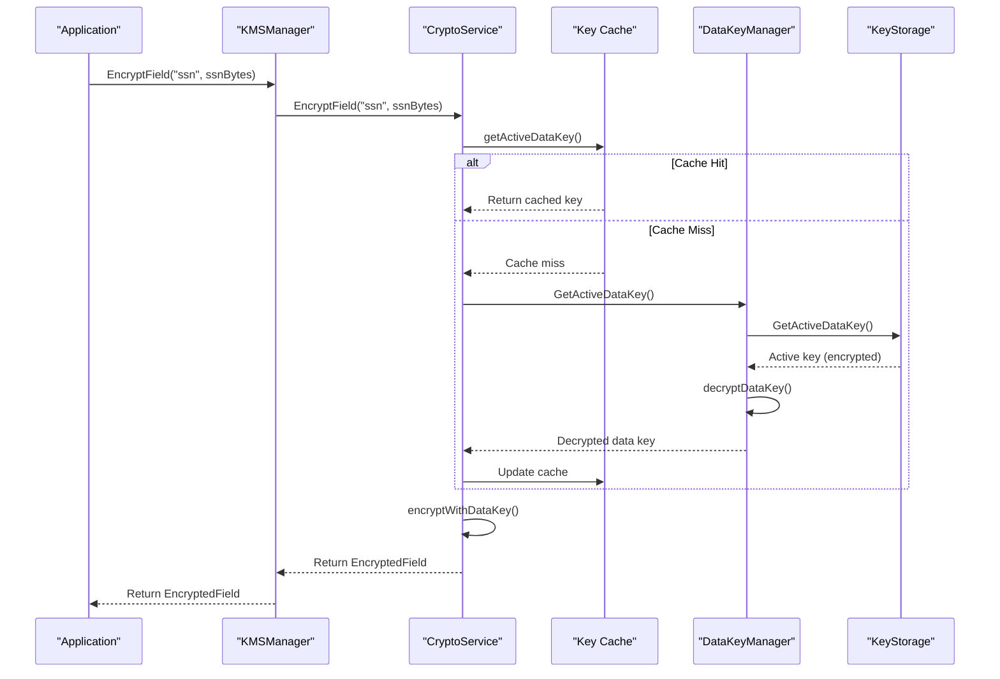

**Diagram sources**
- [manager.go](file://internal/pkg/kms/manager.go#L1-L308)
- [crypto_service.go](file://internal/pkg/kms/crypto_service.go#L1-L321)
- [datakey.go](file://internal/pkg/kms/datakey.go#L1-L251)
- [kms.go](file://internal/data/kms.go#L1-L332)

**Section sources**
- [crypto_service.go](file://internal/pkg/kms/crypto_service.go#L1-L321)

## Security Considerations

### Key Rotation Strategy
The KMS system implements an automated key rotation strategy that ensures cryptographic keys are regularly updated to minimize the risk of compromise. The rotation process creates new data keys while preserving the ability to decrypt data encrypted with previous keys.

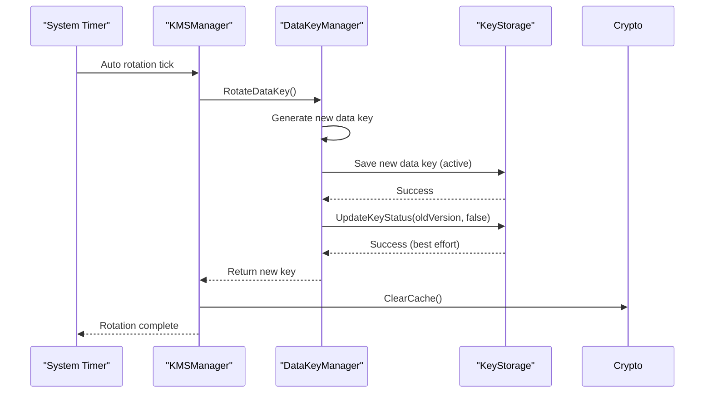

**Diagram sources**
- [manager.go](file://internal/pkg/kms/manager.go#L1-L308)
- [datakey.go](file://internal/pkg/kms/datakey.go#L1-L251)
- [kms.go](file://internal/data/kms.go#L1-L332)

**Section sources**
- [manager.go](file://internal/pkg/kms/manager.go#L1-L308)

### Secure Key Storage
The KMS system stores data keys in an encrypted form in the database, using the root key for protection. The root key itself is derived from configuration parameters and never stored directly. This approach ensures that even if the database is compromised, the data keys remain protected.

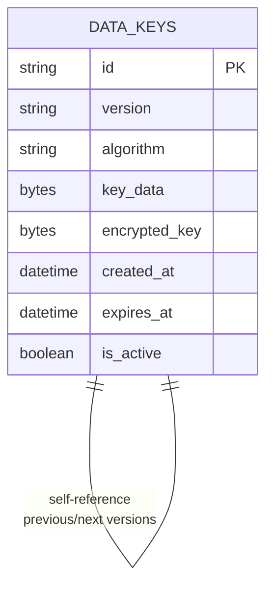

**Diagram sources**
- [000002_create_kms_data_keys.up.sql](file://migrations/000002_create_kms_data_keys.up.sql#L1-L15)
- [kms.go](file://internal/data/kms.go#L1-L332)

**Section sources**
- [000002_create_kms_data_keys.up.sql](file://migrations/000002_create_kms_data_keys.up.sql#L1-L15)
- [kms.go](file://internal/data/kms.go#L1-L332)

## Performance and Caching

### Caching Strategy
The KMS system implements a multi-level caching strategy to optimize performance. The crypto service maintains a cache of recently used data keys, reducing the need to access the database for every cryptographic operation. The cache is automatically cleared when keys are rotated or the system is shut down.

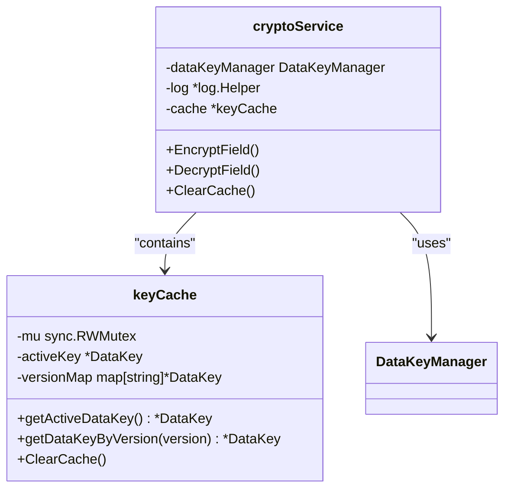

**Diagram sources**
- [crypto_service.go](file://internal/pkg/kms/crypto_service.go#L1-L321)

**Section sources**
- [crypto_service.go](file://internal/pkg/kms/crypto_service.go#L1-L321)

### Performance Implications
Cryptographic operations are computationally expensive, so the KMS system is designed to minimize their impact on application performance. The system uses caching, batch operations, and asynchronous maintenance tasks to ensure that encryption and decryption do not become bottlenecks.

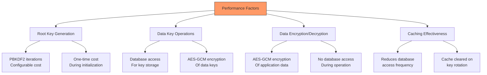

**Section sources**
- [crypto_service.go](file://internal/pkg/kms/crypto_service.go#L1-L321)
- [datakey.go](file://internal/pkg/kms/datakey.go#L1-L251)
- [rootkey.go](file://internal/pkg/kms/rootkey.go#L1-L94)

## Conclusion
The Key Management System in kratos-boilerplate provides a robust, secure, and efficient solution for managing cryptographic keys and protecting sensitive data. By implementing envelope encryption with a hierarchical key structure, the system balances security and performance while supporting essential operations like key rotation and secure storage. The modular design with clear interfaces allows for easy maintenance and potential extension. The system's use of caching optimizes performance for frequent cryptographic operations, while automated key rotation enhances security posture. Overall, the KMS implementation follows cryptographic best practices and provides a solid foundation for securing sensitive application data.