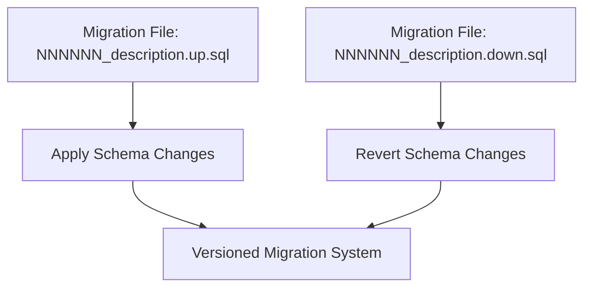
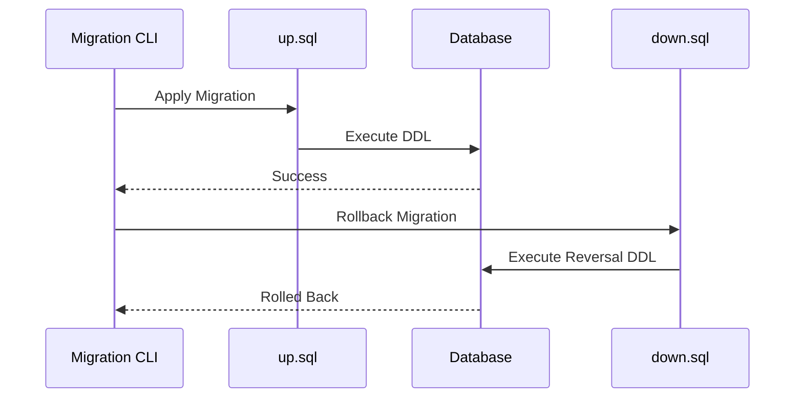

# Migrations

<cite>
**Referenced Files in This Document**   
- [000001_init_schema.up.sql](file://migrations/000001_init_schema.up.sql)
- [000001_init_schema.down.sql](file://migrations/000001_init_schema.down.sql)
- [000002_create_kms_data_keys.up.sql](file://migrations/000002_create_kms_data_keys.up.sql)
- [000002_create_kms_data_keys.down.sql](file://migrations/000002_create_kms_data_keys.down.sql)
- [data.go](file://internal/data/data.go#L1-L95)
- [main.go](file://cmd/kratos-boilerplate/main.go#L1-L92)
</cite>

## Table of Contents
1. [Introduction](#introduction)
2. [Migration File Structure and Naming Convention](#migration-file-structure-and-naming-convention)
3. [Initial Schema Migration (000001_init_schema)](#initial-schema-migration-000001_init_schema)
4. [KMS Data Keys Table Migration (000002_create_kms_data_keys)](#kms-data-keys-table-migration-000002_create_kms_data_keys)
5. [Up and Down Migration Patterns](#up-and-down-migration-patterns)
6. [Versioning Strategy and Idempotency](#versioning-strategy-and-idempotency)
7. [Integration with Application Startup](#integration-with-application-startup)
8. [Best Practices for Production Migrations](#best-practices-for-production-migrations)
9. [Common Issues and Troubleshooting](#common-issues-and-troubleshooting)
10. [Conclusion](#conclusion)

## Introduction
This document provides a comprehensive overview of the database migration system used in the **kratos-boilerplate** project. The migration system ensures that database schema changes are applied in a consistent, versioned, and reversible manner. This documentation details the structure of migration files, explains the purpose of each migration, describes the up/down migration pattern, and outlines best practices for managing database changes in production environments.

**Section sources**
- [000001_init_schema.up.sql](file://migrations/000001_init_schema.up.sql#L1-L17)
- [000002_create_kms_data_keys.up.sql](file://migrations/000002_create_kms_data_keys.up.sql#L1-L70)

## Migration File Structure and Naming Convention
The migration files are located in the `migrations/` directory and follow a strict naming convention: `NNNNNN_description.direction.sql`, where:
- **NNNNNN**: A zero-padded 6-digit sequence number used for versioning.
- **description**: A descriptive name of the migration (e.g., `init_schema`, `create_kms_data_keys`).
- **direction**: Either `up` (for applying changes) or `down` (for rolling back changes).
- **.sql**: File extension indicating SQL content.

Each migration has two corresponding files: one `.up.sql` to apply the change and one `.down.sql` to revert it. This structure supports reversible schema changes and enables safe deployment and rollback workflows.



**Diagram sources**
- [000001_init_schema.up.sql](file://migrations/000001_init_schema.up.sql)
- [000001_init_schema.down.sql](file://migrations/000001_init_schema.down.sql)

## Initial Schema Migration (000001_init_schema)
The first migration, `000001_init_schema`, initializes the core `users` table and associated indexes. This migration establishes the foundational schema for user data storage.

### Up Migration (000001_init_schema.up.sql)
```sql
CREATE TABLE IF NOT EXISTS users (
    id SERIAL PRIMARY KEY,
    username VARCHAR(255) NOT NULL UNIQUE,
    password VARCHAR(255) NOT NULL,
    email_encrypted BYTEA,
    email_hash VARCHAR(64),
    phone_encrypted BYTEA,
    phone_hash VARCHAR(64),
    name_encrypted BYTEA,
    name_hash VARCHAR(64),
    created_at TIMESTAMP NOT NULL DEFAULT CURRENT_TIMESTAMP,
    updated_at TIMESTAMP NOT NULL DEFAULT CURRENT_TIMESTAMP
);

CREATE INDEX IF NOT EXISTS idx_users_email_hash ON users(email_hash);
CREATE INDEX IF NOT EXISTS idx_users_phone_hash ON users(phone_hash);
CREATE INDEX IF NOT EXISTS idx_users_name_hash ON users(name_hash);
```

**Key Features:**
- **Encrypted fields**: Sensitive data (email, phone, name) are stored in encrypted form (`BYTEA`).
- **Hashed fields**: Hashes are used for efficient lookup without exposing plaintext.
- **Timestamps**: Automatic `created_at` and `updated_at` with defaults.
- **Idempotency**: Uses `IF NOT EXISTS` to prevent errors on reapplication.

### Down Migration (000001_init_schema.down.sql)
```sql
DROP TABLE IF EXISTS users;
```

This down migration safely removes the `users` table if it exists, ensuring clean rollback.

**Section sources**
- [000001_init_schema.up.sql](file://migrations/000001_init_schema.up.sql#L1-L17)
- [000001_init_schema.down.sql](file://migrations/000001_init_schema.down.sql#L1)

## KMS Data Keys Table Migration (000002_create_kms_data_keys)
The second migration, `000002_create_kms_data_keys`, introduces a Key Management System (KMS) table to securely store encrypted data keys.

### Up Migration (000002_create_kms_data_keys.up.sql)
```sql
CREATE TABLE IF NOT EXISTS kms_data_keys (
    id VARCHAR(36) PRIMARY KEY,
    version INTEGER NOT NULL,
    algorithm VARCHAR(50) NOT NULL DEFAULT 'AES-256-GCM',
    encrypted_key BYTEA NOT NULL,
    key_hash VARCHAR(64) NOT NULL,
    status VARCHAR(20) NOT NULL DEFAULT 'active',
    created_at TIMESTAMP WITH TIME ZONE NOT NULL DEFAULT CURRENT_TIMESTAMP,
    updated_at TIMESTAMP WITH TIME ZONE NOT NULL DEFAULT CURRENT_TIMESTAMP,
    expires_at TIMESTAMP WITH TIME ZONE,
    metadata JSONB,
    
    CONSTRAINT kms_data_keys_status_check CHECK (status IN ('active', 'inactive', 'expired', 'revoked')),
    CONSTRAINT kms_data_keys_algorithm_check CHECK (algorithm IN ('AES-256-GCM', 'AES-256-CBC', 'ChaCha20-Poly1305', 'SM4-GCM'))
);
```

**Additional Components:**
- **Indexes**: On version, status, timestamps, and key hash.
- **Unique constraint**: Ensures only one active version per key.
- **Trigger**: Automatically updates `updated_at` on row modification.
- **View**: `kms_key_stats` provides aggregated key statistics.
- **Comments**: Full documentation of table and column purposes.

### Down Migration (000002_create_kms_data_keys.down.sql)
```sql
DROP VIEW IF EXISTS kms_key_stats;
DROP TRIGGER IF EXISTS trigger_update_kms_data_keys_updated_at ON kms_data_keys;
DROP FUNCTION IF EXISTS update_kms_data_keys_updated_at();
DROP INDEX IF EXISTS idx_kms_data_keys_version_status;
-- ... other index drops ...
DROP TABLE IF EXISTS kms_data_keys;
```

The down migration removes all KMS-related database objects in reverse order of creation to avoid dependency errors.

**Section sources**
- [000002_create_kms_data_keys.up.sql](file://migrations/000002_create_kms_data_keys.up.sql#L1-L70)
- [000002_create_kms_data_keys.down.sql](file://migrations/000002_create_kms_data_keys.down.sql#L1-L21)

## Up and Down Migration Patterns
The migration system uses paired `up` and `down` scripts to support reversible changes.

### Up Migration Pattern
- Use `CREATE TABLE IF NOT EXISTS` and `CREATE INDEX IF NOT EXISTS` for idempotency.
- Include constraints, indexes, and triggers as needed.
- Add comments for documentation.

### Down Migration Pattern
- Reverse operations in opposite order (e.g., drop triggers before tables).
- Use `DROP IF EXISTS` to prevent errors.
- Clean up all created objects (tables, views, functions, indexes).



**Diagram sources**
- [000001_init_schema.up.sql](file://migrations/000001_init_schema.up.sql)
- [000001_init_schema.down.sql](file://migrations/000001_init_schema.down.sql)

## Versioning Strategy and Idempotency
The system uses sequential numeric prefixes (e.g., `000001`, `000002`) for migration ordering. This ensures migrations are applied in the correct sequence.

### Idempotency Considerations
- **Safe reapplication**: `IF NOT EXISTS` clauses prevent errors when rerunning migrations.
- **Atomic operations**: Each migration should represent a single logical change.
- **No manual edits**: Once applied, migrations should not be modified; instead, create a new migration.

**Section sources**
- [000001_init_schema.up.sql](file://migrations/000001_init_schema.up.sql#L1)
- [000002_create_kms_data_keys.up.sql](file://migrations/000002_create_kms_data_keys.up.sql#L1)

## Integration with Application Startup
The migration system is integrated into the application lifecycle via the data layer initialization in `internal/data/data.go`.

```go
func NewData(c *conf.Data, logger log.Logger) (*Data, func(), error) {
	db, err := sql.Open(c.Database.Driver, c.Database.Source)
	if err != nil {
		return nil, nil, err
	}
	if err := db.Ping(); err != nil {
		return nil, nil, err
	}
	// Database connection established
	// Migrations should be applied before this point
	return &Data{db: db, redis: redisClient}, cleanup, nil
}
```

**Best Practice**: Migrations should be applied automatically during deployment, before the application starts serving traffic. This can be done via:
- CI/CD pipeline steps
- Init containers in Kubernetes
- Manual execution via migration CLI

**Section sources**
- [data.go](file://internal/data/data.go#L1-L95)
- [main.go](file://cmd/kratos-boilerplate/main.go#L1-L92)

## Best Practices for Production Migrations
### 1. Avoid Long-Running Transactions
- Break large data migrations into batches.
- Use background jobs for data transformations.

### 2. Handle Data Transformations Incrementally
- Add new columns before populating them.
- Backfill data in chunks to avoid table locks.

### 3. Test Rollbacks
- Always test `down` migrations in staging.
- Ensure `down` scripts fully revert changes.

### 4. Monitor Migration Execution
- Log migration start and completion.
- Set timeouts for migration operations.

### 5. Use Feature Flags with Schema Changes
- Introduce new fields with default values.
- Enable new functionality via feature flags after deployment.

## Common Issues and Troubleshooting
### Migration Conflicts
**Symptom**: Two developers create migrations with the same version number.  
**Solution**: Use sequential numbering and coordinate via version control.

### Failed Rollbacks
**Symptom**: `down` migration fails due to dependent objects.  
**Solution**: Ensure all dependencies are removed in reverse order.

### Data Loss Risk
**Symptom**: Accidental `DROP COLUMN` or `DROP TABLE`.  
**Solution**: Always backup production data before migrations.

### Locking and Performance
**Symptom**: Long-running migrations block application queries.  
**Solution**: Use `CONCURRENTLY` for index creation, batch data updates.

**Section sources**
- [000001_init_schema.down.sql](file://migrations/000001_init_schema.down.sql#L1)
- [000002_create_kms_data_keys.down.sql](file://migrations/000002_create_kms_data_keys.down.sql#L1-L21)

## Conclusion
The database migration system in **kratos-boilerplate** provides a robust, versioned, and reversible approach to schema management. By following the documented patterns for up/down migrations, versioning, and integration with application startup, teams can safely evolve the database schema in production environments. Adhering to best practices—such as ensuring idempotency, testing rollbacks, and avoiding long-running transactions—helps maintain data integrity and system availability during deployments.