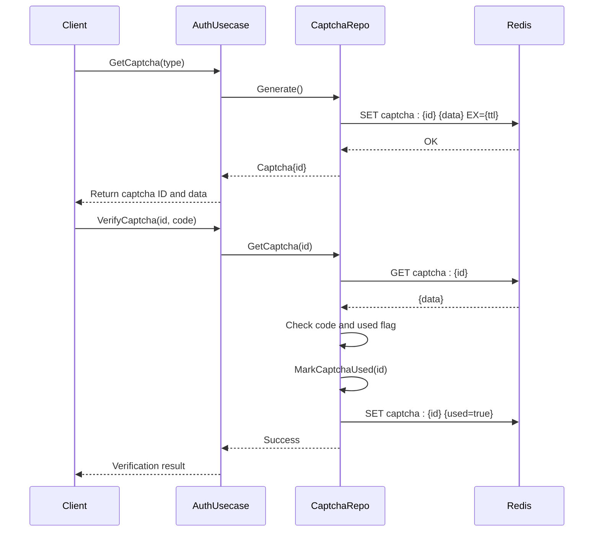
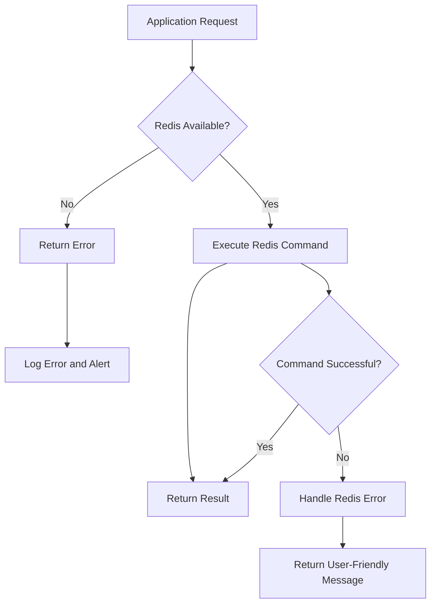

# Redis Usage

<cite>
**Referenced Files in This Document**   
- [config.yaml](file://configs/config.yaml)
- [data.go](file://internal/data/data.go#L1-L95)
- [captcha.go](file://internal/data/captcha.go#L1-L54)
- [auth.go](file://internal/biz/auth.go#L151-L190)
- [captcha_test.go](file://internal/pkg/captcha/captcha_test.go#L490-L541)
</cite>

## Table of Contents
1. [Introduction](#introduction)
2. [Configuration](#configuration)
3. [Data Structures and TTL Management](#data-structures-and-ttl-management)
4. [Captcha Storage and Retrieval](#captcha-storage-and-retrieval)
5. [Authentication Flow Integration](#authentication-flow-integration)
6. [Performance and Connection Handling](#performance-and-connection-handling)
7. [Error Handling and Resilience](#error-handling-and-resilience)
8. [Monitoring and Optimization](#monitoring-and-optimization)

## Introduction
Redis is a critical component in the kratos-boilerplate application, serving as the primary in-memory data store for transient data such as session tokens, account lock states, and captcha codes. It enables fast access to frequently used data, supports time-to-live (TTL) based expiration, and enhances the scalability of authentication and security features. This document details how Redis is configured, used, and managed within the application, focusing on captcha handling, session management, and failover resilience.

**Section sources**
- [config.yaml](file://configs/config.yaml)

## Configuration
The Redis configuration is defined in `config.yaml` under the `data.redis` section. The application uses the `github.com/redis/go-redis/v9` client to establish a connection with Redis. The configuration includes the Redis server address and network timeout settings but does not specify a password or database index, indicating the use of default values (no password, DB 0).

```yaml
data:
  redis:
    addr: 127.0.0.1:6379
    read_timeout: 0.2s
    write_timeout: 0.2s
```

In the `NewData` function, the Redis client is initialized using the provided address and network settings. The connection is established with default database (DB 0) and no password.

```go
redisClient := redis.NewClient(&redis.Options{
    Addr:     c.Redis.Addr,
    Network:  c.Redis.Network,
    Password: "", 
    DB:       0,
})
```

This configuration supports high-throughput, low-latency operations suitable for captcha and session data.

**Section sources**
- [config.yaml](file://configs/config.yaml#L10-L13)
- [data.go](file://internal/data/data.go#L45-L55)

## Data Structures and TTL Management
Redis is used to store structured data using Go's native serialization. The primary data structure used is Redis strings, where Go structs are serialized and stored as binary or JSON-like values. The key naming convention follows a pattern of `{type}:{id}`, such as `captcha:{id}`.

Each stored item is associated with a TTL (Time-To-Live) that ensures automatic expiration. For example, captcha entries are stored with a TTL derived from the `ExpireAt` field:

```go
key := "captcha:" + captcha.ID
return r.data.redis.Set(ctx, key, captcha, time.Until(captcha.ExpireAt)).Err()
```

The TTL is calculated using `time.Until(captcha.ExpireAt)`, which aligns with the application's `CaptchaExpiration` setting (default 5 minutes). This ensures that stale captcha codes are automatically removed from Redis, reducing memory usage and preventing replay attacks.

**Section sources**
- [captcha.go](file://internal/data/captcha.go#L15-L18)

## Captcha Storage and Retrieval
The `captchaRepo` struct implements the `biz.CaptchaRepo` interface to manage captcha lifecycle operations. It uses Redis to persist captcha data, including the ID, code, type, target, expiration time, and usage status.

### Key Operations
- **SaveCaptcha**: Stores a captcha struct in Redis with a TTL.
- **GetCaptcha**: Retrieves and deserializes a captcha from Redis.
- **DeleteCaptcha**: Removes a captcha entry (used for cleanup).
- **MarkCaptchaUsed**: Fetches a captcha, marks it as used, and saves it back.

```go
func (r *captchaRepo) SaveCaptcha(ctx context.Context, captcha *biz.Captcha) error {
    if r.data.redis == nil {
        return fmt.Errorf("redis client is not initialized")
    }
    key := "captcha:" + captcha.ID
    return r.data.redis.Set(ctx, key, captcha, time.Until(captcha.ExpireAt)).Err()
}
```

The `MarkCaptchaUsed` method performs a read-modify-write operation to update the `Used` flag, ensuring that each captcha can only be used once.



**Diagram sources**
- [captcha.go](file://internal/data/captcha.go#L15-L54)
- [auth.go](file://internal/biz/auth.go#L433-L469)

**Section sources**
- [captcha.go](file://internal/data/captcha.go#L15-L54)
- [auth.go](file://internal/biz/auth.go#L433-L469)

## Authentication Flow Integration
Redis plays a key role in the authentication flow by storing temporary data such as captcha codes and account lock states. When a user attempts to log in, the system:

1. Generates a captcha and stores it in Redis with a TTL.
2. Validates the provided captcha code against the stored value.
3. Tracks failed login attempts and locks accounts if the threshold is exceeded.

The `AuthUsecase` uses the `CaptchaService` to generate and verify captchas, which in turn uses the `CaptchaRepo` to interact with Redis. This decoupled design ensures that the business logic remains independent of the storage mechanism.

```go
func (uc *authUsecase) VerifyCaptcha(ctx context.Context, captchaID, captchaCode string) (bool, error) {
    return uc.captchaService.Verify(ctx, captchaID, captchaCode)
}
```

If the captcha is invalid or already used, the login attempt is rejected.

**Section sources**
- [auth.go](file://internal/biz/auth.go#L433-L469)
- [captcha.go](file://internal/data/captcha.go#L45-L54)

## Performance and Connection Handling
The application uses a single Redis client instance with connection pooling managed internally by the `go-redis` library. The client is initialized during application startup and reused across requests, minimizing connection overhead.

Read and write timeouts are set to 200ms, ensuring that Redis operations do not block the request for extended periods. This configuration balances responsiveness with reliability, especially under high load or network latency.

Connection lifecycle is managed via the `cleanup` function returned by `NewData`, which ensures that both the database and Redis connections are properly closed on application shutdown.

```go
cleanup := func() {
    if err := db.Close(); err != nil {
        log.NewHelper(logger).Errorf("failed to close database: %v", err)
    }
    if err := redisClient.Close(); err != nil {
        log.NewHelper(logger).Errorf("failed to close redis: %v", err)
    }
}
```

**Section sources**
- [data.go](file://internal/data/data.go#L57-L67)

## Error Handling and Resilience
The application includes defensive checks to handle Redis unavailability. Before any Redis operation, the code verifies that the `redis` client is initialized:

```go
if r.data.redis == nil {
    return fmt.Errorf("redis client is not initialized")
}
```

If Redis is unreachable, operations like `SaveCaptcha` or `GetCaptcha` will return an error, which propagates up to the API layer. The system does not implement fallback storage (e.g., in-memory), meaning Redis is a hard dependency for captcha and session functionality.

In production, Redis should be deployed with high availability (e.g., Redis Sentinel or Redis Cluster) to minimize downtime. The application should be monitored for Redis connection errors, and alerts should be triggered if the error rate exceeds thresholds.

**Section sources**
- [captcha.go](file://internal/data/captcha.go#L14-L15)

## Monitoring and Optimization
To ensure optimal Redis performance:

- **Memory Usage**: Monitor memory consumption using `INFO memory` and set appropriate `maxmemory` limits with eviction policies (e.g., `allkeys-lru`).
- **Cache Hit Ratio**: Track hit/miss ratios using `INFO stats` to assess effectiveness of TTL settings.
- **Key Expiration**: Use `EXPIRE` commands efficiently; avoid hot keys by distributing load.
- **Persistence**: Configure RDB or AOF based on durability requirements.

Regularly audit Redis keys using `SCAN` to identify stale or oversized entries. For captcha data, ensure that the expiration duration aligns with security policies (e.g., 5 minutes is reasonable for one-time use).



**Diagram sources**
- [captcha.go](file://internal/data/captcha.go#L14-L15)
- [data.go](file://internal/data/data.go#L45-L55)

**Section sources**
- [data.go](file://internal/data/data.go#L45-L55)
- [captcha.go](file://internal/data/captcha.go#L14-L15)