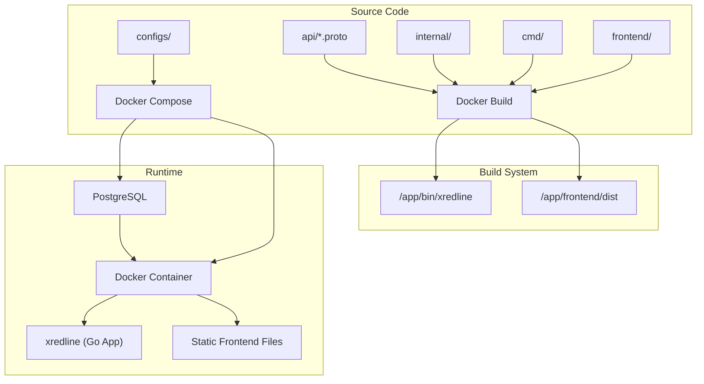
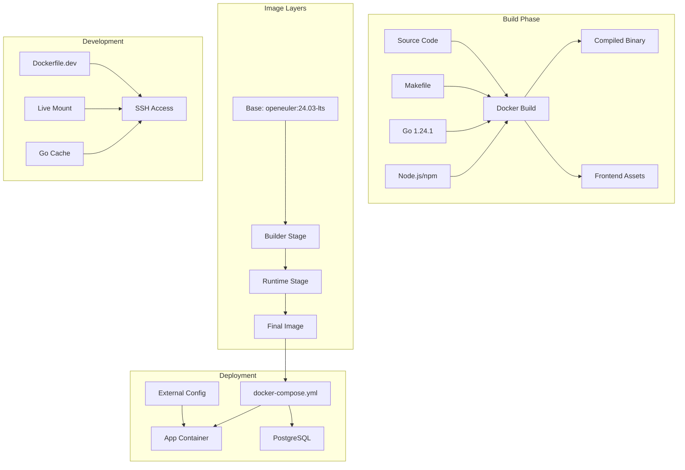
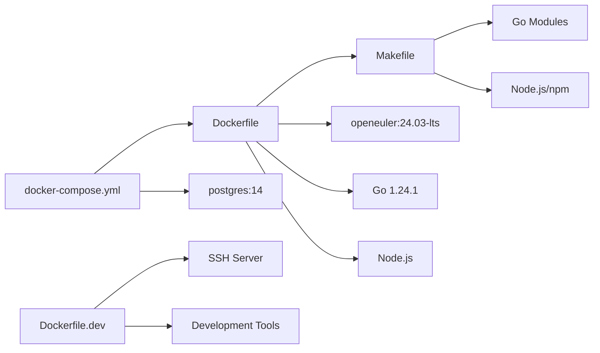

# Docker Setup

<cite>
**Referenced Files in This Document**   
- [Dockerfile](file://Dockerfile#L1-L57)
- [Dockerfile.dev](file://Dockerfile.dev#L1-L71)
- [Makefile](file://Makefile#L1-L141)
- [docker-compose.yml](file://docker-compose.yml#L1-L50)
- [docker-compose.dev.yml](file://docker-compose.dev.yml#L1-L56)
- [main.go](file://cmd/kratos-boilerplate/main.go#L1-L92)
</cite>

## Table of Contents
1. [Introduction](#introduction)
2. [Project Structure](#project-structure)
3. [Core Components](#core-components)
4. [Architecture Overview](#architecture-overview)
5. [Detailed Component Analysis](#detailed-component-analysis)
6. [Dependency Analysis](#dependency-analysis)
7. [Performance Considerations](#performance-considerations)
8. [Troubleshooting Guide](#troubleshooting-guide)
9. [Conclusion](#conclusion)

## Introduction
This document provides a comprehensive overview of the Docker setup in the `kratos-boilerplate` repository. It details the multi-stage Docker build process, integration with the Makefile, and configuration via Docker Compose for both production and development environments. The goal is to enable reproducible, secure, and optimized containerized deployments while supporting efficient development workflows.

## Project Structure
The project follows a modular structure typical of Go-based microservices using the Kratos framework. Key directories include:
- `api/`: Protocol buffer definitions for gRPC and HTTP APIs
- `cmd/kratos-boilerplate/`: Application entry point
- `configs/`: Configuration files for different environments
- `internal/`: Core business logic, data access, and services
- `frontend/`: Frontend assets built with Vue.js
- `migrations/`: Database schema migration scripts
- `Dockerfile`, `Dockerfile.dev`: Container image build definitions
- `Makefile`: Build automation and tooling
- `docker-compose.yml`, `docker-compose.dev.yml`: Multi-container orchestration



**Diagram sources**
- [Dockerfile](file://Dockerfile#L1-L57)
- [docker-compose.yml](file://docker-compose.yml#L1-L50)

**Section sources**
- [Dockerfile](file://Dockerfile#L1-L57)
- [docker-compose.yml](file://docker-compose.yml#L1-L50)

## Core Components

### Dockerfile: Multi-Stage Production Build
The `Dockerfile` implements a two-stage build process to produce a minimal, secure production image.

**Stage 1: Builder**
- Base image: `openeuler/openeuler:24.03-lts`
- Installs Go 1.24.1, Node.js, npm, git, make, and other build tools
- Sets Go environment variables (`GOPROXY`, `GO111MODULE`, `PATH`)
- Copies source code and runs `make build` to compile the Go binary
- Builds the frontend using `npm install && npm run build`

**Stage 2: Runtime**
- Starts from the same minimal base image
- Installs only essential runtime packages (`ca-certificates`, `net-tools`)
- Copies compiled binary from `/src/bin` and frontend assets from `/src/frontend/dist`
- Exposes ports 8000 (HTTP) and 9000 (gRPC)
- Defines volume mount at `/data/conf` for external configuration
- Entry command: `/app/bin/xredline -conf /data/conf`

This approach ensures the final image contains only necessary artifacts, minimizing attack surface and image size.

### Dockerfile.dev: Development Environment
The `Dockerfile.dev` creates a full-featured development container with:
- SSH server for remote access
- Development tools: vim, curl, protobuf compiler
- Go toolchain and Kratos CLI tools pre-installed
- Persistent Go module cache via named volume
- Host source code mounted at `/app` for live reload
- SSH access on port 2222 using host public key

Developers can connect via SSH to work inside a consistent environment with full tooling.

### Makefile Integration
The `Makefile` orchestrates the build process:
- `make build`: Compiles Go code into `./bin/`
- `make api`: Generates gRPC/HTTP stubs from `.proto` files
- `make generate`: Runs code generation and `go mod tidy`
- Used within Docker build context to ensure consistency

The `build` target uses `-ldflags "-X main.Version=$(VERSION)"` to embed Git version information.

### Docker Compose Orchestration
Two Compose files manage multi-container environments:

**docker-compose.yml (Production)**
- Runs the compiled app and PostgreSQL
- Mounts `./configs` as `/data/conf`
- Waits for database readiness via health check
- Uses bridge network for service communication

**docker-compose.dev.yml (Development)**
- Uses `Dockerfile.dev` for hot-reloading development
- Mounts entire project directory
- Exposes SSH port for container access
- Includes Go module caching for faster dependency resolution

**Section sources**
- [Dockerfile](file://Dockerfile#L1-L57)
- [Dockerfile.dev](file://Dockerfile.dev#L1-L71)
- [Makefile](file://Makefile#L1-L141)
- [docker-compose.yml](file://docker-compose.yml#L1-L50)
- [docker-compose.dev.yml](file://docker-compose.dev.yml#L1-L56)

## Architecture Overview



**Diagram sources**
- [Dockerfile](file://Dockerfile#L1-L57)
- [Dockerfile.dev](file://Dockerfile.dev#L1-L71)
- [docker-compose.yml](file://docker-compose.yml#L1-L50)

## Detailed Component Analysis

### Multi-Stage Build Process
The production Docker build separates concerns between build-time and runtime dependencies.

```mermaid
flowchart TD
Start([Start]) --> Builder["FROM openeuler AS builder"]
Builder --> InstallTools["Install Go, Node.js, Build Tools"]
InstallTools --> CopyCode["COPY . /src"]
CopyCode --> BuildBackend["RUN make build"]
BuildBackend --> BuildFrontend["RUN npm install && npm run build"]
BuildFrontend --> Runtime["FROM openeuler"]
Runtime --> InstallRuntime["Install ca-certificates, net-tools"]
InstallRuntime --> CopyArtifacts["COPY --from=builder /src/bin /app/bin"]
CopyArtifacts --> CopyFrontend["COPY --from=builder /src/frontend/dist /app/frontend"]
CopyFrontend --> Configure["EXPOSE 8000, 9000<br/>VOLUME /data/conf"]
Configure --> CMD["CMD [\"/app/bin/xredline\", \"-conf\", \"/data/conf\"]"]
CMD --> End([Final Image])
```

**Diagram sources**
- [Dockerfile](file://Dockerfile#L1-L57)

**Section sources**
- [Dockerfile](file://Dockerfile#L1-L57)

### Build Optimization and Caching
The current setup can be enhanced with build arguments and layer optimization:

```dockerfile
# Suggested improvement: Use ARG for Go version
ARG GO_VERSION=1.24.1
RUN wget https://go.dev/dl/go${GO_VERSION}.linux-amd64.tar.gz && \
    tar -C /usr/local -xzf go${GO_VERSION}.linux-amd64.tar.gz && \
    rm go${GO_VERSION}.linux-amd64.tar.gz
```

For CI/CD pipelines, consider:
- Using buildx for multi-platform images
- Leveraging buildkit for improved caching
- Signing images with Cosign
- Scanning with Trivy

### Configuration Management
The application uses external configuration mounted at runtime:
- `configs/config.yaml`: Main application config
- `configs/plugins/*.yaml`: Plugin configurations
- Environment-specific feature flags (`features.dev.yaml`, etc.)
- Mounted via Docker volume: `./configs:/data/conf`

This enables configuration changes without rebuilding the image.

**Section sources**
- [Dockerfile](file://Dockerfile#L1-L57)
- [configs/config.yaml](file://configs/config.yaml)
- [main.go](file://cmd/kratos-boilerplate/main.go#L1-L92)

## Dependency Analysis



**Diagram sources**
- [Dockerfile](file://Dockerfile#L1-L57)
- [Makefile](file://Makefile#L1-L141)
- [docker-compose.yml](file://docker-compose.yml#L1-L50)
- [Dockerfile.dev](file://Dockerfile.dev#L1-L71)

**Section sources**
- [Dockerfile](file://Dockerfile#L1-L57)
- [Makefile](file://Makefile#L1-L141)

## Performance Considerations
- **Image Size**: Multi-stage build reduces final image size by excluding build tools
- **Layer Caching**: Order of Dockerfile instructions optimizes layer reuse
- **Frontend Optimization**: Webpack/Vite build produces minified static assets
- **Database Connection**: Health check ensures app starts only after DB is ready
- **Resource Usage**: Minimal base image reduces memory footprint

For production, consider:
- Using distroless images
- Setting resource limits in Docker Compose
- Enabling Go pprof for performance profiling
- Implementing readiness/liveness probes

## Troubleshooting Guide
**Common Issues and Solutions:**

| Issue | Solution |
|------|----------|
| Build fails due to missing protoc-gen-go | Run `make init` to install required tools |
| Frontend assets not found | Ensure `npm install` completes successfully in build |
| Database connection refused | Verify health check passes; check PostgreSQL logs |
| Configuration not loaded | Confirm `./configs` is mounted correctly |
| SSH connection refused in dev | Check that `~/.ssh/id_rsa.pub` exists and is mounted |

**Debugging Commands:**
```bash
# View container logs
docker logs cross-redline-app

# Execute shell in running container
docker exec -it cross-redline-app /bin/bash

# Check volume mounts
docker inspect cross-redline-app | grep Mounts

# Test database connectivity
docker exec cross-redline-db psql -U postgres -c "SELECT 1"
```

**Section sources**
- [Dockerfile](file://Dockerfile#L1-L57)
- [docker-compose.yml](file://docker-compose.yml#L1-L50)
- [Dockerfile.dev](file://Dockerfile.dev#L1-L71)

## Conclusion
The Docker setup in `kratos-boilerplate` provides a robust foundation for both development and production deployments. The multi-stage build process ensures small, secure images, while the development container supports efficient iterative development. Integration with Makefile guarantees build consistency, and Docker Compose simplifies multi-service orchestration. By following these patterns, teams can achieve reproducible builds, minimize security risks, and streamline deployment workflows.