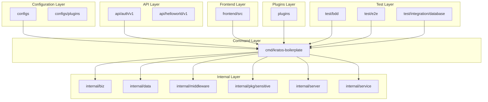
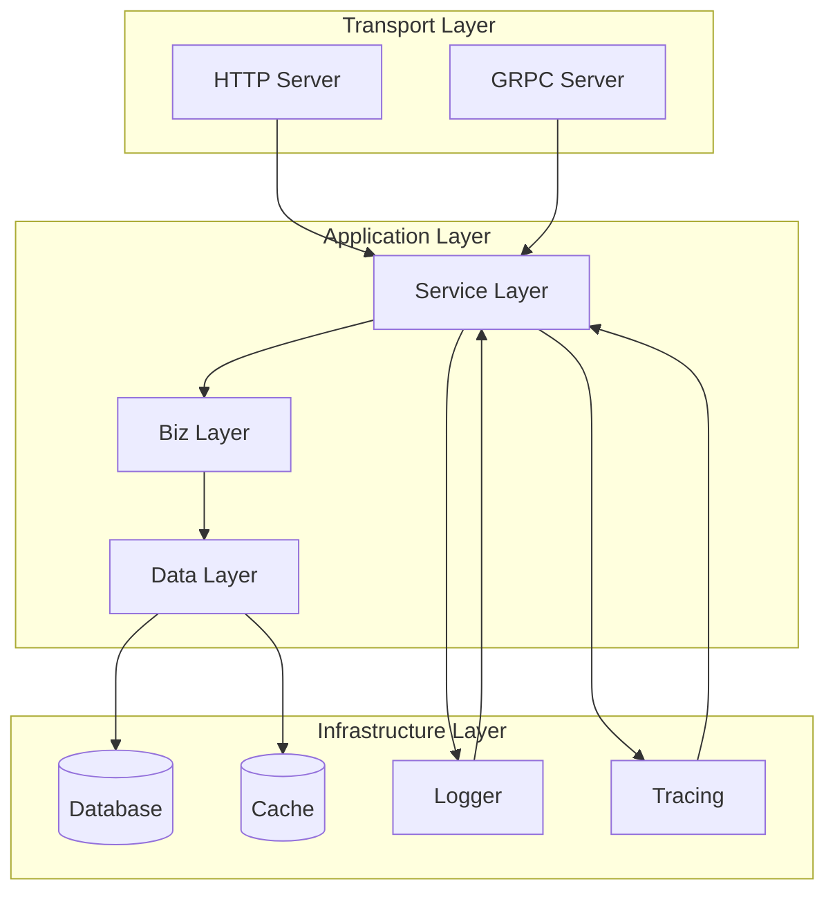
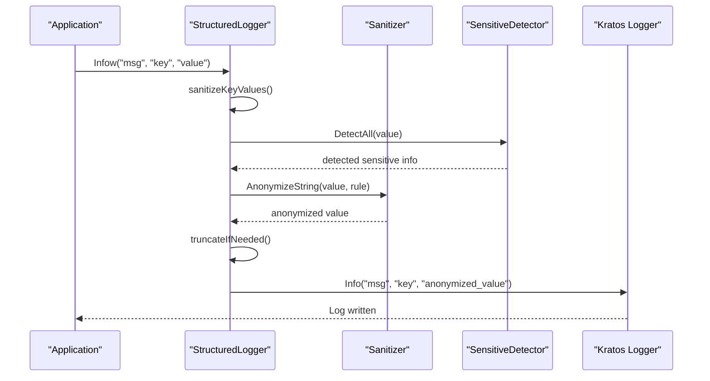
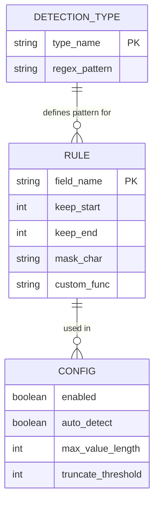
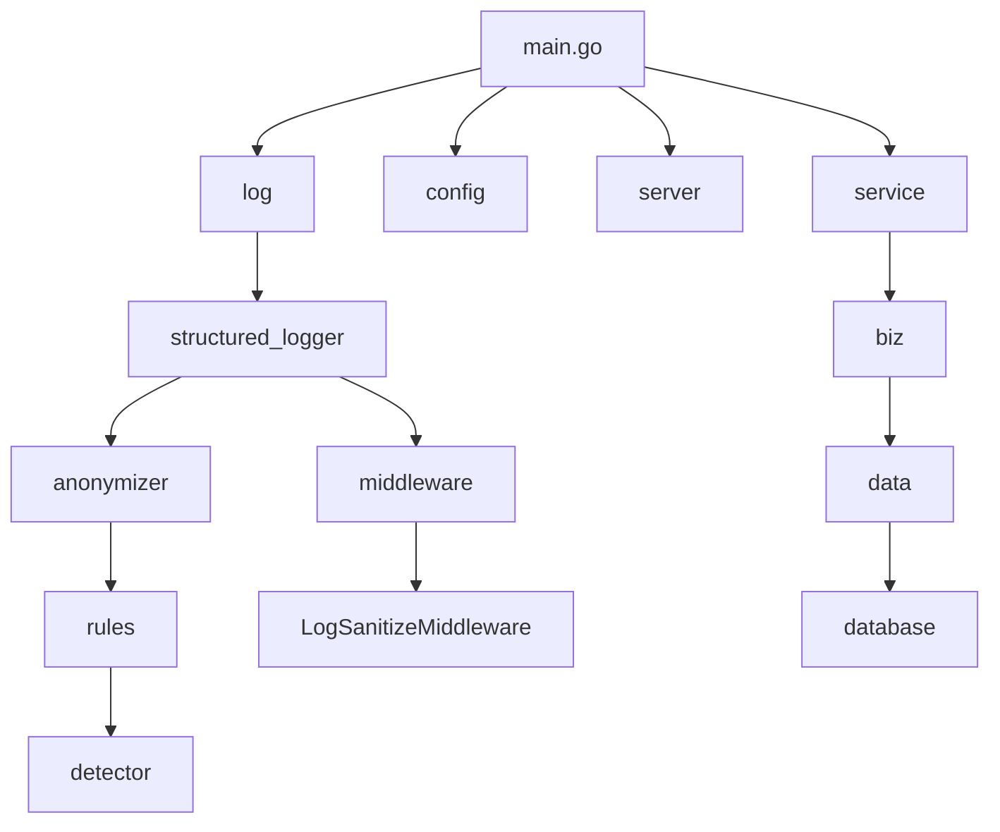

# Monitoring

<cite>
**Referenced Files in This Document**   
- [main.go](file://cmd/kratos-boilerplate/main.go)
- [structured_logger.go](file://internal/pkg/sensitive/structured_logger.go)
- [anonymizer.go](file://internal/pkg/sensitive/anonymizer.go)
- [rules.go](file://internal/pkg/sensitive/rules.go)
- [interfaces.go](file://internal/pkg/sensitive/interfaces.go)
- [middleware.go](file://internal/pkg/sensitive/middleware.go)
- [README.md](file://internal/pkg/sensitive/README.md)
</cite>

## Table of Contents
1. [Introduction](#introduction)
2. [Project Structure](#project-structure)
3. [Core Components](#core-components)
4. [Architecture Overview](#architecture-overview)
5. [Detailed Component Analysis](#detailed-component-analysis)
6. [Dependency Analysis](#dependency-analysis)
7. [Performance Considerations](#performance-considerations)
8. [Troubleshooting Guide](#troubleshooting-guide)
9. [Conclusion](#conclusion)

## Introduction
This document provides comprehensive monitoring guidance for kratos-boilerplate deployments. It explains how operation logging and structured logging via the sensitive package enable observability. The document covers log format, levels, and sensitive data redaction mechanisms. It guides integration with monitoring systems such as Prometheus, Grafana, and ELK by exposing metrics endpoints and configuring log aggregation. Key metrics to monitor include request latency, error rates, and database performance, with recommended alerting thresholds provided. The document includes examples of tracing request flows across services and diagnosing performance bottlenecks. Strategies for log retention, rotation, and compliance with data protection regulations are also detailed.

## Project Structure
The kratos-boilerplate project follows a modular structure with clear separation of concerns. The main components include API definitions, business logic, data access, middleware, and configuration files. The project uses a layered architecture with distinct directories for different responsibilities.



**Diagram sources**
- [main.go](file://cmd/kratos-boilerplate/main.go#L1-L91)
- [project_structure](file://#L1-L100)

**Section sources**
- [main.go](file://cmd/kratos-boilerplate/main.go#L1-L91)

## Core Components
The core components of the kratos-boilerplate project include the main application entry point, structured logging with sensitive data handling, and middleware for operation logging. The main.go file serves as the entry point, initializing the application with configuration, logging, and server setup. The sensitive package provides structured logging with automatic redaction of sensitive information.

**Section sources**
- [main.go](file://cmd/kratos-boilerplate/main.go#L1-L91)
- [structured_logger.go](file://internal/pkg/sensitive/structured_logger.go#L1-L388)

## Architecture Overview
The kratos-boilerplate architecture follows the Kratos framework patterns with a clear separation between transport, business logic, and data layers. The application uses dependency injection via Wire for component initialization. Structured logging with sensitive data handling is implemented through the sensitive package, which integrates with the Kratos logging system.



**Diagram sources**
- [main.go](file://cmd/kratos-boilerplate/main.go#L1-L91)
- [structured_logger.go](file://internal/pkg/sensitive/structured_logger.go#L1-L388)

## Detailed Component Analysis

### Structured Logging with Sensitive Data Handling
The sensitive package provides a comprehensive solution for structured logging with automatic redaction of sensitive information. It implements a StructuredLogger that wraps the Kratos log.Helper and provides methods for structured logging (Infow, Debugw, Errorw, etc.) with automatic sensitive data detection and redaction.

#### Class Diagram of Structured Logging Components
```mermaid
classDiagram
class StructuredLogger {
+helper *log.Helper
+logger log.Logger
+anonymizer Anonymizer
+rules map[string]AnonymizeRule
+config *StructuredLogConfig
+Infow(msg string, keysAndValues ...interface{})
+Debugw(msg string, keysAndValues ...interface{})
+Errorw(msg string, keysAndValues ...interface{})
+Warnw(msg string, keysAndValues ...interface{})
+Fatalw(msg string, keysAndValues ...interface{})
+WithContext(ctx context.Context) StructuredLoggerInterface
+WithFields(keysAndValues ...interface{}) StructuredLoggerInterface
}
class StructuredLogConfig {
+Enabled bool
+AutoDetect bool
+CustomRules map[string]AnonymizeRule
+SensitiveKeys []string
+MaxValueLength int
+TruncateThreshold int
}
class Anonymizer {
+AnonymizeString(value string, rule AnonymizeRule) string
+AnonymizeObject(obj MakeSensitive) interface{}
+AnonymizeBatch(objects []MakeSensitive) []interface{}
+AnonymizeValue(value interface{}, rules map[string]AnonymizeRule) interface{}
}
class AnonymizeRule {
+FieldName string
+KeepStart int
+KeepEnd int
+MaskChar string
+CustomFunc func(string) string
}
class SensitiveDetector {
+DetectSensitiveInfo(text string, infoType string) []string
+DetectAll(text string) map[string][]string
+HasSensitiveInfo(text string, infoType string) bool
}
StructuredLogger --> StructuredLogConfig : "uses"
StructuredLogger --> Anonymizer : "uses"
StructuredLogger --> SensitiveDetector : "uses"
Anonymizer --> AnonymizeRule : "uses"
SensitiveDetector --> AnonymizeRule : "uses"
```

**Diagram sources**
- [structured_logger.go](file://internal/pkg/sensitive/structured_logger.go#L1-L388)
- [anonymizer.go](file://internal/pkg/sensitive/anonymizer.go#L1-L380)
- [rules.go](file://internal/pkg/sensitive/rules.go#L1-L224)
- [interfaces.go](file://internal/pkg/sensitive/interfaces.go#L1-L122)

#### Sequence Diagram of Log Processing


**Diagram sources**
- [structured_logger.go](file://internal/pkg/sensitive/structured_logger.go#L1-L388)
- [anonymizer.go](file://internal/pkg/sensitive/anonymizer.go#L1-L380)

**Section sources**
- [structured_logger.go](file://internal/pkg/sensitive/structured_logger.go#L1-L388)
- [anonymizer.go](file://internal/pkg/sensitive/anonymizer.go#L1-L380)
- [rules.go](file://internal/pkg/sensitive/rules.go#L1-L224)
- [interfaces.go](file://internal/pkg/sensitive/interfaces.go#L1-L122)
- [README.md](file://internal/pkg/sensitive/README.md#L1-L339)

### Log Format and Levels
The structured logging system uses a consistent format with key-value pairs for structured data. The log levels follow standard conventions: DEBUG, INFO, WARN, ERROR, and FATAL. Each log entry includes a message and structured key-value pairs that can be easily parsed by log aggregation systems.

#### Flowchart of Log Level Usage
```mermaid
flowchart TD
Start([Application Event]) --> LevelDecision{"Event Type?"}
LevelDecision --> |Detailed Debug Info| DEBUG["Debugw(\"debug info\", key, value)"]
LevelDecision --> |Normal Operation| INFO["Infow(\"operation\", key, value)"]
LevelDecision --> |Potential Issue| WARN["Warnw(\"warning\", key, value)"]
LevelDecision --> |Error Occurred| ERROR["Errorw(\"error\", key, value)"]
LevelDecision --> |Critical Failure| FATAL["Fatalw(\"failure\", key, value)"]
DEBUG --> Output
INFO --> Output
WARN --> Output
ERROR --> Output
FATAL --> Output
Output([Log Output])
```

**Diagram sources**
- [structured_logger.go](file://internal/pkg/sensitive/structured_logger.go#L1-L388)

**Section sources**
- [structured_logger.go](file://internal/pkg/sensitive/structured_logger.go#L1-L388)

### Sensitive Data Redaction Mechanisms
The sensitive data redaction system automatically detects and redacts sensitive information in log entries. It uses predefined rules for common sensitive data types (email, phone, ID card, etc.) and supports custom rules for application-specific needs.

#### Data Model of Sensitive Data Rules


**Diagram sources**
- [rules.go](file://internal/pkg/sensitive/rules.go#L1-L224)
- [anonymizer.go](file://internal/pkg/sensitive/anonymizer.go#L1-L380)

**Section sources**
- [rules.go](file://internal/pkg/sensitive/rules.go#L1-L224)
- [anonymizer.go](file://internal/pkg/sensitive/anonymizer.go#L1-L380)

## Dependency Analysis
The kratos-boilerplate project has a well-defined dependency structure with clear separation between components. The main dependencies include the Kratos framework for the core functionality, Go modules for package management, and various third-party libraries for specific features.



**Diagram sources**
- [go.mod](file://go.mod#L1-L30)
- [main.go](file://cmd/kratos-boilerplate/main.go#L1-L91)

**Section sources**
- [go.mod](file://go.mod#L1-L30)
- [main.go](file://cmd/kratos-boilerplate/main.go#L1-L91)

## Performance Considerations
The structured logging system is designed to balance security and performance. The sensitive data detection and redaction add some overhead, but this can be controlled through configuration options. In performance-critical scenarios, the redaction can be disabled or configured to only process specific fields.

### Performance Optimization Strategies
- Disable auto-detection of sensitive data when not needed
- Set appropriate value length limits to prevent excessive processing
- Use the WithFields method to add common fields once rather than repeatedly
- Consider disabling redaction in development environments
- Monitor the performance impact of logging in production

**Section sources**
- [structured_logger.go](file://internal/pkg/sensitive/structured_logger.go#L1-L388)
- [anonymizer.go](file://internal/pkg/sensitive/anonymizer.go#L1-L380)

## Troubleshooting Guide
When encountering issues with the monitoring and logging system, consider the following common problems and solutions:

### Common Issues and Solutions
1. **Sensitive data not being redacted**
   - Check that the StructuredLogConfig.Enabled flag is set to true
   - Verify that the field names match the sensitive keys in the configuration
   - Ensure that custom rules are properly defined and loaded

2. **Performance degradation due to logging**
   - Disable auto-detection of sensitive data with AutoDetect = false
   - Set MaxValueLength to limit the size of values being processed
   - Consider disabling redaction for non-production environments

3. **Log format issues**
   - Ensure that structured logging methods (Infow, etc.) are used instead of formatted logging
   - Verify that key-value pairs are provided in the correct order
   - Check that the logger is properly initialized with the structured logger

4. **Missing log entries**
   - Verify that the log level is set appropriately for the environment
   - Check that the logger output is properly configured (stdout, file, etc.)
   - Ensure that the structured logger is being used throughout the application

**Section sources**
- [structured_logger.go](file://internal/pkg/sensitive/structured_logger.go#L1-L388)
- [middleware.go](file://internal/pkg/sensitive/middleware.go#L1-L327)
- [README.md](file://internal/pkg/sensitive/README.md#L1-L339)

## Conclusion
The kratos-boilerplate project provides a robust foundation for monitoring and observability through its structured logging system with sensitive data handling. The integration of the sensitive package ensures that logs are both informative and secure, automatically redacting sensitive information while maintaining the structure needed for effective monitoring. The system can be easily integrated with standard monitoring tools like Prometheus, Grafana, and ELK stack by configuring log aggregation and exposing metrics endpoints. By following the guidelines in this document, teams can effectively monitor their kratos-boilerplate deployments, quickly diagnose issues, and maintain compliance with data protection regulations.