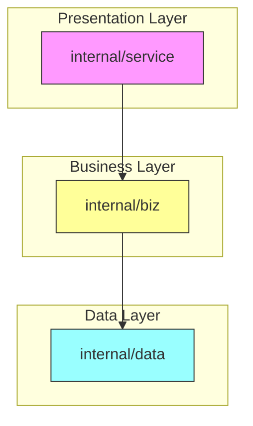
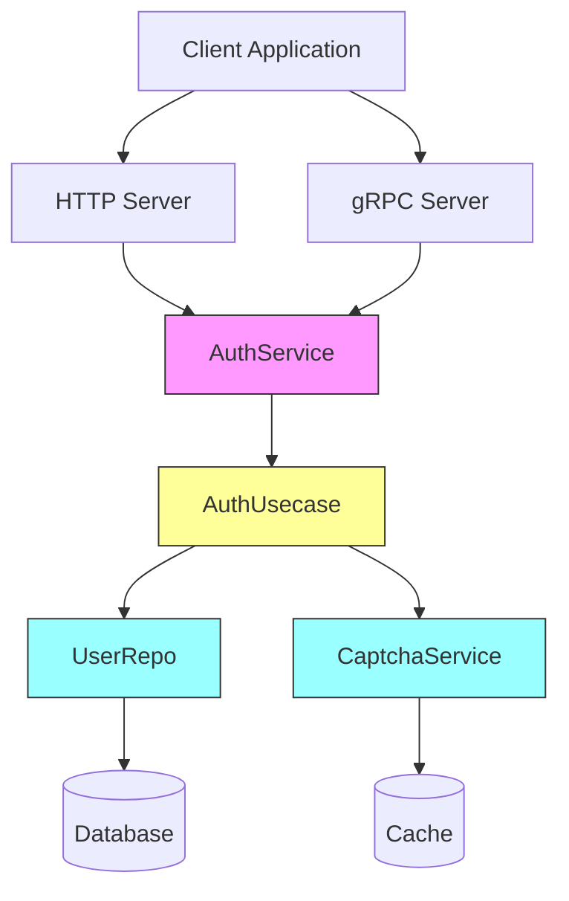
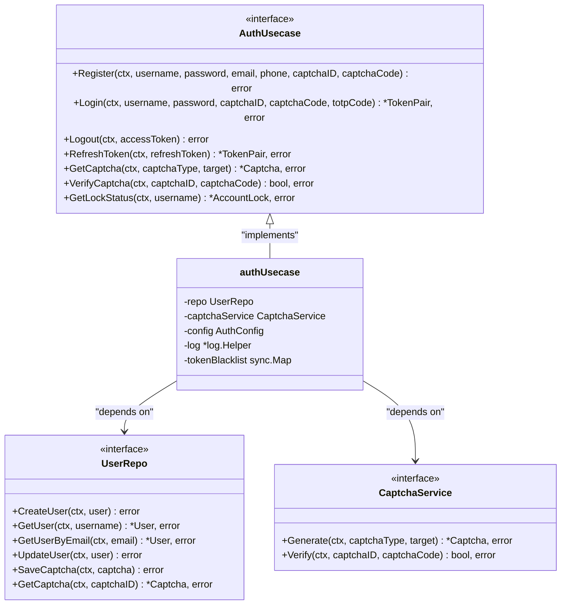
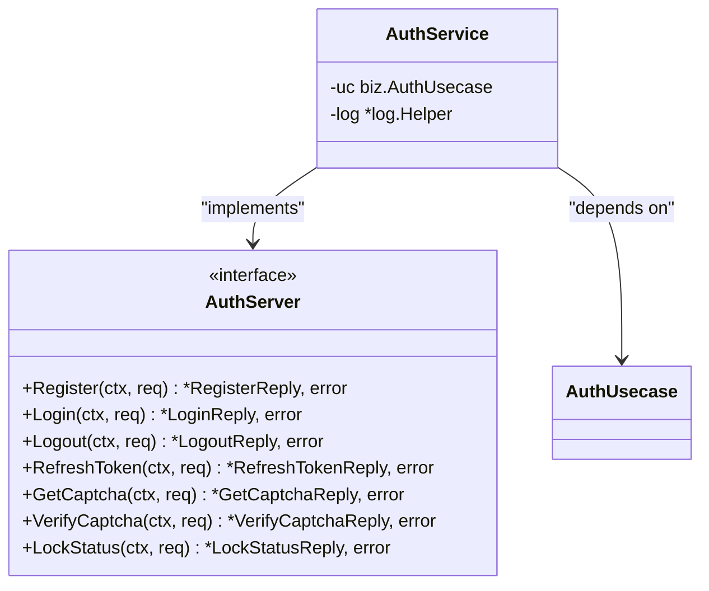
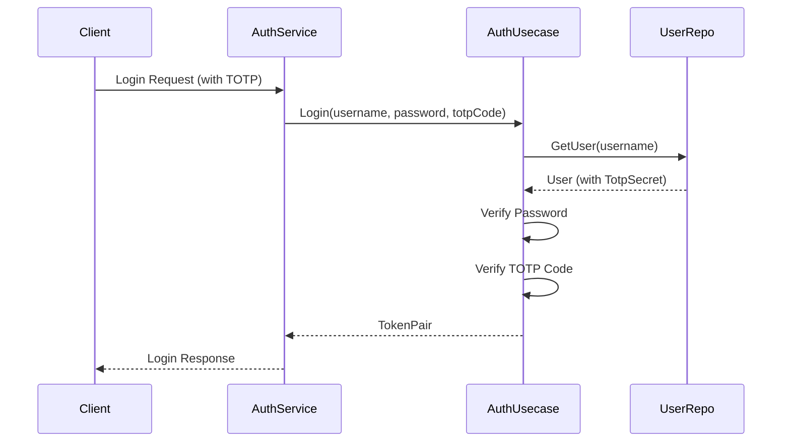
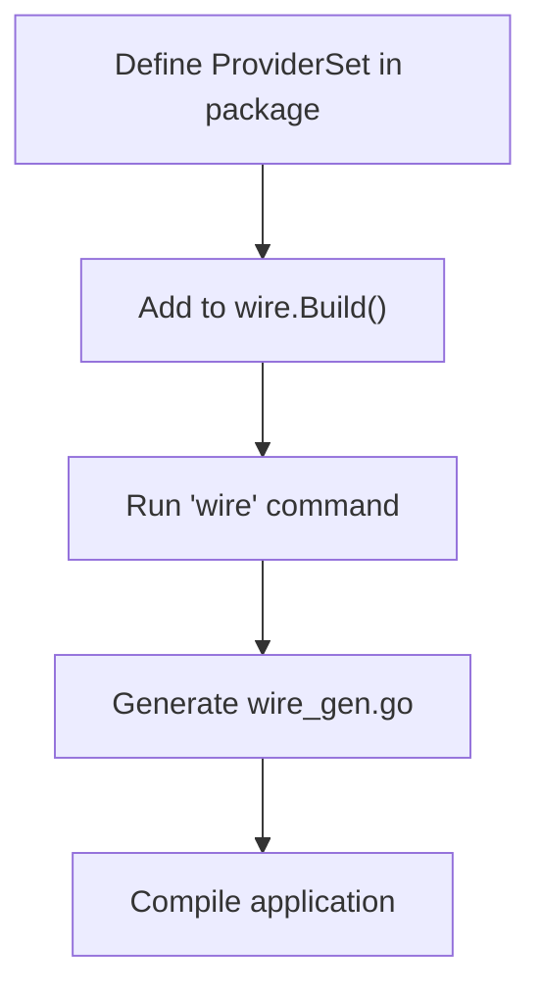
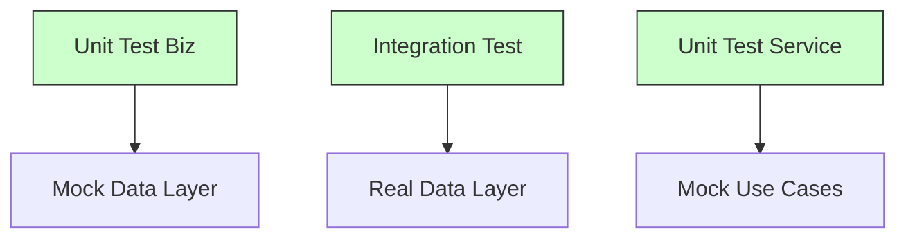

# Adding New Features

<cite>
**Referenced Files in This Document**   
- [biz.go](file://internal/biz/biz.go#L1-L26)
- [auth.go](file://internal/biz/auth.go#L1-L695)
- [data.go](file://internal/data/auth.go#L1-L438)
- [service.go](file://internal/service/auth.go#L1-L235)
- [wire.go](file://cmd/kratos-boilerplate/wire.go#L1-L27)
- [wire_gen.go](file://cmd/kratos-boilerplate/wire_gen.go#L1-L54)
</cite>

## Table of Contents
1. [Introduction](#introduction)
2. [Project Structure](#project-structure)
3. [Core Components](#core-components)
4. [Architecture Overview](#architecture-overview)
5. [Detailed Component Analysis](#detailed-component-analysis)
6. [Adding Multi-Factor Authentication Feature](#adding-multi-factor-authentication-feature)
7. [Dependency Injection with Wire](#dependency-injection-with-wire)
8. [Maintaining Clean Architecture](#maintaining-clean-architecture)
9. [Common Pitfalls and Debugging](#common-pitfalls-and-debugging)
10. [Conclusion](#conclusion)

## Introduction
This document provides a comprehensive guide for adding new features to the kratos-boilerplate project, with a focus on extending the authentication system with multi-factor authentication (MFA). The guide covers the end-to-end workflow from defining use cases in the biz layer to exposing functionality through services, while maintaining Clean Architecture principles and proper dependency management via Wire.

## Project Structure
The kratos-boilerplate follows a Clean Architecture pattern with clear separation of concerns. The key directories for feature development are:

- **internal/biz**: Contains business logic and use cases
- **internal/data**: Implements data access and persistence
- **internal/service**: Exposes business functionality via APIs
- **cmd/kratos-boilerplate**: Application entry point and dependency injection configuration



**Diagram sources**
- [auth.go](file://internal/biz/auth.go#L1-L695)
- [auth.go](file://internal/data/auth.go#L1-L438)
- [auth.go](file://internal/service/auth.go#L1-L235)

**Section sources**
- [auth.go](file://internal/biz/auth.go#L1-L695)
- [auth.go](file://internal/data/auth.go#L1-L438)
- [auth.go](file://internal/service/auth.go#L1-L235)

## Core Components
The authentication system consists of three main components that follow the Clean Architecture pattern:

1. **Business Logic (biz)**: Defines use cases and business rules
2. **Data Access (data)**: Handles persistence and data operations
3. **Service Layer (service)**: Exposes functionality via gRPC/HTTP

The components are connected through interfaces, ensuring loose coupling and testability.

**Section sources**
- [auth.go](file://internal/biz/auth.go#L1-L695)
- [auth.go](file://internal/data/auth.go#L1-L438)
- [auth.go](file://internal/service/auth.go#L1-L235)

## Architecture Overview
The kratos-boilerplate implements a layered architecture where dependencies flow inward, from higher-level components to lower-level ones. This ensures that business logic remains independent of implementation details.



**Diagram sources**
- [auth.go](file://internal/biz/auth.go#L1-L695)
- [auth.go](file://internal/data/auth.go#L1-L438)
- [auth.go](file://internal/service/auth.go#L1-L235)

## Detailed Component Analysis

### Business Logic Layer Analysis
The business logic layer defines use cases through interfaces and implementations. The `AuthUsecase` interface in `internal/biz/auth.go` specifies all authentication operations.



**Diagram sources**
- [auth.go](file://internal/biz/auth.go#L1-L695)

**Section sources**
- [auth.go](file://internal/biz/auth.go#L1-L695)

### Data Access Layer Analysis
The data access layer implements the interfaces defined in the business layer. The `userRepo` struct provides concrete implementations for user-related operations.


**Diagram sources**
- [auth.go](file://internal/data/auth.go#L1-L438)

**Section sources**
- [auth.go](file://internal/data/auth.go#L1-L438)

### Service Layer Analysis
The service layer exposes business functionality via gRPC endpoints. The `AuthService` struct implements the gRPC server interface.



**Diagram sources**
- [auth.go](file://internal/service/auth.go#L1-L235)

**Section sources**
- [auth.go](file://internal/service/auth.go#L1-L235)

## Adding Multi-Factor Authentication Feature

### Step 1: Define Use Case in Biz Layer
To add multi-factor authentication, first extend the `AuthUsecase` interface in `internal/biz/auth.go`. The interface already includes support for TOTP (Time-based One-Time Password) through the `totpCode` parameter in the `Login` method.

```go
// Login method already supports MFA
Login(ctx context.Context, username, password, captchaID, captchaCode, totpCode string) (*TokenPair, error)
```

The implementation checks if TOTP is enabled and validates the provided code:

```go
// If TOTP is enabled and user has a secret, verify the code
if uc.config.TOTPEnabled && user.TotpSecret != "" {
    if totpCode == "" {
        return nil, ErrTotpRequired
    }
    if !uc.verifyTOTP(user.TotpSecret, totpCode) {
        return nil, ErrTotpCodeInvalid
    }
}
```

### Step 2: Implement Business Logic
The business logic for MFA is already partially implemented. To complete it:

1. Add methods to manage TOTP secrets
2. Implement proper TOTP validation using a library like `github.com/pquerna/otp`



**Diagram sources**
- [auth.go](file://internal/biz/auth.go#L1-L695)
- [auth.go](file://internal/service/auth.go#L1-L235)

**Section sources**
- [auth.go](file://internal/biz/auth.go#L1-L695)
- [auth.go](file://internal/service/auth.go#L1-L235)

### Step 3: Update Data Access Methods
The `User` struct in `internal/biz/auth.go` already includes a `TotpSecret` field. The `userRepo` in `internal/data/auth.go` automatically handles this field through the encryption system.

No changes are needed in the data layer as the existing encryption infrastructure handles the TOTP secret securely.

### Step 4: Expose Functionality Through Service
The `AuthService` in `internal/service/auth.go` already exposes MFA functionality through the `Login` method, which accepts a `totpCode` parameter.

Error handling for MFA is properly implemented:

```go
// In service/auth.go
case biz.ErrTotpRequired:
    return nil, errors.BadRequest("TOTP_REQUIRED", "需要TOTP验证码")
case biz.ErrTotpCodeInvalid:
    return nil, errors.BadRequest("TOTP_INVALID", "TOTP验证码无效")
```

## Dependency Injection with Wire

### Wire Configuration
Dependency injection is managed using Google Wire in `cmd/kratos-boilerplate/wire.go`. The `ProviderSet` variables in each package register components for injection.

```go
// In internal/biz/biz.go
var ProviderSet = wire.NewSet(NewGreeterUsecase, NewAuthUsecase, NewAuthConfig)

// In cmd/kratos-boilerplate/wire.go
func wireApp(*conf.Server, *conf.Data, *conf.Auth, *conf.Bootstrap, log.Logger) (*kratos.App, func(), error) {
    wire.Build(server.ProviderSet, data.ProviderSet, biz.ProviderSet, service.ProviderSet, plugin.ProviderSet, feature.ProviderSet, newApp)
    return nil, nil, nil
}
```

### Registration Process
When adding new components:

1. Create a `ProviderSet` in the component's package
2. Add the provider set to `wireApp` in `wire.go`
3. Run `wire` to generate the dependency injection code



**Diagram sources**
- [wire.go](file://cmd/kratos-boilerplate/wire.go#L1-L27)
- [wire_gen.go](file://cmd/kratos-boilerplate/wire_gen.go#L1-L54)

**Section sources**
- [wire.go](file://cmd/kratos-boilerplate/wire.go#L1-L27)
- [wire_gen.go](file://cmd/kratos-boilerplate/wire_gen.go#L1-L54)

## Maintaining Clean Architecture

### Dependency Rules
The project enforces Clean Architecture principles:

1. **Dependencies point inward**: Source code dependencies can only point inwards
2. **Business logic is independent**: Biz layer doesn't depend on service or data layers
3. **Interfaces define contracts**: Data layer implements interfaces defined in biz layer

### Layer Responsibilities
- **Biz Layer**: Contains pure business logic, use cases, and domain models
- **Data Layer**: Implements data access, handles persistence, and manages external dependencies
- **Service Layer**: Translates between external protocols (gRPC/HTTP) and business logic

### Testing Considerations
The architecture enables easy testing:

- Business logic can be tested without database
- Data layer can be tested with mocks
- Service layer can be tested with mocked use cases



**Diagram sources**
- [auth.go](file://internal/biz/auth.go#L1-L695)
- [auth.go](file://internal/data/auth.go#L1-L438)
- [auth.go](file://internal/service/auth.go#L1-L235)

## Common Pitfalls and Debugging

### Circular Dependencies
Circular dependencies are prevented by:

1. Using interfaces to decouple components
2. Following the dependency rule (dependencies point inward)
3. Using Wire for dependency injection

If circular dependencies occur:

1. Check import statements
2. Ensure interfaces are in the correct layer
3. Use Wire to detect dependency cycles

### Layer Violations
Common layer violations and solutions:

- **Biz layer importing service/data**: Move shared types to a common package
- **Service layer containing business logic**: Extract logic to biz layer
- **Data layer knowing about HTTP/gRPC**: Keep data layer protocol-agnostic

### Debugging Feature Registration
When feature registration fails:

1. Check `wire_gen.go` for generated code
2. Verify all dependencies are provided
3. Ensure Wire sets are properly registered

```bash
# Regenerate wire code
cd cmd/kratos-boilerplate
wire
```

### Testing Strategies
Effective testing approaches:

1. **Unit tests**: Test business logic in isolation
2. **Integration tests**: Test data layer with real database
3. **End-to-end tests**: Test complete workflows

The project includes comprehensive test files:
- `internal/biz/auth_test.go`: Business logic tests
- `internal/data/auth_database_test.go`: Data layer integration tests
- `internal/service/auth_test.go`: Service layer tests

**Section sources**
- [auth_test.go](file://internal/biz/auth_test.go#L1-L10)
- [auth_database_test.go](file://internal/data/auth_database_test.go#L1-L10)
- [auth_test.go](file://internal/service/auth_test.go#L1-L10)

## Conclusion
Adding new features to kratos-boilerplate follows a consistent pattern that maintains Clean Architecture principles. By following the workflow from biz to data to service layers and using Wire for dependency injection, developers can extend the system while keeping code organized and testable. The authentication system already supports multi-factor authentication, demonstrating how complex features can be implemented within this architecture. Key success factors include maintaining layer boundaries, using interfaces for decoupling, and leveraging Wire for dependency management.