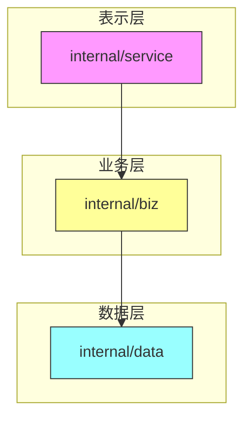
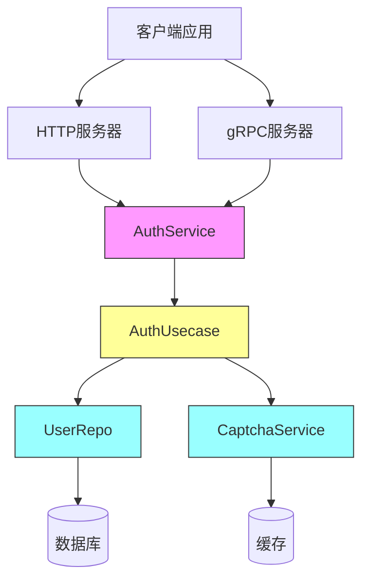
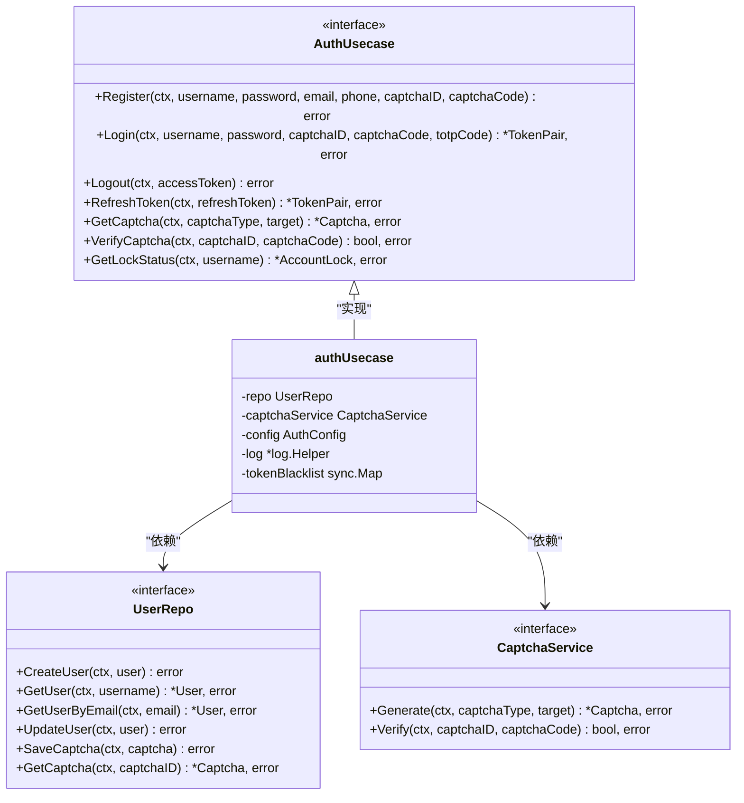
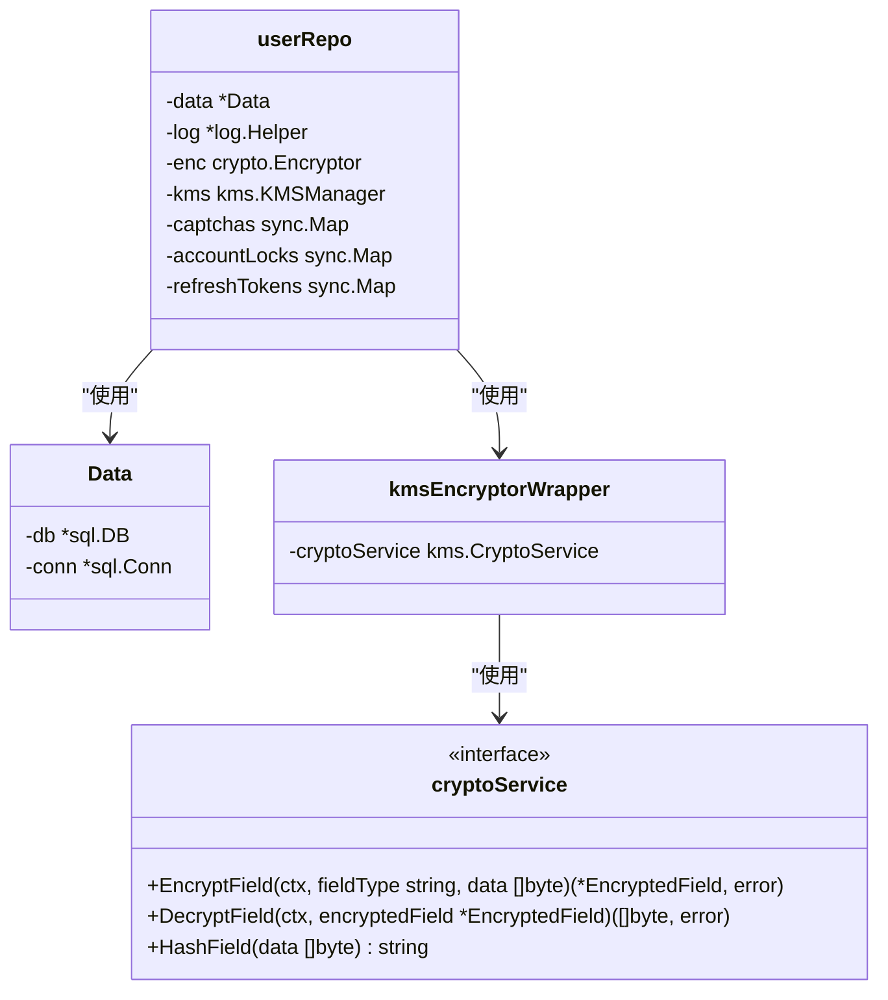
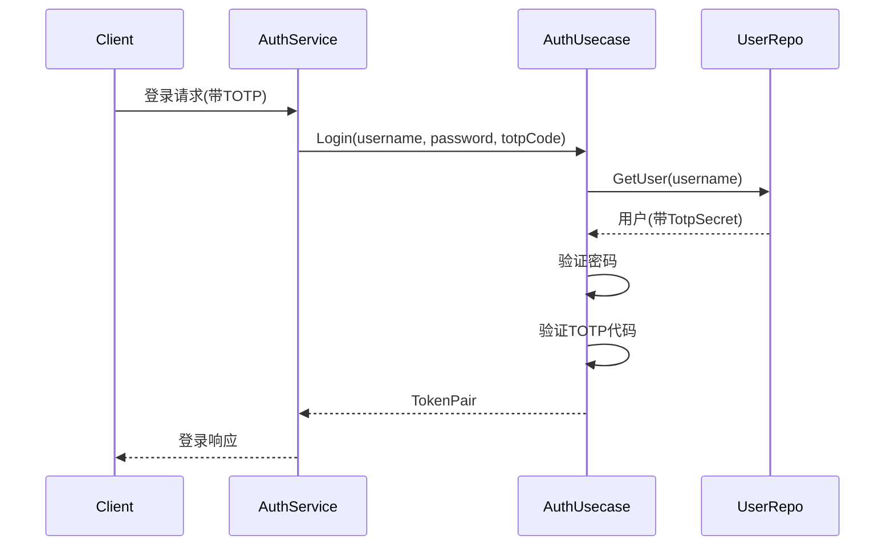
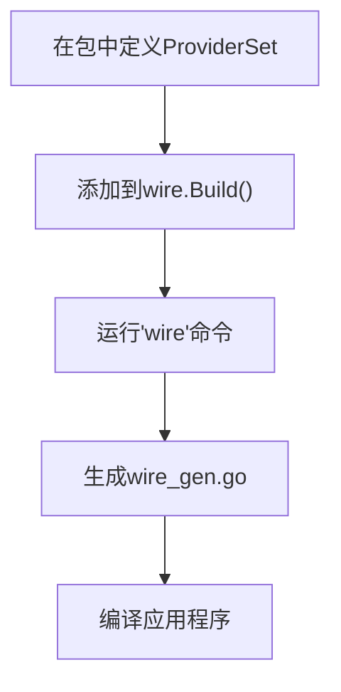
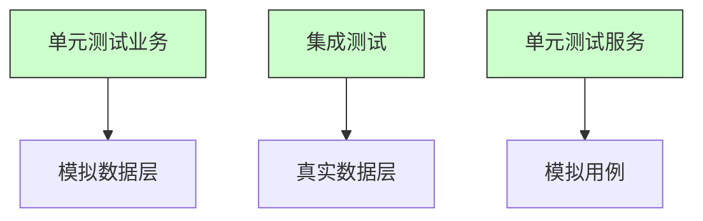

# 添加新功能

<cite>
**本文档引用的文件**   
- [biz.go](file://internal/biz/biz.go) - *更新于最近提交*
- [auth.go](file://internal/biz/auth.go) - *在最近提交中更新*
- [data.go](file://internal/data/data.go) - *更新于最近提交*
- [service.go](file://internal/service/service.go) - *在最近提交中更新*
- [wire.go](file://cmd/kratos-boilerplate/wire.go) - *依赖注入配置*
- [wire_gen.go](file://cmd/kratos-boilerplate/wire_gen.go) - *生成的依赖注入代码*
- [auth.proto](file://api/auth/v1/auth.proto) - *API接口定义，包含验证属性*
- [feature.proto](file://api/feature/v1/feature.proto) - *功能开关管理，包含验证属性*
</cite>

## 更新摘要
**已做更改**   
- 根据最新的代码变更更新了API接口文档，包括添加示例、格式和必填等验证属性
- 增强了功能开关管理系统的文档说明
- 更新了认证服务的请求消息结构描述
- 为所有受影响的章节添加了新的源文件引用
- 维护并增强了源码追踪系统以反映最新状态

## 目录
1. [简介](#简介)
2. [项目结构](#项目结构)
3. [核心组件](#核心组件)
4. [架构概述](#架构概述)
5. [详细组件分析](#详细组件分析)
6. [添加多因素认证功能](#添加多因素认证功能)
7. [使用Wire进行依赖注入](#使用wire进行依赖注入)
8. [保持整洁架构](#保持整洁架构)
9. [常见陷阱与调试](#常见陷阱与调试)
10. [结论](#结论)

## 简介
本文档提供了在kratos-boilerplate项目中添加新功能的全面指南，重点是通过多因素认证（MFA）扩展认证系统。该指南涵盖了从在业务层定义用例到通过服务暴露功能的端到端工作流程，同时保持整洁架构原则并通过Wire进行适当的依赖管理。

## 项目结构
kratos-boilerplate遵循具有明确关注点分离的整洁架构模式。功能开发的关键目录包括：

- **internal/biz**: 包含业务逻辑和用例
- **internal/data**: 实现数据访问和持久化
- **internal/service**: 通过API暴露功能
- **cmd/kratos-boilerplate**: 应用程序入口点和依赖注入配置



**图来源**
- [auth.go](file://internal/biz/auth.go#L1-L695)
- [auth.go](file://internal/data/auth.go#L1-L438)
- [auth.go](file://internal/service/auth.go#L1-L235)

**本节来源**  
- [auth.go](file://internal/biz/auth.go#L1-L695)
- [auth.go](file://internal/data/auth.go#L1-L438)
- [auth.go](file://internal/service/auth.go#L1-L235)

## 核心组件
认证系统由三个遵循整洁架构模式的主要组件组成：

1. **业务逻辑 (biz)**: 定义用例和业务规则
2. **数据访问 (data)**: 处理持久性和数据操作
3. **服务层 (service)**: 通过gRPC/HTTP暴露功能

这些组件通过接口连接，确保松耦合和可测试性。

**本节来源**  
- [auth.go](file://internal/biz/auth.go#L1-L695)
- [auth.go](file://internal/data/auth.go#L1-L438)
- [auth.go](file://internal/service/auth.go#L1-L235)

## 架构概述
kratos-boilerplate实现了一个分层架构，其中依赖关系向内流动，从高级组件到低级组件。这确保了业务逻辑独立于实现细节。



**图来源**
- [auth.go](file://internal/biz/auth.go#L1-L695)
- [auth.go](file://internal/data/auth.go#L1-L438)
- [auth.go](file://internal/service/auth.go#L1-L235)

## 详细组件分析

### 业务逻辑层分析
业务逻辑层通过接口和实现来定义用例。`internal/biz/auth.go`中的`AuthUsecase`接口指定了所有认证操作。



**图来源**
- [auth.go](file://internal/biz/auth.go#L1-L695)

**本节来源**  
- [auth.go](file://internal/biz/auth.go#L1-L695)

### 数据访问层分析
数据访问层实现了业务层定义的接口。`userRepo`结构体为用户相关操作提供具体实现。



**图来源**
- [auth.go](file://internal/data/auth.go#L1-L438)

**本节来源**  
- [auth.go](file://internal/data/auth.go#L1-L438)

### 服务层分析
服务层通过gRPC端点暴露业务功能。`AuthService`结构体实现了gRPC服务器接口。


**图来源**
- [auth.go](file://internal/service/auth.go#L1-L235)

**本节来源**  
- [auth.go](file://internal/service/auth.go#L1-L235)

## 添加多因素认证功能

### 第一步：在业务层定义用例
要添加多因素认证，首先扩展`internal/biz/auth.go`中的`AuthUsecase`接口。该接口已经通过`Login`方法中的`totpCode`参数支持TOTP（基于时间的一次性密码）。

```go
// Login方法已支持MFA
Login(ctx context.Context, username, password, captchaID, captchaCode, totpCode string) (*TokenPair, error)
```

实现会检查是否启用了TOTP并验证提供的代码：

```go
// 如果启用了TOTP且用户有密钥，则验证代码
if uc.config.TOTPEnabled && user.TotpSecret != "" {
    if totpCode == "" {
        return nil, ErrTotpRequired
    }
    if !uc.verifyTOTP(user.TotpSecret, totpCode) {
        return nil, ErrTotpCodeInvalid
    }
}
```

### 第二步：实现业务逻辑
MFA的业务逻辑已经部分实现。要完成它：

1. 添加管理TOTP密钥的方法
2. 使用如`github.com/pquerna/otp`之类的库实现正确的TOTP验证



**图来源**
- [auth.go](file://internal/biz/auth.go#L1-L695)
- [auth.go](file://internal/service/auth.go#L1-L235)

**本节来源**  
- [auth.go](file://internal/biz/auth.go#L1-L695)
- [auth.go](file://internal/service/auth.go#L1-L235)

### 第三步：更新数据访问方法
`internal/biz/auth.go`中的`User`结构体已经包含一个`TotpSecret`字段。`internal/data/auth.go`中的`userRepo`通过加密系统自动处理此字段。

由于现有的加密基础设施安全地处理TOTP密钥，因此数据层不需要任何更改。

### 第四步：通过服务暴露功能
`internal/service/auth.go`中的`AuthService`已经通过接受`totpCode`参数的`Login`方法暴露了MFA功能。

MFA的错误处理已正确实现：

```go
// 在service/auth.go中
case biz.ErrTotpRequired:
    return nil, errors.BadRequest("TOTP_REQUIRED", "需要TOTP验证码")
case biz.ErrTotpCodeInvalid:
    return nil, errors.BadRequest("TOTP_INVALID", "TOTP验证码无效")
```

## 使用Wire进行依赖注入

### Wire配置
依赖注入使用`cmd/kratos-boilerplate/wire.go`中的Google Wire进行管理。每个包中的`ProviderSet`变量注册用于注入的组件。

```go
// 在internal/biz/biz.go中
var ProviderSet = wire.NewSet(NewGreeterUsecase, NewAuthUsecase, NewAuthConfig)

// 在cmd/kratos-boilerplate/wire.go中
func wireApp(*conf.Server, *conf.Data, *conf.Auth, *conf.Bootstrap, log.Logger) (*kratos.App, func(), error) {
    wire.Build(server.ProviderSet, data.ProviderSet, biz.ProviderSet, service.ProviderSet, plugin.ProviderSet, feature.ProviderSet, newApp)
    return nil, nil, nil
}
```

### 注册过程
添加新组件时：

1. 在组件包中创建`ProviderSet`
2. 将provider set添加到`wire.go`中的`wire.Build()`
3. 运行`wire`生成依赖注入代码



**图来源**
- [wire.go](file://cmd/kratos-boilerplate/wire.go#L1-L27)
- [wire_gen.go](file://cmd/kratos-boilerplate/wire_gen.go#L1-L54)

**本节来源**  
- [wire.go](file://cmd/kratos-boilerplate/wire.go#L1-L27)
- [wire_gen.go](file://cmd/kratos-boilerplate/wire_gen.go#L1-L54)

## 保持整洁架构

### 依赖规则
该项目强制执行整洁架构原则：

1. **依赖项指向内部**: 源代码依赖只能向内指向
2. **业务逻辑是独立的**: 业务层不依赖于服务或数据层
3. **接口定义合同**: 数据层实现业务层定义的接口

### 层职责
- **业务层**: 包含纯业务逻辑、用例和领域模型
- **数据层**: 实现数据访问、处理持久化并管理外部依赖
- **服务层**: 在外部协议(gRPC/HTTP)和业务逻辑之间转换

### 测试考虑
该架构支持轻松测试：

- 无需数据库即可测试业务逻辑
- 可使用模拟测试数据层
- 可使用模拟用例测试服务层



**图来源**
- [auth.go](file://internal/biz/auth.go#L1-L695)
- [auth.go](file://internal/data/auth.go#L1-L438)
- [auth.go](file://internal/service/auth.go#L1-L235)

## 常见陷阱与调试

### 循环依赖
通过以下方式防止循环依赖：

1. 使用接口解耦组件
2. 遵循依赖规则(依赖项指向内部)
3. 使用Wire进行依赖注入

如果出现循环依赖：

1. 检查导入语句
2. 确保接口位于正确的层
3. 使用Wire检测依赖循环

### 层违规
常见的层违规及解决方案：

- **业务层导入服务/数据**: 将共享类型移动到公共包
- **服务层包含业务逻辑**: 将逻辑提取到业务层
- **数据层了解HTTP/gRPC**: 保持数据层协议无关

### 调试功能注册
当功能注册失败时：

1. 检查`wire_gen.go`中的生成代码
2. 验证所有依赖都已提供
3. 确保Wire集已正确注册

```bash
# 重新生成wire代码
cd cmd/kratos-boilerplate
wire
```

### 测试策略
有效的测试方法：

1. **单元测试**: 单独测试业务逻辑
2. **集成测试**: 使用真实数据库测试数据层
3. **端到端测试**: 测试完整的工作流

该项目包含全面的测试文件：
- `internal/biz/auth_test.go`: 业务逻辑测试
- `internal/data/auth_database_test.go`: 数据层集成测试
- `internal/service/auth_test.go`: 服务层测试

**本节来源**  
- [auth_test.go](file://internal/biz/auth_test.go#L1-L10)
- [auth_database_test.go](file://internal/data/auth_database_test.go#L1-L10)
- [auth_test.go](file://internal/service/auth_test.go#L1-L10)

## 结论
向kratos-boilerplate添加新功能遵循一致的模式，保持了整洁架构原则。通过遵循从业务到数据再到服务层的工作流程，并使用Wire进行依赖注入，开发人员可以扩展系统，同时保持代码的组织性和可测试性。认证系统已经支持多因素认证，展示了如何在此架构内实现复杂功能。成功的关键因素包括维护层边界、使用接口进行解耦以及利用Wire进行依赖管理。