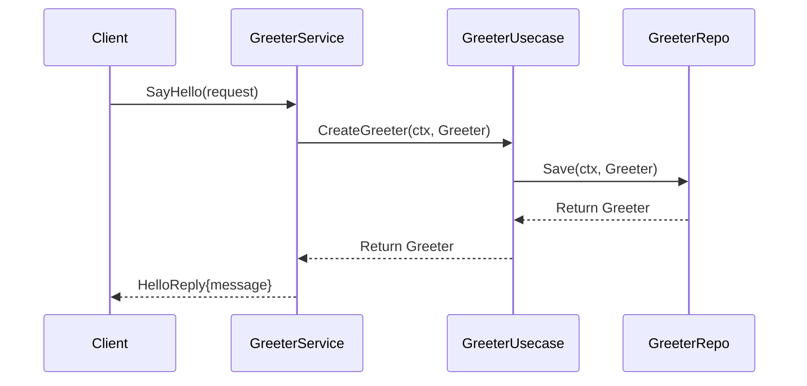

# Creating Services

<cite>
**Referenced Files in This Document**   
- [greeter.proto](file://api/helloworld/v1/greeter.proto#L1-L31)
- [greeter.go](file://internal/service/greeter.go#L1-L30)
- [biz/greeter.go](file://internal/biz/greeter.go#L1-L39)
- [data/greeter.go](file://internal/data/greeter.go#L1-L43)
- [http.go](file://internal/server/http.go#L1-L39)
- [grpc.go](file://internal/server/grpc.go#L1-L37)
- [wire.go](file://cmd/kratos-boilerplate/wire.go#L1-L27)
- [errors.proto](file://third_party/errors/errors.proto)
</cite>

## Table of Contents
1. [Introduction](#introduction)
2. [Defining a Service Contract with Protocol Buffers](#defining-a-service-contract-with-protocol-buffers)
3. [Implementing the Service Logic](#implementing-the-service-logic)
4. [Registering HTTP and gRPC Routes](#registering-http-and-grpc-routes)
5. [Dependency Injection with Wire](#dependency-injection-with-wire)
6. [Error Handling and Response Formatting](#error-handling-and-response-formatting)
7. [Best Practices for API Versioning](#best-practices-for-api-versioning)
8. [Adding Custom Metadata, Headers, and Interceptors](#adding-custom-metadata-headers-and-interceptors)
9. [Troubleshooting Common Issues](#troubleshooting-common-issues)
10. [Conclusion](#conclusion)

## Introduction
This document provides a comprehensive guide to creating new services using the Kratos framework. It walks through the entire lifecycle of service development—from defining a service contract in Protocol Buffers (protobuf), generating server stubs, implementing business logic, registering routes for HTTP and gRPC, to integrating middleware and dependency injection via Wire. The Greeter service is used as a reference example throughout this guide. Best practices for error handling, API versioning, and troubleshooting common issues such as endpoint not found or serialization problems are also covered.

## Defining a Service Contract with Protocol Buffers

To define a new service in Kratos, you start by writing a `.proto` file that specifies the service interface and message types using Protocol Buffers. This contract serves as the source of truth for both client and server implementations.

The `greeter.proto` file defines a simple `Greeter` service with one method: `SayHello`.

```protobuf
syntax = "proto3";

package helloworld.v1;

import "google/api/annotations.proto";

option go_package = "kratos-boilerplate/api/helloworld/v1;v1";
option java_multiple_files = true;
option java_package = "dev.kratos.api.helloworld.v1";
option java_outer_classname = "HelloworldProtoV1";

// The greeting service definition.
service Greeter {
  // Sends a greeting
  rpc SayHello (HelloRequest) returns (HelloReply) {
    option (google.api.http) = {
      get: "/helloworld/{name}"
    };
  }
}

// The request message containing the user's name.
message HelloRequest {
  string name = 1;
}

// The response message containing the greetings
message HelloReply {
  string message = 1;
}
```

### Key Elements:
- **Package Name**: `helloworld.v1` follows versioned API naming conventions.
- **HTTP Mapping**: The `(google.api.http)` annotation maps the gRPC method to an HTTP GET endpoint `/helloworld/{name}`, enabling RESTful access.
- **Message Definitions**: `HelloRequest` and `HelloReply` define input and output structures.
- **Code Generation**: The `option go_package` ensures proper Go package generation.

After defining the `.proto` file, run the Kratos toolchain to generate Go code:
```bash
kratos proto server api/helloworld/v1/greeter.proto
```
This generates server stubs in the `internal/service/` directory.

**Section sources**
- [greeter.proto](file://api/helloworld/v1/greeter.proto#L1-L31)

## Implementing the Service Logic

Service implementation resides in the `internal/service/` directory and follows the clean architecture pattern. The service layer orchestrates use cases from the `biz` layer and returns responses defined in the protobuf contract.

### Example: GreeterService Implementation

```go
package service

import (
	"context"

	v1 "kratos-boilerplate/api/helloworld/v1"
	"kratos-boilerplate/internal/biz"
)

// GreeterService is a greeter service.
type GreeterService struct {
	v1.UnimplementedGreeterServer

	uc *biz.GreeterUsecase
}

// NewGreeterService new a greeter service.
func NewGreeterService(uc *biz.GreeterUsecase) *GreeterService {
	return &GreeterService{uc: uc}
}

// SayHello implements helloworld.GreeterServer.
func (s *GreeterService) SayHello(ctx context.Context, in *v1.HelloRequest) (*v1.HelloReply, error) {
	g, err := s.uc.CreateGreeter(ctx, &biz.Greeter{Hello: in.Name})
	if err != nil {
		return nil, err
	}
	return &v1.HelloReply{Message: "Hello " + g.Hello}, nil
}
```

### Architecture Flow:
1. **Service Layer (`service/greeter.go`)**: Handles gRPC/HTTP requests and delegates to the use case.
2. **Use Case Layer (`biz/greeter.go`)**: Contains business logic.
3. **Data Layer (`data/greeter.go`)**: Implements data persistence.



**Diagram sources**
- [greeter.go](file://internal/service/greeter.go#L1-L30)
- [biz/greeter.go](file://internal/biz/greeter.go#L1-L39)
- [data/greeter.go](file://internal/data/greeter.go#L1-L43)

**Section sources**
- [greeter.go](file://internal/service/greeter.go#L1-L30)
- [biz/greeter.go](file://internal/biz/greeter.go#L1-L39)

## Registering HTTP and gRPC Routes

Kratos supports both HTTP and gRPC transports. Routes are registered in `internal/server/http.go` and `internal/server/grpc.go` by binding the service implementation to the transport server.

### HTTP Server Registration

```go
// NewHTTPServer new an HTTP server.
func NewHTTPServer(c *conf.Server, greeter *service.GreeterService, auth *service.AuthService, feature *service.FeatureToggleService, logger log.Logger) *http.Server {
	var opts = []http.ServerOption{
		http.Middleware(
			recovery.Recovery(),
		),
	}
	// ... network and timeout options
	srv := http.NewServer(opts...)
	v1.RegisterGreeterHTTPServer(srv, greeter)
	authv1.RegisterAuthHTTPServer(srv, auth)
	featurev1.RegisterFeatureToggleHTTPServer(srv, feature)
	return srv
}
```

### gRPC Server Registration

```go
// NewGRPCServer new a gRPC server.
func NewGRPCServer(c *conf.Server, greeter *service.GreeterService, feature *service.FeatureToggleService, logger log.Logger) *grpc.Server {
	var opts = []grpc.ServerOption{
		grpc.Middleware(
			recovery.Recovery(),
		),
	}
	// ... network and timeout options
	srv := grpc.NewServer(opts...)
	v1.RegisterGreeterServer(srv, greeter)
	featurev1.RegisterFeatureToggleServer(srv, feature)
	return srv
}
```

### Key Points:
- **Register Functions**: Generated by protobuf (e.g., `RegisterGreeterHTTPServer`).
- **Middleware**: Global middleware like `recovery.Recovery()` is applied to handle panics.
- **Route Mapping**: The HTTP route `/helloworld/{name}` is automatically mapped via the `google.api.http` annotation.

**Section sources**
- [http.go](file://internal/server/http.go#L1-L39)
- [grpc.go](file://internal/server/grpc.go#L1-L37)

## Dependency Injection with Wire

Kratos uses [Google Wire](https://github.com/google/wire) for compile-time dependency injection. Dependencies are declared in provider sets and injected into the application via `wire.go`.

### Example: Wire Configuration

```go
// wireApp init kratos application.
func wireApp(*conf.Server, *conf.Data, *conf.Auth, *conf.Bootstrap, log.Logger) (*kratos.App, func(), error) {
	wire.Build(server.ProviderSet, data.ProviderSet, biz.ProviderSet, service.ProviderSet, plugin.ProviderSet, feature.ProviderSet, newApp)
	return nil, nil, nil
}
```

### Provider Sets:
- `server.ProviderSet`: Creates HTTP/gRPC servers.
- `data.ProviderSet`: Initializes data repositories.
- `biz.ProviderSet`: Injects use cases with their dependencies.
- `service.ProviderSet`: Builds service implementations.

When `wire` is executed, it generates `wire_gen.go`, which contains the full dependency graph and initialization logic.

**Section sources**
- [wire.go](file://cmd/kratos-boilerplate/wire.go#L1-L27)

## Error Handling and Response Formatting

Proper error handling ensures consistent and meaningful responses across gRPC and HTTP.

### Using `third_party/errors/errors.proto`

Kratos encourages defining application-specific errors in a `.proto` file:

```protobuf
// api/helloworld/v1/error_reason.proto
enum ErrorReason {
  ERROR_REASON_UNSPECIFIED = 0;
  GREETING_NOT_FOUND = 1;
  INVALID_NAME = 2;
}
```

Errors are returned using Kratos' error package:

```go
import "github.com/go-kratos/kratos/v2/errors"

return nil, errors.NotFound("GREETING_NOT_FOUND", "greeting with name %s not found", name)
```

These errors are automatically translated into HTTP status codes and structured JSON responses.

### Response Formatting
- **gRPC**: Returns typed protobuf messages.
- **HTTP**: JSON responses with proper status codes and error details.

**Section sources**
- [errors.proto](file://third_party/errors/errors.proto)

## Best Practices for API Versioning

- **Versioned Packages**: Use directories like `api/helloworld/v1/` to isolate versions.
- **Backward Compatibility**: Avoid breaking changes; add new fields instead of modifying existing ones.
- **Deprecation Strategy**: Mark old methods as deprecated in proto:
  ```protobuf
  rpc OldMethod(Request) returns (Response) {
    option deprecated = true;
  }
  ```
- **Documentation**: Maintain changelogs and update OpenAPI specs accordingly.

## Adding Custom Metadata, Headers, and Interceptors

### Custom Headers and Metadata
Headers can be read from the context in handlers:

```go
func (s *GreeterService) SayHello(ctx context.Context, req *v1.HelloRequest) (*v1.HelloReply, error) {
	if md, ok := metadata.FromIncomingContext(ctx); ok {
		if values := md.Get("x-custom-header"); len(values) > 0 {
			// Handle custom header
		}
	}
	return &v1.HelloReply{Message: "Hello " + req.Name}, nil
}
```

### Interceptors (Middleware)
Custom middleware can be added to the server options:

```go
func LoggingMiddleware(next http.Handler) http.Handler {
	return http.HandlerFunc(func(w http.ResponseWriter, r *http.Request) {
		log.Printf("Received request: %s %s", r.Method, r.URL.Path)
		next.ServeHTTP(w, r)
	})
}

// In http.go
http.Middleware(recovery.Recovery(), LoggingMiddleware),
```

For gRPC, use unary interceptors:
```go
grpc.UnaryInterceptor(yourInterceptor)
```

## Troubleshooting Common Issues

### 1. Endpoint Not Found
- **Cause**: Missing route registration or incorrect HTTP mapping.
- **Fix**: Ensure `RegisterXXXServer()` is called and `google.api.http` annotations are correct.

### 2. Serialization Problems
- **Cause**: Mismatched field types or missing `json` tags.
- **Fix**: Verify protobuf message structure and regenerate code if needed.

### 3. Dependency Injection Failures
- **Cause**: Missing provider in `wire.Build()` or circular dependencies.
- **Fix**: Run `wire` and check generated errors; ensure all dependencies are provided.

### 4. Middleware Not Executing
- **Cause**: Middleware added after server creation.
- **Fix**: Add middleware in `ServerOption` before calling `http.NewServer()` or `grpc.NewServer()`.

## Conclusion
Creating services in Kratos involves defining a protobuf contract, implementing business logic in clean layers, registering routes with proper middleware, and managing dependencies via Wire. By following structured patterns for error handling, versioning, and extensibility, developers can build robust, maintainable microservices. The Greeter service example demonstrates a complete workflow that can be replicated for new services.