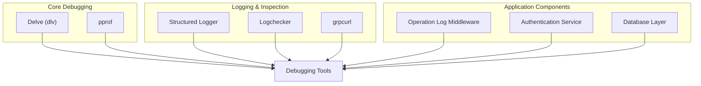
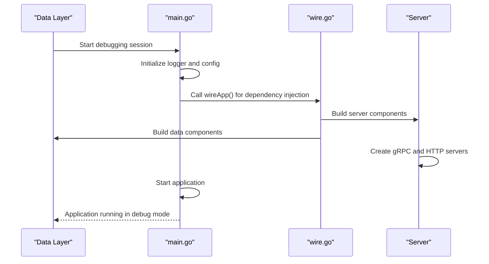
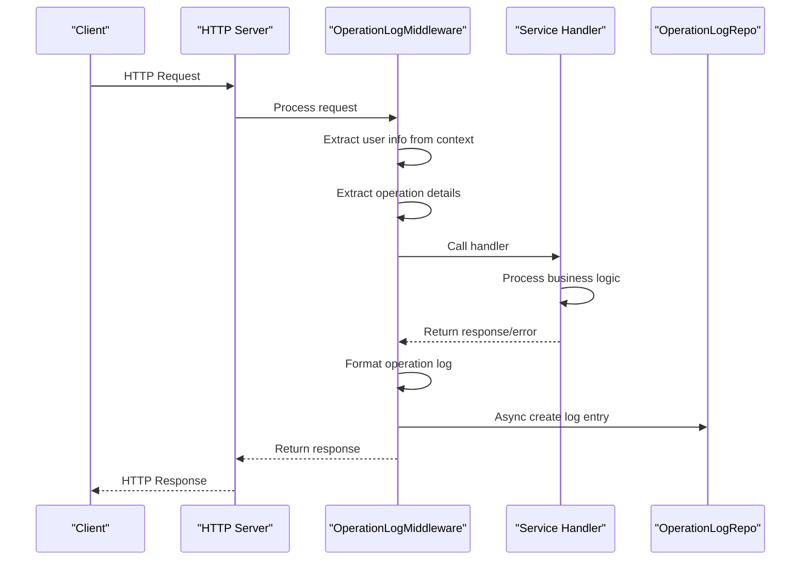
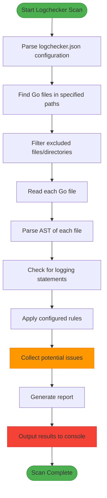
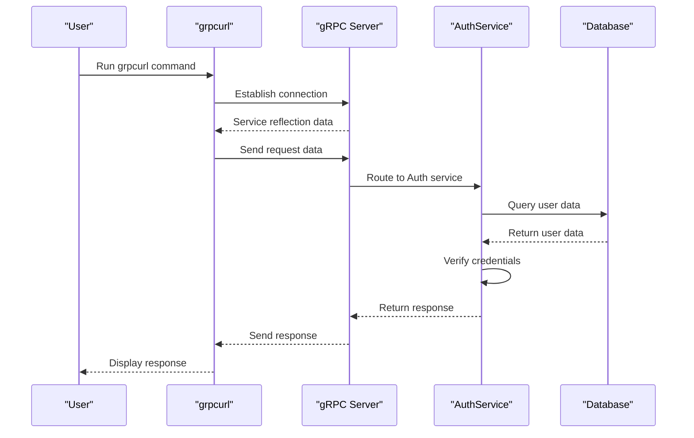
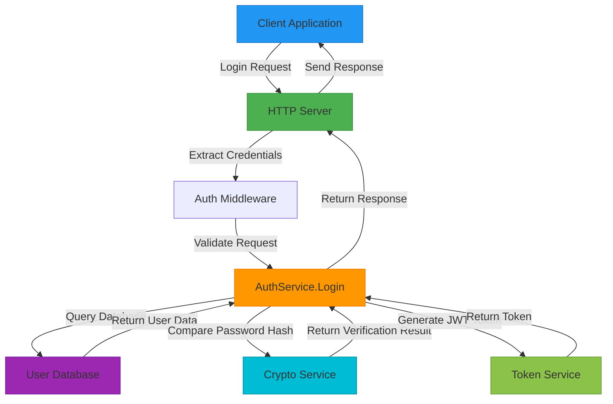
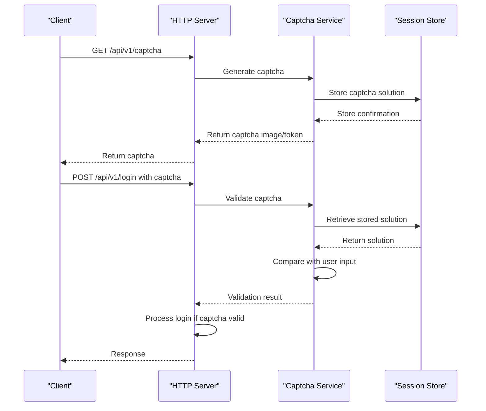
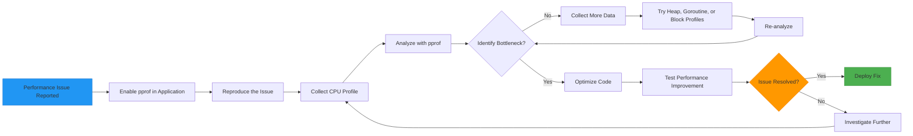
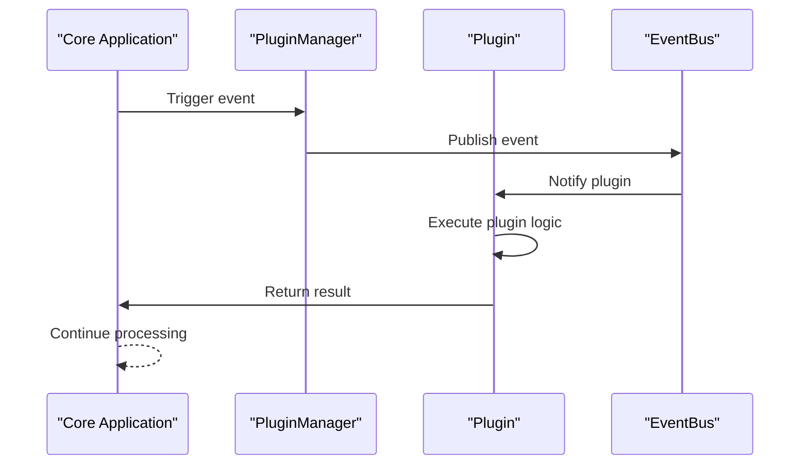

# Debugging

<cite>
**Referenced Files in This Document**   
- [main.go](file://cmd/kratos-boilerplate/main.go)
- [wire.go](file://cmd/kratos-boilerplate/wire.go)
- [operation_log.go](file://internal/middleware/operation_log.go)
- [operation_log.go](file://internal/server/middleware/operation_log.go)
- [operation_log.go](file://internal/biz/operation_log.go)
- [operation_log.go](file://internal/data/operation_log.go)
- [structured_logger.go](file://internal/pkg/sensitive/structured_logger.go)
- [factory.go](file://internal/pkg/sensitive/factory.go)
- [checker.go](file://tools/logchecker/checker.go)
- [main.go](file://tools/logchecker/main.go)
- [auth.go](file://internal/service/auth.go)
- [captcha.go](file://internal/service/captcha.go)
- [kms.go](file://internal/biz/kms.go)
- [crypto.go](file://internal/pkg/crypto/aes.go)
- [server.go](file://internal/server/server.go)
- [http.go](file://internal/server/http.go)
- [grpc.go](file://internal/server/grpc.go)
</cite>

## Table of Contents
1. [Introduction](#introduction)
2. [Debugging Setup and Tools](#debugging-setup-and-tools)
3. [Debugging Go Services with Delve](#debugging-go-services-with-delve)
4. [Request Flow Tracing with Operation Log Middleware](#request-flow-tracing-with-operation-log-middleware)
5. [Structured Logging and Sensitive Data Handling](#structured-logging-and-sensitive-data-handling)
6. [Log Hygiene Validation with Logchecker](#log-hygiene-validation-with-logchecker)
7. [gRPC Debugging with grpcurl](#grpc-debugging-with-grpcurl)
8. [Authentication and Captcha Debugging](#authentication-and-captcha-debugging)
9. [Database and Connection Troubleshooting](#database-and-connection-troubleshooting)
10. [Performance Debugging with pprof](#performance-debugging-with-pprof)
11. [Plugin Execution Tracing](#plugin-execution-tracing)

## Introduction
This document provides a comprehensive guide to debugging the kratos-boilerplate application. It covers essential techniques for identifying and resolving issues across various components of the system, including service execution, request flow, logging, authentication, database connectivity, and performance. The guide focuses on practical debugging approaches using industry-standard tools and the application's built-in diagnostic capabilities.

**Section sources**
- [main.go](file://cmd/kratos-boilerplate/main.go#L1-L92)

## Debugging Setup and Tools
The kratos-boilerplate application is designed with debugging in mind, incorporating various tools and patterns to facilitate troubleshooting. The primary debugging tools include Delve for Go debugging, structured logging with sensitive data handling, log hygiene validation, and gRPC inspection utilities.



**Diagram sources**
- [main.go](file://cmd/kratos-boilerplate/main.go#L1-L92)
- [structured_logger.go](file://internal/pkg/sensitive/structured_logger.go#L1-L200)

**Section sources**
- [main.go](file://cmd/kratos-boilerplate/main.go#L1-L92)
- [checker.go](file://tools/logchecker/checker.go#L1-L150)

## Debugging Go Services with Delve
Delve is the recommended debugger for Go applications and is fully supported in the kratos-boilerplate project. To debug the service, first ensure Delve is installed, then use it to run the application in debug mode.

### Running in Debug Mode
The application can be started in debug mode using Delve. This allows setting breakpoints, inspecting variables, and stepping through code execution.

```bash
# Install Delve if not already installed
go install github.com/go-delve/delve/cmd/dlv@latest

# Run the application in debug mode
cd cmd/kratos-boilerplate
dlv debug -- --conf ../../configs
```

When the debugger starts, it will pause at the beginning of the `main` function, allowing you to set breakpoints and control execution flow.

### Setting Breakpoints
Breakpoints can be set at specific lines or functions to inspect the application state during execution.

```bash
# Set breakpoint at main function
(dlv) break main.main

# Set breakpoint at a specific file and line
(dlv) break internal/service/auth.go:45

# Set breakpoint at a function
(dlv) break internal/biz.(*Auth).Login

# List all breakpoints
(dlv) breakpoints

# Continue execution
(dlv) continue

# Print variable values
(dlv) print variableName

# Print stack trace
(dlv) stack
```

The wire dependency injection framework used in the application (evident from `wire.go`) means that service initialization follows a specific pattern that can be traced through the `wireApp` function.



**Diagram sources**
- [main.go](file://cmd/kratos-boilerplate/main.go#L1-L92)
- [wire.go](file://cmd/kratos-boilerplate/wire.go#L1-L27)

**Section sources**
- [main.go](file://cmd/kratos-boilerplate/main.go#L1-L92)
- [wire.go](file://cmd/kratos-boilerplate/wire.go#L1-L27)

## Request Flow Tracing with Operation Log Middleware
The operation log middleware is a critical component for tracing request flows through the application. It captures information about each request and logs it for audit and debugging purposes.

### Middleware Implementation
The operation log middleware is implemented in multiple layers of the application, with the primary implementation in `internal/server/middleware/operation_log.go`. This middleware captures user information, operation details, and request/response data.

```go
// OperationLogMiddleware creates operation log middleware
func OperationLogMiddleware(repo biz.OperationLogRepo) middleware.Middleware {
	return func(handler middleware.Handler) middleware.Handler {
		return func(ctx context.Context, req interface{}) (reply interface{}, err error) {
			// Get user information from context
			userID := getUserIDFromContext(ctx)
			username := getUsernameFromContext(ctx)

			// Get operation details
			operation := getOperation(ctx)
			target := getTarget(ctx)

			// Execute the actual handler
			reply, err = handler(ctx, req)

			// Create operation log
			log := &biz.OperationLog{
				UserID:    userID,
				Username:  username,
				Operation: operation,
				Target:    target,
				Content:   formatContent(req),
				Result:    formatResult(reply, err),
				CreatedAt: time.Now(),
			}

			// Asynchronously record the log
			go func() {
				if err := repo.CreateLog(context.Background(), log); err != nil {
					// Handle log recording failure
				}
			}()

			return reply, err
		}
	}
}
```

### Debugging Request Flow
To debug request flow using the operation log middleware, you can set breakpoints in the middleware to inspect the request and response data.

```bash
# Set breakpoint in operation log middleware
(dlv) break internal/server/middleware/operation_log.go:15

# This will pause execution when any request is processed
# You can then inspect:
# - ctx: the context containing user and transport information
# - req: the request data
# - handler: the next handler in the chain
# - reply: the response data after handler execution
# - err: any error from handler execution
```

The middleware extracts operation details based on the transport type (HTTP or gRPC):

- For HTTP: Uses the request method and URL path
- For gRPC: Uses the gRPC operation name

This information is crucial for understanding which endpoints are being called and how they're being accessed.



**Diagram sources**
- [operation_log.go](file://internal/server/middleware/operation_log.go#L1-L119)
- [operation_log.go](file://internal/biz/operation_log.go#L1-L24)

**Section sources**
- [operation_log.go](file://internal/server/middleware/operation_log.go#L1-L119)
- [operation_log.go](file://internal/biz/operation_log.go#L1-L24)
- [operation_log.go](file://internal/data/operation_log.go#L1-L50)

## Structured Logging and Sensitive Data Handling
The application uses a structured logging system with built-in sensitive data handling capabilities. This is implemented in the `internal/pkg/sensitive` package and is crucial for both debugging and security.

### Structured Logger Implementation
The structured logger provides a consistent format for log entries and includes automatic sanitization of sensitive data.

```go
// Example of structured logging usage
slogger.Infow("user login attempt",
    "user_id", 12345,
    "username", "john_doe",
    "ip", "192.168.1.100",
    "success", true,
)

// Sensitive fields are automatically sanitized
slogger.Infow("authentication details",
    "password", "mySecretPassword123", // Will be sanitized
    "token", "abc123def456",          // Will be sanitized
    "user_id", 12345,                // Will not be sanitized
)
```

The logger configuration can be customized to enable or disable sanitization based on the environment:

```go
// Production environment configuration
config := &StructuredLogConfig{
    Enabled:           true,
    AutoDetect:        true,
    SensitiveKeys:     []string{"password", "token", "secret", "key", "auth", "credential", "authorization", "session", "cookie"},
    MaxValueLength:    500,
    TruncateThreshold: 300,
}
```

### Debugging with Structured Logs
Structured logs provide rich context for debugging issues, especially those related to authentication and data flow.

```bash
# When debugging authentication issues, look for logs like:
INFO msg="user login attempt" user_id=12345 username=john_doe ip=192.168.1.100 success=false error="invalid credentials"

# For sensitive data handling, verify that sensitive fields are properly sanitized:
INFO msg="Sanitized auth log" data="{\"password\":\"***\",\"token\":\"***\",\"user_id\":12345}...[TRUNCATED]"
```

The structured logger also supports context-based logging, which is useful for tracing requests across different components:

```go
// Create a context-specific logger
ctx := context.WithValue(context.Background(), "request_id", "req-12345")
contextLogger := slogger.WithContext(ctx)

// All logs from this logger will include the request context
contextLogger.Infow("processing request", "step", "validation", "status", "started")
```

```mermaid
classDiagram
class StructuredLoggerInterface {
+Infow(msg string, keysAndValues ...interface{})
+Warnw(msg string, keysAndValues ...interface{})
+Errorw(msg string, keysAndValues ...interface{})
+Debugw(msg string, keysAndValues ...interface{})
+WithContext(ctx context.Context) StructuredLoggerInterface
+AddSensitiveKey(key string)
}
class StructuredLogger {
-helper *log.Helper
-config *StructuredLogConfig
-sanitizer SanitizerInterface
+Infow(msg string, keysAndValues ...interface{})
+Warnw(msg string, keysAndValues ...interface{})
+Errorw(msg string, keysAndValues ...interface{})
+Debugw(msg string, keysAndValues ...interface{})
+WithContext(ctx context.Context) StructuredLoggerInterface
+AddSensitiveKey(key string)
}
class SanitizerInterface {
+SanitizeLogMessage(content string) string
+AddSensitiveKey(key string)
+RemoveSensitiveKey(key string)
}
class DefaultSanitizer {
-rules []DetectionRule
-sensitiveKeys map[string]bool
+SanitizeLogMessage(content string) string
+AddSensitiveKey(key string)
+RemoveSensitiveKey(key string)
}
class DetectionRule {
+Pattern *regexp.Regexp
+Replacement string
+Description string
}
StructuredLoggerInterface <|-- StructuredLogger
SanitizerInterface <|-- DefaultSanitizer
StructuredLogger --> SanitizerInterface : "uses"
DefaultSanitizer --> DetectionRule : "uses"
```

**Diagram sources**
- [structured_logger.go](file://internal/pkg/sensitive/structured_logger.go#L1-L200)
- [factory.go](file://internal/pkg/sensitive/factory.go#L1-L150)

**Section sources**
- [structured_logger.go](file://internal/pkg/sensitive/structured_logger.go#L1-L200)
- [factory.go](file://internal/pkg/sensitive/factory.go#L1-L150)

## Log Hygiene Validation with Logchecker
The logchecker tool is a custom utility designed to validate log hygiene and detect potential information leaks in the codebase.

### Using the Logchecker Tool
The logchecker tool scans Go source files to identify logging statements that might expose sensitive information.

```bash
# Run logchecker from the project root
cd tools/logchecker
go run main.go ../../...

# Or build and run
go build -o logchecker main.go
./logchecker ../../...
```

The tool uses a configuration file (`logchecker.json`) to define rules for detecting potentially problematic logging patterns:

```json
{
  "rules": [
    {
      "name": "direct-sensitive-field",
      "pattern": "password|token|secret|key|auth|credential",
      "severity": "high",
      "description": "Direct logging of sensitive fields"
    },
    {
      "name": "struct-logging",
      "pattern": "fmt.Printf|fmt.Sprintf|log.Print",
      "severity": "medium",
      "description": "Potential information leak through formatting functions"
    }
  ],
  "excluded_files": [
    "test/",
    "_test.go"
  ]
}
```

### Interpreting Logchecker Results
The tool outputs a report of potential issues, helping developers identify and fix logging vulnerabilities.

```bash
# Sample output
[CRITICAL] internal/service/auth.go:45: Direct logging of sensitive field 'password'
[WARNING] internal/biz/user.go:120: Potential information leak through struct logging
[INFO] Scan complete: 2 issues found (1 critical, 1 warning)
```

Developers should address critical issues immediately, as they represent clear security vulnerabilities. Warning-level issues should be reviewed to determine if they represent actual risks.



**Diagram sources**
- [main.go](file://tools/logchecker/main.go#L1-L100)
- [checker.go](file://tools/logchecker/checker.go#L1-L150)

**Section sources**
- [main.go](file://tools/logchecker/main.go#L1-L100)
- [checker.go](file://tools/logchecker/checker.go#L1-L150)
- [config.go](file://tools/logchecker/config.go#L1-L50)

## gRPC Debugging with grpcurl
The kratos-boilerplate application exposes gRPC endpoints that can be inspected and tested using grpcurl, a command-line tool for interacting with gRPC servers.

### Setting Up grpcurl
First, ensure grpcurl is installed and the application is running.

```bash
# Install grpcurl
go install github.com/fullstorydev/grpcurl/cmd/grpcurl@latest

# Start the application (in another terminal)
cd cmd/kratos-boilerplate
go run main.go --conf ../../configs
```

### Inspecting gRPC Services
Use grpcurl to list available services and their methods.

```bash
# List services (assuming server runs on localhost:9000)
grpcurl -plaintext localhost:9000 list

# Output might include:
# api.auth.v1.Auth
# api.helloworld.v1.Greeter
# grpc.reflection.v1alpha.ServerReflection

# List methods of a specific service
grpcurl -plaintext localhost:9000 list api.auth.v1.Auth

# Output might include:
# api.auth.v1.Auth.Login
# api.auth.v1.Auth.Register
# api.auth.v1.Auth.VerifyCaptcha
```

### Testing gRPC Endpoints
Use grpcurl to send requests to gRPC endpoints and inspect responses.

```bash
# Get the request format for a method
grpcurl -plaintext localhost:9000 describe api.auth.v1.LoginRequest

# Send a login request
grpcurl -plaintext \
  -d '{
    "username": "testuser",
    "password": "testpass"
  }' \
  localhost:9000 \
  api.auth.v1.Auth/Login

# The response will include the result and any error information
# This is invaluable for debugging authentication issues
```

### JWT Token Inspection
When debugging authentication issues, you can inspect JWT tokens returned by the service.

```bash
# Capture the token from a login response
# Then decode it using grpcurl or jwt.io
grpcurl -plaintext \
  -d '{"token": "your.jwt.token.here"}' \
  localhost:9000 \
  api.auth.v1.Auth/VerifyToken
```

Alternatively, use online tools or command-line utilities to decode the JWT token and inspect its claims:

```bash
# Using jwt-cli (if installed)
jwt decode your.jwt.token.here --pretty

# Manual decoding (base64 decode the middle part)
echo "your.jwt.payload" | base64 -d
```



**Diagram sources**
- [auth.go](file://internal/service/auth.go#L1-L200)
- [server.go](file://internal/server/server.go#L1-L100)

**Section sources**
- [auth.go](file://internal/service/auth.go#L1-L200)
- [server.go](file://internal/server/server.go#L1-L100)

## Authentication and Captcha Debugging
Authentication issues are common in web applications and require systematic debugging. The kratos-boilerplate application includes both authentication and captcha functionality that can be debugged using various techniques.

### Diagnosing Authentication Failures
When users cannot authenticate, follow this debugging process:

1. Check the structured logs for authentication attempts
2. Verify the request format using grpcurl or API testing tools
3. Set breakpoints in the authentication service
4. Validate database connectivity and user data

```bash
# Set breakpoint in auth service
(dlv) break internal/service/auth.go:50

# Common issues to check:
# - Incorrect password hashing
# - Database connectivity problems
# - User not found in database
# - Token generation failures
```

The authentication flow typically follows this pattern:



**Diagram sources**
- [auth.go](file://internal/service/auth.go#L1-L200)
- [auth.go](file://internal/biz/auth.go#L1-L100)

**Section sources**
- [auth.go](file://internal/service/auth.go#L1-L200)
- [auth.go](file://internal/biz/auth.go#L1-L100)

### Debugging Captcha Mismatches
Captcha functionality is implemented to prevent automated attacks. When debugging captcha issues:

1. Check if the captcha service is properly initialized
2. Verify the captcha generation and validation logic
3. Ensure the frontend is correctly handling captcha tokens

```bash
# Set breakpoint in captcha service
(dlv) break internal/service/captcha.go:30

# Common issues:
# - Captcha not generated
# - Captcha expired
# - Incorrect validation logic
# - Frontend not sending captcha token
```

The captcha flow works as follows:



**Diagram sources**
- [captcha.go](file://internal/service/captcha.go#L1-L100)
- [captcha.go](file://internal/data/captcha.go#L1-L50)

**Section sources**
- [captcha.go](file://internal/service/captcha.go#L1-L100)
- [captcha.go](file://internal/data/captcha.go#L1-L50)

## Database and Connection Troubleshooting
Database connectivity issues can cause various problems in the application. The kratos-boilerplate application uses a standard database layer that can be debugged systematically.

### Identifying Database Issues
Common symptoms of database issues include:

- Slow response times
- Authentication failures
- Data not being saved or retrieved
- Connection timeout errors

To diagnose these issues:

1. Check the application logs for database-related errors
2. Verify database server connectivity
3. Test database queries manually
4. Monitor database performance

```bash
# Check if database is reachable
telnet localhost 5432  # or whatever port PostgreSQL is using

# Connect to database manually
psql -h localhost -U youruser yourdb

# Test basic query
SELECT 1;
```

### Debugging Database Operations
Set breakpoints in the data layer to inspect database operations.

```bash
# Set breakpoint in data layer
(dlv) break internal/data/auth.go:45

# When the breakpoint hits, you can:
# - Inspect the database connection (data.db)
# - View the SQL query being executed
# - Check the query parameters
# - Monitor query execution time
```

The database layer follows a repository pattern, with interfaces defined in the biz layer and implementations in the data layer.

```mermaid
classDiagram
class OperationLogRepo {
<<interface>>
+CreateLog(ctx context.Context, log *OperationLog) error
+ListLogs(ctx context.Context, userID int64, startTime, endTime time.Time) []*OperationLog
}
class operationLogRepo {
-data *Data
-log *log.Helper
+CreateLog(ctx context.Context, log *OperationLog) error
+ListLogs(ctx context.Context, userID int64, startTime, endTime time.Time) []*OperationLog
}
class Data {
-db *sql.DB
-conn *pgx.Conn
+NewData(*conf.Data) (*Data, error)
}
OperationLogRepo <|.. operationLogRepo
operationLogRepo --> Data : "uses"
Data --> "PostgreSQL" : "connects to"
```

**Diagram sources**
- [data.go](file://internal/data/data.go#L1-L100)
- [operation_log.go](file://internal/data/operation_log.go#L1-L50)

**Section sources**
- [data.go](file://internal/data/data.go#L1-L100)
- [operation_log.go](file://internal/data/operation_log.go#L1-L50)

## Performance Debugging with pprof
Performance issues can significantly impact user experience. The Go pprof tool provides detailed insights into application performance.

### Setting Up pprof
The application should include pprof handlers in the HTTP server.

```go
// In internal/server/http.go, ensure pprof is enabled
import _ "net/http/pprof"

// In the HTTP server setup
r := http.NewRouter()
// ... other routes
// pprof routes are automatically registered on /debug/pprof/*
```

### Collecting Performance Data
Use pprof to collect various types of performance data:

```bash
# Start the application
cd cmd/kratos-boilerplate
go run main.go --conf ../../configs

# In another terminal, collect CPU profile for 30 seconds
go tool pprof -http=:8081 http://localhost:9000/debug/pprof/profile?seconds=30

# Collect heap profile
go tool pprof http://localhost:9000/debug/pprof/heap

# Collect goroutine profile
go tool pprof http://localhost:9000/debug/pprof/goroutine

# Collect block profile (for mutex contention)
go tool pprof http://localhost:9000/debug/pprof/block
```

### Analyzing Cryptographic Operations
Since the application includes cryptographic operations (evident from the crypto package), these can be performance bottlenecks.

```bash
# Focus on cryptographic operations in the profile
(pprof) focus=crypto
(pprof) top
(pprof) list github.com/yourorg/kratos-boilerplate/internal/pkg/crypto

# Generate a flame graph
(pprof) svg
# This creates a visualization of where time is spent
```

Common performance issues in cryptographic operations include:

- Using overly complex algorithms when simpler ones suffice
- Not reusing cryptographic contexts or connections
- Performing cryptographic operations on large data sets synchronously



**Diagram sources**
- [server.go](file://internal/server/server.go#L1-L100)
- [http.go](file://internal/server/http.go#L1-L100)
- [aes.go](file://internal/pkg/crypto/aes.go#L1-L100)

**Section sources**
- [server.go](file://internal/server/server.go#L1-L100)
- [http.go](file://internal/server/http.go#L1-L100)
- [aes.go](file://internal/pkg/crypto/aes.go#L1-L100)

## Plugin Execution Tracing
The application supports a plugin system that can be traced and debugged to understand its execution flow.

### Understanding Plugin Architecture
The plugin system is implemented in the `internal/pkg/plugin` package and allows for extensible functionality.

```bash
# To debug plugin execution, set breakpoints in the plugin manager
(dlv) break internal/pkg/plugin/plugin_manager.go:50

# Key components to inspect:
# - Plugin loading and initialization
# - Event bus for plugin communication
# - Hook management for plugin integration points
```

When a plugin is executed, the flow typically follows this pattern:



Configuration for plugins is stored in the configs/plugins directory, with YAML files defining plugin behavior.

```bash
# Check plugin configuration
cat configs/plugins/auth_enhancer.yaml
cat configs/plugins/audit_logger.yaml
```

By tracing plugin execution, you can identify issues with plugin loading, configuration, or runtime behavior.

**Section sources**
- [plugin_manager.go](file://internal/pkg/plugin/plugin_manager.go#L1-L100)
- [event_bus.go](file://internal/pkg/plugin/event_bus.go#L1-L50)
- [auth_enhancer.go](file://plugins/auth_enhancer.go#L1-L50)
- [audit_logger.go](file://plugins/audit_logger.go#L1-L50)