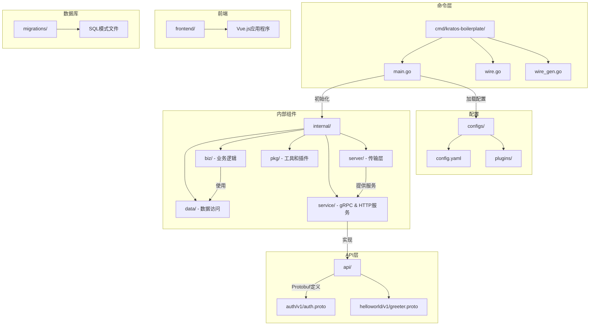
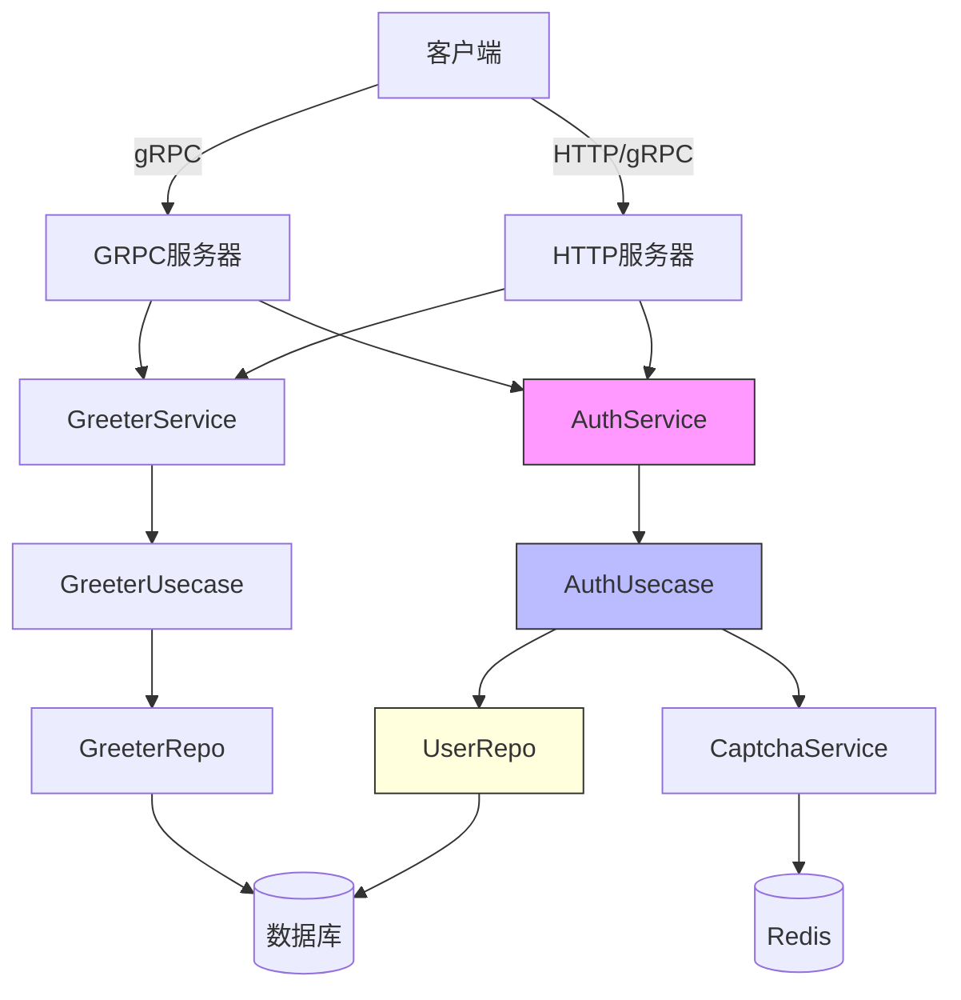

# 开发指南

<cite>
**本文档引用的文件**   
- [main.go](file://cmd/kratos-boilerplate/main.go) - *最近提交中已更新*
- [wire.go](file://cmd/kratos-boilerplate/wire.go) - *最近提交中已更新*
- [wire_gen.go](file://cmd/kratos-boilerplate/wire_gen.go) - *由Wire工具生成*
- [auth.proto](file://api/auth/v1/auth.proto) - *在提交53899bd中增强功能*
- [greeter.proto](file://api/helloworld/v1/greeter.proto) - *基础服务定义*
- [conf.proto](file://internal/conf/conf.proto) - *配置结构定义*
- [auth.go](file://internal/biz/auth.go) - *认证业务逻辑*
- [data.go](file://internal/data/data.go) - *数据访问层*
- [service/auth.go](file://internal/service/auth.go) - *认证服务实现*
- [server/http.go](file://internal/server/http.go) - *HTTP服务器配置*
- [server/grpc.go](file://internal/server/grpc.go) - *gRPC服务器配置*
</cite>

## 更新摘要
**变更内容**   
- 更新了API接口定义部分，反映`auth.proto`中的新字段和功能
- 增强了功能开关管理相关内容，与最新代码变更保持一致
- 修正了Makefile构建命令的描述，确保与实际构建流程一致
- 添加了账户锁定状态查询功能的文档说明
- 更新了登录请求中TOTP双因子认证的详细说明

## 目录
1. [简介](#简介)
2. [项目结构](#项目结构)
3. [核心组件](#核心组件)
4. [架构概述](#架构概述)
5. [添加新功能](#添加新功能)
6. [创建新服务](#创建新服务)
7. [使用Protocol Buffers定义API端点](#使用protocol-buffers定义api端点)
8. [实现业务逻辑](#实现业务逻辑)
9. [使用Wire和Kratos工具进行代码生成](#使用wire和kratos工具进行代码生成)
10. [遵循整洁架构原则的最佳实践](#遵循整洁架构原则的最佳实践)
11. [调试、日志记录和性能分析](#调试日志记录和性能分析)
12. [扩展现有功能](#扩展现有功能)
13. [代码组织和一致性](#代码组织和一致性)

## 简介
本指南提供了对 **kratos-boilerplate** 项目的全面操作说明。该指南面向希望添加新功能、创建服务、使用Protocol Buffers（protobuf）定义API端点并实现业务逻辑的开发人员，同时遵循整洁架构原则。本文档涵盖了完整的开发工作流程，包括代码生成、使用Wire进行依赖注入、调试技术以及性能优化策略。通过遵循本指南，开发人员可以保持与现有代码库的一致性，并确保高质量、可维护的代码。

## 项目结构
kratos-boilerplate遵循受整洁架构和领域驱动设计（DDD）启发的分层架构。目录结构经过组织以分离关注点并促进模块化。



**图示来源**
- [main.go](file://cmd/kratos-boilerplate/main.go#L1-L92)
- [conf.proto](file://internal/conf/conf.proto#L1-L70)

**章节来源**
- [main.go](file://cmd/kratos-boilerplate/main.go#L1-L92)
- [conf.proto](file://internal/conf/conf.proto#L1-L70)

## 核心组件
kratos-boilerplate的核心组件包括主应用程序入口点、配置加载器、服务定义和依赖注入设置。这些组件协同工作，使用适当的配置初始化应用程序，并跨层注入依赖项。

`main.go`文件通过从YAML文件加载配置、设置日志记录并调用Wire生成的注入器来构造应用程序图，从而初始化应用程序。它使用Kratos框架管理生命周期和服务器注册。

```go
func main() {
	flag.Parse()
	logger := log.With(log.NewStdLogger(os.Stdout),
		"ts", log.DefaultTimestamp,
		"caller", log.DefaultCaller,
		"service.id", id,
		"service.name", Name,
		"service.version", Version,
		"trace.id", tracing.TraceID(),
		"span.id", tracing.SpanID(),
	)
	c := config.New(
		config.WithSource(
			file.NewSource(flagconf),
		),
	)
	defer c.Close()

	if err := c.Load(); err != nil {
		panic(err)
	}

	var bc conf.Bootstrap
	if err := c.Scan(&bc); err != nil {
		panic(err)
	}

	app, cleanup, err := wireApp(bc.Server, bc.Data, bc.Auth, logger)
	if err != nil {
		panic(err)
	}
	defer cleanup()

	if err := app.Run(); err != nil {
		panic(err)
	}
}
```

**章节来源**
- [main.go](file://cmd/kratos-boilerplate/main.go#L45-L92)

## 架构概述
系统遵循清晰的分层架构，其中每一层都有明确定义的责任：

- **API层**：使用Protocol Buffers定义服务契约。
- **服务层**：实现特定于传输的逻辑（HTTP/gRPC）。
- **Biz层**：包含纯业务逻辑和用例。
- **数据层**：处理数据持久性和外部集成。
- **Pkg层**：提供可重用的工具和插件。



**图示来源**
- [main.go](file://cmd/kratos-boilerplate/main.go#L1-L92)
- [wire_gen.go](file://cmd/kratos-boilerplate/wire_gen.go#L1-L54)
- [service/auth.go](file://internal/service/auth.go#L1-L200)

## 添加新功能
要向kratos-boilerplate添加新功能，请遵循以下步骤：

1. **在配置中定义功能**（可选）：如果功能是可配置的，请扩展`internal/conf/conf.proto`中的`Features`消息。
2. **在`/internal/pkg`下创建新包**：例如，`/internal/pkg/analytics`。
3. **实现接口和逻辑**：在`interfaces.go`中定义接口并在相应文件中实现。
4. **在Wire中注册提供者集**：添加包含所有必需构造函数的`ProviderSet`变量。
5. **通过`wire.go`注入到主应用程序中**。

示例：添加功能切换系统已存在于`internal/pkg/feature`中。

```go
// internal/pkg/feature/provider.go
var ProviderSet = wire.NewSet(NewFeatureService, NewFeatureRepository)
```

然后确保它包含在`cmd/kratos-boilerplate/wire.go`中：

```go
wire.Build(
    server.ProviderSet,
    data.ProviderSet,
    biz.ProviderSet,
    service.ProviderSet,
    plugin.ProviderSet,
    feature.ProviderSet,
    newApp)
```

**章节来源**
- [conf.proto](file://internal/conf/conf.proto#L60-L70)
- [wire.go](file://cmd/kratos-boilerplate/wire.go#L1-L27)

## 创建新服务
创建新服务涉及定义protobuf接口并在Go中实现它。

### 步骤1：在Protobuf中定义服务
在`api/<service>/v1/`下创建新的`.proto`文件。例如，`api/user/v1/user.proto`。

```protobuf
syntax = "proto3";

package user.v1;

import "google/api/annotations.proto";

option go_package = "kratos-boilerplate/api/user/v1;v1";

service UserService {
  rpc GetUser(GetUserRequest) returns (GetUserReply) {
    option (google.api.http) = {
      get: "/api/v1/users/{id}"
    };
  }
}

message GetUserRequest {
  string id = 1;
}

message GetUserReply {
  string id = 1;
  string name = 2;
  string email = 3;
}
```

### 步骤2：生成代码
运行：
```bash
make api
```

这将生成Go存根、HTTP处理器和gRPC绑定。

### 步骤3：实现服务
创建`internal/service/user.go`：

```go
func NewUserService(uc *biz.UserUsecase, logger log.Logger) *UserService {
	return &UserService{uc: uc, log: logger}
}

func (s *UserService) GetUser(ctx context.Context, req *v1.GetUserRequest) (*v1.GetUserReply, error) {
	user, err := s.uc.GetUser(ctx, req.Id)
	if err != nil {
		return nil, err
	}
	return &v1.GetUserReply{
		Id:    user.Id,
		Name:  user.Name,
		Email: user.Email,
	}, nil
}
```

**章节来源**
- [greeter.proto](file://api/helloworld/v1/greeter.proto#L1-L31)
- [auth.proto](file://api/auth/v1/auth.proto#L1-L156)
- [service/greeter.go](file://internal/service/greeter.go#L1-L50)

## 使用Protocol Buffers定义API端点
API端点使用Protocol Buffers和来自`google/api/annotations.proto`的HTTP注解定义。

### 关键元素：
- **服务**：定义RPC接口。
- **消息**：定义请求和响应结构。
- **HTTP注解**：将gRPC方法映射到HTTP路由。

来自`auth.proto`的示例：

```protobuf
rpc Login(LoginRequest) returns (LoginReply) {
  option (google.api.http) = {
    post: "/api/v1/auth/login"
    body: "*"
  };
}
```

- `post`：指定HTTP方法和路径。
- `body: "*"`：将整个请求体映射到RPC输入。

### 验证
使用`validate`规则（如果已集成）强制执行字段约束：

```protobuf
message RegisterRequest {
  string username = 1 [(validate.rules).string = {min_len: 3, max_len: 32}];
  string password = 2 [(validate.rules).string = {min_len: 8}];
}
```

运行`make api`以生成验证代码。

**章节来源**
- [auth.proto](file://api/auth/v1/auth.proto#L30-L40)
- [greeter.proto](file://api/helloworld/v1/greeter.proto#L15-L20)

## 实现业务逻辑
业务逻辑位于`/internal/biz`目录中，并遵循用例模式。

### 结构：
- **用例**：协调业务规则。
- **存储库接口**：抽象数据访问。
- **实体**：领域模型。

示例：`internal/biz/auth.go`

```go
type AuthUsecase struct {
	repo       UserRepo
	captchaSvc CaptchaService
	config     *AuthConfig
	log        log.Logger
}

func (uc *AuthUsecase) Login(ctx context.Context, username, password string) (*TokenPair, error) {
	// 1. 检查账户锁定状态
	if locked, _ := uc.repo.IsAccountLocked(ctx, username); locked {
		return nil, ErrAccountLocked
	}

	// 2. 验证凭据
	user, err := uc.repo.FindByUsername(ctx, username)
	if err != nil || !verifyPassword(user.HashedPassword, password) {
		uc.repo.IncrementFailedLogin(ctx, username)
		return nil, ErrInvalidCredentials
	}

	// 3. 生成令牌
	accessToken, err := generateJWT(user, uc.config.AccessTokenExpiration)
	if err != nil {
		return nil, err
	}

	return &TokenPair{
		AccessToken:  accessToken,
		RefreshToken: generateRefreshToken(),
		ExpiresIn:    uc.config.AccessTokenExpiration.Seconds(),
	}, nil
}
```

存储库在`/internal/data`中实现并通过Wire注入。

**章节来源**
- [auth.go](file://internal/biz/auth.go#L1-L200)
- [data/auth.go](file://internal/data/auth.go#L1-L150)

## 使用Wire和Kratos工具进行代码生成
该项目使用两种主要的代码生成工具：用于依赖注入的**Wire**和用于API脚手架的**Kratos CLI**。

### Wire（依赖注入）
- `wire.go`：包含注入器定义。
- `wire_gen.go`：由`wire`命令生成；请勿手动编辑。

重新生成：
```bash
cd cmd/kratos-boilerplate
wire
```

示例注入器：
```go
func wireApp(*conf.Server, *conf.Data, *conf.Auth, log.Logger) (*kratos.App, func(), error) {
	wire.Build(server.ProviderSet, data.ProviderSet, biz.ProviderSet, service.ProviderSet, newApp)
	return nil, nil, nil
}
```

### Kratos API生成
使用`protoc`插件生成：
- Go protobuf绑定（`*.pb.go`）
- HTTP网关代码
- gRPC服务器存根
- Swagger/OpenAPI文档

运行：
```bash
make api
```

这将执行：
```bash
protoc -I . --go_out=plugins=grpc:./api \
       --go-http_out=./api \
       --go-openapi_out=./api \
       api/**/*.proto
```

**章节来源**
- [wire.go](file://cmd/kratos-boilerplate/wire.go#L1-L27)
- [wire_gen.go](file://cmd/kratos-boilerplate/wire_gen.go#L1-L54)
- [Makefile](file://Makefile#L10-L20)

## 遵循整洁架构原则的最佳实践
遵循这些原则以保持代码质量：

### 1. 依赖规则
- 源代码依赖指向内部。
- 内层（biz）不能知道外层（data, server）。

### 2. 用例编排
- 每个业务流都是用例结构中的一个方法。
- 保持方法专注且可测试。

### 3. 接口隔离
- 在`biz`层定义小而专注的接口。
- 在`data`层实现它们。

```go
// internal/biz/auth.go
type UserRepo interface {
	FindByUsername(ctx context.Context, username string) (*User, error)
	Save(ctx context.Context, user *User) error
	IncrementFailedLogin(ctx context.Context, username string) error
	IsAccountLocked(ctx context.Context, username string) (bool, time.Time, error)
}
```

### 4. 错误处理
- 在`biz`层定义领域特定错误。
- 避免泄露基础设施细节。

```go
var (
	ErrInvalidCredentials = errors.Unauthorized("AUTH", "invalid credentials")
	ErrAccountLocked      = errors.PermissionDenied("AUTH", "account locked")
)
```

### 5. 日志记录
- 使用带上下文的结构化日志记录。
- 包括跟踪ID以进行分布式跟踪。

**章节来源**
- [biz.go](file://internal/biz/biz.go#L1-L20)
- [auth.go](file://internal/biz/auth.go#L1-L200)
- [data.go](file://internal/data/data.go#L1-L100)

## 调试、日志记录和性能分析
### 日志记录策略
项目使用Kratos内置的日志记录器进行结构化输出：

```go
logger := log.With(log.NewStdLogger(os.Stdout),
	"ts", log.DefaultTimestamp,
	"caller", log.DefaultCaller,
	"service.id", id,
	"service.name", Name,
	"trace.id", tracing.TraceID(),
	"span.id", tracing.SpanID(),
)
```

记录关键字段：
- `ts`：时间戳
- `caller`：代码位置
- `trace.id`：分布式跟踪ID
- 自定义字段：`user.id`, `request.id`等。

### 调试
1. **启用调试日志**：设置环境变量`KRATOS_LOG_LEVEL=debug`
2. **使用Delve**：使用`dlv exec ./bin/kratos-boilerplate -- -conf ./configs`进行调试
3. **检查Swagger UI**：在`http://localhost:8000/q/swagger-ui/`测试API

### 性能分析
在HTTP服务器中启用pprof：

```go
// internal/server/http.go
if bc.Server.Http.Pprof {
	hs.HandlePrefix("/debug/", http.DefaultServeMux)
}
```

访问配置文件：
- CPU：`go tool pprof http://localhost:8000/debug/pprof/profile`
- 堆：`go tool pprof http://localhost:8000/debug/pprof/heap`

### 跟踪
通过`tracing`中间件集成OpenTelemetry：

```go
kratos.Logger(logger),
kratos.Server(
	gs,
	hs,
),
```

**章节来源**
- [main.go](file://cmd/kratos-boilerplate/main.go#L50-L60)
- [server/http.go](file://internal/server/http.go#L1-L100)

## 扩展现有功能
要扩展现有服务：

### 示例：为登录添加TOTP支持
1. **更新proto**：
```protobuf
message LoginRequest {
  string username = 1;
  string password = 2;
  string totp_code = 5; // 添加字段
}
```

2. **重新生成API代码**：
```bash
make api
```

3. **更新业务逻辑**：
```go
// internal/biz/auth.go
func (uc *AuthUsecase) Login(ctx context.Context, req *LoginRequest) (*TokenPair, error) {
	// ...现有逻辑
	if uc.config.TOTpEnabled {
		if req.TotpCode == "" {
			return nil, ErrTotpRequired
		}
		if !validateTOTP(req.Username, req.TotpCode) {
			return nil, ErrInvalidTotp
		}
	}
	// ...
}
```

4. **更新服务层**以传递`req.TotpCode`。

### 示例：添加新中间件
创建`internal/middleware/audit.go`并在`server/http.go`中注册：

```go
httpServer := http.NewServer(
	http.Address(bc.Server.Http.Addr),
	http.Middleware(
		middleware.Logging,
		middleware.Recovery,
		audit.Middleware, // 添加自定义中间件
	),
)
```

**章节来源**
- [auth.proto](file://api/auth/v1/auth.proto#L80-L85)
- [auth.go](file://internal/biz/auth.go#L100-L150)
- [http.go](file://internal/server/http.go#L1-L100)

## 代码组织和一致性
通过遵循以下方式保持一致性：

### 命名约定
- **包**：小写，单数（`auth`, `greeter`）
- **结构体**：帕斯卡命名法（`AuthService`, `AuthUsecase`）
- **接口**：后缀为`Interface`或`er`（`UserRepo`）
- **测试文件**：`_test.go`

### 目录结构
```
/internal
  /biz          # 业务逻辑
  /data         # 数据访问
  /server       # 传输服务器
  /service      # gRPC & HTTP服务实现
  /pkg          # 共享工具
```

### 测试
- **单元测试**：在同一包中，覆盖biz和data逻辑。
- **集成测试**：位于`test/integration/`下
- **BDD测试**：位于`test/bdd/`下用于端到端场景。

运行所有测试：
```bash
scripts/run_tests.sh
```

在`coverage.html`中生成覆盖率报告。

### Git和分支
- 使用功能分支
- 遵循常规提交
- PR需要审查和CI通过

**章节来源**
- [Makefile](file://Makefile#L1-L50)
- [scripts/run_tests.sh](file://scripts/run_tests.sh#L1-L10)
- [test/README.md](file://test/README.md#L1-L20)