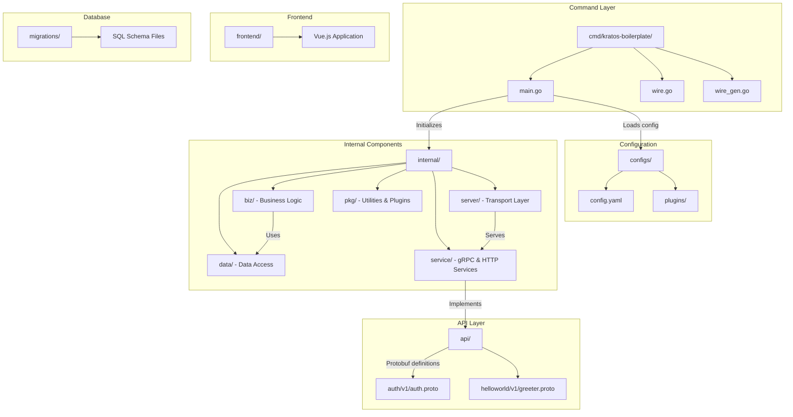
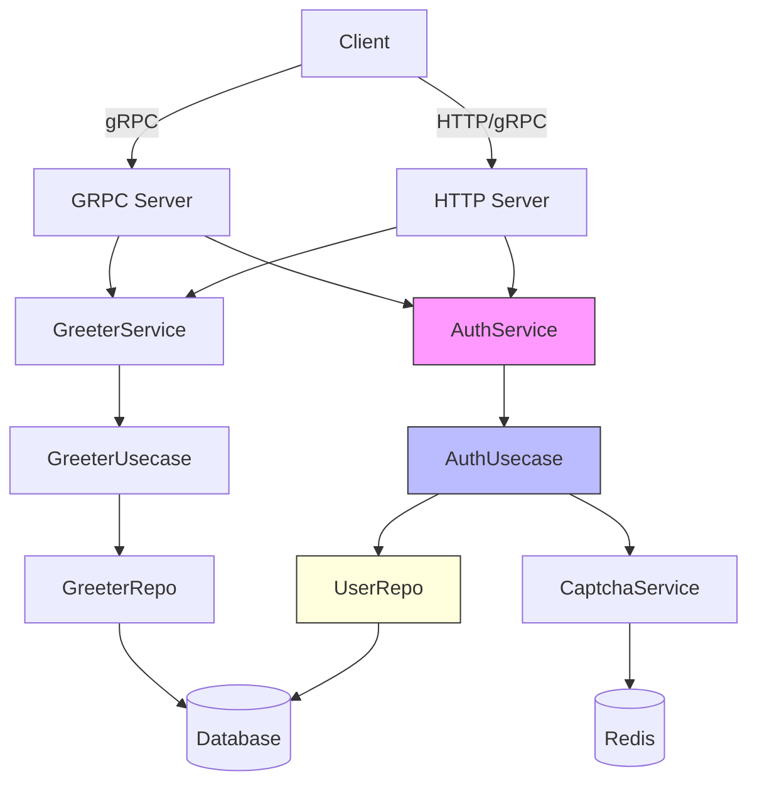

# Development Guide

<cite>
**Referenced Files in This Document**   
- [main.go](file://cmd/kratos-boilerplate/main.go)
- [wire.go](file://cmd/kratos-boilerplate/wire.go)
- [wire_gen.go](file://cmd/kratos-boilerplate/wire_gen.go)
- [auth.proto](file://api/auth/v1/auth.proto)
- [greeter.proto](file://api/helloworld/v1/greeter.proto)
- [conf.proto](file://internal/conf/conf.proto)
- [auth.go](file://internal/biz/auth.go)
- [data.go](file://internal/data/data.go)
- [service/auth.go](file://internal/service/auth.go)
- [server/http.go](file://internal/server/http.go)
- [server/grpc.go](file://internal/server/grpc.go)
</cite>

## Table of Contents
1. [Introduction](#introduction)
2. [Project Structure](#project-structure)
3. [Core Components](#core-components)
4. [Architecture Overview](#architecture-overview)
5. [Adding New Features](#adding-new-features)
6. [Creating New Services](#creating-new-services)
7. [Defining API Endpoints with Protocol Buffers](#defining-api-endpoints-with-protocol-buffers)
8. [Implementing Business Logic](#implementing-business-logic)
9. [Code Generation with Wire and Kratos Tools](#code-generation-with-wire-and-kratos-tools)
10. [Clean Architecture Best Practices](#clean-architecture-best-practices)
11. [Debugging, Logging, and Performance Profiling](#debugging-logging-and-performance-profiling)
12. [Extending Existing Functionality](#extending-existing-functionality)
13. [Code Organization and Consistency](#code-organization-and-consistency)

## Introduction
This guide provides a comprehensive walkthrough for extending the **kratos-boilerplate** project. It is designed for developers who want to add new features, create services, define API endpoints using Protocol Buffers (protobuf), and implement business logic while adhering to Clean Architecture principles. The document covers the full development workflow, including code generation, dependency injection with Wire, debugging techniques, and performance optimization strategies. By following this guide, developers can maintain consistency with the existing codebase and ensure high-quality, maintainable code.

## Project Structure
The kratos-boilerplate follows a layered architecture inspired by Clean Architecture and Domain-Driven Design (DDD). The directory structure is organized to separate concerns and promote modularity.



**Diagram sources**
- [main.go](file://cmd/kratos-boilerplate/main.go#L1-L92)
- [conf.proto](file://internal/conf/conf.proto#L1-L70)

**Section sources**
- [main.go](file://cmd/kratos-boilerplate/main.go#L1-L92)
- [conf.proto](file://internal/conf/conf.proto#L1-L70)

## Core Components
The core components of the kratos-boilerplate include the main application entry point, configuration loader, service definitions, and dependency injection setup. These components work together to initialize the application with proper configuration and inject dependencies across layers.

The `main.go` file initializes the application by loading configuration from YAML files, setting up logging, and calling the Wire-generated injector to construct the application graph. It uses the Kratos framework to manage lifecycle and server registration.

```go
func main() {
	flag.Parse()
	logger := log.With(log.NewStdLogger(os.Stdout),
		"ts", log.DefaultTimestamp,
		"caller", log.DefaultCaller,
		"service.id", id,
		"service.name", Name,
		"service.version", Version,
		"trace.id", tracing.TraceID(),
		"span.id", tracing.SpanID(),
	)
	c := config.New(
		config.WithSource(
			file.NewSource(flagconf),
		),
	)
	defer c.Close()

	if err := c.Load(); err != nil {
		panic(err)
	}

	var bc conf.Bootstrap
	if err := c.Scan(&bc); err != nil {
		panic(err)
	}

	app, cleanup, err := wireApp(bc.Server, bc.Data, bc.Auth, logger)
	if err != nil {
		panic(err)
	}
	defer cleanup()

	if err := app.Run(); err != nil {
		panic(err)
	}
}
```

**Section sources**
- [main.go](file://cmd/kratos-boilerplate/main.go#L45-L92)

## Architecture Overview
The system follows a clean, layered architecture where each layer has a well-defined responsibility:

- **API Layer**: Defines service contracts using Protocol Buffers.
- **Service Layer**: Implements transport-specific logic (HTTP/gRPC).
- **Biz Layer**: Contains pure business logic and use cases.
- **Data Layer**: Handles data persistence and external integrations.
- **Pkg Layer**: Provides reusable utilities and plugins.



**Diagram sources**
- [main.go](file://cmd/kratos-boilerplate/main.go#L1-L92)
- [wire_gen.go](file://cmd/kratos-boilerplate/wire_gen.go#L1-L54)
- [service/auth.go](file://internal/service/auth.go#L1-L200)

## Adding New Features
To add new features to the kratos-boilerplate, follow these steps:

1. **Define the feature in configuration** (optional): If the feature is configurable, extend the `Features` message in `internal/conf/conf.proto`.
2. **Create a new package under `/internal/pkg`**: For example, `/internal/pkg/analytics`.
3. **Implement interfaces and logic**: Define interfaces in `interfaces.go` and implementations in respective files.
4. **Register the provider set in Wire**: Add a `ProviderSet` variable that includes all required constructors.
5. **Inject into main application via `wire.go`**.

Example: Adding a feature toggle system already exists in `internal/pkg/feature`.

```go
// internal/pkg/feature/provider.go
var ProviderSet = wire.NewSet(NewFeatureService, NewFeatureRepository)
```

Then ensure it's included in `cmd/kratos-boilerplate/wire.go`:

```go
wire.Build(
    server.ProviderSet,
    data.ProviderSet,
    biz.ProviderSet,
    service.ProviderSet,
    plugin.ProviderSet,
    feature.ProviderSet,
    newApp)
```

**Section sources**
- [conf.proto](file://internal/conf/conf.proto#L60-L70)
- [wire.go](file://cmd/kratos-boilerplate/wire.go#L1-L27)

## Creating New Services
Creating a new service involves defining a protobuf interface and implementing it in Go.

### Step 1: Define the Service in Protobuf
Create a new `.proto` file under `api/<service>/v1/`. For example, `api/user/v1/user.proto`.

```protobuf
syntax = "proto3";

package user.v1;

import "google/api/annotations.proto";

option go_package = "kratos-boilerplate/api/user/v1;v1";

service UserService {
  rpc GetUser(GetUserRequest) returns (GetUserReply) {
    option (google.api.http) = {
      get: "/api/v1/users/{id}"
    };
  }
}

message GetUserRequest {
  string id = 1;
}

message GetUserReply {
  string id = 1;
  string name = 2;
  string email = 3;
}
```

### Step 2: Generate Code
Run:
```bash
make api
```

This generates Go stubs, HTTP handlers, and gRPC bindings.

### Step 3: Implement the Service
Create `internal/service/user.go`:

```go
func NewUserService(uc *biz.UserUsecase, logger log.Logger) *UserService {
	return &UserService{uc: uc, log: logger}
}

func (s *UserService) GetUser(ctx context.Context, req *v1.GetUserRequest) (*v1.GetUserReply, error) {
	user, err := s.uc.GetUser(ctx, req.Id)
	if err != nil {
		return nil, err
	}
	return &v1.GetUserReply{
		Id:    user.Id,
		Name:  user.Name,
		Email: user.Email,
	}, nil
}
```

**Section sources**
- [greeter.proto](file://api/helloworld/v1/greeter.proto#L1-L31)
- [auth.proto](file://api/auth/v1/auth.proto#L1-L156)
- [service/greeter.go](file://internal/service/greeter.go#L1-L50)

## Defining API Endpoints with Protocol Buffers
API endpoints are defined using Protocol Buffers with HTTP annotations from `google/api/annotations.proto`.

### Key Elements:
- **Service**: Defines the RPC interface.
- **Messages**: Define request and response structures.
- **HTTP Annotations**: Map gRPC methods to HTTP routes.

Example from `auth.proto`:

```protobuf
rpc Login(LoginRequest) returns (LoginReply) {
  option (google.api.http) = {
    post: "/api/v1/auth/login"
    body: "*"
  };
}
```

- `post`: Specifies the HTTP method and path.
- `body: "*"`: Maps the entire request body to the RPC input.

### Validation
Use `validate` rules (if integrated) to enforce field constraints:

```protobuf
message RegisterRequest {
  string username = 1 [(validate.rules).string = {min_len: 3, max_len: 32}];
  string password = 2 [(validate.rules).string = {min_len: 8}];
}
```

Run `make api` to generate validation code.

**Section sources**
- [auth.proto](file://api/auth/v1/auth.proto#L30-L40)
- [greeter.proto](file://api/helloworld/v1/greeter.proto#L15-L20)

## Implementing Business Logic
Business logic resides in the `/internal/biz` directory and follows the use case pattern.

### Structure:
- **Usecase**: Orchestrates business rules.
- **Repository Interface**: Abstracts data access.
- **Entity**: Domain model.

Example: `internal/biz/auth.go`

```go
type AuthUsecase struct {
	repo       UserRepo
	captchaSvc CaptchaService
	config     *AuthConfig
	log        log.Logger
}

func (uc *AuthUsecase) Login(ctx context.Context, username, password string) (*TokenPair, error) {
	// 1. Check account lock status
	if locked, _ := uc.repo.IsAccountLocked(ctx, username); locked {
		return nil, ErrAccountLocked
	}

	// 2. Validate credentials
	user, err := uc.repo.FindByUsername(ctx, username)
	if err != nil || !verifyPassword(user.HashedPassword, password) {
		uc.repo.IncrementFailedLogin(ctx, username)
		return nil, ErrInvalidCredentials
	}

	// 3. Generate tokens
	accessToken, err := generateJWT(user, uc.config.AccessTokenExpiration)
	if err != nil {
		return nil, err
	}

	return &TokenPair{
		AccessToken:  accessToken,
		RefreshToken: generateRefreshToken(),
		ExpiresIn:    uc.config.AccessTokenExpiration.Seconds(),
	}, nil
}
```

Repositories are implemented in `/internal/data` and injected via Wire.

**Section sources**
- [auth.go](file://internal/biz/auth.go#L1-L200)
- [data/auth.go](file://internal/data/auth.go#L1-L150)

## Code Generation with Wire and Kratos Tools
The project uses two main code generation tools: **Wire** for dependency injection and **Kratos CLI** for API scaffolding.

### Wire (Dependency Injection)
- `wire.go`: Contains injector definitions.
- `wire_gen.go`: Generated by `wire` command; do not edit manually.

To regenerate:
```bash
cd cmd/kratos-boilerplate
wire
```

Example injector:
```go
func wireApp(*conf.Server, *conf.Data, *conf.Auth, log.Logger) (*kratos.App, func(), error) {
	wire.Build(server.ProviderSet, data.ProviderSet, biz.ProviderSet, service.ProviderSet, newApp)
	return nil, nil, nil
}
```

### Kratos API Generation
Uses `protoc` plugins to generate:
- Go protobuf bindings (`*.pb.go`)
- HTTP gateway code
- gRPC server stubs
- Swagger/OpenAPI docs

Run:
```bash
make api
```

This executes:
```bash
protoc -I . --go_out=plugins=grpc:./api \
       --go-http_out=./api \
       --go-openapi_out=./api \
       api/**/*.proto
```

**Section sources**
- [wire.go](file://cmd/kratos-boilerplate/wire.go#L1-L27)
- [wire_gen.go](file://cmd/kratos-boilerplate/wire_gen.go#L1-L54)
- [Makefile](file://Makefile#L10-L20)

## Clean Architecture Best Practices
Follow these principles to maintain code quality:

### 1. Dependency Rule
- Source code dependencies point inward.
- Inner layers (biz) must not know about outer layers (data, server).

### 2. Use Case Orchestration
- Each business flow is a method in a usecase struct.
- Keep methods focused and testable.

### 3. Interface Segregation
- Define small, focused interfaces in `biz` layer.
- Implement them in `data` layer.

```go
// internal/biz/auth.go
type UserRepo interface {
	FindByUsername(ctx context.Context, username string) (*User, error)
	Save(ctx context.Context, user *User) error
	IncrementFailedLogin(ctx context.Context, username string) error
	IsAccountLocked(ctx context.Context, username string) (bool, time.Time, error)
}
```

### 4. Error Handling
- Define domain-specific errors in `biz` layer.
- Avoid leaking infrastructure details.

```go
var (
	ErrInvalidCredentials = errors.Unauthorized("AUTH", "invalid credentials")
	ErrAccountLocked      = errors.PermissionDenied("AUTH", "account locked")
)
```

### 5. Logging
- Use structured logging with context.
- Include trace IDs for distributed tracing.

**Section sources**
- [biz.go](file://internal/biz/biz.go#L1-L20)
- [auth.go](file://internal/biz/auth.go#L1-L200)
- [data.go](file://internal/data/data.go#L1-L100)

## Debugging, Logging, and Performance Profiling
### Logging Strategy
The project uses Kratos' built-in logger with structured output:

```go
logger := log.With(log.NewStdLogger(os.Stdout),
	"ts", log.DefaultTimestamp,
	"caller", log.DefaultCaller,
	"service.id", id,
	"service.name", Name,
	"trace.id", tracing.TraceID(),
	"span.id", tracing.SpanID(),
)
```

Log key fields:
- `ts`: Timestamp
- `caller`: Code location
- `trace.id`: Distributed trace ID
- Custom fields: `user.id`, `request.id`, etc.

### Debugging
1. **Enable debug logs**: Set environment variable `KRATOS_LOG_LEVEL=debug`
2. **Use Delve**: Debug with `dlv exec ./bin/kratos-boilerplate -- -conf ./configs`
3. **Check Swagger UI**: Test APIs at `http://localhost:8000/q/swagger-ui/`

### Performance Profiling
Enable pprof in HTTP server:

```go
// internal/server/http.go
if bc.Server.Http.Pprof {
	hs.HandlePrefix("/debug/", http.DefaultServeMux)
}
```

Access profiles:
- CPU: `go tool pprof http://localhost:8000/debug/pprof/profile`
- Heap: `go tool pprof http://localhost:8000/debug/pprof/heap`

### Tracing
Integrated with OpenTelemetry via `tracing` middleware:

```go
kratos.Logger(logger),
kratos.Server(
	gs,
	hs,
),
```

**Section sources**
- [main.go](file://cmd/kratos-boilerplate/main.go#L50-L60)
- [server/http.go](file://internal/server/http.go#L1-L100)

## Extending Existing Functionality
To extend existing services:

### Example: Add TOTP Support to Login
1. **Update proto**:
```protobuf
message LoginRequest {
  string username = 1;
  string password = 2;
  string totp_code = 5; // Add field
}
```

2. **Regenerate API code**:
```bash
make api
```

3. **Update business logic**:
```go
// internal/biz/auth.go
func (uc *AuthUsecase) Login(ctx context.Context, req *LoginRequest) (*TokenPair, error) {
	// ... existing logic
	if uc.config.TOTpEnabled {
		if req.TotpCode == "" {
			return nil, ErrTotpRequired
		}
		if !validateTOTP(req.Username, req.TotpCode) {
			return nil, ErrInvalidTotp
		}
	}
	// ...
}
```

4. **Update service layer** to pass `req.TotpCode`.

### Example: Add New Middleware
Create `internal/middleware/audit.go` and register in `server/http.go`:

```go
httpServer := http.NewServer(
	http.Address(bc.Server.Http.Addr),
	http.Middleware(
		middleware.Logging,
		middleware.Recovery,
		audit.Middleware, // Add custom middleware
	),
)
```

**Section sources**
- [auth.proto](file://api/auth/v1/auth.proto#L80-L85)
- [auth.go](file://internal/biz/auth.go#L100-L150)
- [http.go](file://internal/server/http.go#L1-L100)

## Code Organization and Consistency
Maintain consistency by following:

### Naming Conventions
- **Packages**: lowercase, singular (`auth`, `greeter`)
- **Structs**: PascalCase (`AuthService`, `AuthUsecase`)
- **Interfaces**: Suffix with `Interface` or `er` (`UserRepo`)
- **Test files**: `_test.go`

### Directory Structure
```
/internal
  /biz          # Business logic
  /data         # Data access
  /server       # Transport servers
  /service      # gRPC & HTTP service implementations
  /pkg          # Shared utilities
```

### Testing
- **Unit tests**: In same package, cover biz and data logic.
- **Integration tests**: Under `test/integration/`
- **BDD tests**: Under `test/bdd/` for end-to-end scenarios.

Run all tests:
```bash
scripts/run_tests.sh
```

Generates coverage report in `coverage.html`.

### Git and Branching
- Use feature branches
- Follow conventional commits
- PRs require review and CI pass

**Section sources**
- [Makefile](file://Makefile#L1-L50)
- [scripts/run_tests.sh](file://scripts/run_tests.sh#L1-L10)
- [test/README.md](file://test/README.md#L1-L20)