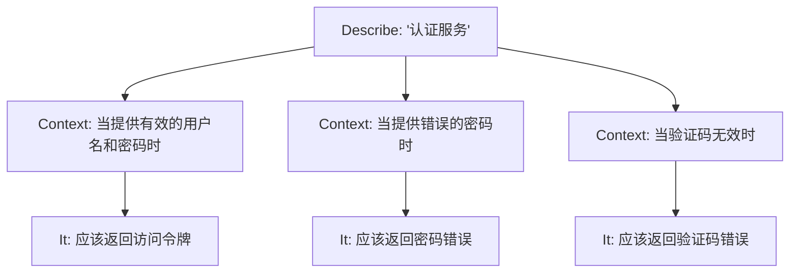
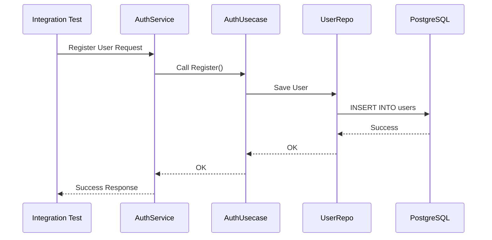
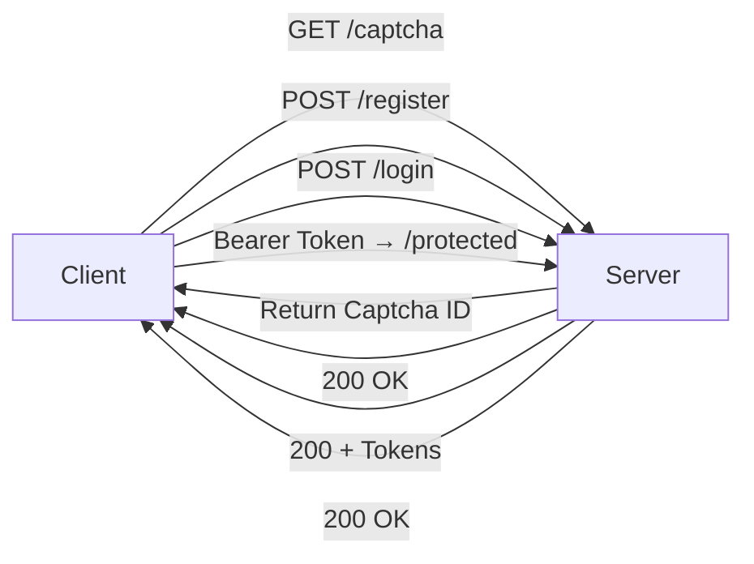

# Writing Tests

<cite>
**Referenced Files in This Document**   
- [auth.go](file://internal/biz/auth.go)
- [mock_repository.go](file://internal/pkg/kms/mock_repository.go)
- [auth_bdd_test.go](file://test/bdd/auth/auth_bdd_test.go)
- [test_suite.go](file://test/bdd/shared/test_suite.go)
- [auth_integration_test.go](file://test/integration/database/auth_integration_test.go)
- [auth_e2e_test.go](file://test/e2e/scenarios/auth_e2e_test.go)
- [api_client.go](file://test/e2e/helpers/api_client.go)
- [auth.go](file://internal/service/auth.go)
</cite>

## Table of Contents
1. [Introduction](#introduction)
2. [Unit Testing Business Logic with Mocks](#unit-testing-business-logic-with-mocks)
3. [BDD-Style Testing with Ginkgo/Gomega](#bdd-style-testing-with-ginkgo-gomega)
4. [Integration Testing with Real Database](#integration-testing-with-real-database)
5. [End-to-End API Testing](#end-to-end-api-testing)
6. [Test Data Management and Parallel Execution](#test-data-management-and-parallel-execution)
7. [Coverage Reporting and Common Issues](#coverage-reporting-and-common-issues)

## Introduction
This document provides a comprehensive guide to writing tests at all levels in the kratos-boilerplate project. It covers unit, BDD-style, integration, and end-to-end testing strategies, focusing on authentication functionality. The goal is to ensure robust, maintainable, and reliable code through systematic test coverage across different layers of the application.

## Unit Testing Business Logic with Mocks

The business logic in the `internal/biz/` package is tested using mocks defined in `internal/pkg/plugin/mock_repository.go`. This approach isolates the business layer from external dependencies such as databases and services, enabling fast and deterministic unit tests.

The `AuthUsecase` interface encapsulates core authentication operations like registration, login, logout, and token refresh. Its implementation, `authUsecase`, depends on `UserRepo` and `CaptchaService` interfaces, which are mocked during unit testing. By injecting mock implementations, we can simulate various scenarios including success paths, validation failures, and error conditions without relying on real infrastructure.

For example, in `internal/biz/auth_test.go`, mock repositories are used to verify that:
- User registration fails when the username already exists.
- Login returns an error if the password is incorrect.
- Captcha verification is required when enabled in configuration.

This mocking strategy allows precise control over test conditions and ensures that business logic is validated independently of data persistence mechanisms.

**Section sources**
- [auth.go](file://internal/biz/auth.go#L1-L695)
- [mock_repository.go](file://internal/pkg/kms/mock_repository.go#L1-L304)

## BDD-Style Testing with Ginkgo/Gomega

Behavior-Driven Development (BDD) style testing is implemented using the Ginkgo and Gomega frameworks in `test/bdd/auth/auth_bdd_test.go`. These tests describe system behavior in a human-readable format, making them ideal for collaboration between developers, testers, and stakeholders.

The test suite is structured using Ginkgo's `Describe`, `Context`, and `It` blocks to organize specifications hierarchically. For instance:

**Diagram sources**
- [auth_bdd_test.go](file://test/bdd/auth/auth_bdd_test.go#L30-L285)

Each test case uses mocks to simulate interactions with the `UserRepo` and `CaptchaService`. The `test/bdd/shared/test_suite.go` file provides a reusable test suite setup that initializes mock repositories and service instances before each test.

Key features of this BDD setup include:
- Clear separation of test setup (`BeforeEach`) and teardown (`AfterEach`).
- Use of `GinkgoWriter` for logging test execution flow.
- Integration with `mock` library to define expected method calls and arguments.
- Assertion of both successful outcomes and error conditions using `Expect()` and `errors.Is*()` helpers.

This approach enhances test readability and maintainability while ensuring comprehensive coverage of business rules.

**Section sources**
- [auth_bdd_test.go](file://test/bdd/auth/auth_bdd_test.go#L1-L286)
- [test_suite.go](file://test/bdd/shared/test_suite.go#L1-L231)

## Integration Testing with Real Database

Integration testing is performed using real database connections to validate interactions between the application and persistent storage. The `auth_integration_test.go` file in `test/integration/database/` demonstrates how to set up a full data layer with actual database access.

These tests use Docker-based test isolation to ensure a clean and consistent environment. A dedicated test database container is spun up before the test suite runs, initialized with schema migrations from the `migrations/` directory. After tests complete, the container is torn down to prevent state leakage.

The integration test setup involves:
1. Loading configuration from `test/config/test.yaml`.
2. Initializing the `Data` struct with real database connections.
3. Creating repository instances (`UserRepo`, `CaptchaRepo`) backed by the live database.
4. Executing service-layer operations and verifying their effects on stored data.

**Diagram sources**
- [auth_integration_test.go](file://test/integration/database/auth_integration_test.go#L1-L200)
- [data.go](file://internal/data/data.go#L1-L150)

This level of testing validates SQL queries, transaction handling, and data consistency constraints that cannot be caught by unit tests alone.

**Section sources**
- [auth_integration_test.go](file://test/integration/database/auth_integration_test.go#L1-L200)

## End-to-End API Testing

End-to-end (E2E) testing validates the complete API workflow from HTTP request to response, ensuring that all layers function correctly together. The `auth_e2e_test.go` file in `test/e2e/scenarios/` contains E2E test cases for authentication endpoints.

These tests use helper functions defined in `api_client.go` to send HTTP requests to a running server instance. The server is typically started in a test mode with in-memory or Docker-managed dependencies to avoid side effects on production systems.

Key aspects of E2E testing include:
- Testing actual HTTP routes and request/response formats.
- Validating status codes, headers, and JSON payloads.
- Simulating user flows such as registration → login → protected access → logout.
- Using test users created via `test_user.go` to manage credentials and state.

Example test flow:
1. Request a captcha via `/api/auth/v1/get_captcha`.
2. Submit registration with valid captcha.
3. Perform login and receive JWT tokens.
4. Use access token to call protected endpoints.
5. Refresh token and verify new token issuance.

**Diagram sources**
- [auth_e2e_test.go](file://test/e2e/scenarios/auth_e2e_test.go#L1-L180)
- [api_client.go](file://test/e2e/helpers/api_client.go#L1-L120)

This approach catches integration bugs related to serialization, middleware, authentication, and routing.

**Section sources**
- [auth_e2e_test.go](file://test/e2e/scenarios/auth_e2e_test.go#L1-L180)
- [api_client.go](file://test/e2e/helpers/api_client.go#L1-L120)

## Test Data Management and Parallel Execution

Effective test data management is critical for reliable and fast test execution. The kratos-boilerplate employs several strategies:

- **Isolated Test Databases**: Each integration test runs against a fresh database instance using Docker, preventing interference between test cases.
- **Test Fixtures**: Predefined data sets are loaded before specific test suites to ensure consistent initial states.
- **Cleanup Hooks**: The `Teardown()` function in `test_suite.go` ensures resources like database connections and mock expectations are properly released.

To support parallel test execution:
- Tests avoid shared global state by using dependency injection.
- Randomized identifiers (e.g., usernames, emails) prevent collisions.
- Time-sensitive logic uses injectable `Now()` functions for deterministic behavior.

Race conditions are mitigated by:
- Using `sync.RWMutex` in mock repositories.
- Avoiding shared mutable state in test suites.
- Running flaky tests with retry logic via Ginkgo’s `Eventually`.

Slow database setup is optimized by:
- Reusing Docker containers across test runs.
- Pre-building schema via migration scripts.
- Caching test binaries and dependencies.

**Section sources**
- [test_suite.go](file://test/bdd/shared/test_suite.go#L1-L231)
- [auth_integration_test.go](file://test/integration/database/auth_integration_test.go#L1-L200)

## Coverage Reporting and Common Issues

Code coverage is measured using Go’s built-in `go test -cover` tool, with thresholds enforced in CI pipelines. The project aims for ≥85% coverage in business logic packages (`internal/biz/`), with lower emphasis on generated or boilerplate code.

Common issues encountered and their solutions:
- **Flaky Tests**: Addressed by increasing timeouts, using `Eventually()` for asynchronous conditions, and avoiding time-based assertions unless mocked.
- **Slow Tests**: Optimized by minimizing external calls, using mocks where appropriate, and parallelizing independent test suites.
- **Database Setup Overhead**: Reduced by container reuse and schema caching.
- **Mock Misuse**: Prevented by strict expectation validation (`AssertExpectations`) and avoiding over-mocking.

Best practices followed:
- Each test verifies a single behavior.
- Descriptive test names follow Given-When-Then patterns.
- Error messages include context for debugging.
- All test files are colocated with corresponding source files.

**Section sources**
- [auth.go](file://internal/biz/auth.go#L1-L695)
- [auth_bdd_test.go](file://test/bdd/auth/auth_bdd_test.go#L1-L286)
- [auth_integration_test.go](file://test/integration/database/auth_integration_test.go#L1-L200)
- [auth_e2e_test.go](file://test/e2e/scenarios/auth_e2e_test.go#L1-L180)