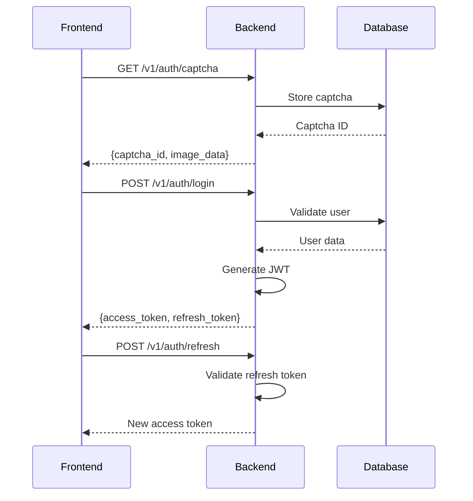
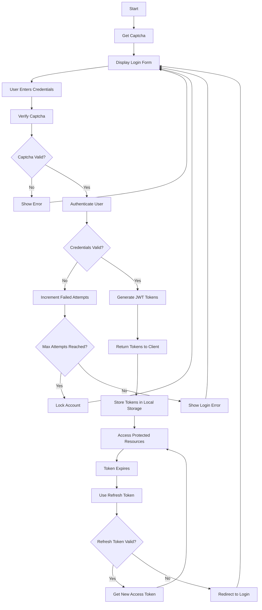
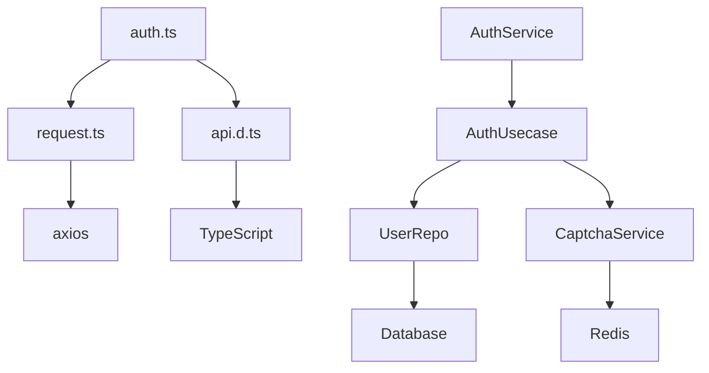

# API Integration

<cite>
**Referenced Files in This Document**   
- [request.ts](file://frontend/src/api/request.ts)
- [auth.ts](file://frontend/src/api/auth.ts)
- [api.d.ts](file://frontend/src/types/api.d.ts)
- [auth.go](file://internal/biz/auth.go)
- [auth_bdd_test.go](file://internal/service/auth_bdd_test.go)
- [auth_test.go](file://internal/biz/auth_test.go)
- [auth_bdd_test.go](file://test/bdd/auth/auth_bdd_test.go)
</cite>

## Table of Contents
1. [Introduction](#introduction)
2. [Project Structure](#project-structure)
3. [Core Components](#core-components)
4. [Architecture Overview](#architecture-overview)
5. [Detailed Component Analysis](#detailed-component-analysis)
6. [Dependency Analysis](#dependency-analysis)
7. [Performance Considerations](#performance-considerations)
8. [Troubleshooting Guide](#troubleshooting-guide)
9. [Conclusion](#conclusion)

## Introduction
This document provides comprehensive documentation for the frontend-backend API integration in the kratos-boilerplate project. It details the implementation of the HTTP client wrapper (`request.ts`) using Axios, the authentication service (`auth.ts`) with methods for login, registration, and token refresh, and the use of TypeScript interfaces (`api.d.ts`) for type safety. The document also includes usage examples, error handling strategies, and guidance on extending the API client for new endpoints while maintaining type consistency.

## Project Structure
The kratos-boilerplate project follows a modular architecture with a clear separation between frontend and backend components. The frontend is implemented using Vue.js and TypeScript, while the backend is built with Go and the Kratos framework. The API integration layer resides in the `frontend/src/api` directory, with key files including `request.ts` (HTTP client configuration), `auth.ts` (authentication service), and `api.d.ts` (TypeScript type definitions).

```mermaid
graph TB
subgraph "Frontend"
A[request.ts] --> B[auth.ts]
B --> C[api.d.ts]
D[Login.vue] --> B
E[Register.vue] --> B
end
subgraph "Backend"
F[AuthService] --> G[AuthUsecase]
G --> H[UserRepo]
G --> I[CaptchaService]
end
B < --> F
```

**Diagram sources**
- [request.ts](file://frontend/src/api/request.ts)
- [auth.ts](file://frontend/src/api/auth.ts)
- [api.d.ts](file://frontend/src/types/api.d.ts)

**Section sources**
- [request.ts](file://frontend/src/api/request.ts)
- [auth.ts](file://frontend/src/api/auth.ts)
- [api.d.ts](file://frontend/src/types/api.d.ts)

## Core Components
The core components of the API integration include the HTTP client wrapper, authentication service, and TypeScript type definitions. These components work together to provide a type-safe, secure, and user-friendly authentication experience.

### HTTP Client Wrapper (request.ts)
The `request.ts` file configures an Axios instance with default settings and interceptors for request and response handling. It sets the base URL and timeout for all requests and provides a foundation for authentication and error handling.

```typescript
import axios from 'axios'

const request = axios.create({
    baseURL: import.meta.env.VITE_API_BASE_URL || '/api',
    timeout: 5000
})
```

**Section sources**
- [request.ts](file://frontend/src/api/request.ts#L1-L28)

### Authentication Service (auth.ts)
The `auth.ts` file implements the authentication service with methods for login, registration, logout, and token refresh. It uses Axios interceptors to automatically attach the JWT token to requests and handle 401 responses by redirecting to the login page.

```typescript
// 请求拦截器
request.interceptors.request.use(
    (config) => {
        const token = localStorage.getItem('access_token');
        if (token) {
            config.headers.Authorization = `Bearer ${token}`;
        }
        return config;
    },
    (error) => {
        return Promise.reject(error);
    }
);

// 响应拦截器
request.interceptors.response.use(
    (response) => {
        return response.data;
    },
    (error) => {
        if (error.response?.status === 401) {
            // 处理token过期
            localStorage.removeItem('access_token');
            localStorage.removeItem('refresh_token');
            window.location.href = '/login';
        }
        return Promise.reject(error);
    }
);
```

**Section sources**
- [auth.ts](file://frontend/src/api/auth.ts#L1-L98)

### TypeScript Type Definitions (api.d.ts)
The `api.d.ts` file defines TypeScript interfaces for API responses, ensuring type safety throughout the application. It includes interfaces for captcha, login, registration, and lock status responses, as well as a generic `ApiResponse` interface.

```typescript
export interface ApiResponse<T> {
    code: number;
    message: string;
    data: T;
}
```

**Section sources**
- [api.d.ts](file://frontend/src/types/api.d.ts#L1-L31)

## Architecture Overview
The API integration architecture follows a layered pattern with clear separation of concerns. The frontend communicates with the backend through RESTful endpoints, with authentication handled via JWT tokens. The architecture includes client-side request handling, server-side authentication logic, and database interactions for user management.



**Diagram sources**
- [auth.ts](file://frontend/src/api/auth.ts)
- [auth.go](file://internal/biz/auth.go)

## Detailed Component Analysis

### Authentication Flow Analysis
The authentication flow in kratos-boilerplate follows a standard JWT-based pattern with additional security features such as captcha verification and account lockout.



**Diagram sources**
- [auth.ts](file://frontend/src/api/auth.ts#L52-L98)
- [auth.go](file://internal/biz/auth.go#L188-L223)

### Backend Authentication Logic
The backend authentication logic is implemented in the `AuthUsecase` interface and its concrete implementation. It handles user registration, login, logout, and token refresh operations with proper validation and error handling.

```go
type AuthUsecase interface {
    Register(ctx context.Context, username, password, email, phone, captchaID, captchaCode string) error
    Login(ctx context.Context, username, password, captchaID, captchaCode, totpCode string) (*TokenPair, error)
    Logout(ctx context.Context, accessToken string) error
    RefreshToken(ctx context.Context, refreshToken string) (*TokenPair, error)
    GetCaptcha(ctx context.Context, captchaType, target string) (*Captcha, error)
    VerifyCaptcha(ctx context.Context, captchaID, captchaCode string) (bool, error)
    GetLockStatus(ctx context.Context, username string) (*AccountLock, error)
    Now() time.Time
    GetMaxLoginAttempts() int32
}
```

**Section sources**
- [auth.go](file://internal/biz/auth.go#L188-L223)

## Dependency Analysis
The API integration components have well-defined dependencies that ensure loose coupling and high cohesion. The frontend components depend on Axios for HTTP requests and TypeScript for type safety, while the backend components use the Kratos framework and various Go packages for business logic implementation.



**Diagram sources**
- [auth.ts](file://frontend/src/api/auth.ts)
- [auth.go](file://internal/biz/auth.go)

**Section sources**
- [auth.ts](file://frontend/src/api/auth.ts)
- [auth.go](file://internal/biz/auth.go)

## Performance Considerations
The API integration is designed with performance in mind, using efficient data structures and algorithms for authentication operations. The use of JWT tokens reduces database queries for authenticated requests, and captcha images are served as base64-encoded strings to minimize round trips.

Key performance considerations:
- **Token Expiration**: Access tokens expire after 15 minutes, reducing the risk of token theft while minimizing refresh requests.
- **Captcha Expiration**: Captchas expire after 5 minutes, balancing security with user experience.
- **Account Lockout**: Accounts are locked after 5 failed attempts for 30 minutes, preventing brute force attacks.
- **HTTP Caching**: The API supports standard HTTP caching headers for appropriate endpoints.

**Section sources**
- [auth.go](file://internal/biz/auth.go#L188-L223)

## Troubleshooting Guide
This section provides guidance on common issues and their solutions when working with the API integration.

### Common Issues and Solutions
- **401 Unauthorized Errors**: Ensure the access token is present in local storage and has not expired. The response interceptor automatically handles token expiration by redirecting to the login page.
- **Captcha Validation Failures**: Verify that the captcha ID and code are correctly passed to the verification endpoint. Captchas are case-sensitive and expire after 5 minutes.
- **Account Lockout**: Check the account lock status using the `getLockStatus` method. Locked accounts cannot be unlocked programmatically and require waiting for the lock duration to expire.
- **Type Errors**: Ensure that TypeScript interfaces in `api.d.ts` match the actual API responses. Use the `ApiResponse<T>` generic interface for consistent error handling.

### Debugging Tips
- Use browser developer tools to inspect network requests and responses.
- Check the console for JavaScript errors related to Axios or TypeScript.
- Verify environment variables, especially `VITE_API_BASE_URL`, are correctly set.
- Enable verbose logging in the backend for detailed error information.

**Section sources**
- [auth.ts](file://frontend/src/api/auth.ts)
- [auth.go](file://internal/biz/auth.go)

## Conclusion
The API integration in kratos-boilerplate provides a robust, secure, and type-safe foundation for frontend-backend communication. By leveraging Axios interceptors, TypeScript interfaces, and JWT-based authentication, the system ensures a seamless user experience while maintaining high security standards. The modular architecture allows for easy extension and maintenance, making it suitable for both small and large-scale applications.