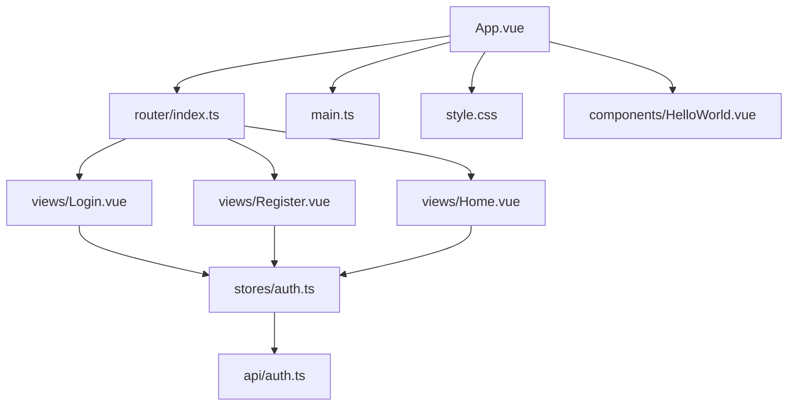
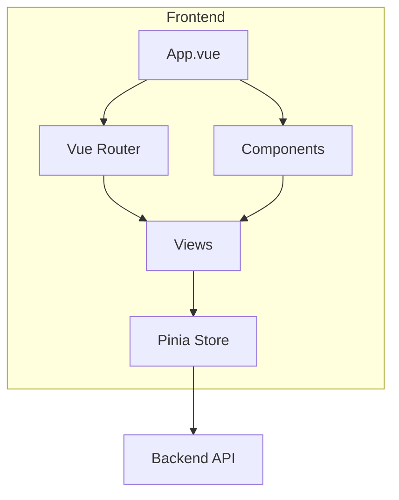
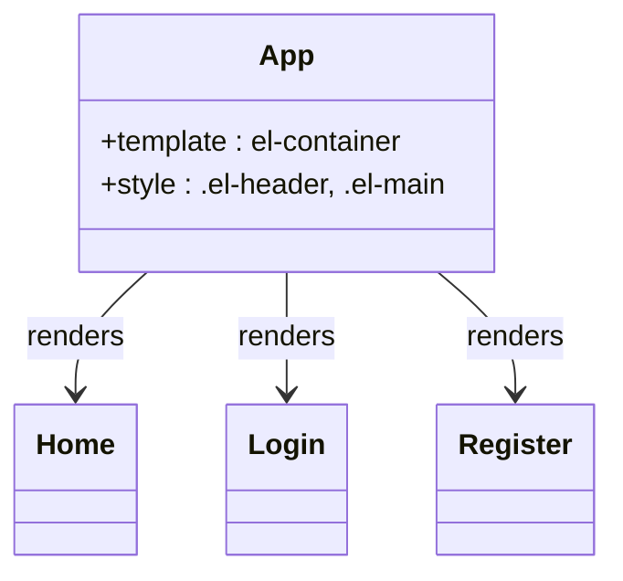
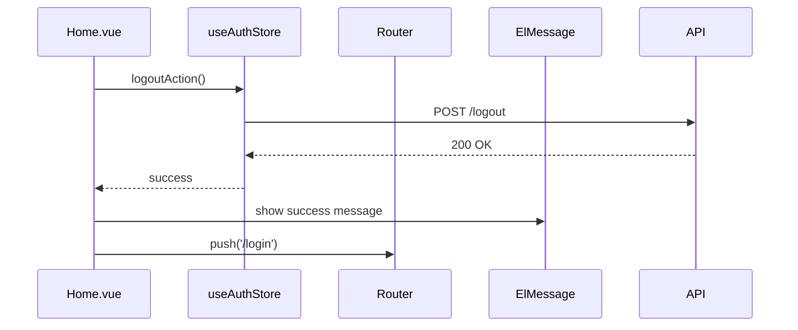
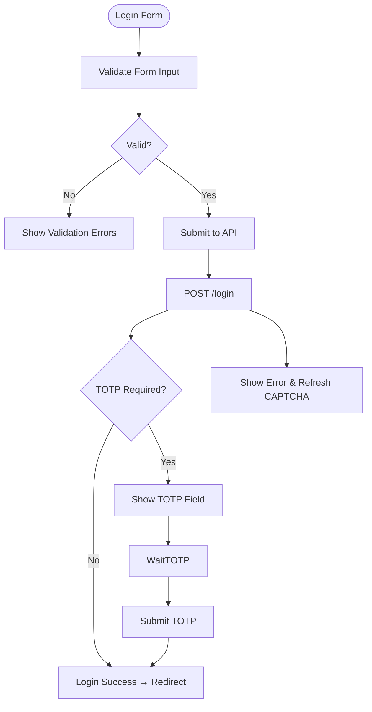
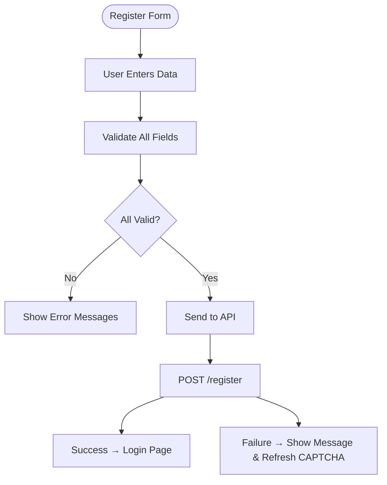
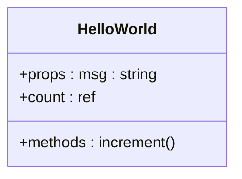
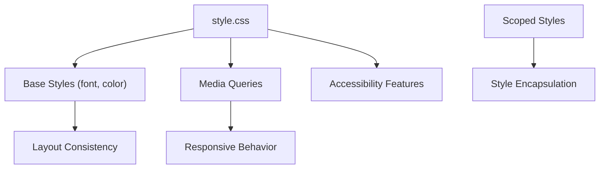
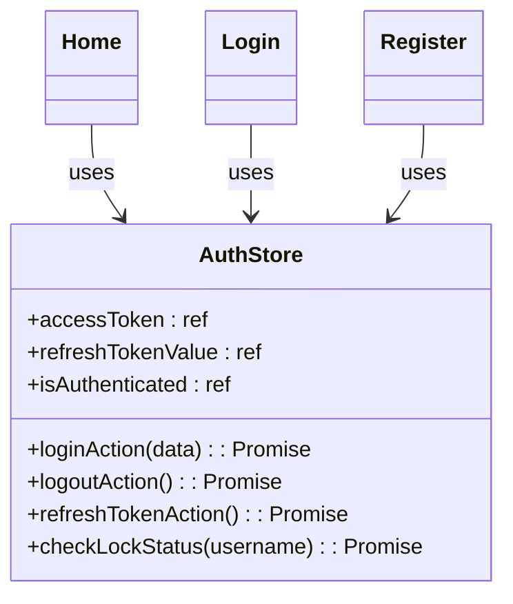

# Component Architecture

<cite>
**Referenced Files in This Document**   
- [App.vue](file://frontend/src/App.vue#L1-L27)
- [main.ts](file://frontend/src/main.ts#L1-L20)
- [router/index.ts](file://frontend/src/router/index.ts#L1-L41)
- [stores/auth.ts](file://frontend/src/stores/auth.ts#L1-L98)
- [style.css](file://frontend/src/style.css#L1-L79)
- [components/HelloWorld.vue](file://frontend/src/components/HelloWorld.vue#L1-L41)
- [views/Home.vue](file://frontend/src/views/Home.vue#L1-L84)
- [views/Login.vue](file://frontend/src/views/Login.vue#L1-L185)
- [views/Register.vue](file://frontend/src/views/Register.vue#L1-L228)
</cite>

## Table of Contents
1. [Project Structure](#project-structure)
2. [Core Components](#core-components)
3. [Architecture Overview](#architecture-overview)
4. [Detailed Component Analysis](#detailed-component-analysis)
5. [Styling and Responsive Design](#styling-and-responsive-design)
6. [Component Composition and Communication](#component-composition-and-communication)
7. [State Management with Pinia](#state-management-with-pinia)
8. [Routing and Navigation Guards](#routing-and-navigation-guards)
9. [Accessibility and UI/UX Consistency](#accessibility-and-uiux-consistency)
10. [Performance Optimization and Common Issues](#performance-optimization-and-common-issues)

## Project Structure

The frontend structure of the `kratos-boilerplate` project follows a modular and feature-based organization. Key directories include:
- `api/`: Contains API service definitions and request utilities.
- `components/`: Houses reusable UI components like `HelloWorld.vue`.
- `router/`: Defines route configurations and navigation guards.
- `stores/`: Implements state management using Pinia.
- `types/`: Type definitions for TypeScript.
- `views/`: Top-level page components such as `Home.vue`, `Login.vue`, and `Register.vue`.
- Root-level files like `App.vue`, `main.ts`, and `style.css` serve as entry points and global configuration.

This structure promotes separation of concerns, scalability, and ease of maintenance.



**Diagram sources**
- [App.vue](file://frontend/src/App.vue#L1-L27)
- [main.ts](file://frontend/src/main.ts#L1-L20)
- [router/index.ts](file://frontend/src/router/index.ts#L1-L41)

**Section sources**
- [App.vue](file://frontend/src/App.vue#L1-L27)
- [main.ts](file://frontend/src/main.ts#L1-L20)

## Core Components

The core components in this Vue.js application are:
- **App.vue**: The root component that provides the layout and renders child views via `<router-view>`.
- **Home.vue, Login.vue, Register.vue**: Top-level views representing major application pages.
- **HelloWorld.vue**: A reusable example component demonstrating basic Vue 3 composition API usage.
- **auth.ts (Pinia Store)**: Manages authentication state including tokens and user session.
- **router/index.ts**: Handles client-side routing and navigation guards.

These components work together to form a cohesive single-page application (SPA) with secure authentication flows.

**Section sources**
- [App.vue](file://frontend/src/App.vue#L1-L27)
- [views/Home.vue](file://frontend/src/views/Home.vue#L1-L84)
- [views/Login.vue](file://frontend/src/views/Login.vue#L1-L185)
- [views/Register.vue](file://frontend/src/views/Register.vue#L1-L228)
- [components/HelloWorld.vue](file://frontend/src/components/HelloWorld.vue#L1-L41)

## Architecture Overview

The application uses Vue 3 with the Composition API, TypeScript, and Element Plus for UI components. It follows a component-driven architecture where `App.vue` acts as the shell, delegating view rendering to Vue Router. State is managed centrally using Pinia, enabling reactive data flow across components.

Authentication logic is abstracted into a dedicated store (`auth.ts`), which interacts with backend APIs through `api/auth.ts`. The routing system enforces access control via navigation guards, redirecting unauthenticated users to the login page.



**Diagram sources**
- [App.vue](file://frontend/src/App.vue#L1-L27)
- [router/index.ts](file://frontend/src/router/index.ts#L1-L41)
- [stores/auth.ts](file://frontend/src/stores/auth.ts#L1-L98)

## Detailed Component Analysis

### App.vue Analysis

`App.vue` serves as the root component, defining the overall layout using Element Plus containers (`el-container`, `el-header`, `el-main`). It hosts the router outlet (`<router-view>`) to dynamically render matched views.

It applies global styles for header and main content areas, ensuring consistent visual hierarchy.



**Diagram sources**
- [App.vue](file://frontend/src/App.vue#L1-L27)

**Section sources**
- [App.vue](file://frontend/src/App.vue#L1-L27)

### Home.vue Analysis

`Home.vue` displays the main dashboard after successful login. It shows user information and a logout button. It uses `useAuthStore()` to access authentication state and perform logout actions.

Key features:
- Reactive username display
- Logout functionality with success/error feedback
- Responsive layout using Element Plus card and container components



**Diagram sources**
- [views/Home.vue](file://frontend/src/views/Home.vue#L1-L84)
- [stores/auth.ts](file://frontend/src/stores/auth.ts#L1-L98)

**Section sources**
- [views/Home.vue](file://frontend/src/views/Home.vue#L1-L84)

### Login.vue Analysis

`Login.vue` implements a secure login form with:
- Username and password fields
- CAPTCHA integration for bot protection
- TOTP (Time-based One-Time Password) support for 2FA
- Form validation using Element Plus rules
- Error handling with user feedback

The component dynamically shows the TOTP field when required by the backend.



**Diagram sources**
- [views/Login.vue](file://frontend/src/views/Login.vue#L1-L185)
- [api/auth.ts](file://frontend/src/api/auth.ts)

**Section sources**
- [views/Login.vue](file://frontend/src/views/Login.vue#L1-L185)

### Register.vue Analysis

`Register.vue` provides a registration form with:
- Username, password, email, phone inputs
- Strong password validation (length, complexity)
- Confirm password matching
- CAPTCHA verification
- Client-side validation with custom rules

It ensures data integrity before submission and provides immediate feedback.



**Diagram sources**
- [views/Register.vue](file://frontend/src/views/Register.vue#L1-L228)
- [api/auth.ts](file://frontend/src/api/auth.ts)

**Section sources**
- [views/Register.vue](file://frontend/src/views/Register.vue#L1-L228)

### HelloWorld.vue Analysis

`HelloWorld.vue` is a reusable component demonstrating Vue 3 composition API basics:
- Props (`msg`) for configurable text
- Reactive state (`count`) with click handler
- Scoped CSS to prevent style leakage
- Template expressions and event binding

It serves as a development playground and HMR (Hot Module Replacement) test.



**Diagram sources**
- [components/HelloWorld.vue](file://frontend/src/components/HelloWorld.vue#L1-L41)

**Section sources**
- [components/HelloWorld.vue](file://frontend/src/components/HelloWorld.vue#L1-L41)

## Styling and Responsive Design

Global styles are defined in `style.css`, which sets:
- Base typography and color scheme
- Responsive breakpoints via `@media`
- Accessibility enhancements (font smoothing, focus visibility)
- Dark/light mode support using `color-scheme`

Component-specific styles use `scoped` attribute to prevent conflicts. Element Plus provides responsive layout utilities (flexbox, grid) used in `Login.vue` and `Register.vue` for centering and alignment.

Key responsive techniques:
- `min-height: 100vh` for full viewport height
- Flexbox for vertical and horizontal centering
- Max-width containers with auto margins
- Mobile-first font sizes and spacing



**Diagram sources**
- [style.css](file://frontend/src/style.css#L1-L79)

**Section sources**
- [style.css](file://frontend/src/style.css#L1-L79)

## Component Composition and Communication

The composition pattern follows parent-child hierarchy:
- `App.vue` is the parent, rendering routed views
- Views use shared components (e.g., `HelloWorld.vue`)
- Components communicate via props, events, and shared state

Key communication mechanisms:
- **Props**: `HelloWorld.vue` accepts `msg` prop
- **Events**: Not explicitly used; relies on store for state changes
- **Slots**: Not used in current implementation
- **Global State**: Pinia store (`auth.ts`) for authentication data

Best practices followed:
- Single responsibility per component
- Reusable UI elements
- Clear separation between presentation and logic

**Section sources**
- [App.vue](file://frontend/src/App.vue#L1-L27)
- [components/HelloWorld.vue](file://frontend/src/components/HelloWorld.vue#L1-L41)
- [stores/auth.ts](file://frontend/src/stores/auth.ts#L1-L98)

## State Management with Pinia

The `auth.ts` store manages authentication state using Pinia:
- Reactive refs: `accessToken`, `refreshTokenValue`, `isAuthenticated`
- Actions: `loginAction`, `logoutAction`, `refreshTokenAction`
- Persistence: Tokens stored in `localStorage`
- Cross-component access: Any component can import and use the store

This centralized approach ensures consistent state across the app and simplifies debugging.



**Diagram sources**
- [stores/auth.ts](file://frontend/src/stores/auth.ts#L1-L98)

**Section sources**
- [stores/auth.ts](file://frontend/src/stores/auth.ts#L1-L98)

## Routing and Navigation Guards

Vue Router configures three routes:
- `/` → Home (requires auth)
- `/login` → Login (public)
- `/register` → Register (public)

A global `beforeEach` guard checks `requiresAuth` meta field and redirects accordingly:
- Unauthenticated users → `/login`
- Authenticated users on login → `/home`

This prevents unauthorized access while maintaining UX flow.

```mermaid
graph TD
A[/login] --> |isAuthenticated| B[/]
B --> |!isAuthenticated| A
C[/register] --> A
D[/] --> |!isAuthenticated| A
```

**Diagram sources**
- [router/index.ts](file://frontend/src/router/index.ts#L1-L41)

**Section sources**
- [router/index.ts](file://frontend/src/router/index.ts#L1-L41)

## Accessibility and UI/UX Consistency

The application ensures accessibility through:
- Semantic HTML (`<button>`, `<form>`, `<label>`)
- Keyboard navigation support (Enter key submission)
- Focus visibility (CSS outline)
- ARIA attributes (implied via Element Plus)

UI/UX consistency is maintained by:
- Using Element Plus components for uniform design
- Centralized styling in `style.css`
- Reusable components
- Standardized error/success messaging with `ElMessage`

**Section sources**
- [style.css](file://frontend/src/style.css#L1-L79)
- [Login.vue](file://frontend/src/views/Login.vue#L1-L185)
- [Register.vue](file://frontend/src/views/Register.vue#L1-L228)

## Performance Optimization and Common Issues

### Performance Considerations
- **Lazy Loading**: Views are dynamically imported (`import('@/views/Home.vue')`)
- **Reactivity Optimization**: Pinia uses refs efficiently
- **Event Handling**: Direct DOM events without unnecessary wrappers

### Common Issues and Solutions
- **Style Conflicts**: Solved using scoped CSS and BEM-like naming
- **Component Communication**: Centralized via Pinia instead of prop drilling
- **Re-rendering**: Minimized by using reactive primitives only where needed
- **Authentication State Sync**: Ensured via localStorage persistence and store reactivity

Best practices:
- Always validate forms before submission
- Handle API errors gracefully
- Use loading states during async operations
- Refresh CAPTCHA on failure to prevent brute force

**Section sources**
- [App.vue](file://frontend/src/App.vue#L1-L27)
- [stores/auth.ts](file://frontend/src/stores/auth.ts#L1-L98)
- [Login.vue](file://frontend/src/views/Login.vue#L1-L185)