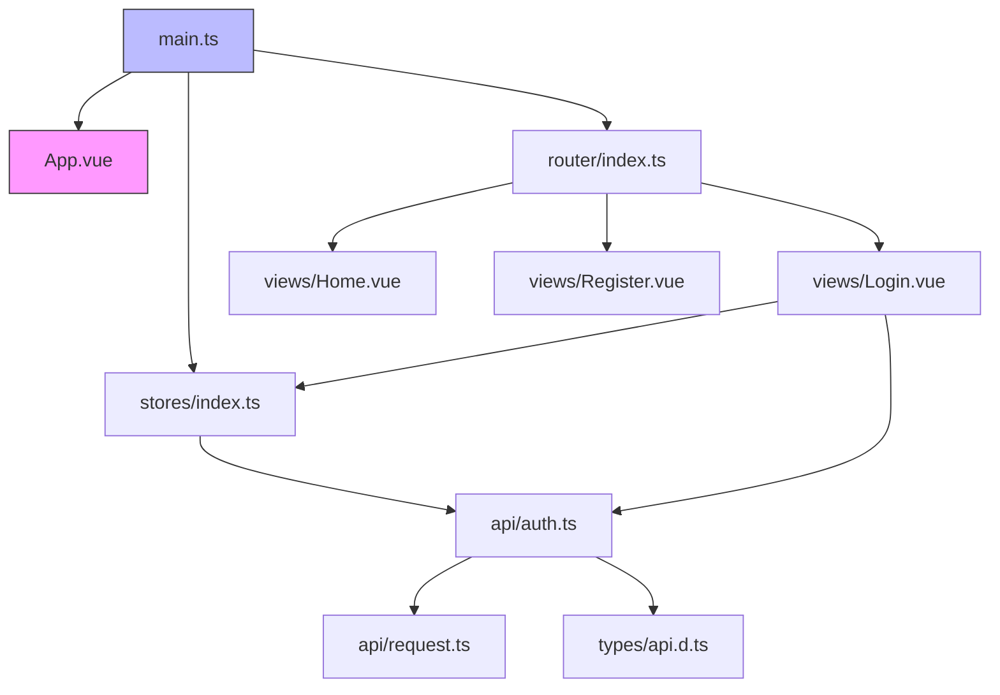
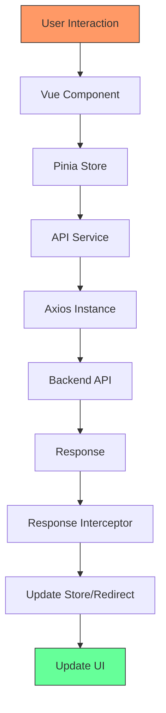
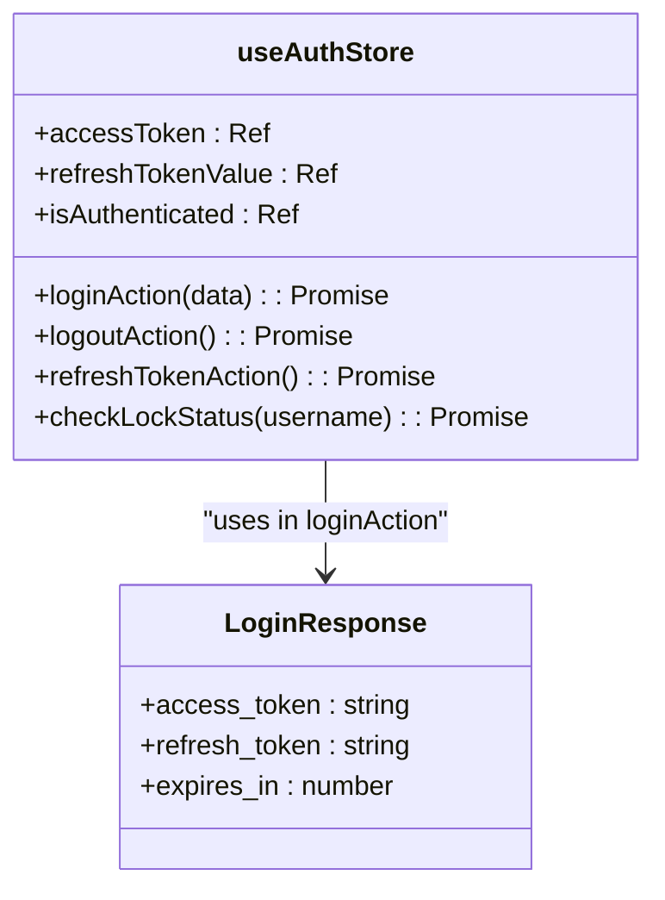
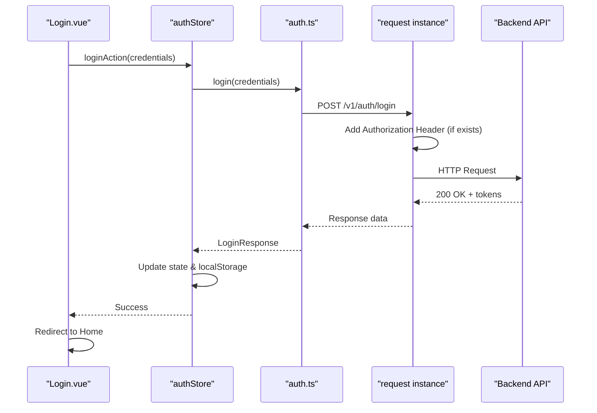
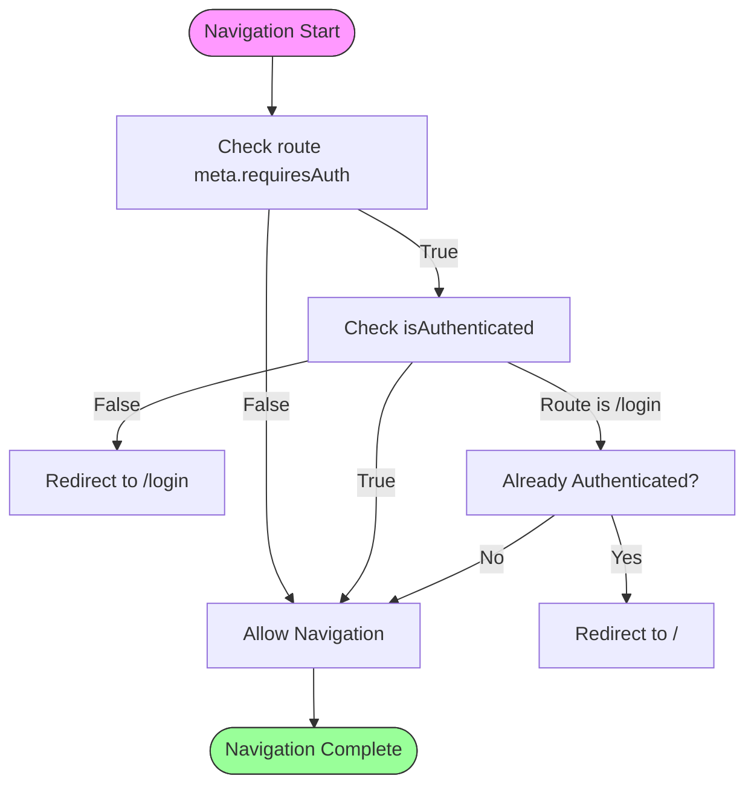
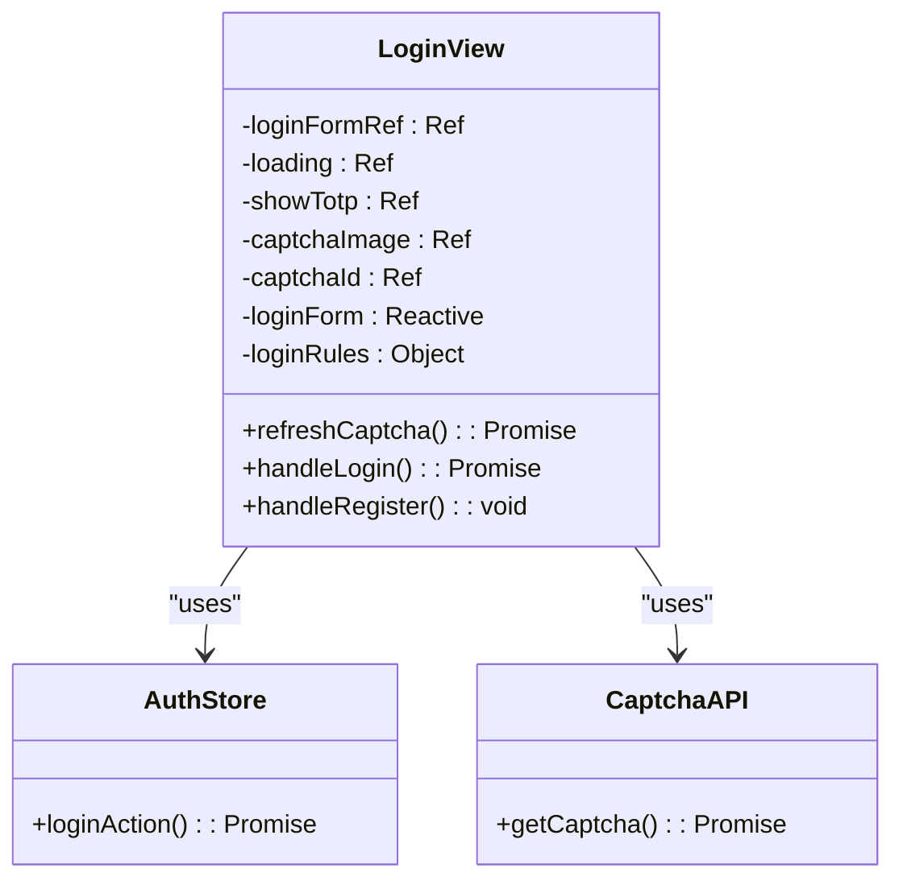
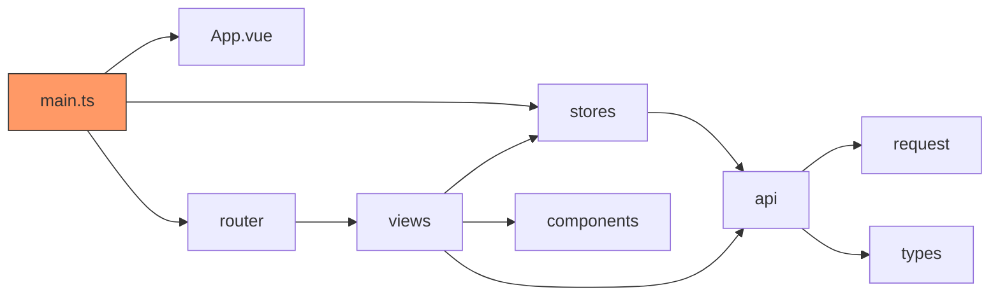

# Frontend Application

<cite>
**Referenced Files in This Document**   
- [main.ts](file://frontend/src/main.ts#L1-L21)
- [router/index.ts](file://frontend/src/router/index.ts#L1-L42)
- [stores/auth.ts](file://frontend/src/stores/auth.ts#L1-L99)
- [api/auth.ts](file://frontend/src/api/auth.ts#L1-L99)
- [api/request.ts](file://frontend/src/api/request.ts#L1-L29)
- [types/api.d.ts](file://frontend/src/types/api.d.ts#L1-L32)
- [views/Login.vue](file://frontend/src/views/Login.vue#L1-L186)
- [App.vue](file://frontend/src/App.vue)
- [views/Home.vue](file://frontend/src/views/Home.vue)
- [views/Register.vue](file://frontend/src/views/Register.vue)
</cite>

## Table of Contents
1. [Introduction](#introduction)
2. [Project Structure](#project-structure)
3. [Core Components](#core-components)
4. [Architecture Overview](#architecture-overview)
5. [Detailed Component Analysis](#detailed-component-analysis)
6. [Dependency Analysis](#dependency-analysis)
7. [Performance Considerations](#performance-considerations)
8. [Troubleshooting Guide](#troubleshooting-guide)
9. [Conclusion](#conclusion)

## Introduction
This document provides comprehensive documentation for the Vue.js frontend application in the kratos-boilerplate repository. It details the component architecture, state management using Pinia, routing configuration with navigation guards, API integration through Axios, and key user flows such as login and registration. The goal is to offer both technical depth and accessibility for developers at all levels.

## Project Structure
The frontend application follows a standard Vue 3 + TypeScript + Vite structure with clear separation of concerns. Key directories include:
- `api/`: API service definitions and Axios configuration
- `components/`: Reusable UI components
- `router/`: Route definitions and navigation guards
- `stores/`: Pinia state management modules
- `types/`: TypeScript interfaces for API responses
- `views/`: Page-level components
- Root-level files handle app initialization, styling, and environment setup.

**Diagram sources**
- [main.ts](file://frontend/src/main.ts#L1-L21)
- [router/index.ts](file://frontend/src/router/index.ts#L1-L42)
- [stores/auth.ts](file://frontend/src/stores/auth.ts#L1-L99)

**Section sources**
- [main.ts](file://frontend/src/main.ts#L1-L21)
- [router/index.ts](file://frontend/src/router/index.ts#L1-L42)

## Core Components
The core components of the frontend application include the authentication store (`auth.ts`), API service layer (`auth.ts` and `request.ts`), router with guards, and view components for login, registration, and home. These components work together to manage user sessions, handle API communication, enforce authentication requirements, and provide a responsive user interface.

**Section sources**
- [stores/auth.ts](file://frontend/src/stores/auth.ts#L1-L99)
- [api/auth.ts](file://frontend/src/api/auth.ts#L1-L99)
- [router/index.ts](file://frontend/src/router/index.ts#L1-L42)

## Architecture Overview
The frontend architecture is built on Vue 3's Composition API with Pinia for state management, Vue Router for navigation, and Axios for HTTP communication. Authentication state is centrally managed in a Pinia store, which synchronizes with localStorage. All API requests are intercepted to inject authentication tokens and handle unauthorized responses by redirecting to the login page.

**Diagram sources**
- [main.ts](file://frontend/src/main.ts#L1-L21)
- [stores/auth.ts](file://frontend/src/stores/auth.ts#L1-L99)
- [api/auth.ts](file://frontend/src/api/auth.ts#L1-L99)

## Detailed Component Analysis

### Authentication State Management
The `useAuthStore` in Pinia manages the entire authentication state including access and refresh tokens, isAuthenticated flag, and related actions.

**Diagram sources**
- [stores/auth.ts](file://frontend/src/stores/auth.ts#L1-L99)
- [types/api.d.ts](file://frontend/src/types/api.d.ts#L1-L32)

### API Integration Layer
The API layer uses Axios with request and response interceptors to standardize communication with the backend.

**Diagram sources**
- [api/auth.ts](file://frontend/src/api/auth.ts#L1-L99)
- [stores/auth.ts](file://frontend/src/stores/auth.ts#L1-L99)
- [views/Login.vue](file://frontend/src/views/Login.vue#L1-L186)

### Routing and Navigation Guards
The router configuration includes meta fields to specify authentication requirements and uses a beforeEach guard to enforce them.

**Diagram sources**
- [router/index.ts](file://frontend/src/router/index.ts#L1-L42)

### Login Form Implementation
The Login.vue component demonstrates form handling with Element Plus UI, validation, and captcha integration.

**Diagram sources**
- [views/Login.vue](file://frontend/src/views/Login.vue#L1-L186)
- [stores/auth.ts](file://frontend/src/stores/auth.ts#L1-L99)
- [api/auth.ts](file://frontend/src/api/auth.ts#L1-L99)

## Dependency Analysis
The frontend components have a well-defined dependency hierarchy with minimal circular dependencies.

**Diagram sources**
- [main.ts](file://frontend/src/main.ts#L1-L21)
- [router/index.ts](file://frontend/src/router/index.ts#L1-L42)
- [stores/index.ts](file://frontend/src/stores/index.ts)
- [api/auth.ts](file://frontend/src/api/auth.ts#L1-L99)

## Performance Considerations
The application implements several performance optimizations:
- Lazy loading of view components via dynamic imports in router
- Efficient state management with Pinia's reactivity system
- Centralized API request handling with interceptors
- LocalStorage persistence to avoid re-authentication on refresh
- Error handling that preserves user input state

No heavy computations or memory-intensive operations are performed on the frontend. The main performance bottleneck would be network latency for API calls, which is mitigated by proper loading states and error recovery.

## Troubleshooting Guide
Common issues and their solutions:

**Authentication State Not Persisting**
- Ensure tokens are properly stored in localStorage during login
- Verify that the Pinia store initializes from localStorage values
- Check for JavaScript errors in the console during login

**Captcha Not Loading**
- Verify that the `/v1/auth/captcha` endpoint is accessible
- Check network tab for failed requests
- Ensure response data structure matches `CaptchaResponse` interface

**Token Refresh Failing**
- Confirm refresh token is stored and sent correctly
- Check that 401 responses trigger proper cleanup
- Verify refresh endpoint returns new access and refresh tokens

**Routing Guard Issues**
- Ensure `isAuthenticated` computed state updates correctly
- Check that navigation guards don't create redirect loops
- Verify route meta fields are set correctly

**Section sources**
- [stores/auth.ts](file://frontend/src/stores/auth.ts#L1-L99)
- [api/auth.ts](file://frontend/src/api/auth.ts#L1-L99)
- [router/index.ts](file://frontend/src/router/index.ts#L1-L42)
- [views/Login.vue](file://frontend/src/views/Login.vue#L1-L186)

## Conclusion
The Vue.js frontend in kratos-boilerplate demonstrates a robust architecture for modern web applications with proper separation of concerns, centralized state management, and secure authentication flows. The integration between Vue, Pinia, Vue Router, and Axios is well-structured and maintainable. Key strengths include the comprehensive authentication handling, responsive UI components, and effective error management. Developers can extend this foundation with additional views and API integrations following the established patterns.