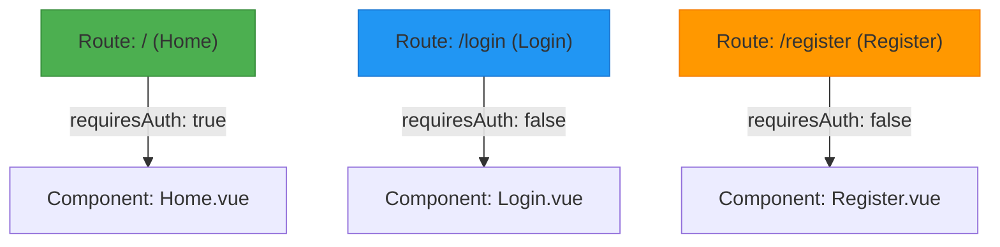
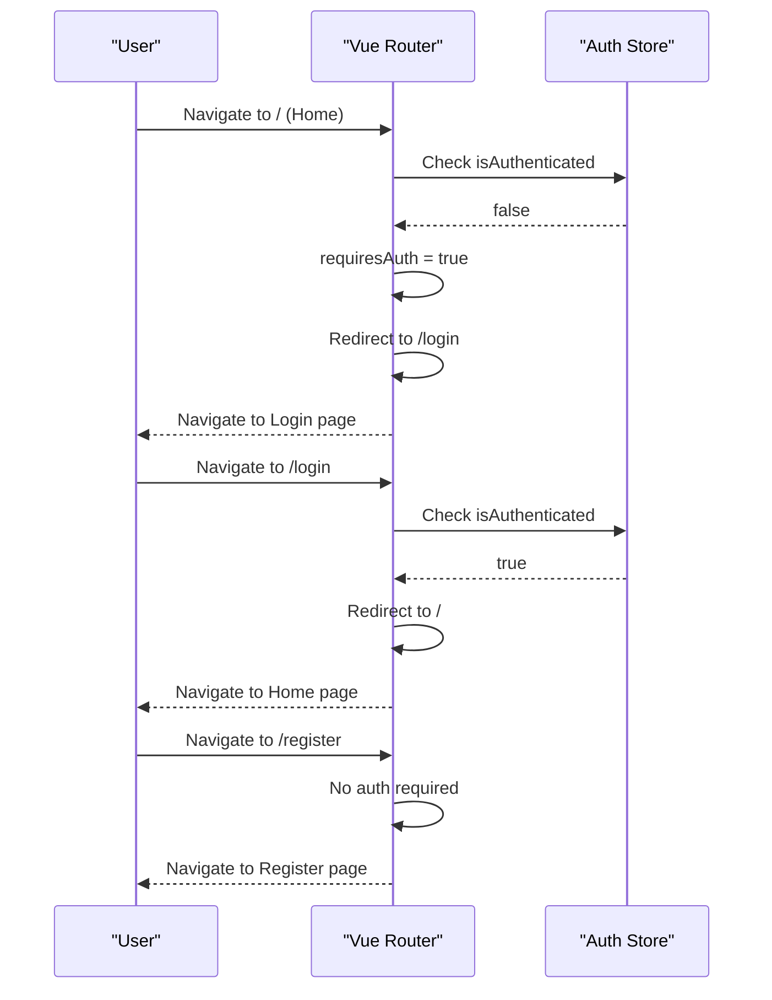
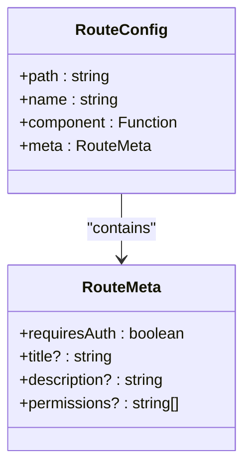
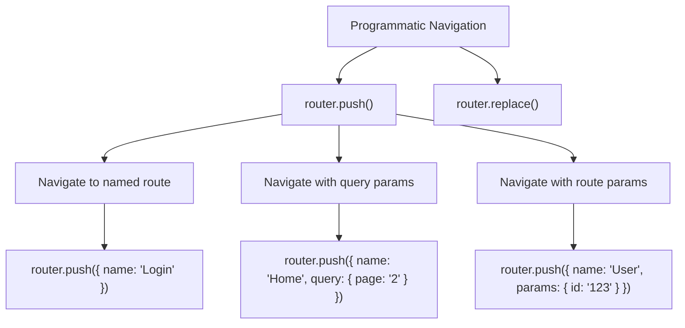
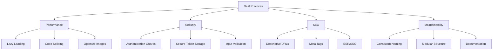

# Routing

<cite>
**Referenced Files in This Document**   
- [index.ts](file://frontend/src/router/index.ts#L0-L41)
- [auth.ts](file://frontend/src/stores/auth.ts#L0-L98)
- [main.ts](file://frontend/src/main.ts#L0-L20)
- [Home.vue](file://frontend/src/views/Home.vue)
- [Login.vue](file://frontend/src/views/Login.vue)
- [Register.vue](file://frontend/src/views/Register.vue)
</cite>

## Table of Contents
1. [Introduction](#introduction)
2. [Route Configuration](#route-configuration)
3. [Navigation Guards for Authentication](#navigation-guards-for-authentication)
4. [Route Meta Fields Usage](#route-meta-fields-usage)
5. [Programmatic Navigation and Query Parameters](#programmatic-navigation-and-query-parameters)
6. [Best Practices and Common Considerations](#best-practices-and-common-considerations)

## Introduction
This document provides a comprehensive overview of the Vue Router configuration in the application. It details how routes are defined, how authentication protection is enforced via navigation guards, and how meta fields are used for route-specific behaviors. The analysis is based on the `index.ts` file in the `frontend/src/router` directory and its integration with the Pinia-based authentication store. This documentation aims to clarify routing logic for both technical and non-technical stakeholders.

**Section sources**
- [index.ts](file://frontend/src/router/index.ts#L0-L41)
- [main.ts](file://frontend/src/main.ts#L0-L20)

## Route Configuration
The Vue Router is configured using `createRouter` with `createWebHistory` to enable clean URL paths without hash fragments. The route definitions map specific URL paths to corresponding view components using dynamic imports for lazy loading.

Each route includes:
- **path**: The URL path (e.g., `/`, `/login`)
- **name**: A unique identifier for the route
- **component**: Dynamically imported view component
- **meta**: Custom data attached to the route (used for authentication requirements)

```typescript
const router = createRouter({
    history: createWebHistory(),
    routes: [
        {
            path: '/',
            name: 'Home',
            component: () => import('@/views/Home.vue'),
            meta: { requiresAuth: true },
        },
        {
            path: '/login',
            name: 'Login',
            component: () => import('@/views/Login.vue'),
            meta: { requiresAuth: false },
        },
        {
            path: '/register',
            name: 'Register',
            component: () => import('@/views/Register.vue'),
            meta: { requiresAuth: false },
        },
    ]
})
```

This configuration enables:
- Lazy loading of components (improving initial load performance)
- Clean URL structure
- Route naming for easier programmatic navigation
- Meta field usage for route-specific logic



**Diagram sources**
- [index.ts](file://frontend/src/router/index.ts#L6-L25)

**Section sources**
- [index.ts](file://frontend/src/router/index.ts#L6-L25)
- [Home.vue](file://frontend/src/views/Home.vue)
- [Login.vue](file://frontend/src/views/Login.vue)
- [Register.vue](file://frontend/src/views/Register.vue)

## Navigation Guards for Authentication
The application implements a global beforeEach navigation guard to protect routes based on authentication status. This guard checks the `requiresAuth` meta field and the user's authentication state from the Pinia store.

The guard logic:
1. Retrieves the authentication store
2. Determines if the target route requires authentication
3. Redirects unauthenticated users to login
4. Redirects authenticated users away from login page
5. Allows navigation to proceed otherwise

```typescript
router.beforeEach((to, from, next) => {
    const authStore = useAuthStore()
    const requiresAuth = to.matched.some(record => record.meta.requiresAuth)

    if (requiresAuth && !authStore.isAuthenticated) {
        next({ name: 'Login' })
    } else if (to.name === 'Login' && authStore.isAuthenticated) {
        next({ name: 'Home' })
    } else {
        next()
    }
})
```

This creates a secure navigation flow:
- Protected routes (like Home) redirect unauthenticated users to Login
- The Login page redirects authenticated users to Home
- Public routes (like Register) are accessible to all users



**Diagram sources**
- [index.ts](file://frontend/src/router/index.ts#L27-L41)
- [auth.ts](file://frontend/src/stores/auth.ts#L0-L98)

**Section sources**
- [index.ts](file://frontend/src/router/index.ts#L27-L41)
- [auth.ts](file://frontend/src/stores/auth.ts#L0-L98)

## Route Meta Fields Usage
Meta fields are used to attach route-specific metadata that can be accessed during navigation guards. In this application, the `requiresAuth` flag determines whether a route should be protected.

The meta field structure:
```typescript
meta: { 
    requiresAuth: boolean 
}
```

Benefits of using meta fields:
- Centralized route configuration
- Reusable guard logic
- Easy to extend with additional metadata (e.g., page titles, permissions)
- Type-safe when combined with TypeScript interfaces

Example extension for SEO:
```typescript
// Potential future enhancement
meta: { 
    requiresAuth: true,
    title: "Home Page",
    description: "Welcome to our application"
}
```



**Diagram sources**
- [index.ts](file://frontend/src/router/index.ts#L12-L24)

## Programmatic Navigation and Query Parameters
While not explicitly shown in the current codebase, the routing configuration supports programmatic navigation and query parameters through Vue Router's standard API.

### Programmatic Navigation Examples
```typescript
// Navigate using route name
router.push({ name: 'Login' })

// Navigate with query parameters
router.push({ 
    name: 'Home', 
    query: { page: '2', search: 'term' } 
})

// Navigate with parameters (for dynamic routes)
router.push({ 
    name: 'UserProfile', 
    params: { id: '123' } 
})
```

### Accessing Query Parameters
```typescript
// In a component
import { useRoute } from 'vue-router'

const route = useRoute()
const page = route.query.page
const search = route.query.search
```

The current route configuration can be extended to support dynamic routes and query parameters as the application grows.



**Section sources**
- [index.ts](file://frontend/src/router/index.ts#L6-L25)

## Best Practices and Common Considerations

### Route Lazy Loading
The current implementation uses dynamic imports (`import('@/views/Home.vue')`), which automatically enables code splitting and lazy loading. This improves initial load performance by only loading route components when needed.

### Scroll Behavior
While not configured in the current code, Vue Router supports custom scroll behavior:

```typescript
const router = createRouter({
    // ... other options
    scrollBehavior(to, from, savedPosition) {
        if (savedPosition) {
            return savedPosition
        } else {
            return { top: 0 }
        }
    }
})
```

### Dynamic Route Matching
The current routes are static, but can be extended for dynamic segments:

```typescript
{
    path: '/user/:id',
    name: 'UserProfile',
    component: () => import('@/views/UserProfile.vue'),
    meta: { requiresAuth: true }
}
```

### Error Handling
Implement a catch-all route for 404 pages:

```typescript
{
    path: '/:pathMatch(.*)*',
    name: 'NotFound',
    component: () => import('@/views/NotFound.vue'),
    meta: { requiresAuth: false }
}
```

### SEO Considerations
For better SEO:
- Use descriptive route names and paths
- Implement meta tags for page titles and descriptions
- Consider server-side rendering for critical pages
- Ensure all important content is accessible without JavaScript

### Security Best Practices
- Always validate authentication on protected routes
- Use secure storage for tokens (HttpOnly cookies when possible)
- Implement token refresh mechanisms
- Protect against XSS attacks



**Diagram sources**
- [index.ts](file://frontend/src/router/index.ts#L6-L25)
- [main.ts](file://frontend/src/main.ts#L0-L20)

**Section sources**
- [index.ts](file://frontend/src/router/index.ts#L6-L25)
- [main.ts](file://frontend/src/main.ts#L0-L20)