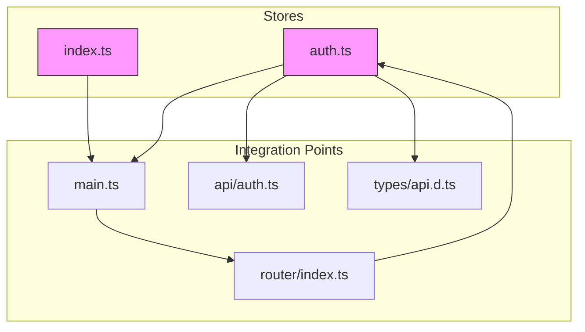
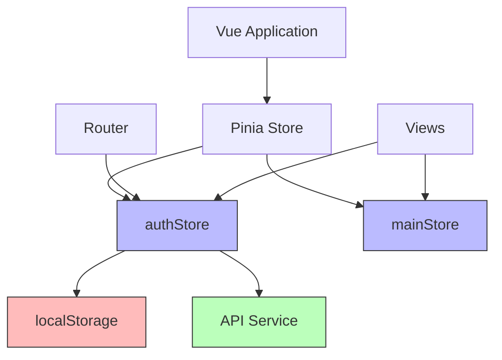
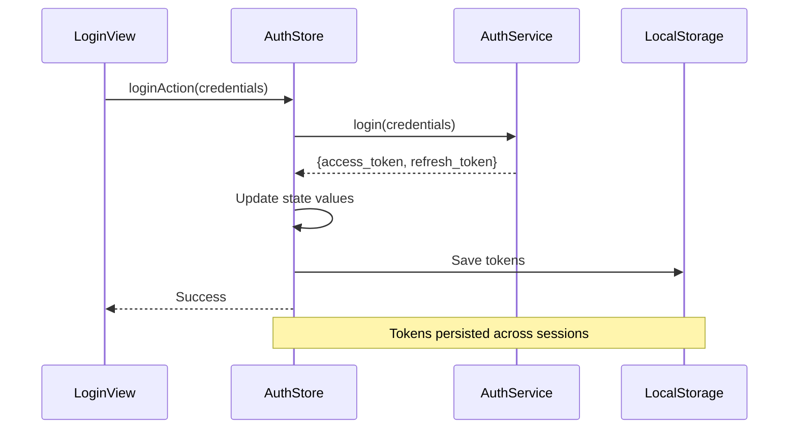
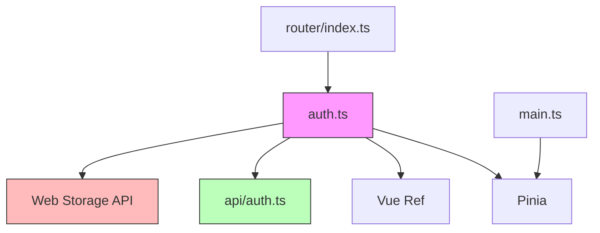

# State Management

<cite>
**Referenced Files in This Document**   
- [auth.ts](file://frontend/src/stores/auth.ts#L1-L98)
- [index.ts](file://frontend/src/stores/index.ts#L1-L12)
- [main.ts](file://frontend/src/main.ts#L1-L21)
- [auth.ts](file://frontend/src/api/auth.ts#L1-L98)
- [api.d.ts](file://frontend/src/types/api.d.ts#L1-L32)
- [index.ts](file://frontend/src/router/index.ts#L1-L42)
</cite>

## Table of Contents
1. [Introduction](#introduction)
2. [Project Structure](#project-structure)
3. [Core Components](#core-components)
4. [Architecture Overview](#architecture-overview)
5. [Detailed Component Analysis](#detailed-component-analysis)
6. [Dependency Analysis](#dependency-analysis)
7. [Performance Considerations](#performance-considerations)
8. [Troubleshooting Guide](#troubleshooting-guide)
9. [Conclusion](#conclusion)

## Introduction
This document provides a comprehensive analysis of the Pinia-based state management system in the frontend application of the kratos-boilerplate project. It focuses on the authentication store implementation, covering state properties, actions, initialization, and integration with Vue. The document explains how user authentication state is managed across the application, including token persistence, route protection, and API interactions. It also details best practices for handling asynchronous operations and error states within the store.

## Project Structure
The state management system is located in the `frontend/src/stores` directory and consists of two main files: `auth.ts` for authentication logic and `index.ts` for general application state. The stores are initialized in `main.ts` and used throughout the application via Vue's composition API. The authentication store interacts with API services defined in `api/auth.ts` and uses TypeScript interfaces from `types/api.d.ts` for type safety.



**Diagram sources**
- [auth.ts](file://frontend/src/stores/auth.ts#L1-L98)
- [index.ts](file://frontend/src/stores/index.ts#L1-L12)
- [main.ts](file://frontend/src/main.ts#L1-L21)
- [router/index.ts](file://frontend/src/router/index.ts#L1-L42)

**Section sources**
- [auth.ts](file://frontend/src/stores/auth.ts#L1-L98)
- [index.ts](file://frontend/src/stores/index.ts#L1-L12)

## Core Components
The core components of the state management system include the authentication store (`useAuthStore`) and the main store (`useMainStore`). The authentication store manages user session state including access and refresh tokens, authentication status, and provides actions for login, logout, and token refresh operations. The store uses localStorage for persistence and integrates with the application's routing system to protect authenticated routes.

**Section sources**
- [auth.ts](file://frontend/src/stores/auth.ts#L1-L98)
- [index.ts](file://frontend/src/stores/index.ts#L1-L12)

## Architecture Overview
The state management architecture follows the Pinia store pattern with a clear separation between state, actions, and getters (though getters are implicit in this implementation). The authentication store maintains reactive state properties and provides asynchronous actions that interact with the backend API. The store is initialized at the application level and made available to all components through Vue's dependency injection system.



**Diagram sources**
- [main.ts](file://frontend/src/main.ts#L1-L21)
- [auth.ts](file://frontend/src/stores/auth.ts#L1-L98)
- [index.ts](file://frontend/src/stores/index.ts#L1-L12)

## Detailed Component Analysis

### Authentication Store Analysis
The authentication store is implemented using Pinia's composition API style, which allows for better TypeScript support and more flexible store organization. It manages the user's authentication state and provides methods for authentication-related operations.

#### State Properties
The store maintains three reactive state properties:
- **accessToken**: Stores the JWT access token retrieved from the authentication API
- **refreshTokenValue**: Stores the refresh token used to obtain new access tokens
- **isAuthenticated**: Boolean flag indicating the user's authentication status

These properties are initialized from localStorage to maintain session state across page reloads.

```mermaid
classDiagram
class useAuthStore {
+accessToken : Ref<string | null>
+refreshTokenValue : Ref<string | null>
+isAuthenticated : Ref<boolean>
+loginAction(data) : Promise~any~
+logoutAction() : Promise~void~
+refreshTokenAction() : Promise~any~
+checkLockStatus(username) : Promise~any~
}
note right of useAuthStore
Pinia store for authentication state
Uses Vue refs for reactivity
Persists tokens to localStorage
end note
```

**Diagram sources**
- [auth.ts](file://frontend/src/stores/auth.ts#L1-L98)

#### Authentication Actions
The store provides several actions to manage the authentication workflow:

**Login Action**: Handles user authentication by calling the login API endpoint, storing the returned tokens in both reactive state and localStorage, and updating the authentication status.

**Logout Action**: Clears all authentication state and removes tokens from localStorage, effectively ending the user session.

**Refresh Token Action**: Uses the refresh token to obtain a new access token when the current one expires, maintaining continuous user sessions.



**Diagram sources**
- [auth.ts](file://frontend/src/stores/auth.ts#L15-L42)
- [auth.ts](file://frontend/src/api/auth.ts#L50-L55)

### Main Store Analysis
The main store is a simpler Pinia store that demonstrates the options API style of store definition. It contains a counter state and an increment action, serving as a basic example of state management.

```mermaid
classDiagram
class useMainStore {
+count : number
+increment() : void
}
note right of useMainStore
Example store using options API
Demonstrates basic state management
Not used in authentication flow
end note
```

**Diagram sources**
- [index.ts](file://frontend/src/stores/index.ts#L1-L12)

**Section sources**
- [index.ts](file://frontend/src/stores/index.ts#L1-L12)

## Dependency Analysis
The authentication store has dependencies on several external modules and services. It imports API functions from `@/api/auth` for backend communication, uses Vue's `ref` for reactive state, and depends on Pinia for store functionality. The store also interacts with localStorage for persistence and is consumed by the router for route protection.



**Diagram sources**
- [auth.ts](file://frontend/src/stores/auth.ts#L1-L98)
- [api/auth.ts](file://frontend/src/api/auth.ts#L1-L98)
- [main.ts](file://frontend/src/main.ts#L1-L21)

**Section sources**
- [auth.ts](file://frontend/src/stores/auth.ts#L1-L98)
- [api/auth.ts](file://frontend/src/api/auth.ts#L1-L98)

## Performance Considerations
The state management implementation includes several performance considerations:
- **Token Persistence**: Tokens are stored in localStorage to avoid re-authentication on page refresh, reducing API calls and improving user experience.
- **Reactive State**: Using Vue's ref ensures that components automatically update when authentication state changes, eliminating the need for manual re-renders.
- **Error Handling**: All asynchronous operations are wrapped in try-catch blocks to prevent unhandled promise rejections and provide proper error propagation.
- **Memory Management**: The store automatically clears authentication state on logout or token refresh failure, preventing memory leaks from stale data.

The implementation avoids unnecessary re-renders by only exposing the minimal required state and using Pinia's efficient state change detection.

## Troubleshooting Guide
Common issues and their solutions when working with the authentication store:

**Token Not Persisting**: Ensure that the browser allows localStorage operations and that there are no Content Security Policy restrictions blocking storage access.

**Authentication State Not Syncing**: Verify that the store is properly initialized in `main.ts` and that components are correctly importing and using the store.

**Route Guard Not Working**: Check that the router is importing the correct store instance and that the meta flags on routes are properly configured.

**Token Refresh Failing**: Confirm that the refresh token endpoint is correctly implemented on the backend and that the refresh token is being properly stored and retrieved.

**CORS Issues**: Ensure that the API server includes proper CORS headers to allow requests from the frontend origin.

**Section sources**
- [auth.ts](file://frontend/src/stores/auth.ts#L1-L98)
- [router/index.ts](file://frontend/src/router/index.ts#L1-L42)
- [main.ts](file://frontend/src/main.ts#L1-L21)

## Conclusion
The Pinia-based state management system in the kratos-boilerplate frontend provides a robust and maintainable solution for handling authentication state. By leveraging Pinia's composition API, the implementation achieves excellent TypeScript support and code organization. The store effectively manages user sessions with proper token persistence and cleanup, integrates seamlessly with Vue's reactivity system, and provides a clear API for authentication operations. The architecture demonstrates best practices in state management, including proper error handling, persistence, and integration with routing for protected views. This implementation serves as a solid foundation for authentication in Vue applications and can be extended to support additional features like role-based access control or multi-factor authentication.