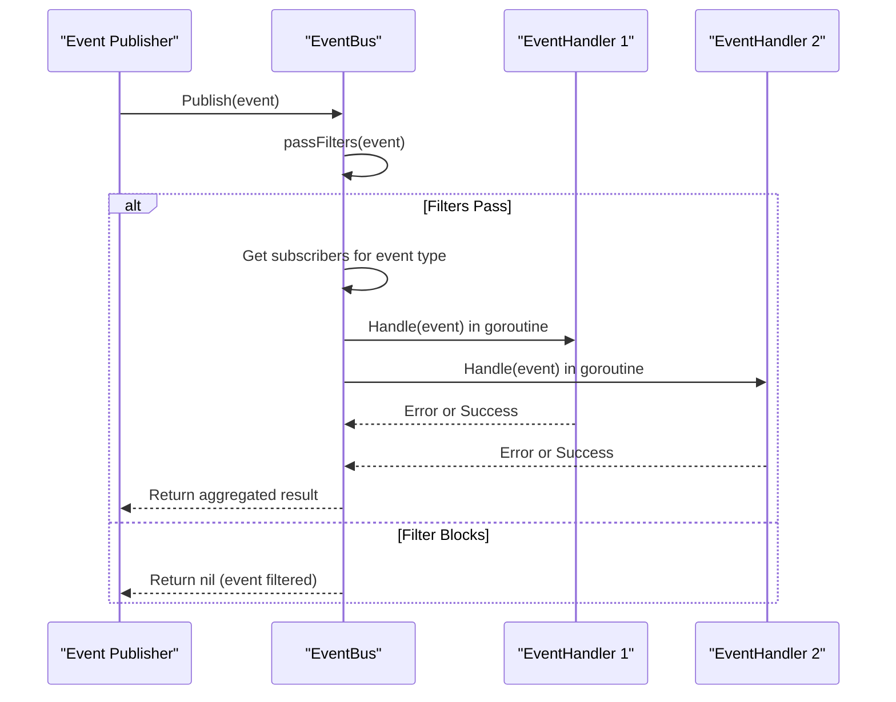
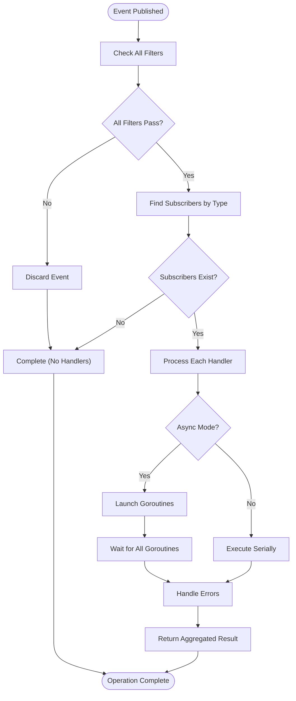
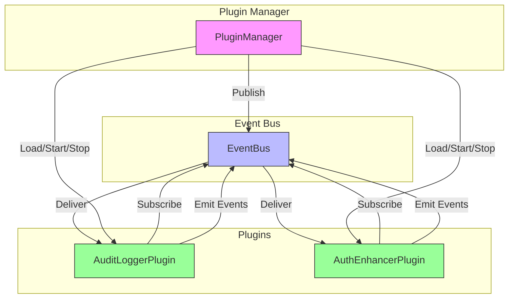

# Event Bus

<cite>
**Referenced Files in This Document**   
- [event.go](file://internal/pkg/plugin/event.go#L1-L81)
- [event_bus.go](file://internal/pkg/plugin/event_bus.go#L1-L274)
- [plugin_manager.go](file://internal/pkg/plugin/plugin_manager.go#L1-L442)
- [audit_logger.go](file://plugins/audit_logger.go#L1-L132)
- [auth_enhancer.go](file://plugins/auth_enhancer.go#L1-L122)
</cite>

## Table of Contents
1. [Event Bus](#event-bus)
2. [Event Definition and Types](#event-definition-and-types)
3. [EventBus Implementation](#eventbus-implementation)
4. [Event Publishing and Subscription](#event-publishing-and-subscription)
5. [Plugin Integration Examples](#plugin-integration-examples)
6. [Performance and Error Handling](#performance-and-error-handling)
7. [Extensibility and System Stability](#extensibility-and-system-stability)

## Event Definition and Types

The Event Bus system in kratos-boilerplate is built around a well-defined event model that enables decoupled communication between core services and plugins. Events are defined in `event.go` and represent discrete occurrences within the system that can be observed and reacted to by various components.

Events are strongly typed using the `EventType` string type, with a comprehensive set of predefined constants that cover plugin lifecycle, system operations, and business activities. This type system ensures consistency and discoverability across the codebase.

**Event Types Classification:**

- **Plugin Lifecycle Events:**
  - `EventPluginLoaded`: Triggered when a plugin is successfully loaded
  - `EventPluginUnloaded`: Emitted when a plugin is unloaded
  - `EventPluginStarted`: Fired when a plugin transitions to the started state
  - `EventPluginStopped`: Generated when a plugin stops execution
  - `EventPluginError`: Indicates an error occurred in a plugin

- **System Events:**
  - `EventSystemStartup`: Published at system initialization
  - `EventSystemShutdown`: Emitted during system shutdown
  - `EventConfigChanged`: Triggered when configuration is modified

- **Business Events:**
  - `EventUserLogin`: Fired upon successful user authentication
  - `EventUserLogout`: Generated when a user logs out
  - `EventDataCreated`: Emitted when new data is created
  - `EventDataUpdated`: Triggered when existing data is modified
  - `EventDataDeleted`: Published when data is removed

The `Event` interface defines the contract for all events, requiring implementations to provide:
- Unique identifier (`GetID`)
- Event type classification (`GetType`)
- Source component (`GetSource`)
- Timestamp of occurrence (`GetTimestamp`)
- Payload data (`GetData`)
- Additional metadata (`GetMetadata`)

```go
// Event interface definition
type Event interface {
    GetID() string
    GetType() EventType
    GetSource() string
    GetTimestamp() time.Time
    GetData() map[string]interface{}
    GetMetadata() map[string]string
}
```

**Section sources**
- [event.go](file://internal/pkg/plugin/event.go#L4-L47)

## EventBus Implementation

The EventBus implementation in `event_bus.go` provides a thread-safe, asynchronous publish-subscribe mechanism that forms the backbone of the plugin communication system. The `eventBusImpl` struct manages subscriptions, event dispatching, and filtering with careful attention to concurrency and performance.

### Core Components

The event bus consists of several key components:

- **Subscribers Map**: A thread-safe map (`map[EventType][]*subscription`) that maintains lists of handlers for each event type
- **Filters Slice**: A collection of `EventFilter` implementations that can selectively block events
- **RWMutex**: Ensures safe concurrent access to internal data structures
- **Async Workers**: Configurable number of goroutines for asynchronous event processing

```mermaid
classDiagram
class EventBus {
<<interface>>
+Subscribe(eventType, handler) error
+Unsubscribe(eventType, handlerName) error
+Publish(ctx, event) error
+PublishAsync(ctx, event) error
+AddFilter(filter) error
+RemoveFilter(filter) error
}
class eventBusImpl {
-mu sync.RWMutex
-subscribers map[EventType][]*subscription
-filters []EventFilter
-asyncWorkers int
+Subscribe(eventType, handler) error
+Unsubscribe(eventType, handlerName) error
+Publish(ctx, event) error
+PublishAsync(ctx, event) error
}
class Event {
<<interface>>
+GetID() string
+GetType() EventType
+GetSource() string
+GetTimestamp() time.Time
+GetData() map[string]interface{}
+GetMetadata() map[string]string
}
class EventHandler {
<<interface>>
+GetName() string
+GetEventTypes() []EventType
+Handle(ctx, event) error
+GetTimeout() time.Duration
}
class EventFilter {
<<interface>>
+Match(event) bool
}
class eventImpl {
-id string
-type_ EventType
-source string
-timestamp time.Time
-data map[string]interface{}
-metadata map[string]string
}
class baseEventHandler {
-name string
-eventTypes []EventType
-timeout time.Duration
-handler func(context.Context, Event) error
}
class subscription {
-handler EventHandler
-id string
}
EventBus <|-- eventBusImpl : "implements"
Event <|-- eventImpl : "implements"
EventHandler <|-- baseEventHandler : "implements"
eventBusImpl --> subscription : "contains"
eventBusImpl --> EventFilter : "uses"
```

**Diagram sources**
- [event_bus.go](file://internal/pkg/plugin/event_bus.go#L10-L274)
- [event.go](file://internal/pkg/plugin/event.go#L48-L80)

### Subscription Management

The subscription system uses a simple but effective pattern where each subscription is represented by a `subscription` struct containing a handler reference and unique ID. Subscriptions are stored in a map indexed by event type, allowing for O(1) lookup during event dispatch.

```go
type subscription struct {
    handler EventHandler
    id      string
}
```

When a component subscribes to an event type, a new subscription is created with a UUID and appended to the appropriate list in the subscribers map. The use of `sync.RWMutex` allows multiple concurrent readers (during event publishing) while ensuring exclusive access during subscription modifications.

**Section sources**
- [event_bus.go](file://internal/pkg/plugin/event_bus.go#L10-L65)

## Event Publishing and Subscription

The EventBus provides both synchronous and asynchronous publishing mechanisms to accommodate different use cases and performance requirements.

### Publishing Mechanism

The core publishing logic is implemented in the `publish` method, which handles both synchronous and asynchronous dispatch:

```go
func (eb *eventBusImpl) publish(ctx context.Context, event Event, async bool) error {
    eb.mu.RLock()
    defer eb.mu.RUnlock()

    // Check event filters
    if !eb.passFilters(event) {
        return nil
    }

    subs, exists := eb.subscribers[event.GetType()]
    if !exists {
        return nil
    }

    var wg sync.WaitGroup
    var errors []error
    var mu sync.Mutex

    for _, sub := range subs {
        if async {
            wg.Add(1)
            go func(s *subscription) {
                defer wg.Done()
                if err := eb.handleEvent(ctx, s.handler, event); err != nil {
                    mu.Lock()
                    errors = append(errors, err)
                    mu.Unlock()
                }
            }(sub)
        } else {
            if err := eb.handleEvent(ctx, sub.handler, event); err != nil {
                errors = append(errors, err)
            }
        }
    }

    if async {
        wg.Wait()
    }

    if len(errors) > 0 {
        return NewPluginError(ErrCodePluginInternal, "event handling failed", "event_bus", errors[0])
    }

    return nil
}
```

### Key Features

- **Filtering**: Events are checked against all registered filters before dispatch. If any filter rejects the event, it is not delivered to subscribers.
- **Concurrency**: Synchronous publishing blocks until all handlers complete, while asynchronous publishing returns immediately and processes handlers in goroutines.
- **Error Handling**: Errors from individual handlers are collected and returned as a single error if any occur.
- **Timeout Management**: Each handler can specify its own timeout, with a default of 30 seconds if not specified.

The `handleEvent` method wraps each handler call with a context timeout to prevent handlers from blocking indefinitely:

```go
func (eb *eventBusImpl) handleEvent(ctx context.Context, handler EventHandler, event Event) error {
    timeout := handler.GetTimeout()
    if timeout == 0 {
        timeout = 30 * time.Second
    }

    handlerCtx, cancel := context.WithTimeout(ctx, timeout)
    defer cancel()

    return handler.Handle(handlerCtx, event)
}
```



**Diagram sources**
- [event_bus.go](file://internal/pkg/plugin/event_bus.go#L67-L183)

**Section sources**
- [event_bus.go](file://internal/pkg/plugin/event_bus.go#L67-L183)

## Plugin Integration Examples

Plugins integrate with the Event Bus system by implementing the `EventPlugin` interface and registering their event handlers during initialization. Two example plugins demonstrate different integration patterns.

### Audit Logger Plugin

The `AuditLoggerPlugin` subscribes to multiple event types to create comprehensive audit logs:

```go
func (p *AuditLoggerPlugin) RegisterEventHandlers(bus plugin.EventBus) error {
    events := []plugin.EventType{
        plugin.EventUserLogin,
        plugin.EventUserLogout,
        plugin.EventDataCreated,
        plugin.EventDataUpdated,
        plugin.EventDataDeleted,
        plugin.EventPluginLoaded,
        plugin.EventPluginStarted,
    }

    eventHandler := plugin.NewBaseEventHandler(
        "audit_logger_event_handler",
        events,
        15*time.Second,
        func(ctx context.Context, event plugin.Event) error {
            fmt.Printf("AuditLoggerPlugin: Event %s received: %+v\n", event.GetType(), event.GetData())
            // In production: write to audit log storage
            return nil
        },
    )

    return bus.Subscribe(plugin.EventUserLogin, eventHandler)
}
```

Note: There appears to be a bug in the implementation - it subscribes the handler only to `EventUserLogin` despite wanting to handle multiple event types. A correct implementation would need to subscribe to each event type individually.

### Authentication Enhancer Plugin

The `AuthEnhancerPlugin` focuses on user authentication events:

```go
func (p *AuthEnhancerPlugin) RegisterEventHandlers(bus plugin.EventBus) error {
    loginHandler := plugin.NewBaseEventHandler(
        "auth_enhancer_login_handler",
        []plugin.EventType{plugin.EventUserLogin},
        10*time.Second,
        func(ctx context.Context, event plugin.Event) error {
            fmt.Printf("AuthEnhancerPlugin: User login event received: %+v\n", event.GetData())
            // In production: update session, check for suspicious activity
            return nil
        },
    )

    return bus.Subscribe(plugin.EventUserLogin, loginHandler)
}
```

### Event Creation and Publishing

The plugin manager publishes various lifecycle events using the EventBus:

```go
// In plugin_manager.go
pm.eventBus.PublishAsync(context.Background(), NewEvent(
    EventPluginLoaded,
    "plugin_manager",
    map[string]interface{}{
        "plugin": pluginName,
        "path":   path,
    },
))
```

The `NewEvent` constructor creates event instances with a unique ID, timestamp, and the provided data payload:

```go
func NewEvent(eventType EventType, source string, data map[string]interface{}) Event {
    return &eventImpl{
        id:        uuid.New().String(),
        type_:     eventType,
        source:    source,
        timestamp: time.Now(),
        data:      data,
        metadata:  make(map[string]string),
    }
}
```

**Section sources**
- [audit_logger.go](file://plugins/audit_logger.go#L100-L130)
- [auth_enhancer.go](file://plugins/auth_enhancer.go#L100-L120)
- [plugin_manager.go](file://internal/pkg/plugin/plugin_manager.go#L99-L327)

## Performance and Error Handling

The Event Bus implementation includes several performance optimizations and robust error handling mechanisms to ensure system stability.

### Goroutine Management

The asynchronous publishing mechanism creates a new goroutine for each event handler, allowing non-blocking event processing. The system uses a `sync.WaitGroup` to ensure all handlers complete before returning from `PublishAsync`:

```go
if async {
    wg.Add(1)
    go func(s *subscription) {
        defer wg.Done()
        if err := eb.handleEvent(ctx, s.handler, event); err != nil {
            mu.Lock()
            errors = append(errors, err)
            mu.Unlock()
        }
    }(sub)
}
```

A mutex (`mu sync.Mutex`) protects the shared `errors` slice from concurrent access, ensuring thread safety during error collection.

### Error Handling Strategy

The EventBus employs a "best effort" delivery model:
- Individual handler errors are collected but don't prevent other handlers from executing
- The first error encountered is returned to the publisher
- Handlers are isolated from each other to prevent cascading failures
- Context timeouts prevent handlers from hanging indefinitely

### Backpressure Considerations

While the current implementation doesn't include explicit backpressure mechanisms, several design choices help mitigate overload:
- Asynchronous processing prevents publishers from being blocked
- Handler timeouts limit resource consumption
- The use of goroutines allows the system to handle bursts of events

Potential improvements could include:
- Bounded worker pools instead of unbounded goroutines
- Event queue with size limits
- Retry mechanisms for failed handlers
- Circuit breakers for misbehaving handlers



**Diagram sources**
- [event_bus.go](file://internal/pkg/plugin/event_bus.go#L67-L183)

**Section sources**
- [event_bus.go](file://internal/pkg/plugin/event_bus.go#L121-L183)

## Extensibility and System Stability

The Event Bus architecture in kratos-boilerplate strikes a balance between extensibility and system stability through several design principles.

### Decoupling Benefits

The publish-subscribe pattern enables complete decoupling between event producers and consumers:
- Core services can emit events without knowledge of subscribers
- Plugins can react to events without modifying core code
- Components can be added or removed without affecting others
- Different parts of the system can evolve independently

### Stability Mechanisms

Several features contribute to system stability:
- **Interface-based design**: Clear contracts between components
- **Error isolation**: Handler failures don't crash the event bus
- **Timeout enforcement**: Prevents handlers from blocking indefinitely
- **Thread safety**: Proper synchronization prevents race conditions
- **Memory management**: No event queuing reduces memory pressure

### Extensibility Features

The system supports various extension points:
- **Custom event types**: Plugins can define their own event types
- **Event filtering**: Selective event processing based on criteria
- **Dynamic subscription**: Handlers can be added/removed at runtime
- **Multiple handler patterns**: Both synchronous and asynchronous processing

### Integration with Plugin Lifecycle

The Event Bus is tightly integrated with the plugin management system, enabling a rich ecosystem of interactions:



**Diagram sources**
- [plugin_manager.go](file://internal/pkg/plugin/plugin_manager.go#L1-L442)
- [event_bus.go](file://internal/pkg/plugin/event_bus.go#L1-L274)

**Section sources**
- [plugin_manager.go](file://internal/pkg/plugin/plugin_manager.go#L99-L327)