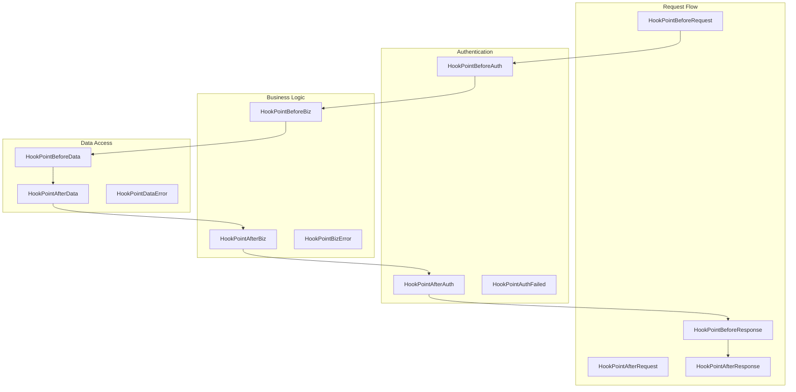
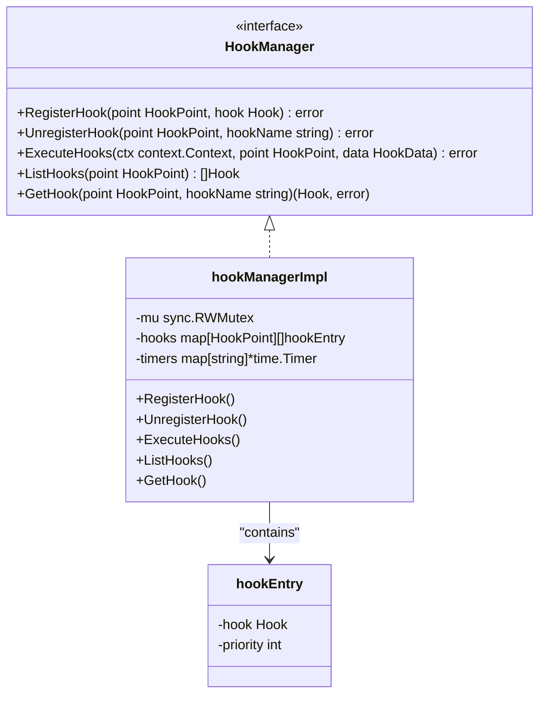
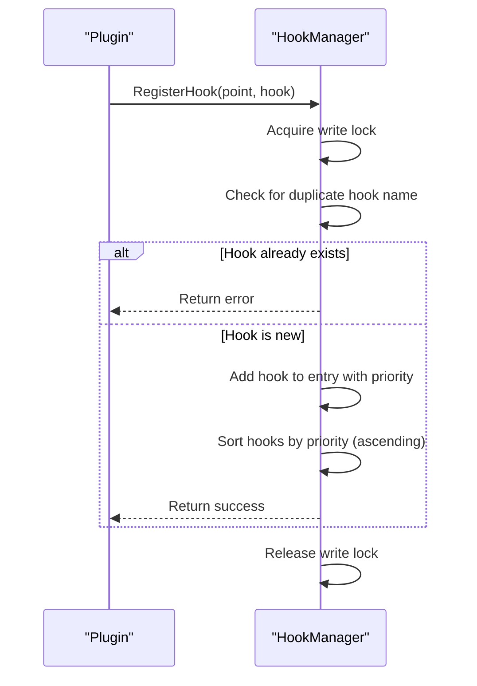
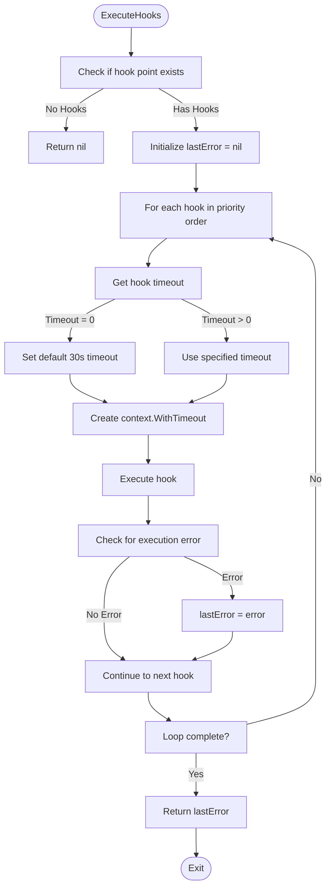
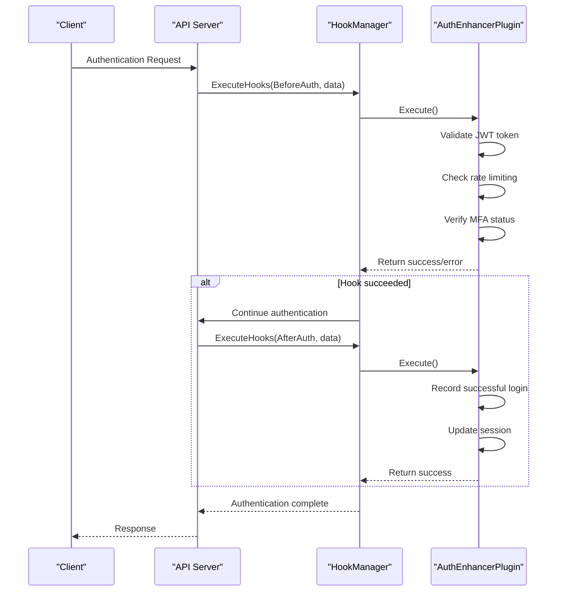
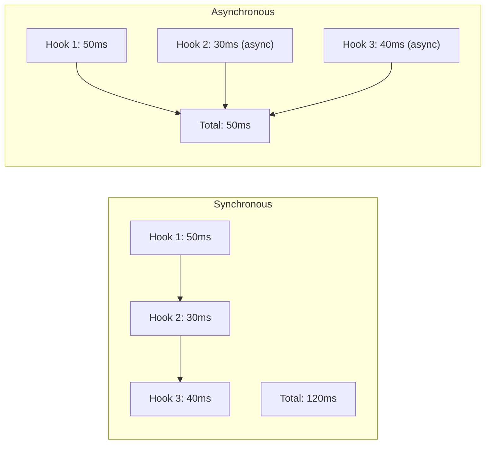
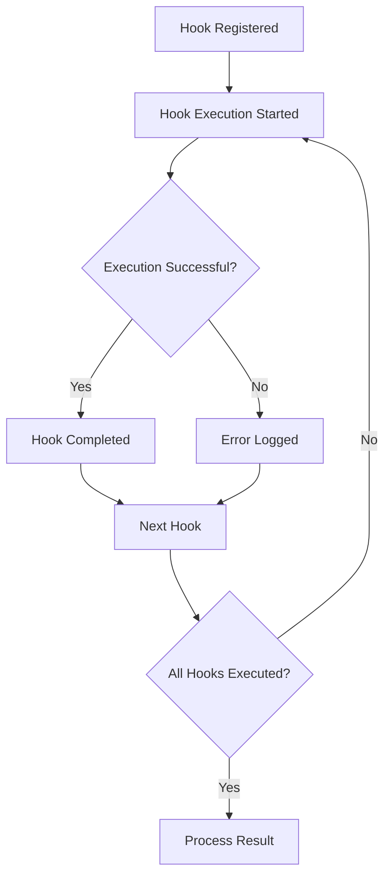

# Hook System

<cite>
**Referenced Files in This Document**   
- [hook.go](file://internal/pkg/plugin/hook.go#L1-L71)
- [hook_manager.go](file://internal/pkg/plugin/hook_manager.go#L1-L235)
- [auth_enhancer.go](file://plugins/auth_enhancer.go#L1-L122)
- [audit_logger.go](file://plugins/audit_logger.go#L1-L132)
</cite>

## Table of Contents
1. [Introduction](#introduction)
2. [Hook Interface and Types](#hook-interface-and-types)
3. [HookManager Implementation](#hookmanager-implementation)
4. [Hook Execution Flow](#hook-execution-flow)
5. [Real-World Example: AuthEnhancerPlugin](#real-world-example-authenhancerplugin)
6. [Synchronous vs Asynchronous Hooks](#synchronous-vs-asynchronous-hooks)
7. [Best Practices and Error Resilience](#best-practices-and-error-resilience)
8. [Common Pitfalls and Debugging](#common-pitfalls-and-debugging)

## Introduction
The Hook System in kratos-boilerplate provides a flexible plugin architecture that allows custom logic to be injected at specific interception points in the application flow. This system enables extensibility without modifying core application code, supporting use cases such as authentication enhancement, audit logging, and business logic modification. The system is orchestrated by the HookManager, which manages the registration, ordering, and execution of hooks defined by plugins.

**Section sources**
- [hook.go](file://internal/pkg/plugin/hook.go#L1-L71)
- [hook_manager.go](file://internal/pkg/plugin/hook_manager.go#L1-L235)

## Hook Interface and Types

### HookPoint Constants
The system defines a comprehensive set of hook points across different application layers:



**Diagram sources**
- [hook.go](file://internal/pkg/plugin/hook.go#L13-L31)

### Hook Interface
The `Hook` interface defines the contract for all hooks:

```go
type Hook interface {
    GetName() string
    GetPriority() int
    Execute(ctx context.Context, data HookData) error
    GetTimeout() time.Duration
}
```

- **GetName**: Unique identifier for the hook
- **GetPriority**: Determines execution order (lower values = higher priority)
- **Execute**: Core logic executed at the hook point
- **GetTimeout**: Maximum execution duration before cancellation

### HookData Interface
The `HookData` interface provides contextual information to hooks:

```go
type HookData interface {
    GetContext() context.Context
    GetData() map[string]interface{}
    SetData(key string, value interface{})
    GetMetadata() map[string]string
}
```

This allows hooks to access and modify shared data and metadata during execution.

**Section sources**
- [hook.go](file://internal/pkg/plugin/hook.go#L46-L70)

## HookManager Implementation

### Architecture Overview
The HookManager is implemented as `hookManagerImpl` with thread-safe operations using `sync.RWMutex`:



**Diagram sources**
- [hook_manager.go](file://internal/pkg/plugin/hook_manager.go#L10-L25)

### Registration Mechanism
Hooks are registered with validation and priority-based sorting:



**Diagram sources**
- [hook_manager.go](file://internal/pkg/plugin/hook_manager.go#L56-L88)

**Section sources**
- [hook_manager.go](file://internal/pkg/plugin/hook_manager.go#L56-L88)

## Hook Execution Flow

### Execution Process
The `ExecuteHooks` method orchestrates the execution of all hooks at a specific point:



**Diagram sources**
- [hook_manager.go](file://internal/pkg/plugin/hook_manager.go#L90-L112)

### Error Propagation and Resilience
The system implements a resilient error handling strategy:
- **Non-blocking execution**: If one hook fails, others continue to execute
- **Last error propagation**: Returns the last encountered error (not the first)
- **Context cancellation**: Each hook runs in its own timeout context
- **Graceful degradation**: Absence of hooks at a point results in no-op

```go
var lastError error
for _, entry := range hooks {
    // ...
    if err := hm.executeSingleHook(hookCtx, hook, data); err != nil {
        lastError = err
        // Continue with other hooks
    }
}
return lastError
```

**Section sources**
- [hook_manager.go](file://internal/pkg/plugin/hook_manager.go#L90-L112)

## Real-World Example: AuthEnhancerPlugin

### Authentication Enhancement Hook
The `auth_enhancer.go` plugin demonstrates practical hook usage for authentication enhancement:



**Diagram sources**
- [auth_enhancer.go](file://plugins/auth_enhancer.go#L80-L105)

### Code Implementation
```go
func (p *AuthEnhancerPlugin) RegisterHooks(manager plugin.HookManager) error {
    // Pre-authentication hook with high priority
    authHook := plugin.NewBaseHook(
        "auth_enhancer_pre_auth",
        10, // High priority
        5*time.Second,
        func(ctx context.Context, data plugin.HookData) error {
            // JWT validation, rate limiting, etc.
            return nil
        },
    )
    
    if err := manager.RegisterHook(plugin.HookPointBeforeAuth, authHook); err != nil {
        return err
    }

    // Post-authentication hook
    authPostHook := plugin.NewBaseHook(
        "auth_enhancer_post_auth",
        20, // Lower priority
        5*time.Second,
        func(ctx context.Context, data plugin.HookData) error {
            // Log successful authentication, update session
            return nil
        },
    )

    return manager.RegisterHook(plugin.HookPointAfterAuth, authPostHook)
}
```

**Section sources**
- [auth_enhancer.go](file://plugins/auth_enhancer.go#L80-L105)

## Synchronous vs Asynchronous Hooks

### Synchronous Hooks
Default behavior where hooks execute sequentially in the main request flow:

```go
// Synchronous hook - blocks request processing
func(ctx context.Context, data plugin.HookData) error {
    // Perform synchronous operations
    result := expensiveOperation()
    data.SetData("result", result)
    return nil
}
```

**Use cases:**
- Input validation
- Authentication checks
- Critical business rules
- Data transformation

### Asynchronous Hooks
For non-critical operations that shouldn't block the main flow:

```go
// Pattern for asynchronous execution within a synchronous hook
func(ctx context.Context, data plugin.HookData) error {
    go func() {
        // Run in background
        time.Sleep(100 * time.Millisecond)
        // Perform non-critical operation
        logAuditEvent(data.GetData())
    }()
    return nil // Return immediately
}
```

**Use cases:**
- Audit logging
- Analytics tracking
- Notification dispatch
- Cache updates

### Performance Comparison


**Section sources**
- [hook_manager.go](file://internal/pkg/plugin/hook_manager.go#L114-L172)
- [auth_enhancer.go](file://plugins/auth_enhancer.go#L80-L105)

## Best Practices and Error Resilience

### Hook Design Guidelines
- **Idempotency**: Design hooks to be safe for multiple executions
- **Minimal scope**: Each hook should have a single responsibility
- **Fast execution**: Keep hook logic lightweight (< 100ms)
- **Proper timeouts**: Set realistic timeout values based on operation complexity
- **Error logging**: Log errors internally while propagating them

### Error Handling Patterns
```go
func(ctx context.Context, data plugin.HookData) error {
    // Always respect context cancellation
    select {
    case <-ctx.Done():
        return ctx.Err()
    default:
    }
    
    // Wrap errors with context
    if err := criticalOperation(); err != nil {
        return fmt.Errorf("operation failed: %w", err)
    }
    
    return nil
}
```

### Configuration Example
```yaml
# configs/plugins/auth_enhancer.yaml
plugin:
  name: auth_enhancer
  enabled: true
  config:
    jwt_validation: true
    rate_limiting: true
    mfa_required: false
    timeout: 5s
```

**Section sources**
- [auth_enhancer.go](file://plugins/auth_enhancer.go#L80-L105)
- [hook_manager.go](file://internal/pkg/plugin/hook_manager.go#L114-L172)

## Common Pitfalls and Debugging

### Hook Chaining Failures
**Symptoms:**
- Hooks not executing in expected order
- Missing hook execution
- Priority conflicts

**Solutions:**
- Verify priority values (lower = higher priority)
- Check for duplicate hook names
- Validate hook point registration

```go
// Debug hook execution order
hooks := manager.ListHooks(plugin.HookPointBeforeAuth)
for i, hook := range hooks {
    log.Printf("Hook %d: %s (priority: %d)", 
               i, hook.GetName(), hook.GetPriority())
}
```

### Performance Bottlenecks
**Common causes:**
- Synchronous I/O operations in hooks
- Excessive logging
- Complex computations
- Database queries without caching

**Mitigation strategies:**
- Move heavy operations to asynchronous goroutines
- Implement caching for repeated operations
- Use appropriate timeouts
- Monitor hook execution times

### Debugging Hook Execution
```go
// Enhanced hook with debugging
debugHook := plugin.NewBaseHook(
    "debug_hook",
    5,
    2*time.Second,
    func(ctx context.Context, data plugin.HookData) error {
        requestId, _ := data.GetContext().Value("request_id").(string)
        log.Printf("Executing hook: debug_hook, RequestID: %s", requestId)
        
        // Add debug data
        data.SetData("debug_timestamp", time.Now().Unix())
        
        return nil
    },
)
```

### Monitoring and Logging
The system provides several debugging capabilities:
- **Hook registration logging**: Track which hooks are registered
- **Execution tracing**: Monitor hook execution order and timing
- **Error tracking**: Capture and log hook execution failures
- **Performance metrics**: Measure hook execution duration



**Section sources**
- [hook_manager.go](file://internal/pkg/plugin/hook_manager.go#L114-L172)
- [auth_enhancer.go](file://plugins/auth_enhancer.go#L80-L105)