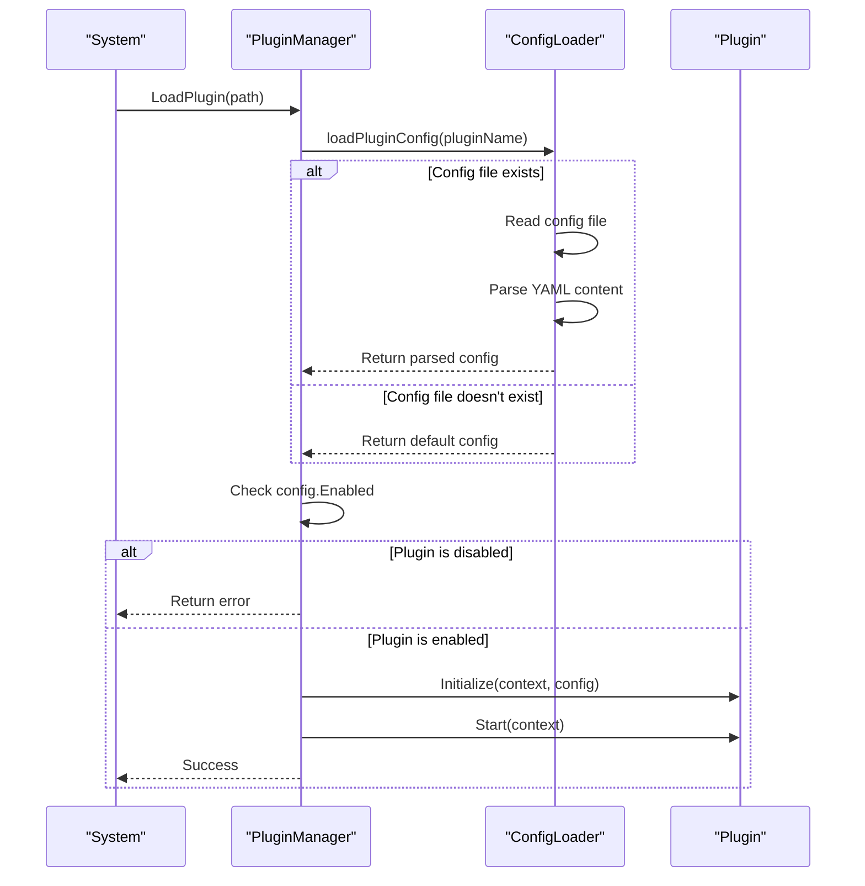
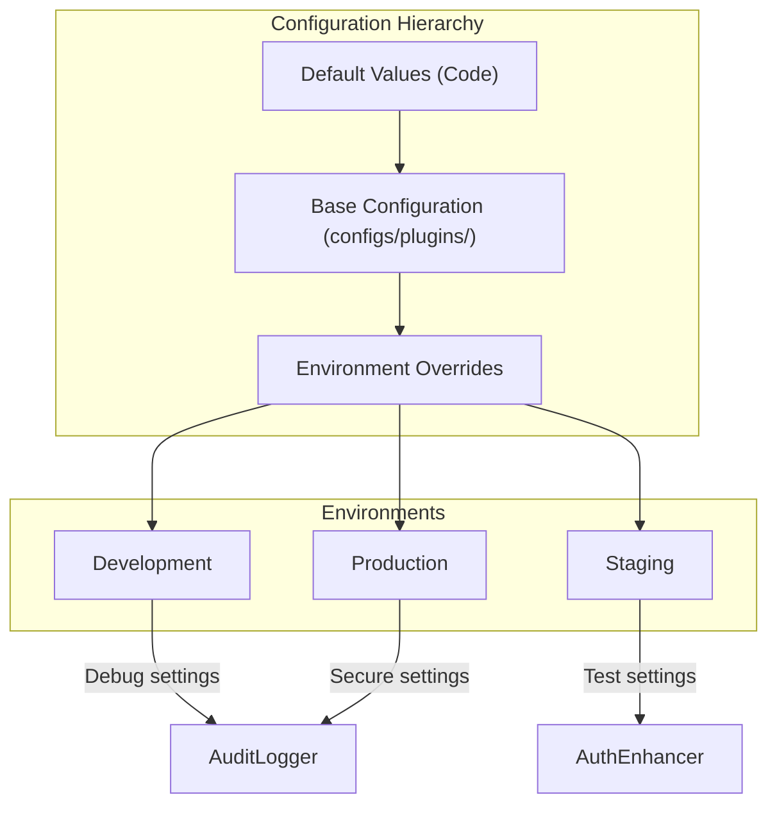
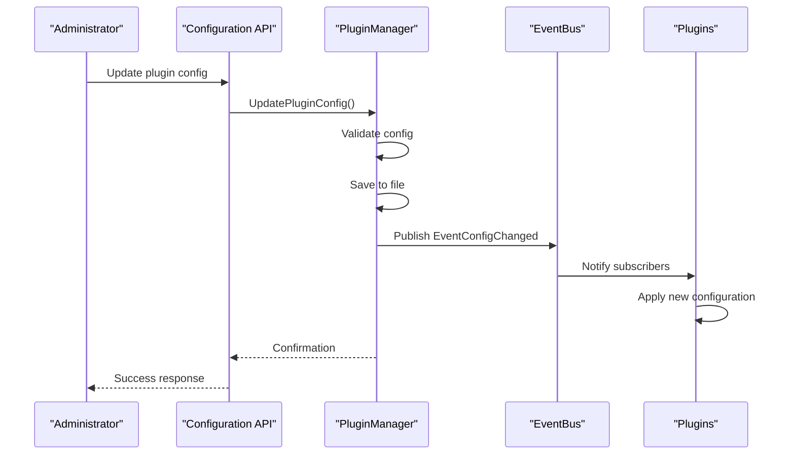

# Plugin Configuration

<cite>
**Referenced Files in This Document**   
- [audit_logger.yaml](file://configs/plugins/audit_logger.yaml)
- [auth_enhancer.yaml](file://configs/plugins/auth_enhancer.yaml)
- [conf.proto](file://internal/conf/conf.proto)
- [plugin_manager.go](file://internal/pkg/plugin/plugin_manager.go)
- [types.go](file://internal/pkg/plugin/types.go)
- [audit_logger.go](file://plugins/audit_logger.go)
- [auth_enhancer.go](file://plugins/auth_enhancer.go)
</cite>

## Table of Contents
1. [Introduction](#introduction)
2. [Plugin Configuration Structure](#plugin-configuration-structure)
3. [Configuration Loading and Validation](#configuration-loading-and-validation)
4. [Common Configuration Scenarios](#common-configuration-scenarios)
5. [Environment-Specific Configuration Management](#environment-specific-configuration-management)
6. [Configuration Validation and Error Handling](#configuration-validation-and-error-handling)
7. [Hot-Reload Capabilities](#hot-reload-capabilities)
8. [Versioning Considerations](#versioning-considerations)

## Introduction
The kratos-boilerplate framework implements a flexible plugin system that allows for extensible functionality through modular components. Plugin configuration is managed through dedicated YAML files located in the `configs/plugins/` directory. This document details the configuration mechanism, structure, and best practices for managing plugins within the system. The configuration system supports dynamic loading, validation against a defined schema, and runtime updates, enabling robust plugin management across different deployment environments.

## Plugin Configuration Structure

The plugin configuration system in kratos-boilerplate follows a standardized structure that defines both operational parameters and feature-specific settings. Each plugin has its own YAML configuration file in the `configs/plugins/` directory, with filenames corresponding to the plugin name (e.g., `audit_logger.yaml`, `auth_enhancer.yaml`).

### Core Configuration Elements
All plugin configuration files share a common structure with the following core elements:

```yaml
enabled: true
priority: 20
timeout: 30s
retry_count: 3
settings:
  # Feature-specific parameters
metadata:
  category: "logging"
  author: "system"
  version: "1.0.0"
```

**Section sources**
- [audit_logger.yaml](file://configs/plugins/audit_logger.yaml#L1-L14)
- [auth_enhancer.yaml](file://configs/plugins/auth_enhancer.yaml#L1-L14)

### Configuration Field Descriptions
The following table describes the standard configuration fields available for all plugins:

| Field | Type | Description | Default Value |
|-------|------|-------------|---------------|
| **enabled** | boolean | Determines whether the plugin is active and should be loaded | true |
| **priority** | integer | Load order priority (lower numbers load first) | 100 |
| **timeout** | duration | Maximum execution time for plugin operations | 30s |
| **retry_count** | integer | Number of retry attempts for failed operations | 3 |
| **settings** | map | Plugin-specific configuration parameters | empty map |
| **metadata** | map | Additional metadata about the plugin | empty map |

The `settings` section contains feature-specific parameters that control the behavior of individual plugins. For example, the audit_logger plugin uses settings to configure logging behavior, while the auth_enhancer plugin uses settings to control authentication features.

### Example: Audit Logger Configuration
The audit_logger plugin configuration demonstrates how feature-specific settings are organized:

```yaml
enabled: true
priority: 20
timeout: 30s
retry_count: 3
settings:
  log_level: "info"
  output_format: "json"
  max_log_size: "100MB"
  retention_days: 30
  sensitive_data_masking: true
metadata:
  category: "logging"
  author: "system"
  version: "1.0.0"
```

This configuration enables comprehensive audit logging with JSON-formatted output, 30-day log retention, and sensitive data masking for security compliance.

**Section sources**
- [audit_logger.yaml](file://configs/plugins/audit_logger.yaml#L1-L14)

### Example: Authentication Enhancer Configuration
The auth_enhancer plugin configuration illustrates authentication-specific settings:

```yaml
enabled: true
priority: 10
timeout: 30s
retry_count: 3
settings:
  jwt_validation: true
  rate_limiting: true
  max_requests_per_minute: 100
  token_expiry: 3600
  audit_logging: true
metadata:
  category: "authentication"
  author: "system"
  version: "1.0.0"
```

This configuration enables JWT validation, rate limiting with a threshold of 100 requests per minute, one-hour token expiration, and integrated audit logging for authentication events.

**Section sources**
- [auth_enhancer.yaml](file://configs/plugins/auth_enhancer.yaml#L1-L14)

```mermaid
classDiagram
class PluginConfig {
+bool enabled
+int priority
+Duration timeout
+int retry_count
+map[string]interface{} settings
+map[string]string metadata
}
class AuditLoggerConfig {
+string log_level
+string output_format
+string max_log_size
+int retention_days
+bool sensitive_data_masking
}
class AuthEnhancerConfig {
+bool jwt_validation
+bool rate_limiting
+int max_requests_per_minute
+int token_expiry
+bool audit_logging
}
PluginConfig <|-- AuditLoggerConfig : "extends"
PluginConfig <|-- AuthEnhancerConfig : "extends"
```

**Diagram sources**
- [types.go](file://internal/pkg/plugin/types.go#L31-L70)
- [audit_logger.yaml](file://configs/plugins/audit_logger.yaml#L1-L14)
- [auth_enhancer.yaml](file://configs/plugins/auth_enhancer.yaml#L1-L14)

## Configuration Loading and Validation

The plugin configuration system follows a robust loading and validation process to ensure configuration integrity and application stability.

### Configuration Loading Process
The configuration loading process is implemented in the `pluginManagerImpl` struct and follows these steps:

1. Check if the configuration file exists in the `configs/plugins/` directory
2. If the file doesn't exist, use default configuration values
3. If the file exists, read and parse the YAML content
4. Apply the configuration to the plugin instance

```go
func (pm *pluginManagerImpl) loadPluginConfig(pluginName string) (PluginConfig, error) {
    configPath := filepath.Join(pm.configDir, pluginName+".yaml")

    config := PluginConfig{
        Enabled:    true,
        Priority:   100,
        Settings:   make(map[string]interface{}),
        Timeout:    30 * time.Second,
        RetryCount: 3,
        Metadata:   make(map[string]string),
    }

    if _, err := os.Stat(configPath); os.IsNotExist(err) {
        // Configuration file doesn't exist, use default configuration
        return config, nil
    }

    data, err := os.ReadFile(configPath)
    if err != nil {
        return config, NewPluginError(ErrCodePluginConfigError, "failed to read config file", pluginName, err)
    }

    if err := yaml.Unmarshal(data, &config); err != nil {
        return config, NewPluginError(ErrCodePluginConfigError, "failed to parse config file", pluginName, err)
    }

    return config, nil
}
```

**Section sources**
- [plugin_manager.go](file://internal/pkg/plugin/plugin_manager.go#L314-L368)

### Schema Validation
While the current implementation uses YAML files for plugin configuration, the application's overall configuration schema is defined in `conf.proto`. This Protocol Buffers definition establishes the structure and data types for the main application configuration, providing a foundation for type-safe configuration management.

The `Features` message in `conf.proto` defines the plugin system configuration:

```protobuf
message Features {
  bool enabled = 1;
  string config_file = 2;
  string config_format = 3;
  bool watch_config = 4;
  string default_environment = 5;
  FeatureRepository repository = 6;
}
```

This schema supports configuration file specification, format declaration (YAML, JSON), configuration watching for hot-reload, default environment settings, and feature repository configuration.

**Section sources**
- [conf.proto](file://internal/conf/conf.proto#L50-L56)

### Configuration Application Flow
The configuration application process involves several components working together to ensure proper plugin initialization:



**Diagram sources**
- [plugin_manager.go](file://internal/pkg/plugin/plugin_manager.go#L0-L61)
- [plugin_manager.go](file://internal/pkg/plugin/plugin_manager.go#L57-L119)

## Common Configuration Scenarios

### Enabling and Disabling Plugins
The most basic configuration operation is enabling or disabling plugins through the `enabled` flag. Setting `enabled: false` prevents the plugin from loading, effectively disabling its functionality without removing the configuration file.

```yaml
enabled: false  # Plugin will not be loaded
priority: 20
timeout: 30s
retry_count: 3
```

This approach allows for temporary deactivation of plugins during troubleshooting or when features are not needed in specific environments.

**Section sources**
- [plugin_manager.go](file://internal/pkg/plugin/plugin_manager.go#L57-L119)

### Adjusting Timeouts
The `timeout` parameter controls the maximum execution time for plugin operations. This can be adjusted based on performance requirements and system load:

```yaml
enabled: true
priority: 20
timeout: 60s  # Increased from default 30s
retry_count: 3
```

Increasing the timeout may be necessary for plugins that perform resource-intensive operations or depend on external services with variable response times.

### External Service Integration
Plugins can be configured to integrate with external services by specifying connection parameters in the `settings` section:

```yaml
enabled: true
priority: 15
timeout: 30s
retry_count: 3
settings:
  external_api_url: "https://api.example.com/v1"
  api_key: "your-api-key-here"
  connection_timeout: "10s"
  max_retries: 5
```

This pattern allows plugins to connect to third-party services while keeping sensitive credentials out of the main application configuration.

## Environment-Specific Configuration Management

### Configuration Hierarchy
The plugin system supports environment-specific configuration through a hierarchical approach:

1. Default values defined in code
2. Base configuration in `configs/plugins/`
3. Environment-specific overrides

This hierarchy allows for consistent base configurations with targeted adjustments for different deployment environments.

### Development Environment
In development environments, plugins may be configured for maximum visibility and debugging:

```yaml
enabled: true
priority: 20
timeout: 30s
retry_count: 3
settings:
  log_level: "debug"
  output_format: "pretty"
  max_log_size: "10MB"
  retention_days: 7
  sensitive_data_masking: false  # Easier debugging
```

### Production Environment
Production configurations prioritize performance, security, and compliance:

```yaml
enabled: true
priority: 20
timeout: 15s  # Stricter timeout for production
retry_count: 2
settings:
  log_level: "warn"
  output_format: "json"
  max_log_size: "1GB"
  retention_days: 90
  sensitive_data_masking: true  # Required for compliance
```

### Configuration Best Practices
1. **Use version control** for all configuration files to track changes
2. **Avoid hardcoding** sensitive information; use environment variables or secret management systems
3. **Document configuration changes** with comments explaining the rationale
4. **Test configuration changes** in staging environments before deploying to production
5. **Maintain consistent naming** conventions across all plugin configurations



**Diagram sources**
- [audit_logger.yaml](file://configs/plugins/audit_logger.yaml)
- [auth_enhancer.yaml](file://configs/plugins/auth_enhancer.yaml)

## Configuration Validation and Error Handling

### Validation Process
The configuration validation process includes multiple layers of checking to ensure configuration integrity:

1. **File existence check**: Verify the configuration file exists
2. **Syntax validation**: Ensure the YAML syntax is correct
3. **Semantic validation**: Check that values are within acceptable ranges
4. **Dependency validation**: Verify required dependencies are available

When validation fails, the system returns descriptive error messages to aid in troubleshooting:

```go
if err := yaml.Unmarshal(data, &config); err != nil {
    return config, NewPluginError(ErrCodePluginConfigError, "failed to parse config file", pluginName, err)
}
```

### Common Validation Errors
The following table outlines common configuration validation errors and their solutions:

| Error | Cause | Solution |
|-------|------|----------|
| **Config file not found** | Missing configuration file | Create the YAML file in `configs/plugins/` |
| **Invalid YAML syntax** | Malformed YAML structure | Validate YAML with a linter and fix syntax errors |
| **Invalid data types** | Using incorrect value types | Ensure values match expected types (string, int, bool) |
| **Missing required fields** | Omitting mandatory configuration | Add required fields with appropriate values |
| **Invalid timeout format** | Incorrect duration specification | Use valid duration format (e.g., "30s", "5m") |

**Section sources**
- [plugin_manager.go](file://internal/pkg/plugin/plugin_manager.go#L365-L417)

## Hot-Reload Capabilities

The plugin system supports runtime configuration updates through a hot-reload mechanism. When configuration changes are detected, the system can apply them without requiring a full application restart.

### Configuration Update Process
The `UpdatePluginConfig` method handles runtime configuration updates:

```go
func (pm *pluginManagerImpl) UpdatePluginConfig(name string, config PluginConfig) error {
    pm.mu.Lock()
    defer pm.mu.Unlock()

    wrapper, exists := pm.plugins[name]
    if !exists {
        return NewPluginError(ErrCodePluginNotFound, "plugin not found", name, nil)
    }

    // Save configuration to file
    if err := pm.savePluginConfig(name, config); err != nil {
        return err
    }

    wrapper.config = config

    // Publish configuration change event
    pm.eventBus.PublishAsync(context.Background(), NewEvent(
        EventConfigChanged,
        "plugin_manager",
        map[string]interface{}{
            "plugin": name,
            "config": config,
        },
    ))

    return nil
}
```

This process ensures that configuration changes are persisted to disk and broadcast to interested components through the event bus system.

**Section sources**
- [plugin_manager.go](file://internal/pkg/plugin/plugin_manager.go#L314-L368)

### Event-Driven Configuration Updates
The system uses an event-driven architecture to propagate configuration changes:



**Diagram sources**
- [plugin_manager.go](file://internal/pkg/plugin/plugin_manager.go#L314-L368)
- [event.go](file://internal/pkg/plugin/event.go#L0-L46)

## Versioning Considerations

### Configuration Versioning Strategy
The plugin configuration system incorporates versioning at multiple levels to ensure compatibility and facilitate upgrades:

1. **Plugin versioning**: Each plugin specifies its version in the metadata
2. **Configuration schema versioning**: The configuration structure may evolve over time
3. **Backward compatibility**: Newer plugin versions should support older configuration formats

### Migration Best Practices
When updating plugin configurations, follow these best practices:

1. **Document breaking changes**: Clearly communicate any configuration format changes
2. **Provide migration scripts**: Automate the conversion of old configurations to new formats
3. **Maintain backward compatibility**: Support old configuration options during transition periods
4. **Test thoroughly**: Validate configuration updates in non-production environments
5. **Rollback plan**: Have a strategy for reverting to previous configurations if issues arise

The metadata section in plugin configurations includes a version field that helps track compatibility:

```yaml
metadata:
  category: "logging"
  author: "system"
  version: "1.0.0"
```

This version should be incremented according to semantic versioning principles (MAJOR.MINOR.PATCH) to indicate the nature of changes in the plugin's behavior or configuration requirements.

**Section sources**
- [audit_logger.yaml](file://configs/plugins/audit_logger.yaml#L11-L14)
- [auth_enhancer.yaml](file://configs/plugins/auth_enhancer.yaml#L11-L14)